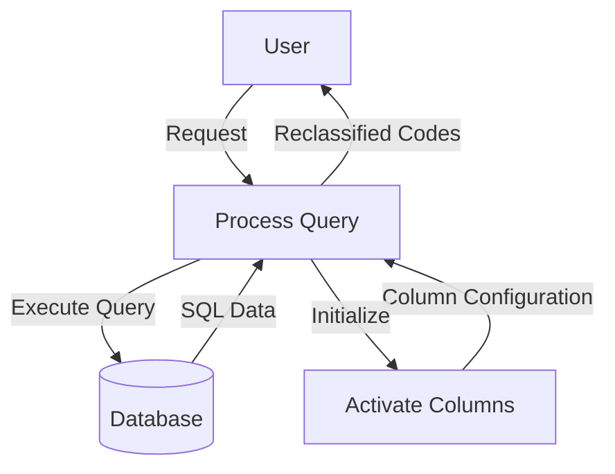

## Module: CConsultaCodigosReclasificados.cpp
# Comprehensive Analysis of CConsultaCodigosReclasificados Module

## Module Name
CConsultaCodigosReclasificados (from CConsultaCodigosReclasificados.cpp)

## Primary Objectives
This module serves as a specialized record set class designed to query and handle reclassified codes from a database. It appears to be focused on retrieving information about items that have been reclassified, including their department, class, family, and other attributes before and after reclassification.

## Critical Functions
1. **Constructor** (`CConsultaCodigosReclasificados`): Initializes the record set with database connection and SQL query parameters, setting up the data types and field mappings.
2. **Destructor** (`~CConsultaCodigosReclasificados`): Handles cleanup when the object is destroyed.
3. **activarCols()**: Activates all columns in the record set for data retrieval, binding database columns to local variables.
4. **Inherited methods from CRecordSet**: While not explicitly shown, the class inherits functionality from CRecordSet for database operations.

## Key Variables
1. **odbc**: Database connection object
2. **nCols**: Number of columns (11) in the result set
3. **odbcRet**: Return value for ODBC operations
4. **nSqlTipo[]**: Array defining SQL data types for each column
5. **nCTipo[]**: Array defining C data types for each column
6. **nLongitud[]**: Array defining buffer lengths for each column
7. **pVar[]**: Array of pointers to variables that will store column data
8. **Data fields**:
   - `ccodigoregresa`: Return code
   - `cdepartamentonuevo`: New department
   - `cclasenueva`: New class
   - `cfamilianueva`: New family
   - `cdepartamentoant`: Previous department
   - `cclaseant`: Previous class
   - `cfamiliaant`: Previous family
   - `cdescripcion`: Description
   - `cexistenciant`: Previous existence/inventory
   - `cexistencianva`: New existence/inventory
   - `cfechae`: Date (possibly execution or effective date)

## Interdependencies
1. Depends on `C_ODBC` for database connectivity
2. Inherits from `CRecordSet` for record set functionality
3. Requires external SQL queries to be passed to the constructor
4. Likely interacts with a database table containing reclassified codes information

## Core vs. Auxiliary Operations
- **Core Operations**: 
  - Database query execution via the constructor
  - Column activation and data binding via activarCols()
  
- **Auxiliary Operations**:
  - Memory management and cleanup in the destructor
  - Type and length definitions in the constructor

## Operational Sequence
1. An instance is created with a database connection and optional SQL query
2. If a query is provided, it's executed immediately
3. Column bindings are activated to map database fields to local variables
4. The caller can then use inherited methods from CRecordSet to navigate through results
5. When finished, the destructor is called to clean up resources

## Performance Aspects
1. All string columns are allocated with a fixed size of 87 characters, which may impact memory usage if many records are processed
2. The module uses direct ODBC calls which generally provide good performance for database operations
3. No explicit pagination or batch processing is implemented, which could be a concern for large result sets

## Reusability
The class is moderately reusable within its specific domain:
- It's tightly coupled to a specific database schema for reclassified codes
- The fixed column structure limits its adaptability to different queries
- Could be extended or modified to handle similar record structures with minimal changes

## Usage
This module would typically be used in scenarios such as:
1. Generating reports of reclassified inventory items
2. Auditing changes to product classifications
3. Tracking historical changes to product categorization
4. Supporting inventory management processes where items are moved between departments or categories

## Assumptions
1. The database schema has a table with exactly 11 columns matching the defined structure
2. All data fields can be represented as VARCHAR/character strings
3. A buffer size of 87 characters is sufficient for all string fields
4. The C_ODBC and CRecordSet base classes handle the core database connectivity and cursor operations
5. Error handling is primarily managed by the parent CRecordSet class
6. The caller will properly manage the lifecycle of the odbc connection object
## Flow Diagram [via mermaid]

