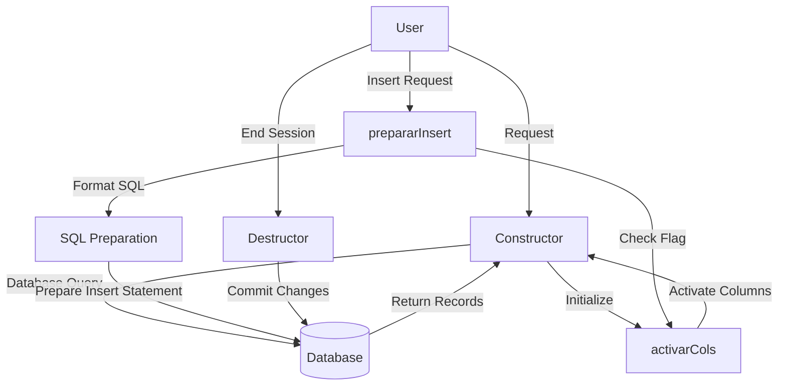

## Module: CConsultaFechaReclasificados.cpp
# Comprehensive Analysis of CConsultaFechaReclasificados Module

## Module Name
CConsultaFechaReclasificados (from CConsultaFechaReclasificados.cpp)

## Primary Objectives
This module appears to be a specialized database record set class designed to handle date validation operations for reclassified records. It provides an interface for querying and inserting data related to date validation functionality in a database system.

## Critical Functions
1. **Constructor** (`CConsultaFechaReclasificados`): Initializes the record set with database connection and optional SQL query.
2. **Destructor** (`~CConsultaFechaReclasificados`): Commits any pending transactions before destruction.
3. **activarCols()**: Activates column bindings for data retrieval.
4. **prepararInsert()**: Prepares an SQL insert statement without specifying a table name.
5. **prepararInsert(const char *nombreTabla)**: Prepares an SQL insert statement for a specified table.

## Key Variables
1. **odbc**: Database connection object (C_ODBC pointer).
2. **nCols**: Number of columns (set to 1 in this implementation).
3. **odbcRet**: Return status for ODBC operations.
4. **flagInsertar**: Flag indicating whether columns are activated for insertion.
5. **fun_validarfecha**: Variable to store date validation function result (short integer).
6. **nSqlTipo[]**: Array defining SQL data types for columns.
7. **nCTipo[]**: Array defining C data types for columns.
8. **nLongitud[]**: Array defining column lengths.
9. **pVar[]**: Array of pointers to variables that will store column values.

## Interdependencies
1. Inherits from **CRecordSet** class, suggesting a database abstraction layer.
2. Depends on **C_ODBC** for database connectivity.
3. Uses **CString** for string manipulation, likely from a framework like MFC.
4. Relies on SQL database with tables containing a `fun_validarfecha` column.

## Core vs. Auxiliary Operations
**Core Operations:**
- Database query execution via constructor
- Data binding through activarCols()
- Insert statement preparation via prepararInsert() methods

**Auxiliary Operations:**
- Transaction commitment in the destructor
- Internal flag management for insertion state

## Operational Sequence
1. Initialize with database connection and optional SQL query
2. If query provided, execute it and activate column bindings
3. When needed, prepare insert statements with or without table name specification
4. Bind variables for insertion
5. (Implied) Execute inserts through inherited functionality
6. Commit transactions upon object destruction

## Performance Aspects
1. The module is designed for minimal memory usage with only one column.
2. Direct variable binding to database columns optimizes data transfer.
3. The class maintains state (flagInsertar) to avoid redundant column activation.
4. Uses prepared statements which can improve performance for repeated operations.

## Reusability
The module has limited reusability as designed:
1. It's highly specialized for a single column (`fun_validarfecha`).
2. The fixed column structure makes it difficult to adapt to different schemas.
3. Could be used as a template for creating similar specialized record set classes.
4. Would require significant modification to handle different data structures.

## Usage
This module is likely used in scenarios where:
1. Date validation is required for reclassified records.
2. A system needs to query or update date validation flags in a database.
3. Part of a larger data processing or validation workflow.
4. Potentially used in batch processing of records requiring date validation.

## Assumptions
1. The database has a table with a `fun_validarfecha` column of SQL_SMALLINT type.
2. The parent CRecordSet class handles the core database operations.
3. The C_ODBC connection is properly initialized before being passed to this class.
4. The caller manages transaction boundaries except for the final commit in the destructor.
5. Error handling is primarily managed by the parent class.
6. The module assumes single-threaded access or external synchronization.
7. The `fun_validarfecha` field is assumed to be a flag or code representing date validation status.
## Flow Diagram [via mermaid]

