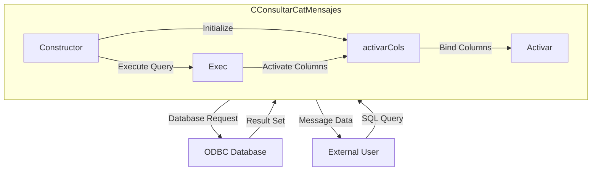

## Module: CConsultarCatMensajes.cpp
# Module Analysis: CConsultarCatMensajes

## Module Name
CConsultarCatMensajes (from CConsultarCatMensajes.cpp)

## Primary Objectives
This module provides a specialized database record set implementation for consulting message catalogs. It appears to be designed to retrieve and handle message data from a database using ODBC connections.

## Critical Functions
1. **Constructor** (`CConsultarCatMensajes`): Initializes the record set with ODBC connection, sets up column types and bindings, and optionally executes a provided SQL query.
2. **Destructor** (`~CConsultarCatMensajes`): Handles cleanup when the object is destroyed.
3. **activarCols()**: Activates column bindings for data retrieval, connecting database columns to program variables.

## Key Variables
1. `odbc`: Pointer to an external ODBC connection object.
2. `nCols`: Number of columns in the result set (set to 1).
3. `odbcRet`: Boolean flag indicating success/failure of ODBC operations.
4. `nSqlTipo`: Array defining SQL data types for columns (SQL_LONGVARCHAR).
5. `nCTipo`: Array defining C data types for columns (SQL_C_CHAR).
6. `nLongitud`: Array defining buffer lengths for columns (1026 bytes).
7. `pVar`: Array of pointers to variables that will store retrieved data.
8. `fun_consultarcatmensajes`: Variable that stores the retrieved message data.

## Interdependencies
1. Inherits from `CRecordSet` class, extending its functionality.
2. Depends on `C_ODBC` class for database connectivity.
3. Likely interacts with other components that need to access message catalog data.

## Core vs. Auxiliary Operations
- **Core Operations**: Executing SQL queries to retrieve message catalog data and binding result columns to program variables.
- **Auxiliary Operations**: Memory management and cleanup handled by the constructor and destructor.

## Operational Sequence
1. Object instantiation with ODBC connection.
2. Column type and binding setup.
3. Optional immediate execution of a SQL query if provided.
4. Column activation to bind database results to program variables.
5. (Implied) Data retrieval through inherited methods from CRecordSet.
6. Object destruction and cleanup.

## Performance Aspects
1. Uses a fixed buffer size of 1026 bytes for the message text, which could be a limitation for very long messages.
2. Single column retrieval suggests focused, efficient data access.
3. Direct binding of database columns to program variables eliminates need for intermediate processing.

## Reusability
The class is somewhat specialized for message catalog consultation but could be adapted for other single-column text retrieval tasks. Its inheritance from CRecordSet suggests it's part of a broader database access framework.

## Usage
This module is likely used to retrieve messages or descriptions from a catalog table in the database. The retrieved messages might be used for:
- User interface text
- Error messages
- System notifications
- Configuration information

## Assumptions
1. The message catalog table has at least one column containing text data.
2. The maximum length of a message is 1026 bytes.
3. The ODBC connection is properly initialized before being passed to this class.
4. The SQL query passed to the constructor is valid and targets the appropriate message catalog table.
5. The CRecordSet parent class handles the core functionality of executing queries and navigating results.
## Flow Diagram [via mermaid]

