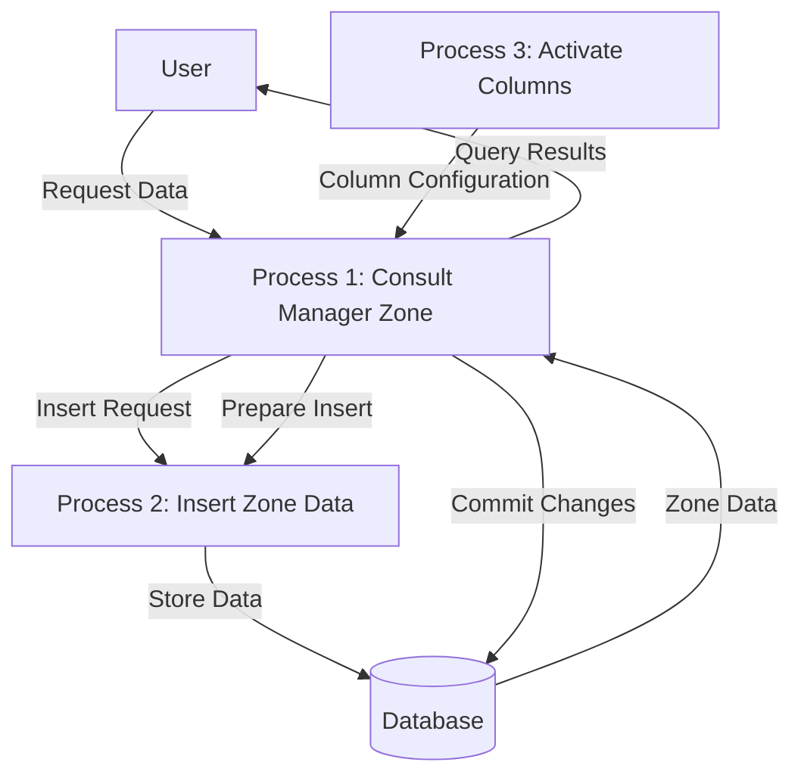

## Module: CConsultarGerenteZonaProGC.cpp
# Comprehensive Analysis of CConsultarGerenteZonaProGC Module

## Module Name
CConsultarGerenteZonaProGC (from CConsultarGerenteZonaProGC.cpp)

## Primary Objectives
This module appears to be a database access class designed to query and manipulate data related to zone managers (Gerentes de Zona) in a retail or organizational context. It provides an interface for retrieving and inserting records about managers, their regions, zones, stores, and employee information.

## Critical Functions
1. **Constructor (`CConsultarGerenteZonaProGC`)**: Initializes the object with database connection and optional SQL query, setting up data types and column mappings.
2. **Destructor (`~CConsultarGerenteZonaProGC`)**: Performs a database commit before object destruction.
3. **`activarCols()`**: Activates columns for data binding between database and class variables.
4. **`prepararInsert()`**: Prepares an SQL INSERT statement for the default table.
5. **`prepararInsert(const char *nombreTabla)`**: Prepares an SQL INSERT statement for a specified table.

## Key Variables
1. **Database-related**:
   - `odbc`: Database connection object
   - `odbcRet`: Return status for database operations
   - `nCols`: Number of columns (5)

2. **Data fields**:
   - `ciudad`: City identifier (smallint)
   - `region`: Region code (char[10])
   - `zona`: Zone description (char[42])
   - `empleado`: Employee ID (integer)
   - `tienda`: Store ID (smallint)

3. **Metadata arrays**:
   - `nSqlTipo[]`: SQL data types
   - `nCTipo[]`: C data types
   - `nLongitud[]`: Column lengths
   - `pVar[]`: Pointers to variables
   - `nLongResp[]`: Response lengths

4. **State flags**:
   - `flagInsertar`: Indicates if columns are activated for insertion

## Interdependencies
- Inherits from `CRecordSet` class
- Depends on `C_ODBC` for database connectivity
- Uses `CString` for string manipulation
- Likely part of a larger system for managing organizational structure

## Core vs. Auxiliary Operations
**Core Operations**:
- Database record retrieval via constructor with SELECT statement
- Record insertion via `prepararInsert` methods

**Auxiliary Operations**:
- Column activation (`activarCols`)
- Memory management in constructor and destructor
- Data type mapping between SQL and C types

## Operational Sequence
1. Object instantiation with database connection
2. Optional immediate query execution if SELECT statement provided
3. Column activation for data binding
4. Preparation for insertion operations when needed
5. Database commit on object destruction

## Performance Aspects
- Uses direct variable binding to database columns for efficient data transfer
- Commits database transactions on object destruction
- Reuses column activation logic between query and insert operations
- Uses fixed-size arrays for data fields which could limit flexibility but improves performance

## Reusability
- Moderate reusability within its specific domain
- The class is specialized for a specific table structure
- The overloaded `prepararInsert` method allows some flexibility in targeting different tables with the same structure
- Hard-coded column names and types limit general reusability

## Usage
This module would typically be used in code that needs to:
1. Query information about zone managers, their regions, and associated stores
2. Insert new zone manager records into the database
3. Access specific fields like employee IDs, regions, and zones for business logic

Example usage pattern:
```cpp
C_ODBC* dbConnection = new C_ODBC(/* connection parameters */);
// Query existing records
CConsultarGerenteZonaProGC* managers = new CConsultarGerenteZonaProGC(dbConnection, "SELECT * FROM CConsultarGerenteZonaProGC WHERE region = 'NORTH'");
// Process results
while(managers->Next()) {
    // Access managers->ciudad, managers->region, etc.
}
// Insert new record
CConsultarGerenteZonaProGC* newManager = new CConsultarGerenteZonaProGC(dbConnection, NULL);
newManager->ciudad = 101;
newManager->empleado = 5432;
// Set other fields...
newManager->prepararInsert();
newManager->Insert();
delete newManager;
```

## Assumptions
1. The database table has exactly 5 columns with the specified names and types
2. The `CRecordSet` base class handles cursor movement and basic ODBC operations
3. Memory for character arrays (`region`, `zona`) is managed externally or by the base class
4. The database connection (`C_ODBC`) remains valid throughout the object's lifetime
5. The system uses a specific character encoding (likely Latin-1 or similar)
6. The table structure remains consistent and doesn't change during runtime
## Flow Diagram [via mermaid]

