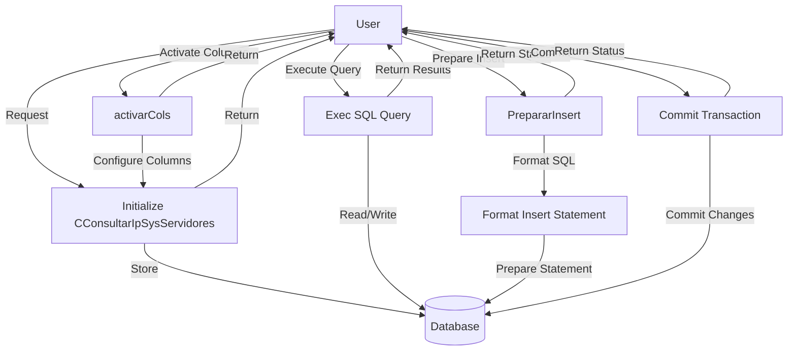

## Module: CConsultarIpSysServidores.cpp
# Comprehensive Analysis of CConsultarIpSysServidores Module

## Module Name
CConsultarIpSysServidores.cpp

## Primary Objectives
This module provides a specialized database interface for accessing and manipulating server IP address information stored in a database table (likely named "sysServidores"). It extends the CRecordSet class to handle specific operations related to server IP addresses and their alternates.

## Critical Functions
1. **Constructor** (`CConsultarIpSysServidores`): Initializes the object with an ODBC connection, commit flag, and optional SQL select statement. Sets up data types, lengths, and variable bindings.
2. **Destructor** (`~CConsultarIpSysServidores`): Performs a commit operation if the bFlagCommit flag is set to true.
3. **activarCols()**: Activates column bindings for database operations.
4. **prepararInsert()**: Prepares an insert statement for the default "sysServidores" table.
5. **prepararInsert(const char *nombreTabla)**: Overloaded version that prepares an insert statement for a specified table name with validation.

## Key Variables
1. **ipservidor**: Character array to store the primary server IP address.
2. **ipalterno**: Character array to store the alternate server IP address.
3. **odbc**: Pointer to the ODBC connection object.
4. **bFlagCommit**: Boolean flag indicating whether to commit transactions in the destructor.
5. **nSqlTipo[]**: Array defining SQL data types for columns.
6. **nCTipo[]**: Array defining C data types for columns.
7. **nLongitud[]**: Array defining column lengths.
8. **pVar[]**: Array of pointers to variables for binding.
9. **flagInsertar**: Flag indicating whether columns are activated for insert operations.

## Interdependencies
1. Depends on the `CRecordSet` class (inherits from it).
2. Relies on the `C_ODBC` class for database connectivity.
3. Uses `CString` class for SQL statement formatting.
4. Includes standard C++ libraries `<cctype>` and `<cstring>` for character manipulation and string operations.

## Core vs. Auxiliary Operations
**Core Operations**:
- Database record retrieval via constructor with select statement
- Insert operations via prepararInsert methods
- Column binding via activarCols

**Auxiliary Operations**:
- Input validation in prepararInsert
- Memory initialization and management
- Transaction commit handling in the destructor

## Operational Sequence
1. Initialize with ODBC connection
2. Optionally execute a select statement during construction
3. Activate columns for data binding
4. Prepare insert statements as needed
5. Perform database operations (implied through CRecordSet parent class)
6. Optionally commit changes when the object is destroyed

## Performance Aspects
- Uses fixed-size character arrays (17 bytes) for IP addresses, which is appropriate for IPv4 addresses with the format "xxx.xxx.xxx.xxx"
- Performs input validation on table names to prevent SQL injection
- Minimizes memory operations by setting up all column bindings at initialization

## Reusability
- Moderately reusable for server IP management scenarios
- The class is specialized for a specific table structure with two IP address columns
- Could be adapted for similar two-column string-based tables by modifying column names and data types

## Usage
This module is likely used to:
1. Retrieve server IP configurations from a database
2. Insert or update server IP configurations
3. Manage primary and alternate IP addresses for system servers

## Assumptions
1. The database table "sysServidores" exists with columns "ipservidor" and "ipalterno"
2. IP addresses are stored as character strings of maximum length 16 (plus null terminator)
3. The parent CRecordSet class provides methods like Exec(), Commit(), PrepararInsert(), Activar(), and ActivarInsert()
4. The C_ODBC class provides the necessary database connectivity
5. The system uses IPv4 addresses (based on the 17-byte buffer size)
6. Table names used in prepararInsert() contain only alphanumeric characters and underscores
## Flow Diagram [via mermaid]

