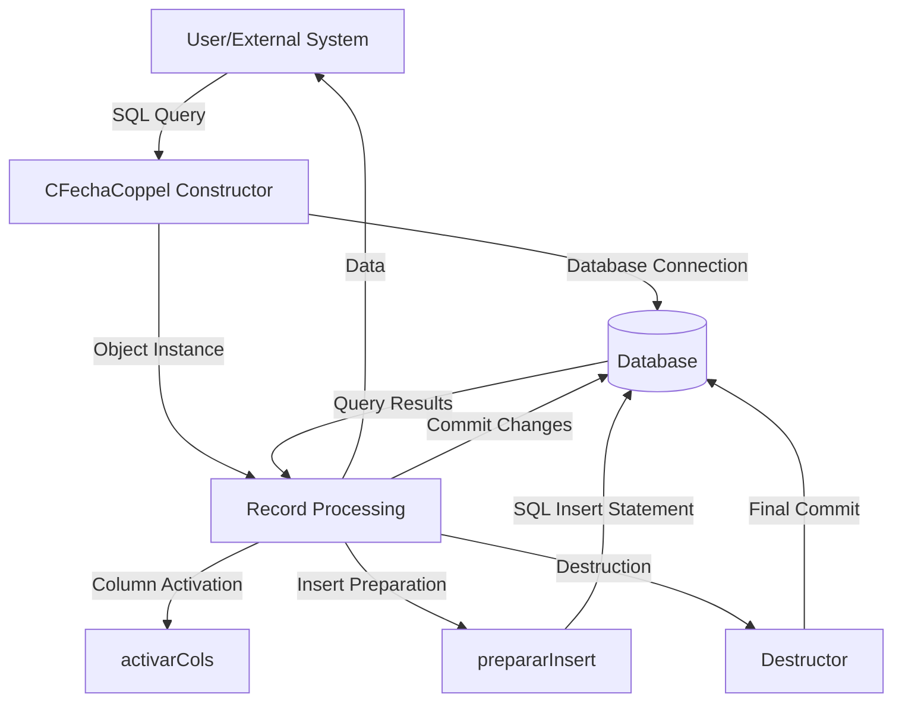

## Module: CFechaCoppel.cpp
# Comprehensive Analysis of CFechaCoppel Module

## Module Name
CFechaCoppel.cpp (with corresponding header CFECHACOPPEL.HPP)

## Primary Objectives
This module provides a specialized database record set implementation for handling date operations in a Coppel system. It appears to be designed for retrieving, storing, and manipulating date information in a database table, specifically focusing on a "fecha" (date) field.

## Critical Functions
1. **Constructor (`CFechaCoppel::CFechaCoppel`)**: Initializes the object with database connection, commit flag, and optional SQL select statement.
2. **Destructor (`CFechaCoppel::~CFechaCoppel`)**: Performs cleanup and commits transactions if the commit flag is set.
3. **`activarCols()`**: Activates columns for data binding.
4. **`prepararInsert()`**: Prepares an SQL insert statement for the default "gnDominio" table.
5. **`prepararInsert(const char *nombreTabla)`**: Prepares an SQL insert statement for a specified table.

## Key Variables
1. **`fecha`**: Stores the date value (character array, implied by context).
2. **`odbc`**: Pointer to the ODBC connection object.
3. **`bFlagCommit`**: Boolean flag indicating whether to commit transactions automatically.
4. **`nCols`**: Number of columns (set to 1 in this implementation).
5. **`flagInsertar`**: Flag indicating whether columns have been activated for insertion.
6. **`nSqlTipo[]`**, **`nCTipo[]`**, **`nLongitud[]`**: Arrays storing SQL data types, C data types, and field lengths.
7. **`pVar[]`**: Array of pointers to variables that will hold the data.

## Interdependencies
1. Inherits from **`CRecordSet`** class, extending its functionality.
2. Depends on **`C_ODBC`** for database connectivity.
3. Uses **`CString`** for string manipulation.
4. Interacts with database tables, particularly "gnDominio" by default.

## Core vs. Auxiliary Operations
**Core Operations:**
- Database record retrieval via constructor with select statement
- Data insertion via `prepararInsert()` methods
- Column activation for data binding

**Auxiliary Operations:**
- Memory management in constructor and destructor
- Transaction management (commit handling)

## Operational Sequence
1. Initialize the object with database connection
2. Optionally execute a select statement during initialization
3. Activate columns for data binding
4. Prepare insert statements as needed
5. (Implied) Execute inserts or updates
6. Commit changes if the commit flag is set (during destruction)

## Performance Aspects
1. Uses direct pointer manipulation for data binding, which is efficient.
2. Minimizes string operations in critical paths.
3. Only activates columns once (controlled by `flagInsertar` flag).
4. Performs validation checks before operations (e.g., checking if table name is valid).

## Reusability
The module has moderate reusability:
- It's specialized for date operations in a specific system (Coppel).
- The fixed column structure (single "fecha" column) limits general-purpose use.
- Could be adapted for other single-column table operations with modifications.
- The parameterized table name in `prepararInsert()` provides some flexibility.

## Usage
This module is likely used for:
1. Retrieving date information from database tables
2. Inserting date records into database tables
3. Managing date-related transactions in the Coppel system
4. Potentially serving as a utility class for date operations across the application

## Assumptions
1. The database schema contains tables with a "fecha" column.
2. The "fecha" field is a VARCHAR type with a maximum length of 107 characters.
3. The default table for operations is "gnDominio" if not specified.
4. The C_ODBC connection is properly initialized before being passed to this class.
5. The caller manages the lifetime of the C_ODBC object (it's passed by pointer).
6. The module assumes single-threaded operation or external thread synchronization.
7. The "fecha" variable is properly defined elsewhere in the class (not shown in the provided code).
## Flow Diagram [via mermaid]

