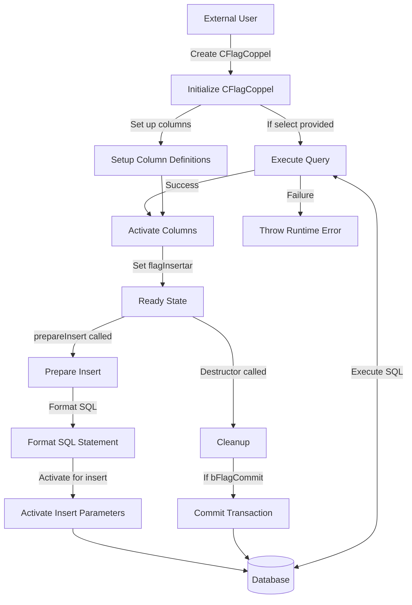

## Module: CFlagCoppel.cpp
# Comprehensive Analysis of CFlagCoppel Module

## Module Name
CFlagCoppel.cpp

## Primary Objectives
This module provides a specialized database interface for handling flag operations in a Coppel system. It's designed to interact with a database table (likely named "sysflags") that stores flag values, providing a structured way to read and write flag data through ODBC connections.

## Critical Functions
1. **Constructor (`CFlagCoppel`)**: Initializes the object with an ODBC connection, sets up data binding structures, and optionally executes a select query.
2. **Destructor (`~CFlagCoppel`)**: Performs cleanup and commits transactions if the commit flag is set.
3. **`activarCols()`**: Activates column bindings for database operations.
4. **`prepararInsert()`**: Prepares an INSERT statement for the default "sysflags" table.
5. **`prepararInsert(const char *nombreTabla)`**: Prepares an INSERT statement for a specified table.

## Key Variables
1. **`flag`**: The actual flag value being stored or retrieved.
2. **`bFlagCommit`**: Boolean that determines whether to commit transactions in the destructor.
3. **`odbc`**: Pointer to the ODBC connection object.
4. **`flagInsertar`**: State variable indicating if insert operations have been prepared.
5. **`nSqlTipo[]`, `nCTipo[]`, `nLongitud[]`, `pVar[]`, `nLongResp[]`**: Arrays for managing database column bindings.

## Interdependencies
1. **CFLAGCOPPEL.HPP**: Header file for this class.
2. **C_ODBC**: External class that provides ODBC database connectivity.
3. **CRecordSet**: Parent class that this module inherits from, providing database record operations.
4. **CString**: Used for SQL string formatting.

## Core vs. Auxiliary Operations
**Core Operations**:
- Flag value retrieval via SELECT queries
- Flag value insertion via INSERT statements
- Transaction management (commit)

**Auxiliary Operations**:
- Column activation and binding
- SQL statement preparation
- Error handling

## Operational Sequence
1. Initialize with ODBC connection
2. Optionally execute a SELECT query during construction
3. Activate columns for data binding
4. Prepare INSERT statements as needed
5. Perform database operations (inherited from CRecordSet)
6. Optionally commit changes when the object is destroyed

## Performance Aspects
1. The module uses direct ODBC calls which are generally efficient for database operations.
2. Input validation is performed to prevent buffer overflows (checking string lengths).
3. Exception handling is implemented for critical errors.
4. The module appears to be designed for single-row operations rather than bulk operations.

## Reusability
The module is somewhat specialized for flag operations but could be adapted for similar simple data types. Its reusability is limited by:
1. The fixed column structure (assumes a single column named "flag")
2. The hardcoded data type (SQL_SMALLINT)
3. The default table name ("sysflags")

However, the overloaded `prepararInsert` method that accepts a table name provides some flexibility.

## Usage
This module is likely used to:
1. Read system flags or configuration settings from a database
2. Update or insert new flag values
3. Manage transaction commits for these operations

Typical usage would involve:
```cpp
C_ODBC* odbcConnection = /* obtain connection */;
CFlagCoppel flagHandler(odbcConnection, true, "SELECT flag FROM sysflags WHERE id = 1");
// Read flag value from flagHandler.flag
// Or set a new value
flagHandler.flag = newValue;
flagHandler.prepararInsert();
flagHandler.Insert();
```

## Assumptions
1. The database table has a column named "flag" of type SMALLINT.
2. The default table name is "sysflags" unless specified otherwise.
3. The ODBC connection is properly initialized before being passed to this class.
4. The caller manages the lifecycle of the ODBC connection object.
5. Flag values can be represented as short integers.
6. SELECT queries passed to the constructor are properly formatted and safe.
7. The module assumes single-threaded access or external synchronization.
## Flow Diagram [via mermaid]

