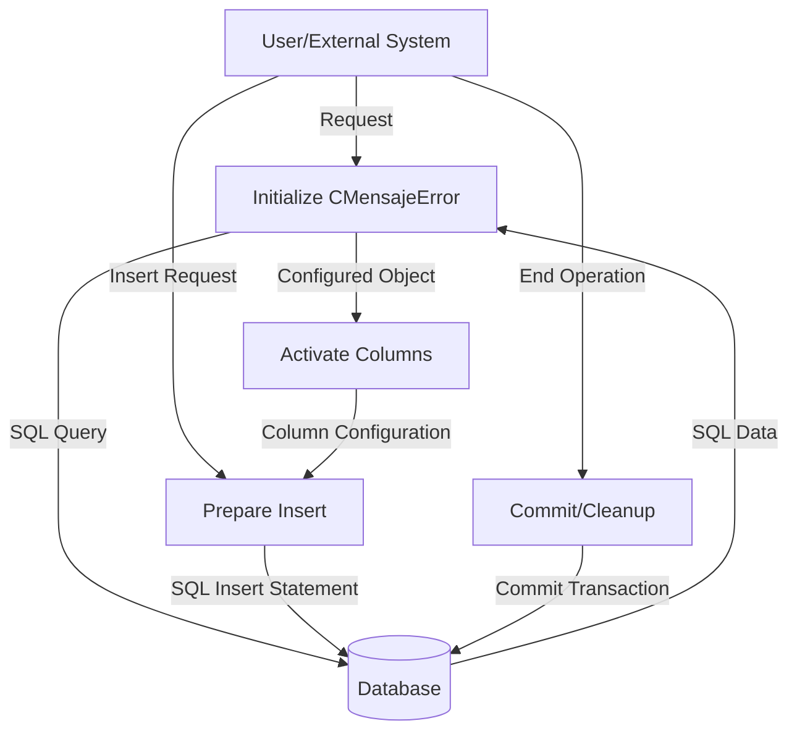

## Module: CMensajeError.cpp
# Comprehensive Analysis of CMensajeError Module

## Module Name
CMensajeError.cpp (with corresponding header CMENSAJEERROR.HPP)

## Primary Objectives
This module implements a database interface class for handling error messages in a system. It's designed to interact with a database table named "sysMensajeError" through ODBC connections, providing functionality to store error information including SQL errors, application details, and contextual information.

## Critical Functions
1. **Constructor (`CMensajeError`)**: Initializes the object with an ODBC connection, sets up data types and column mappings, and optionally executes a SELECT query.
2. **Destructor (`~CMensajeError`)**: Performs a commit operation if the flag is set.
3. **`activarCols()`**: Activates columns for data binding.
4. **`prepararInsert()`**: Prepares an INSERT statement for the default table "sysMensajeError".
5. **`prepararInsert(const char *nombreTabla)`**: Prepares an INSERT statement for a specified table.

## Key Variables
1. **`odbc`**: ODBC connection pointer.
2. **`bFlagCommit`**: Boolean flag determining if a commit should be performed on destruction.
3. **`nCols`**: Number of columns (12) in the error message table.
4. **`nSqlTipo[]`**: Array defining SQL data types for each column.
5. **`nCTipo[]`**: Array defining C data types for each column.
6. **`nLongitud[]`**: Array defining column lengths.
7. **`pVar[]`**: Array of pointers to variables holding column values.
8. **`flagInsertar`**: Flag indicating if columns are activated for insertion.

## Interdependencies
1. **`CRecordSet`**: Base class that CMensajeError inherits from.
2. **`C_ODBC`**: External class for ODBC database connectivity.
3. **`CString`**: String handling class used for SQL statement formatting.

## Core vs. Auxiliary Operations
- **Core Operations**: 
  - Preparing and executing INSERT statements for error messages
  - Binding database columns to variables
  
- **Auxiliary Operations**:
  - Commit handling
  - Column activation

## Operational Sequence
1. Object is instantiated with an ODBC connection
2. Column data types and lengths are defined
3. Variables are bound to columns
4. If a SELECT statement is provided, it's executed and columns are activated
5. When needed, INSERT statements are prepared with `prepararInsert()`
6. On object destruction, a commit may be performed based on the flag

## Performance Aspects
- The module uses direct variable binding to columns which is efficient for database operations
- Pre-defined column types and lengths optimize the database interaction
- The module allows for parameterized queries which helps prevent SQL injection

## Reusability
- The class is designed to work with a specific table structure but offers some flexibility:
  - The alternative `prepararInsert(const char *nombreTabla)` allows targeting different tables with the same structure
  - The constructor accepts an external ODBC connection, allowing it to be used in different database contexts

## Usage
This module is likely used throughout an application to log errors to a database. When an error occurs, an instance of CMensajeError would be created, populated with error details (SQL error codes, application context, user information), and then inserted into the database through the prepared statements.

## Assumptions
1. The database table "sysMensajeError" exists with the expected 12-column structure
2. The ODBC connection provided is valid and has appropriate permissions
3. The error message fields (area, caja, iporigen, etc.) have specific meanings in the application context
4. The column types and lengths are fixed and match the database schema
5. The class assumes it's used in a C++ environment with access to CString and the parent CRecordSet class
6. The module assumes proper memory management for the variables pointed to by pVar[]
## Flow Diagram [via mermaid]

