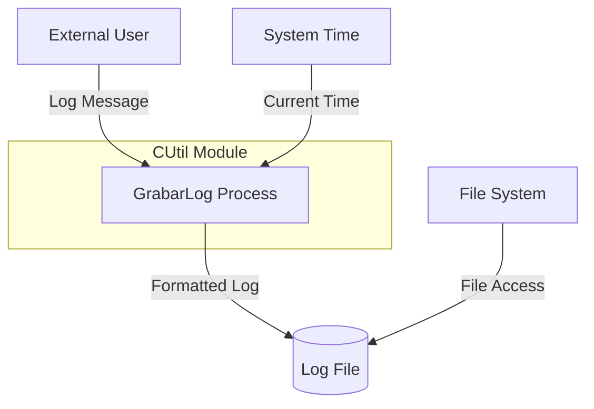

## Module: CUtil.cpp
# Comprehensive Analysis of CUtil Module

## Module Name
The module is named "CUtil" (Utility Class), implemented in CUtil.cpp.

## Primary Objectives
This module serves as a utility class providing common functionality, specifically focused on logging operations. Its main purpose is to write timestamped log entries to a file for debugging, auditing, or monitoring purposes.

## Critical Functions
1. **GrabarLog(char *cLog)** - The primary function that writes a log message to a file with a timestamp. It:
   - Validates the input log message
   - Creates a filename with the current date
   - Formats the log message with timestamp
   - Opens a file and appends the log message

## Key Variables
- **sArch[256]** - Buffer to store the log filename
- **cTextoGrabar[2048]** - Buffer to store the formatted log message with timestamp
- **tFecha** - CTime object that provides the current date and time

## Interdependencies
- **CTime** - Used for retrieving the current date and time
- **C_Archivo** - Used for file operations (opening, positioning, writing)
- The module likely depends on "CUtil.h" header file (included at the top)

## Core vs. Auxiliary Operations
- **Core Operation**: Writing log messages to a file (GrabarLog function)
- **Auxiliary Operations**: 
  - Date/time retrieval
  - String formatting
  - File positioning and writing

## Operational Sequence
1. Validate the input log message
2. Get the current date and time
3. Create a log filename with format "C:\sys\mem\RI0074_YYYYMMDD.log"
4. Format the log message with timestamp "YYYY-MM-DD HH:MM:SS [message]"
5. Open the log file
6. Position at the end of the file
7. Write the formatted log message

## Performance Aspects
- The code includes buffer size checks to prevent buffer overflows
- Fixed-size buffers (256 bytes for filename, 2048 bytes for log message) may limit log message length
- File is opened and closed for each log entry, which could be inefficient for high-frequency logging

## Reusability
- The module is designed as a class that can be instantiated and used throughout an application
- The logging functionality is generic and could be reused in various contexts
- The hardcoded file path "C:\sys\mem\" limits portability across different environments

## Usage
The module is used by creating an instance of CUtil and calling the GrabarLog method with a string message:
```cpp
CUtil util;
util.GrabarLog("This is a log message");
```

## Assumptions
1. The system has write access to the "C:\sys\mem\" directory
2. Log messages will not exceed 2048 characters
3. The CTime class is available and properly implemented
4. The C_Archivo class is available and properly implemented for file operations
5. The system uses a format where "\" is the directory separator (Windows-style paths)
6. The code assumes a specific naming convention for logs (RI0074_YYYYMMDD.log)
7. The log file should be appended to rather than overwritten
## Flow Diagram [via mermaid]

