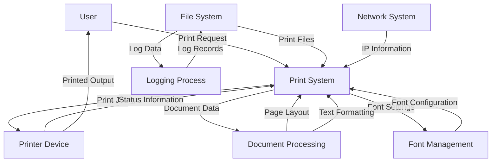

## Module: C_WFormas.cpp
# Comprehensive Analysis of C_WFormas Module

## Module Name
C_WFormas.cpp - A Windows-based printing and document formatting module

## Primary Objectives
This module provides a comprehensive interface for document printing and formatting in Windows applications. It handles various printer types (laser, matrix, PDF), manages page layouts, text positioning, font styling, and printer communication. The primary purpose is to abstract the complexities of Windows printing APIs and provide a higher-level interface for document creation.

## Critical Functions

1. **Constructor/Destructor**:
   - `C_WFormas::C_WFormas()` - Initializes printing environment based on printer type and page orientation
   - `C_WFormas::~C_WFormas()` - Cleans up printing resources

2. **Printer Management**:
   - `GetPrinterDevice()` - Retrieves printer device information
   - `ChecarImpresora()` - Checks printer status
   - `IsPrinterError()` - Detects printer errors
   - `GetJobs()` - Retrieves printer job information
   - `MapearLaser()` - Maps to laser printer
   - `imprimirArchivo()` - Prints a file directly to printer

3. **Text Positioning and Formatting**:
   - `poner()` - Places text at specific coordinates
   - `ponerTexto()` - Places text with floating-point coordinates
   - `ponerPP()` - Places text with direct pixel positioning
   - `nuevaPagina()` - Handles page breaks
   - `nuevaPaginaMatricial()` - Handles page breaks for matrix printers

4. **Drawing Functions**:
   - `ponerLinea()` - Draws horizontal lines
   - `ponerColumna()` - Draws vertical lines
   - `ponerCuadro()` - Draws rectangles
   - `ponerGrid()` - Creates grid layouts

5. **Font and Style Management**:
   - `AjustarFont()` - Sets font properties
   - `AjustarTipoDeLetra()` - Changes font type
   - `AjustarTamano()` - Changes font size
   - `AjustarFormato()` - Sets text formatting (bold, italic, underline)
   - `AjustarColor()` - Sets text color
   - `cambiarLetra()` - Changes font with coordinate adjustment

6. **Document Control**:
   - `imprimir()` - Finalizes current page
   - `imprimirLaser()` - Initializes laser printer document
   - `finDocumento()` - Ends the document

## Key Variables

1. **Printer State**:
   - `PrintDC` - Device context for printing
   - `hPPrintDC` - Handle to printer device context
   - `sPrinter` - Printer name
   - `sPuertoImp` - Printer port
   - `iTipoImpresora` - Printer type (0=matrix, 1=laser, 2=PDF)
   - `bContinuar` - Flag to continue printing process
   - `bNextPage` - Flag for page transition

2. **Text Formatting**:
   - `sFuente` - Current font name
   - `nFontSize` - Current font size
   - `nEnfatizar` - Bold setting
   - `bItalicas` - Italic setting
   - `bSubrayar` - Underline setting
   - `xFont` - Array of font configurations

3. **Layout**:
   - `LineHeight` - Height of text lines
   - `nColWidth` - Width of columns
   - `LinesPerPage` - Number of lines per page
   - `ColsPerPage` - Number of columns per page
   - `TM` - Text metrics

## Interdependencies
- **Windows API**: Heavy reliance on Windows printing APIs (winspool.h)
- **MFC**: Uses MFC classes like CString, CFont, CDC
- **C_Mem**: Used for memory management
- **C_Archiv**: Used for file operations
- **gnwproto**: Protocol definitions (likely network-related)
- **Network**: Uses winsock.h for IP address retrieval

## Core vs. Auxiliary Operations
- **Core Operations**:
  - Printer detection and configuration
  - Text positioning and formatting
  - Page management
  - Document control

- **Auxiliary Operations**:
  - Error checking and reporting
  - IP address retrieval
  - Logging functionality
  - Font caching

## Operational Sequence
1. Initialize printer with specific paper type and orientation
2. Configure fonts and text properties
3. Position and format text/graphics on pages
4. Handle page transitions when needed
5. Finalize document and clean up resources

## Performance Aspects
- Font caching system to avoid recreating fonts
- Direct printer access for raw printing when needed
- Memory management for printer job information
- Error checking to prevent wasted print jobs
- Efficient handling of device contexts

## Reusability
The module is designed for high reusability:
- Abstracts printer-specific details
- Provides consistent interface across printer types
- Supports multiple paper sizes and orientations
- Handles both text and graphical elements
- Offers flexible positioning systems (grid, absolute coordinates)

## Usage
This module would typically be used in applications requiring formatted document output:
- Financial reports
- Invoices and receipts
- Forms and certificates
- Data listings and tables
- The function naming suggests it may be used in a Spanish-language application

## Assumptions
1. Windows operating system environment
2. Printers are properly installed and configured in Windows
3. Printer names follow certain conventions (containing "LASER", "EPSON", "PDF", etc.)
4. Local network access for printer sharing
5. Sufficient memory for font caching
6. Log directory exists at "c:\sys\mem\"
7. User has appropriate permissions for printer access
8. Assumes specific paper sizes (referenced as TAMANO_OFICIO)
9. Maximum of 80 different font configurations

This module provides a comprehensive abstraction layer over Windows printing functionality, making document creation and formatting significantly easier for application developers.
## Flow Diagram [via mermaid]

