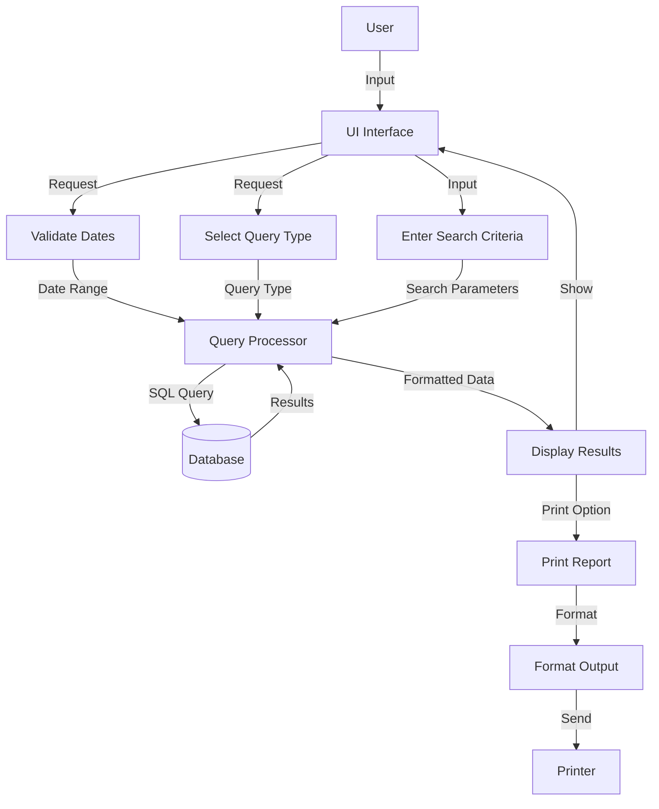

## Module: DlgConsultaReclasificaciones.cpp
# Comprehensive Analysis of DlgConsultaReclasificaciones Module

## Module Name
**DlgConsultaReclasificaciones.cpp** - A dialog-based module for handling reclassification queries in a retail management system.

## Primary Objectives
This module provides a user interface for querying and displaying product reclassification data. It allows users to search for reclassification records based on different criteria such as date ranges, product codes, and class/family combinations, and displays the results in a grid format with options for printing reports.

## Critical Functions
1. **OnInitDialog()** - Initializes the dialog and its components
2. **ConsultarPor()** - Core function that executes database queries based on user-selected criteria
3. **ValidarFechaConsulta()** - Validates date inputs for queries
4. **ValidarRangoFechas()** - Validates date ranges for queries
5. **PreTranslateMessage()** - Handles keyboard input and navigation
6. **validarControl()** - Validates user inputs based on the current focus
7. **impresionReclasificaciones()** - Generates printed reports of query results
8. **Inicializar()** - Sets up initial state of the dialog components

## Key Variables
1. **m_grid** - The grid control that displays query results
2. **m_SbConsultaTipo** - Combo box for selecting query type
3. **sFecha/sFechaFinal** - Date range for queries
4. **iFoco** - Tracks the current input focus for navigation
5. **existeinfo** - Boolean flag indicating if query results exist
6. **m_Codigo/m_Clase/m_Familia** - Input fields for search criteria

## Interdependencies
The module interacts with several system components:
1. Database access through ODBC connections (**odbcTiendaNumero**)
2. Custom grid control (**CGridConsultaReclasificacion**)
3. Database query classes (**CConsultaCodigosReclasificados**, **CConsultaFechaReclasificados**, etc.)
4. Printing utilities (**C_WFormas**, **C_FormasPCL**)
5. Message catalog system (**consultarCatMensajes**)
6. Error logging system (**grabarMensajeError**)

## Core vs. Auxiliary Operations
**Core Operations:**
- Query execution via ConsultarPor()
- Result display in the grid
- Date validation
- Navigation between input fields

**Auxiliary Operations:**
- Message display handling
- Printing functionality
- UI state management
- Error handling and logging

## Operational Sequence
1. User initializes the dialog and selects date range
2. User selects query type from combo box
3. Based on selection, appropriate input fields are displayed
4. User enters search criteria
5. System validates inputs and executes query
6. Results are displayed in grid
7. User can navigate results or print a report
8. User can start a new query with F2 or exit with ESC

## Performance Aspects
1. The module uses direct SQL queries with parameterized inputs
2. Grid operations are optimized with QuickSetText methods
3. Memory management for SQL queries with fixed-size buffers
4. Error handling with specific error codes and messages
5. The module appears to handle potentially large result sets in a grid with pagination for printing

## Reusability
The module has moderate reusability:
1. It's designed specifically for product reclassification queries
2. The dialog framework (CDialog2012) appears to be a reusable base class
3. Printing functions are designed to work with different printer types
4. Database access methods follow a consistent pattern that could be reused
5. Message handling system is generalized

## Usage
This module is used by retail staff to:
1. Track product reclassifications over time
2. Search for specific reclassification records by code or class/family
3. Generate reports of reclassification activities
4. View changes in product classifications, including department, class, family, and inventory changes

## Assumptions
1. The system assumes a specific database schema with reclassification data
2. It assumes specific message catalog entries exist for error messages
3. It assumes printer configurations are stored in the database
4. It assumes user has appropriate permissions to access reclassification data
5. It assumes date inputs follow a specific format (DD-MM-YYYY)
6. It assumes product codes, classes, and families are numeric values
7. It assumes a maximum query date range of 7 days (based on ValidarRangoFechas function)
8. It assumes specific printer output formats for reports

The module is a specialized tool for tracking product classification changes in what appears to be a retail inventory management system, with comprehensive search capabilities and reporting functions.
## Flow Diagram [via mermaid]

