# Introduction :

# System Overview

This program appears to be a comprehensive management and consultation system for Coppel, likely focused on inventory reclassification and administrative operations. The system is structured around multiple specialized modules that handle different aspects of data consultation, user interface management, and system utilities.

The core functionality revolves around reclassification operations, with dedicated modules for consulting reclassified codes and dates (CConsultaCodigosReclasificados, CConsultaFechaReclasificados). The system includes specialized interfaces for clothing inventory management (MenuConsultaRopa) and provides administrative tools for consulting manager and zone information (CConsultarGerenteZonaProGC).

Supporting these primary functions are utility modules that handle date operations (CFechaCoppel), flag management (CFlagCoppel), error messaging (CMensajeError), and general utilities (CUtil). The system also incorporates server IP consultation capabilities (CConsultarIpSysServidores) and message catalog management (CConsultarCatMensajes).

The user interface is managed through form handling components (C_WFormas) and specialized dialog interfaces (DlgConsultaReclasificaciones), all orchestrated by a central module (ModuloPrincipal) that likely serves as the application's entry point and controller.

This system appears designed to provide Coppel's administrative staff with efficient tools for inventory management, reclassification operations, and related administrative functions.

# Full System Overview

# Module Overview
## Module: CConsultaCodigosReclasificados.cpp
# Comprehensive Analysis of CConsultaCodigosReclasificados Module

## Module Name
CConsultaCodigosReclasificados (from CConsultaCodigosReclasificados.cpp)

## Primary Objectives
This module serves as a specialized record set class designed to query and handle reclassified codes from a database. It appears to be focused on retrieving information about items that have been reclassified, including their department, class, family, and other attributes before and after reclassification.

## Critical Functions
1. **Constructor** (`CConsultaCodigosReclasificados`): Initializes the record set with database connection and SQL query parameters, setting up the data types and field mappings.
2. **Destructor** (`~CConsultaCodigosReclasificados`): Handles cleanup when the object is destroyed.
3. **activarCols()**: Activates all columns in the record set for data retrieval, binding database columns to local variables.
4. **Inherited methods from CRecordSet**: While not explicitly shown, the class inherits functionality from CRecordSet for database operations.

## Key Variables
1. **odbc**: Database connection object
2. **nCols**: Number of columns (11) in the result set
3. **odbcRet**: Return value for ODBC operations
4. **nSqlTipo[]**: Array defining SQL data types for each column
5. **nCTipo[]**: Array defining C data types for each column
6. **nLongitud[]**: Array defining buffer lengths for each column
7. **pVar[]**: Array of pointers to variables that will store column data
8. **Data fields**:
   - `ccodigoregresa`: Return code
   - `cdepartamentonuevo`: New department
   - `cclasenueva`: New class
   - `cfamilianueva`: New family
   - `cdepartamentoant`: Previous department
   - `cclaseant`: Previous class
   - `cfamiliaant`: Previous family
   - `cdescripcion`: Description
   - `cexistenciant`: Previous existence/inventory
   - `cexistencianva`: New existence/inventory
   - `cfechae`: Date (possibly execution or effective date)

## Interdependencies
1. Depends on `C_ODBC` for database connectivity
2. Inherits from `CRecordSet` for record set functionality
3. Requires external SQL queries to be passed to the constructor
4. Likely interacts with a database table containing reclassified codes information

## Core vs. Auxiliary Operations
- **Core Operations**: 
  - Database query execution via the constructor
  - Column activation and data binding via activarCols()
  
- **Auxiliary Operations**:
  - Memory management and cleanup in the destructor
  - Type and length definitions in the constructor

## Operational Sequence
1. An instance is created with a database connection and optional SQL query
2. If a query is provided, it's executed immediately
3. Column bindings are activated to map database fields to local variables
4. The caller can then use inherited methods from CRecordSet to navigate through results
5. When finished, the destructor is called to clean up resources

## Performance Aspects
1. All string columns are allocated with a fixed size of 87 characters, which may impact memory usage if many records are processed
2. The module uses direct ODBC calls which generally provide good performance for database operations
3. No explicit pagination or batch processing is implemented, which could be a concern for large result sets

## Reusability
The class is moderately reusable within its specific domain:
- It's tightly coupled to a specific database schema for reclassified codes
- The fixed column structure limits its adaptability to different queries
- Could be extended or modified to handle similar record structures with minimal changes

## Usage
This module would typically be used in scenarios such as:
1. Generating reports of reclassified inventory items
2. Auditing changes to product classifications
3. Tracking historical changes to product categorization
4. Supporting inventory management processes where items are moved between departments or categories

## Assumptions
1. The database schema has a table with exactly 11 columns matching the defined structure
2. All data fields can be represented as VARCHAR/character strings
3. A buffer size of 87 characters is sufficient for all string fields
4. The C_ODBC and CRecordSet base classes handle the core database connectivity and cursor operations
5. Error handling is primarily managed by the parent CRecordSet class
6. The caller will properly manage the lifecycle of the odbc connection object
## Flow Diagram [via mermaid]
## Module: CConsultaFechaReclasificados.cpp
# Comprehensive Analysis of CConsultaFechaReclasificados Module

## Module Name
CConsultaFechaReclasificados (from CConsultaFechaReclasificados.cpp)

## Primary Objectives
This module appears to be a specialized database record set class designed to handle date validation operations for reclassified records. It provides an interface for querying and inserting data related to date validation functionality in a database system.

## Critical Functions
1. **Constructor** (`CConsultaFechaReclasificados`): Initializes the record set with database connection and optional SQL query.
2. **Destructor** (`~CConsultaFechaReclasificados`): Commits any pending transactions before destruction.
3. **activarCols()**: Activates column bindings for data retrieval.
4. **prepararInsert()**: Prepares an SQL insert statement without specifying a table name.
5. **prepararInsert(const char *nombreTabla)**: Prepares an SQL insert statement for a specified table.

## Key Variables
1. **odbc**: Database connection object (C_ODBC pointer).
2. **nCols**: Number of columns (set to 1 in this implementation).
3. **odbcRet**: Return status for ODBC operations.
4. **flagInsertar**: Flag indicating whether columns are activated for insertion.
5. **fun_validarfecha**: Variable to store date validation function result (short integer).
6. **nSqlTipo[]**: Array defining SQL data types for columns.
7. **nCTipo[]**: Array defining C data types for columns.
8. **nLongitud[]**: Array defining column lengths.
9. **pVar[]**: Array of pointers to variables that will store column values.

## Interdependencies
1. Inherits from **CRecordSet** class, suggesting a database abstraction layer.
2. Depends on **C_ODBC** for database connectivity.
3. Uses **CString** for string manipulation, likely from a framework like MFC.
4. Relies on SQL database with tables containing a `fun_validarfecha` column.

## Core vs. Auxiliary Operations
**Core Operations:**
- Database query execution via constructor
- Data binding through activarCols()
- Insert statement preparation via prepararInsert() methods

**Auxiliary Operations:**
- Transaction commitment in the destructor
- Internal flag management for insertion state

## Operational Sequence
1. Initialize with database connection and optional SQL query
2. If query provided, execute it and activate column bindings
3. When needed, prepare insert statements with or without table name specification
4. Bind variables for insertion
5. (Implied) Execute inserts through inherited functionality
6. Commit transactions upon object destruction

## Performance Aspects
1. The module is designed for minimal memory usage with only one column.
2. Direct variable binding to database columns optimizes data transfer.
3. The class maintains state (flagInsertar) to avoid redundant column activation.
4. Uses prepared statements which can improve performance for repeated operations.

## Reusability
The module has limited reusability as designed:
1. It's highly specialized for a single column (`fun_validarfecha`).
2. The fixed column structure makes it difficult to adapt to different schemas.
3. Could be used as a template for creating similar specialized record set classes.
4. Would require significant modification to handle different data structures.

## Usage
This module is likely used in scenarios where:
1. Date validation is required for reclassified records.
2. A system needs to query or update date validation flags in a database.
3. Part of a larger data processing or validation workflow.
4. Potentially used in batch processing of records requiring date validation.

## Assumptions
1. The database has a table with a `fun_validarfecha` column of SQL_SMALLINT type.
2. The parent CRecordSet class handles the core database operations.
3. The C_ODBC connection is properly initialized before being passed to this class.
4. The caller manages transaction boundaries except for the final commit in the destructor.
5. Error handling is primarily managed by the parent class.
6. The module assumes single-threaded access or external synchronization.
7. The `fun_validarfecha` field is assumed to be a flag or code representing date validation status.
## Flow Diagram [via mermaid]
## Module: CConsultarCatMensajes.cpp
# Module Analysis: CConsultarCatMensajes

## Module Name
CConsultarCatMensajes (from CConsultarCatMensajes.cpp)

## Primary Objectives
This module provides a specialized database record set implementation for consulting message catalogs. It appears to be designed to retrieve and handle message data from a database using ODBC connections.

## Critical Functions
1. **Constructor** (`CConsultarCatMensajes`): Initializes the record set with ODBC connection, sets up column types and bindings, and optionally executes a provided SQL query.
2. **Destructor** (`~CConsultarCatMensajes`): Handles cleanup when the object is destroyed.
3. **activarCols()**: Activates column bindings for data retrieval, connecting database columns to program variables.

## Key Variables
1. `odbc`: Pointer to an external ODBC connection object.
2. `nCols`: Number of columns in the result set (set to 1).
3. `odbcRet`: Boolean flag indicating success/failure of ODBC operations.
4. `nSqlTipo`: Array defining SQL data types for columns (SQL_LONGVARCHAR).
5. `nCTipo`: Array defining C data types for columns (SQL_C_CHAR).
6. `nLongitud`: Array defining buffer lengths for columns (1026 bytes).
7. `pVar`: Array of pointers to variables that will store retrieved data.
8. `fun_consultarcatmensajes`: Variable that stores the retrieved message data.

## Interdependencies
1. Inherits from `CRecordSet` class, extending its functionality.
2. Depends on `C_ODBC` class for database connectivity.
3. Likely interacts with other components that need to access message catalog data.

## Core vs. Auxiliary Operations
- **Core Operations**: Executing SQL queries to retrieve message catalog data and binding result columns to program variables.
- **Auxiliary Operations**: Memory management and cleanup handled by the constructor and destructor.

## Operational Sequence
1. Object instantiation with ODBC connection.
2. Column type and binding setup.
3. Optional immediate execution of a SQL query if provided.
4. Column activation to bind database results to program variables.
5. (Implied) Data retrieval through inherited methods from CRecordSet.
6. Object destruction and cleanup.

## Performance Aspects
1. Uses a fixed buffer size of 1026 bytes for the message text, which could be a limitation for very long messages.
2. Single column retrieval suggests focused, efficient data access.
3. Direct binding of database columns to program variables eliminates need for intermediate processing.

## Reusability
The class is somewhat specialized for message catalog consultation but could be adapted for other single-column text retrieval tasks. Its inheritance from CRecordSet suggests it's part of a broader database access framework.

## Usage
This module is likely used to retrieve messages or descriptions from a catalog table in the database. The retrieved messages might be used for:
- User interface text
- Error messages
- System notifications
- Configuration information

## Assumptions
1. The message catalog table has at least one column containing text data.
2. The maximum length of a message is 1026 bytes.
3. The ODBC connection is properly initialized before being passed to this class.
4. The SQL query passed to the constructor is valid and targets the appropriate message catalog table.
5. The CRecordSet parent class handles the core functionality of executing queries and navigating results.
## Flow Diagram [via mermaid]
## Module: CConsultarGerenteZonaProGC.cpp
# Comprehensive Analysis of CConsultarGerenteZonaProGC Module

## Module Name
CConsultarGerenteZonaProGC (from CConsultarGerenteZonaProGC.cpp)

## Primary Objectives
This module appears to be a database access class designed to query and manipulate data related to zone managers (Gerentes de Zona) in a retail or organizational context. It provides an interface for retrieving and inserting records about managers, their regions, zones, stores, and employee information.

## Critical Functions
1. **Constructor (`CConsultarGerenteZonaProGC`)**: Initializes the object with database connection and optional SQL query, setting up data types and column mappings.
2. **Destructor (`~CConsultarGerenteZonaProGC`)**: Performs a database commit before object destruction.
3. **`activarCols()`**: Activates columns for data binding between database and class variables.
4. **`prepararInsert()`**: Prepares an SQL INSERT statement for the default table.
5. **`prepararInsert(const char *nombreTabla)`**: Prepares an SQL INSERT statement for a specified table.

## Key Variables
1. **Database-related**:
   - `odbc`: Database connection object
   - `odbcRet`: Return status for database operations
   - `nCols`: Number of columns (5)

2. **Data fields**:
   - `ciudad`: City identifier (smallint)
   - `region`: Region code (char[10])
   - `zona`: Zone description (char[42])
   - `empleado`: Employee ID (integer)
   - `tienda`: Store ID (smallint)

3. **Metadata arrays**:
   - `nSqlTipo[]`: SQL data types
   - `nCTipo[]`: C data types
   - `nLongitud[]`: Column lengths
   - `pVar[]`: Pointers to variables
   - `nLongResp[]`: Response lengths

4. **State flags**:
   - `flagInsertar`: Indicates if columns are activated for insertion

## Interdependencies
- Inherits from `CRecordSet` class
- Depends on `C_ODBC` for database connectivity
- Uses `CString` for string manipulation
- Likely part of a larger system for managing organizational structure

## Core vs. Auxiliary Operations
**Core Operations**:
- Database record retrieval via constructor with SELECT statement
- Record insertion via `prepararInsert` methods

**Auxiliary Operations**:
- Column activation (`activarCols`)
- Memory management in constructor and destructor
- Data type mapping between SQL and C types

## Operational Sequence
1. Object instantiation with database connection
2. Optional immediate query execution if SELECT statement provided
3. Column activation for data binding
4. Preparation for insertion operations when needed
5. Database commit on object destruction

## Performance Aspects
- Uses direct variable binding to database columns for efficient data transfer
- Commits database transactions on object destruction
- Reuses column activation logic between query and insert operations
- Uses fixed-size arrays for data fields which could limit flexibility but improves performance

## Reusability
- Moderate reusability within its specific domain
- The class is specialized for a specific table structure
- The overloaded `prepararInsert` method allows some flexibility in targeting different tables with the same structure
- Hard-coded column names and types limit general reusability

## Usage
This module would typically be used in code that needs to:
1. Query information about zone managers, their regions, and associated stores
2. Insert new zone manager records into the database
3. Access specific fields like employee IDs, regions, and zones for business logic

Example usage pattern:
```cpp
C_ODBC* dbConnection = new C_ODBC(/* connection parameters */);
// Query existing records
CConsultarGerenteZonaProGC* managers = new CConsultarGerenteZonaProGC(dbConnection, "SELECT * FROM CConsultarGerenteZonaProGC WHERE region = 'NORTH'");
// Process results
while(managers->Next()) {
    // Access managers->ciudad, managers->region, etc.
}
// Insert new record
CConsultarGerenteZonaProGC* newManager = new CConsultarGerenteZonaProGC(dbConnection, NULL);
newManager->ciudad = 101;
newManager->empleado = 5432;
// Set other fields...
newManager->prepararInsert();
newManager->Insert();
delete newManager;
```

## Assumptions
1. The database table has exactly 5 columns with the specified names and types
2. The `CRecordSet` base class handles cursor movement and basic ODBC operations
3. Memory for character arrays (`region`, `zona`) is managed externally or by the base class
4. The database connection (`C_ODBC`) remains valid throughout the object's lifetime
5. The system uses a specific character encoding (likely Latin-1 or similar)
6. The table structure remains consistent and doesn't change during runtime
## Flow Diagram [via mermaid]
## Module: CConsultarIpSysServidores.cpp
# Comprehensive Analysis of CConsultarIpSysServidores Module

## Module Name
CConsultarIpSysServidores.cpp

## Primary Objectives
This module provides a specialized database interface for accessing and manipulating server IP address information stored in a database table (likely named "sysServidores"). It extends the CRecordSet class to handle specific operations related to server IP addresses and their alternates.

## Critical Functions
1. **Constructor** (`CConsultarIpSysServidores`): Initializes the object with an ODBC connection, commit flag, and optional SQL select statement. Sets up data types, lengths, and variable bindings.
2. **Destructor** (`~CConsultarIpSysServidores`): Performs a commit operation if the bFlagCommit flag is set to true.
3. **activarCols()**: Activates column bindings for database operations.
4. **prepararInsert()**: Prepares an insert statement for the default "sysServidores" table.
5. **prepararInsert(const char *nombreTabla)**: Overloaded version that prepares an insert statement for a specified table name with validation.

## Key Variables
1. **ipservidor**: Character array to store the primary server IP address.
2. **ipalterno**: Character array to store the alternate server IP address.
3. **odbc**: Pointer to the ODBC connection object.
4. **bFlagCommit**: Boolean flag indicating whether to commit transactions in the destructor.
5. **nSqlTipo[]**: Array defining SQL data types for columns.
6. **nCTipo[]**: Array defining C data types for columns.
7. **nLongitud[]**: Array defining column lengths.
8. **pVar[]**: Array of pointers to variables for binding.
9. **flagInsertar**: Flag indicating whether columns are activated for insert operations.

## Interdependencies
1. Depends on the `CRecordSet` class (inherits from it).
2. Relies on the `C_ODBC` class for database connectivity.
3. Uses `CString` class for SQL statement formatting.
4. Includes standard C++ libraries `<cctype>` and `<cstring>` for character manipulation and string operations.

## Core vs. Auxiliary Operations
**Core Operations**:
- Database record retrieval via constructor with select statement
- Insert operations via prepararInsert methods
- Column binding via activarCols

**Auxiliary Operations**:
- Input validation in prepararInsert
- Memory initialization and management
- Transaction commit handling in the destructor

## Operational Sequence
1. Initialize with ODBC connection
2. Optionally execute a select statement during construction
3. Activate columns for data binding
4. Prepare insert statements as needed
5. Perform database operations (implied through CRecordSet parent class)
6. Optionally commit changes when the object is destroyed

## Performance Aspects
- Uses fixed-size character arrays (17 bytes) for IP addresses, which is appropriate for IPv4 addresses with the format "xxx.xxx.xxx.xxx"
- Performs input validation on table names to prevent SQL injection
- Minimizes memory operations by setting up all column bindings at initialization

## Reusability
- Moderately reusable for server IP management scenarios
- The class is specialized for a specific table structure with two IP address columns
- Could be adapted for similar two-column string-based tables by modifying column names and data types

## Usage
This module is likely used to:
1. Retrieve server IP configurations from a database
2. Insert or update server IP configurations
3. Manage primary and alternate IP addresses for system servers

## Assumptions
1. The database table "sysServidores" exists with columns "ipservidor" and "ipalterno"
2. IP addresses are stored as character strings of maximum length 16 (plus null terminator)
3. The parent CRecordSet class provides methods like Exec(), Commit(), PrepararInsert(), Activar(), and ActivarInsert()
4. The C_ODBC class provides the necessary database connectivity
5. The system uses IPv4 addresses (based on the 17-byte buffer size)
6. Table names used in prepararInsert() contain only alphanumeric characters and underscores
## Flow Diagram [via mermaid]
## Module: CFechaCoppel.cpp
# Comprehensive Analysis of CFechaCoppel Module

## Module Name
CFechaCoppel.cpp (with corresponding header CFECHACOPPEL.HPP)

## Primary Objectives
This module provides a specialized database record set implementation for handling date operations in a Coppel system. It appears to be designed for retrieving, storing, and manipulating date information in a database table, specifically focusing on a "fecha" (date) field.

## Critical Functions
1. **Constructor (`CFechaCoppel::CFechaCoppel`)**: Initializes the object with database connection, commit flag, and optional SQL select statement.
2. **Destructor (`CFechaCoppel::~CFechaCoppel`)**: Performs cleanup and commits transactions if the commit flag is set.
3. **`activarCols()`**: Activates columns for data binding.
4. **`prepararInsert()`**: Prepares an SQL insert statement for the default "gnDominio" table.
5. **`prepararInsert(const char *nombreTabla)`**: Prepares an SQL insert statement for a specified table.

## Key Variables
1. **`fecha`**: Stores the date value (character array, implied by context).
2. **`odbc`**: Pointer to the ODBC connection object.
3. **`bFlagCommit`**: Boolean flag indicating whether to commit transactions automatically.
4. **`nCols`**: Number of columns (set to 1 in this implementation).
5. **`flagInsertar`**: Flag indicating whether columns have been activated for insertion.
6. **`nSqlTipo[]`**, **`nCTipo[]`**, **`nLongitud[]`**: Arrays storing SQL data types, C data types, and field lengths.
7. **`pVar[]`**: Array of pointers to variables that will hold the data.

## Interdependencies
1. Inherits from **`CRecordSet`** class, extending its functionality.
2. Depends on **`C_ODBC`** for database connectivity.
3. Uses **`CString`** for string manipulation.
4. Interacts with database tables, particularly "gnDominio" by default.

## Core vs. Auxiliary Operations
**Core Operations:**
- Database record retrieval via constructor with select statement
- Data insertion via `prepararInsert()` methods
- Column activation for data binding

**Auxiliary Operations:**
- Memory management in constructor and destructor
- Transaction management (commit handling)

## Operational Sequence
1. Initialize the object with database connection
2. Optionally execute a select statement during initialization
3. Activate columns for data binding
4. Prepare insert statements as needed
5. (Implied) Execute inserts or updates
6. Commit changes if the commit flag is set (during destruction)

## Performance Aspects
1. Uses direct pointer manipulation for data binding, which is efficient.
2. Minimizes string operations in critical paths.
3. Only activates columns once (controlled by `flagInsertar` flag).
4. Performs validation checks before operations (e.g., checking if table name is valid).

## Reusability
The module has moderate reusability:
- It's specialized for date operations in a specific system (Coppel).
- The fixed column structure (single "fecha" column) limits general-purpose use.
- Could be adapted for other single-column table operations with modifications.
- The parameterized table name in `prepararInsert()` provides some flexibility.

## Usage
This module is likely used for:
1. Retrieving date information from database tables
2. Inserting date records into database tables
3. Managing date-related transactions in the Coppel system
4. Potentially serving as a utility class for date operations across the application

## Assumptions
1. The database schema contains tables with a "fecha" column.
2. The "fecha" field is a VARCHAR type with a maximum length of 107 characters.
3. The default table for operations is "gnDominio" if not specified.
4. The C_ODBC connection is properly initialized before being passed to this class.
5. The caller manages the lifetime of the C_ODBC object (it's passed by pointer).
6. The module assumes single-threaded operation or external thread synchronization.
7. The "fecha" variable is properly defined elsewhere in the class (not shown in the provided code).
## Flow Diagram [via mermaid]
## Module: CFlagCoppel.cpp
# Comprehensive Analysis of CFlagCoppel Module

## Module Name
CFlagCoppel.cpp

## Primary Objectives
This module provides a specialized database interface for handling flag operations in a Coppel system. It's designed to interact with a database table (likely named "sysflags") that stores flag values, providing a structured way to read and write flag data through ODBC connections.

## Critical Functions
1. **Constructor (`CFlagCoppel`)**: Initializes the object with an ODBC connection, sets up data binding structures, and optionally executes a select query.
2. **Destructor (`~CFlagCoppel`)**: Performs cleanup and commits transactions if the commit flag is set.
3. **`activarCols()`**: Activates column bindings for database operations.
4. **`prepararInsert()`**: Prepares an INSERT statement for the default "sysflags" table.
5. **`prepararInsert(const char *nombreTabla)`**: Prepares an INSERT statement for a specified table.

## Key Variables
1. **`flag`**: The actual flag value being stored or retrieved.
2. **`bFlagCommit`**: Boolean that determines whether to commit transactions in the destructor.
3. **`odbc`**: Pointer to the ODBC connection object.
4. **`flagInsertar`**: State variable indicating if insert operations have been prepared.
5. **`nSqlTipo[]`, `nCTipo[]`, `nLongitud[]`, `pVar[]`, `nLongResp[]`**: Arrays for managing database column bindings.

## Interdependencies
1. **CFLAGCOPPEL.HPP**: Header file for this class.
2. **C_ODBC**: External class that provides ODBC database connectivity.
3. **CRecordSet**: Parent class that this module inherits from, providing database record operations.
4. **CString**: Used for SQL string formatting.

## Core vs. Auxiliary Operations
**Core Operations**:
- Flag value retrieval via SELECT queries
- Flag value insertion via INSERT statements
- Transaction management (commit)

**Auxiliary Operations**:
- Column activation and binding
- SQL statement preparation
- Error handling

## Operational Sequence
1. Initialize with ODBC connection
2. Optionally execute a SELECT query during construction
3. Activate columns for data binding
4. Prepare INSERT statements as needed
5. Perform database operations (inherited from CRecordSet)
6. Optionally commit changes when the object is destroyed

## Performance Aspects
1. The module uses direct ODBC calls which are generally efficient for database operations.
2. Input validation is performed to prevent buffer overflows (checking string lengths).
3. Exception handling is implemented for critical errors.
4. The module appears to be designed for single-row operations rather than bulk operations.

## Reusability
The module is somewhat specialized for flag operations but could be adapted for similar simple data types. Its reusability is limited by:
1. The fixed column structure (assumes a single column named "flag")
2. The hardcoded data type (SQL_SMALLINT)
3. The default table name ("sysflags")

However, the overloaded `prepararInsert` method that accepts a table name provides some flexibility.

## Usage
This module is likely used to:
1. Read system flags or configuration settings from a database
2. Update or insert new flag values
3. Manage transaction commits for these operations

Typical usage would involve:
```cpp
C_ODBC* odbcConnection = /* obtain connection */;
CFlagCoppel flagHandler(odbcConnection, true, "SELECT flag FROM sysflags WHERE id = 1");
// Read flag value from flagHandler.flag
// Or set a new value
flagHandler.flag = newValue;
flagHandler.prepararInsert();
flagHandler.Insert();
```

## Assumptions
1. The database table has a column named "flag" of type SMALLINT.
2. The default table name is "sysflags" unless specified otherwise.
3. The ODBC connection is properly initialized before being passed to this class.
4. The caller manages the lifecycle of the ODBC connection object.
5. Flag values can be represented as short integers.
6. SELECT queries passed to the constructor are properly formatted and safe.
7. The module assumes single-threaded access or external synchronization.
## Flow Diagram [via mermaid]
## Module: CMensajeError.cpp
# Comprehensive Analysis of CMensajeError Module

## Module Name
CMensajeError.cpp (with corresponding header CMENSAJEERROR.HPP)

## Primary Objectives
This module implements a database interface class for handling error messages in a system. It's designed to interact with a database table named "sysMensajeError" through ODBC connections, providing functionality to store error information including SQL errors, application details, and contextual information.

## Critical Functions
1. **Constructor (`CMensajeError`)**: Initializes the object with an ODBC connection, sets up data types and column mappings, and optionally executes a SELECT query.
2. **Destructor (`~CMensajeError`)**: Performs a commit operation if the flag is set.
3. **`activarCols()`**: Activates columns for data binding.
4. **`prepararInsert()`**: Prepares an INSERT statement for the default table "sysMensajeError".
5. **`prepararInsert(const char *nombreTabla)`**: Prepares an INSERT statement for a specified table.

## Key Variables
1. **`odbc`**: ODBC connection pointer.
2. **`bFlagCommit`**: Boolean flag determining if a commit should be performed on destruction.
3. **`nCols`**: Number of columns (12) in the error message table.
4. **`nSqlTipo[]`**: Array defining SQL data types for each column.
5. **`nCTipo[]`**: Array defining C data types for each column.
6. **`nLongitud[]`**: Array defining column lengths.
7. **`pVar[]`**: Array of pointers to variables holding column values.
8. **`flagInsertar`**: Flag indicating if columns are activated for insertion.

## Interdependencies
1. **`CRecordSet`**: Base class that CMensajeError inherits from.
2. **`C_ODBC`**: External class for ODBC database connectivity.
3. **`CString`**: String handling class used for SQL statement formatting.

## Core vs. Auxiliary Operations
- **Core Operations**: 
  - Preparing and executing INSERT statements for error messages
  - Binding database columns to variables
  
- **Auxiliary Operations**:
  - Commit handling
  - Column activation

## Operational Sequence
1. Object is instantiated with an ODBC connection
2. Column data types and lengths are defined
3. Variables are bound to columns
4. If a SELECT statement is provided, it's executed and columns are activated
5. When needed, INSERT statements are prepared with `prepararInsert()`
6. On object destruction, a commit may be performed based on the flag

## Performance Aspects
- The module uses direct variable binding to columns which is efficient for database operations
- Pre-defined column types and lengths optimize the database interaction
- The module allows for parameterized queries which helps prevent SQL injection

## Reusability
- The class is designed to work with a specific table structure but offers some flexibility:
  - The alternative `prepararInsert(const char *nombreTabla)` allows targeting different tables with the same structure
  - The constructor accepts an external ODBC connection, allowing it to be used in different database contexts

## Usage
This module is likely used throughout an application to log errors to a database. When an error occurs, an instance of CMensajeError would be created, populated with error details (SQL error codes, application context, user information), and then inserted into the database through the prepared statements.

## Assumptions
1. The database table "sysMensajeError" exists with the expected 12-column structure
2. The ODBC connection provided is valid and has appropriate permissions
3. The error message fields (area, caja, iporigen, etc.) have specific meanings in the application context
4. The column types and lengths are fixed and match the database schema
5. The class assumes it's used in a C++ environment with access to CString and the parent CRecordSet class
6. The module assumes proper memory management for the variables pointed to by pVar[]
## Flow Diagram [via mermaid]
## Module: CUtil.cpp
# Comprehensive Analysis of CUtil Module

## Module Name
The module is named "CUtil" (Utility Class), implemented in CUtil.cpp.

## Primary Objectives
This module serves as a utility class providing common functionality, specifically focused on logging operations. Its main purpose is to write timestamped log entries to a file for debugging, auditing, or monitoring purposes.

## Critical Functions
1. **GrabarLog(char *cLog)** - The primary function that writes a log message to a file with a timestamp. It:
   - Validates the input log message
   - Creates a filename with the current date
   - Formats the log message with timestamp
   - Opens a file and appends the log message

## Key Variables
- **sArch[256]** - Buffer to store the log filename
- **cTextoGrabar[2048]** - Buffer to store the formatted log message with timestamp
- **tFecha** - CTime object that provides the current date and time

## Interdependencies
- **CTime** - Used for retrieving the current date and time
- **C_Archivo** - Used for file operations (opening, positioning, writing)
- The module likely depends on "CUtil.h" header file (included at the top)

## Core vs. Auxiliary Operations
- **Core Operation**: Writing log messages to a file (GrabarLog function)
- **Auxiliary Operations**: 
  - Date/time retrieval
  - String formatting
  - File positioning and writing

## Operational Sequence
1. Validate the input log message
2. Get the current date and time
3. Create a log filename with format "C:\sys\mem\RI0074_YYYYMMDD.log"
4. Format the log message with timestamp "YYYY-MM-DD HH:MM:SS [message]"
5. Open the log file
6. Position at the end of the file
7. Write the formatted log message

## Performance Aspects
- The code includes buffer size checks to prevent buffer overflows
- Fixed-size buffers (256 bytes for filename, 2048 bytes for log message) may limit log message length
- File is opened and closed for each log entry, which could be inefficient for high-frequency logging

## Reusability
- The module is designed as a class that can be instantiated and used throughout an application
- The logging functionality is generic and could be reused in various contexts
- The hardcoded file path "C:\sys\mem\" limits portability across different environments

## Usage
The module is used by creating an instance of CUtil and calling the GrabarLog method with a string message:
```cpp
CUtil util;
util.GrabarLog("This is a log message");
```

## Assumptions
1. The system has write access to the "C:\sys\mem\" directory
2. Log messages will not exceed 2048 characters
3. The CTime class is available and properly implemented
4. The C_Archivo class is available and properly implemented for file operations
5. The system uses a format where "\" is the directory separator (Windows-style paths)
6. The code assumes a specific naming convention for logs (RI0074_YYYYMMDD.log)
7. The log file should be appended to rather than overwritten
## Flow Diagram [via mermaid]
## Module: C_WFormas.cpp
# Comprehensive Analysis of C_WFormas Module

## Module Name
C_WFormas.cpp - A Windows-based printing and document formatting module

## Primary Objectives
This module provides a comprehensive interface for document printing and formatting in Windows applications. It handles various printer types (laser, matrix, PDF), manages page layouts, text positioning, font styling, and printer communication. The primary purpose is to abstract the complexities of Windows printing APIs and provide a higher-level interface for document creation.

## Critical Functions

1. **Constructor/Destructor**:
   - `C_WFormas::C_WFormas()` - Initializes printing environment based on printer type and page orientation
   - `C_WFormas::~C_WFormas()` - Cleans up printing resources

2. **Printer Management**:
   - `GetPrinterDevice()` - Retrieves printer device information
   - `ChecarImpresora()` - Checks printer status
   - `IsPrinterError()` - Detects printer errors
   - `GetJobs()` - Retrieves printer job information
   - `MapearLaser()` - Maps to laser printer
   - `imprimirArchivo()` - Prints a file directly to printer

3. **Text Positioning and Formatting**:
   - `poner()` - Places text at specific coordinates
   - `ponerTexto()` - Places text with floating-point coordinates
   - `ponerPP()` - Places text with direct pixel positioning
   - `nuevaPagina()` - Handles page breaks
   - `nuevaPaginaMatricial()` - Handles page breaks for matrix printers

4. **Drawing Functions**:
   - `ponerLinea()` - Draws horizontal lines
   - `ponerColumna()` - Draws vertical lines
   - `ponerCuadro()` - Draws rectangles
   - `ponerGrid()` - Creates grid layouts

5. **Font and Style Management**:
   - `AjustarFont()` - Sets font properties
   - `AjustarTipoDeLetra()` - Changes font type
   - `AjustarTamano()` - Changes font size
   - `AjustarFormato()` - Sets text formatting (bold, italic, underline)
   - `AjustarColor()` - Sets text color
   - `cambiarLetra()` - Changes font with coordinate adjustment

6. **Document Control**:
   - `imprimir()` - Finalizes current page
   - `imprimirLaser()` - Initializes laser printer document
   - `finDocumento()` - Ends the document

## Key Variables

1. **Printer State**:
   - `PrintDC` - Device context for printing
   - `hPPrintDC` - Handle to printer device context
   - `sPrinter` - Printer name
   - `sPuertoImp` - Printer port
   - `iTipoImpresora` - Printer type (0=matrix, 1=laser, 2=PDF)
   - `bContinuar` - Flag to continue printing process
   - `bNextPage` - Flag for page transition

2. **Text Formatting**:
   - `sFuente` - Current font name
   - `nFontSize` - Current font size
   - `nEnfatizar` - Bold setting
   - `bItalicas` - Italic setting
   - `bSubrayar` - Underline setting
   - `xFont` - Array of font configurations

3. **Layout**:
   - `LineHeight` - Height of text lines
   - `nColWidth` - Width of columns
   - `LinesPerPage` - Number of lines per page
   - `ColsPerPage` - Number of columns per page
   - `TM` - Text metrics

## Interdependencies
- **Windows API**: Heavy reliance on Windows printing APIs (winspool.h)
- **MFC**: Uses MFC classes like CString, CFont, CDC
- **C_Mem**: Used for memory management
- **C_Archiv**: Used for file operations
- **gnwproto**: Protocol definitions (likely network-related)
- **Network**: Uses winsock.h for IP address retrieval

## Core vs. Auxiliary Operations
- **Core Operations**:
  - Printer detection and configuration
  - Text positioning and formatting
  - Page management
  - Document control

- **Auxiliary Operations**:
  - Error checking and reporting
  - IP address retrieval
  - Logging functionality
  - Font caching

## Operational Sequence
1. Initialize printer with specific paper type and orientation
2. Configure fonts and text properties
3. Position and format text/graphics on pages
4. Handle page transitions when needed
5. Finalize document and clean up resources

## Performance Aspects
- Font caching system to avoid recreating fonts
- Direct printer access for raw printing when needed
- Memory management for printer job information
- Error checking to prevent wasted print jobs
- Efficient handling of device contexts

## Reusability
The module is designed for high reusability:
- Abstracts printer-specific details
- Provides consistent interface across printer types
- Supports multiple paper sizes and orientations
- Handles both text and graphical elements
- Offers flexible positioning systems (grid, absolute coordinates)

## Usage
This module would typically be used in applications requiring formatted document output:
- Financial reports
- Invoices and receipts
- Forms and certificates
- Data listings and tables
- The function naming suggests it may be used in a Spanish-language application

## Assumptions
1. Windows operating system environment
2. Printers are properly installed and configured in Windows
3. Printer names follow certain conventions (containing "LASER", "EPSON", "PDF", etc.)
4. Local network access for printer sharing
5. Sufficient memory for font caching
6. Log directory exists at "c:\sys\mem\"
7. User has appropriate permissions for printer access
8. Assumes specific paper sizes (referenced as TAMANO_OFICIO)
9. Maximum of 80 different font configurations

This module provides a comprehensive abstraction layer over Windows printing functionality, making document creation and formatting significantly easier for application developers.
## Flow Diagram [via mermaid]
## Module: DlgConsultaReclasificaciones.cpp
# Comprehensive Analysis of DlgConsultaReclasificaciones Module

## Module Name
**DlgConsultaReclasificaciones.cpp** - A dialog-based module for handling reclassification queries in a retail management system.

## Primary Objectives
This module provides a user interface for querying and displaying product reclassification data. It allows users to search for reclassification records based on different criteria such as date ranges, product codes, and class/family combinations, and displays the results in a grid format with options for printing reports.

## Critical Functions
1. **OnInitDialog()** - Initializes the dialog and its components
2. **ConsultarPor()** - Core function that executes database queries based on user-selected criteria
3. **ValidarFechaConsulta()** - Validates date inputs for queries
4. **ValidarRangoFechas()** - Validates date ranges for queries
5. **PreTranslateMessage()** - Handles keyboard input and navigation
6. **validarControl()** - Validates user inputs based on the current focus
7. **impresionReclasificaciones()** - Generates printed reports of query results
8. **Inicializar()** - Sets up initial state of the dialog components

## Key Variables
1. **m_grid** - The grid control that displays query results
2. **m_SbConsultaTipo** - Combo box for selecting query type
3. **sFecha/sFechaFinal** - Date range for queries
4. **iFoco** - Tracks the current input focus for navigation
5. **existeinfo** - Boolean flag indicating if query results exist
6. **m_Codigo/m_Clase/m_Familia** - Input fields for search criteria

## Interdependencies
The module interacts with several system components:
1. Database access through ODBC connections (**odbcTiendaNumero**)
2. Custom grid control (**CGridConsultaReclasificacion**)
3. Database query classes (**CConsultaCodigosReclasificados**, **CConsultaFechaReclasificados**, etc.)
4. Printing utilities (**C_WFormas**, **C_FormasPCL**)
5. Message catalog system (**consultarCatMensajes**)
6. Error logging system (**grabarMensajeError**)

## Core vs. Auxiliary Operations
**Core Operations:**
- Query execution via ConsultarPor()
- Result display in the grid
- Date validation
- Navigation between input fields

**Auxiliary Operations:**
- Message display handling
- Printing functionality
- UI state management
- Error handling and logging

## Operational Sequence
1. User initializes the dialog and selects date range
2. User selects query type from combo box
3. Based on selection, appropriate input fields are displayed
4. User enters search criteria
5. System validates inputs and executes query
6. Results are displayed in grid
7. User can navigate results or print a report
8. User can start a new query with F2 or exit with ESC

## Performance Aspects
1. The module uses direct SQL queries with parameterized inputs
2. Grid operations are optimized with QuickSetText methods
3. Memory management for SQL queries with fixed-size buffers
4. Error handling with specific error codes and messages
5. The module appears to handle potentially large result sets in a grid with pagination for printing

## Reusability
The module has moderate reusability:
1. It's designed specifically for product reclassification queries
2. The dialog framework (CDialog2012) appears to be a reusable base class
3. Printing functions are designed to work with different printer types
4. Database access methods follow a consistent pattern that could be reused
5. Message handling system is generalized

## Usage
This module is used by retail staff to:
1. Track product reclassifications over time
2. Search for specific reclassification records by code or class/family
3. Generate reports of reclassification activities
4. View changes in product classifications, including department, class, family, and inventory changes

## Assumptions
1. The system assumes a specific database schema with reclassification data
2. It assumes specific message catalog entries exist for error messages
3. It assumes printer configurations are stored in the database
4. It assumes user has appropriate permissions to access reclassification data
5. It assumes date inputs follow a specific format (DD-MM-YYYY)
6. It assumes product codes, classes, and families are numeric values
7. It assumes a maximum query date range of 7 days (based on ValidarRangoFechas function)
8. It assumes specific printer output formats for reports

The module is a specialized tool for tracking product classification changes in what appears to be a retail inventory management system, with comprehensive search capabilities and reporting functions.
## Flow Diagram [via mermaid]
## Module: MenuConsultaRopa.cpp
# Comprehensive Analysis of MenuConsultaRopa.cpp

## Module Name
MenuConsultaRopa.cpp - A DLL extension module for what appears to be a clothing consultation or inventory system.

## Primary Objectives
This module serves as a Dynamic Link Library (DLL) entry point for a clothing consultation application. Its purpose is to properly initialize and terminate the DLL when it's loaded into or unloaded from a process.

## Critical Functions
- **DllMain**: The standard entry point function for Windows DLLs. Handles initialization when the DLL is attached to a process and cleanup when it's detached.

## Key Variables
- **MenuConsultaRopaDLL**: Static AFX_EXTENSION_MODULE structure that stores information about the DLL extension module.
- **pDllLib**: Pointer to a CDynLinkLibrary object that represents the DLL in the MFC extension mechanism.

## Interdependencies
- **MFC Framework**: The code relies on the Microsoft Foundation Classes (MFC) framework, as evidenced by the inclusion of <afxdllx.h> and the use of MFC-specific classes and functions.
- **Resource.h**: Includes a resource header file, suggesting the DLL has resources (dialogs, menus, etc.) defined elsewhere.

## Core vs. Auxiliary Operations
- **Core Operations**: DLL initialization and termination through the DllMain function.
- **Auxiliary Operations**: Debug memory allocation tracking (via DEBUG_NEW macro).

## Operational Sequence
1. When the DLL is loaded (DLL_PROCESS_ATTACH):
   - Initialize the extension module using AfxInitExtensionModule
   - Create a new CDynLinkLibrary object to register the DLL with MFC
2. When the DLL is unloaded (DLL_PROCESS_DETACH):
   - Delete the CDynLinkLibrary object
   - Terminate the extension module using AfxTermExtensionModule

## Performance Aspects
The code follows standard DLL initialization practices. The use of static objects and proper cleanup in DLL_PROCESS_DETACH helps prevent memory leaks. There are no obvious performance bottlenecks in this initialization code.

## Reusability
This is a standard MFC DLL initialization template that could be adapted for other MFC-based DLLs by changing the module name and associated resources. The structure itself is highly reusable.

## Usage
This DLL is likely used as a plugin or extension for a clothing consultation application. The main application would load this DLL to access functionality related to clothing consultation, possibly including UI elements, business logic, or data access components.

## Assumptions
1. The code assumes it's being compiled in an MFC environment.
2. It assumes that the Resource.h file exists and contains necessary resource definitions.
3. It assumes that the actual functionality of the DLL (not shown in this snippet) is implemented elsewhere, possibly in other source files that are part of the same project.
4. The code assumes proper memory management, with the expectation that the DLL will be properly detached when no longer needed.
## Flow Diagram [via mermaid]
## Module: ModuloPrincipal.cpp
# Comprehensive Module Analysis

## Module Name
**ModuloPrincipal.cpp** - This is the main module for the retail consultation system in the Coppel retail management platform.

## Primary Objectives
This module serves as the central hub for various consultation operations in a retail environment, specifically for the "Ropa" (clothing) department. Its main purpose is to provide a menu-driven interface for employees to access different consultation functions including customer information, inventory queries, sales statistics, and management tools.

## Critical Functions
1. **RI0074()** - The main entry point function that displays the consultation menu and handles user selections.
2. **comprobarCajaVentaAsistida()** - Validates if a cash register is configured for assisted sales.
3. **validarPuestoConsulta()** - Verifies if an employee has the necessary permissions for specific consultation types.
4. **fechaActualDelGnDominio()** - Retrieves the current date from the system database.
5. **checarDerecho()** - Checks if an employee has specific access rights.
6. **MenuProGC()** - Displays the Programa Gerencial Coppel (ProGC) management menu.
7. **validarGerente()** - Validates if an employee has manager-level permissions.
8. **ConsultarPermisoSubOrigen()** - Checks permissions for specific subsystems.

## Key Variables
1. **parametros** - Structure containing session parameters (employee ID, store, register, etc.).
2. **iCajaVentaAsistida** - Flag indicating if a register is configured for assisted sales.
3. **iFlagPermisoSubOrigen** - Flag for subsystem permissions.
4. **lNumeroEmpleado** - Employee ID number.
5. **iTienda** - Store number.
6. **iCaja** - Register/cashier number.
7. **iSistema** - System identifier (1=M, 2=R, 3=C).
8. **sServer** - Server connection string.

## Interdependencies
The module interacts with numerous system components:
1. Database connections via ODBC (odbcTiendaNumero).
2. External DLLs loaded dynamically (GN and RI modules).
3. C# components through bridge applications.
4. UWP applications for specific functions.
5. Various utility classes (CUtil, CFlagCoppel, CMaximo, etc.).
6. Menu system (C_Menu).

## Core vs. Auxiliary Operations
**Core Operations:**
- Menu display and navigation
- Permission validation
- DLL loading and execution
- Database queries for business logic

**Auxiliary Operations:**
- Error logging
- Date formatting
- Connection management
- Parameter passing between modules

## Operational Sequence
1. The module initializes with parameters from the calling system.
2. It establishes database connections and validates user permissions.
3. A menu is displayed with options based on user rights and system configuration.
4. When an option is selected, the module either:
   - Loads and executes the appropriate DLL
   - Spawns an external process
   - Opens a dialog for further input
5. After the selected operation completes, control returns to the menu until the user exits.

## Performance Aspects
- The module uses dynamic memory allocation for parameters and strings.
- Database connections are established and closed as needed.
- External processes are spawned with P_WAIT to ensure sequential operation.
- Error handling includes database error capture and logging.
- The module uses direct memory operations (memcpy_s, sprintf_s) for efficiency.

## Reusability
The module is designed for a specific retail system but demonstrates several reusable patterns:
- Parameter passing structure (SParametros)
- Dynamic DLL loading mechanism
- Menu-driven interface
- Permission validation framework
- Error handling and logging system

However, its tight coupling with specific database schemas and external components limits direct reusability outside the Coppel system.

## Usage
This module is used as the main consultation interface for retail employees in the clothing department. It provides access to:
1. Customer information and notes
2. Inventory queries
3. Sales statistics
4. Management reports and planning tools
5. Electronic catalogs and manuals
6. Special functions like FONACOT invoice queries
7. Management tools for scheduling and performance tracking

## Assumptions
1. The module assumes a specific database schema is available.
2. It assumes certain DLLs exist in predefined paths.
3. It assumes specific user permission structures in the database.
4. It assumes the existence of external applications like HTML.EXE and PuenteToCSharp.EXE.
5. It assumes a specific hardware configuration (cash registers, possibly fingerprint readers).
6. It assumes a Windows environment with MFC support.
7. It assumes specific flag configurations in the database for features like Canada stores.
8. It assumes the calling system provides valid parameters in the expected format.

The module is clearly part of a larger retail management system with complex interdependencies between components.
## Flow Diagram [via mermaid]
## Module: stdafx.cpp
# Comprehensive Analysis: stdafx.cpp

## Module Name
The module is `stdafx.cpp`, a standard precompiled header source file for a Windows application named "MenuConsultaRopa".

## Primary Objectives
This module serves as a precompiled header implementation file that:
1. Includes standard headers needed throughout the application
2. Provides a custom implementation of the `AfxMessageBox` function
3. Supports the precompiled header mechanism to improve compilation speed

## Critical Functions
- **`AfxMessageBox`**: An overridden version of the MFC (Microsoft Foundation Classes) message box function that customizes the title of message boxes to "COPPEL" and sets a default icon type of MB_ICONEXCLAMATION when none is specified.

## Key Variables
- **`lpszText`**: The message text to be displayed in the message box
- **`nType`**: The type/style of the message box (buttons and icons)
- **`nIDHelp`**: An unused parameter (commented as such) that would typically specify a help context ID

## Interdependencies
- Depends on `stdafx.h` - the precompiled header file
- Depends on `afxwin.h` - a core MFC header file for Windows functionality
- Interacts with Windows API functions like `MessageBox` and `GetActiveWindow`
- Provides services to the rest of the "MenuConsultaRopa" application

## Core vs. Auxiliary Operations
- **Core**: The precompiled header mechanism itself (implicit)
- **Auxiliary**: The custom `AfxMessageBox` implementation, which modifies standard MFC behavior

## Operational Sequence
The operational flow is straightforward:
1. The precompiled header is included
2. MFC Windows functionality is included
3. The `AfxMessageBox` function is defined to customize message boxes

## Performance Aspects
- The file implements the precompiled header pattern, which significantly improves compilation speed in large projects by caching compiled headers
- The custom message box function is minimal and should have negligible performance impact

## Reusability
- The custom `AfxMessageBox` function could be reused in other MFC applications that require a consistent message box title
- The precompiled header pattern itself is a standard reusable approach for C++ Windows applications

## Usage
- This file is compiled once to generate the precompiled header (.pch) file
- The resulting precompiled header is then used by other source files in the project
- The custom `AfxMessageBox` function would be used throughout the application to display messages to users with the "COPPEL" title

## Assumptions
1. The application is an MFC-based Windows application
2. "COPPEL" is the application or company name that should appear in all message box titles
3. The default message box style should include an exclamation icon when not otherwise specified
4. The application is named "MenuConsultaRopa" (based on the comment about the .pch file)
5. The help functionality of message boxes is not being used (the nIDHelp parameter is ignored)
## Flow Diagram [via mermaid]

