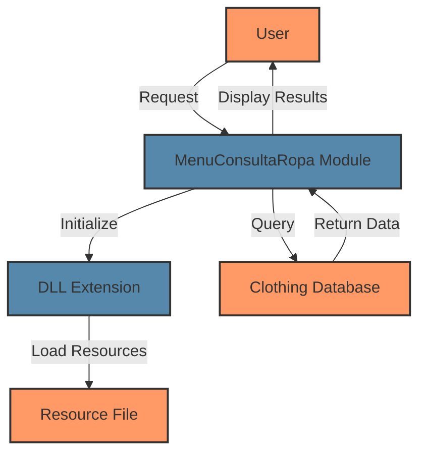

## Module: MenuConsultaRopa.cpp
# Comprehensive Analysis of MenuConsultaRopa.cpp

## Module Name
MenuConsultaRopa.cpp - A DLL extension module for what appears to be a clothing consultation or inventory system.

## Primary Objectives
This module serves as a Dynamic Link Library (DLL) entry point for a clothing consultation application. Its purpose is to properly initialize and terminate the DLL when it's loaded into or unloaded from a process.

## Critical Functions
- **DllMain**: The standard entry point function for Windows DLLs. Handles initialization when the DLL is attached to a process and cleanup when it's detached.

## Key Variables
- **MenuConsultaRopaDLL**: Static AFX_EXTENSION_MODULE structure that stores information about the DLL extension module.
- **pDllLib**: Pointer to a CDynLinkLibrary object that represents the DLL in the MFC extension mechanism.

## Interdependencies
- **MFC Framework**: The code relies on the Microsoft Foundation Classes (MFC) framework, as evidenced by the inclusion of <afxdllx.h> and the use of MFC-specific classes and functions.
- **Resource.h**: Includes a resource header file, suggesting the DLL has resources (dialogs, menus, etc.) defined elsewhere.

## Core vs. Auxiliary Operations
- **Core Operations**: DLL initialization and termination through the DllMain function.
- **Auxiliary Operations**: Debug memory allocation tracking (via DEBUG_NEW macro).

## Operational Sequence
1. When the DLL is loaded (DLL_PROCESS_ATTACH):
   - Initialize the extension module using AfxInitExtensionModule
   - Create a new CDynLinkLibrary object to register the DLL with MFC
2. When the DLL is unloaded (DLL_PROCESS_DETACH):
   - Delete the CDynLinkLibrary object
   - Terminate the extension module using AfxTermExtensionModule

## Performance Aspects
The code follows standard DLL initialization practices. The use of static objects and proper cleanup in DLL_PROCESS_DETACH helps prevent memory leaks. There are no obvious performance bottlenecks in this initialization code.

## Reusability
This is a standard MFC DLL initialization template that could be adapted for other MFC-based DLLs by changing the module name and associated resources. The structure itself is highly reusable.

## Usage
This DLL is likely used as a plugin or extension for a clothing consultation application. The main application would load this DLL to access functionality related to clothing consultation, possibly including UI elements, business logic, or data access components.

## Assumptions
1. The code assumes it's being compiled in an MFC environment.
2. It assumes that the Resource.h file exists and contains necessary resource definitions.
3. It assumes that the actual functionality of the DLL (not shown in this snippet) is implemented elsewhere, possibly in other source files that are part of the same project.
4. The code assumes proper memory management, with the expectation that the DLL will be properly detached when no longer needed.
## Flow Diagram [via mermaid]

