## Module: ModuloPrincipal.cpp
# Comprehensive Module Analysis

## Module Name
**ModuloPrincipal.cpp** - This is the main module for the retail consultation system in the Coppel retail management platform.

## Primary Objectives
This module serves as the central hub for various consultation operations in a retail environment, specifically for the "Ropa" (clothing) department. Its main purpose is to provide a menu-driven interface for employees to access different consultation functions including customer information, inventory queries, sales statistics, and management tools.

## Critical Functions
1. **RI0074()** - The main entry point function that displays the consultation menu and handles user selections.
2. **comprobarCajaVentaAsistida()** - Validates if a cash register is configured for assisted sales.
3. **validarPuestoConsulta()** - Verifies if an employee has the necessary permissions for specific consultation types.
4. **fechaActualDelGnDominio()** - Retrieves the current date from the system database.
5. **checarDerecho()** - Checks if an employee has specific access rights.
6. **MenuProGC()** - Displays the Programa Gerencial Coppel (ProGC) management menu.
7. **validarGerente()** - Validates if an employee has manager-level permissions.
8. **ConsultarPermisoSubOrigen()** - Checks permissions for specific subsystems.

## Key Variables
1. **parametros** - Structure containing session parameters (employee ID, store, register, etc.).
2. **iCajaVentaAsistida** - Flag indicating if a register is configured for assisted sales.
3. **iFlagPermisoSubOrigen** - Flag for subsystem permissions.
4. **lNumeroEmpleado** - Employee ID number.
5. **iTienda** - Store number.
6. **iCaja** - Register/cashier number.
7. **iSistema** - System identifier (1=M, 2=R, 3=C).
8. **sServer** - Server connection string.

## Interdependencies
The module interacts with numerous system components:
1. Database connections via ODBC (odbcTiendaNumero).
2. External DLLs loaded dynamically (GN and RI modules).
3. C# components through bridge applications.
4. UWP applications for specific functions.
5. Various utility classes (CUtil, CFlagCoppel, CMaximo, etc.).
6. Menu system (C_Menu).

## Core vs. Auxiliary Operations
**Core Operations:**
- Menu display and navigation
- Permission validation
- DLL loading and execution
- Database queries for business logic

**Auxiliary Operations:**
- Error logging
- Date formatting
- Connection management
- Parameter passing between modules

## Operational Sequence
1. The module initializes with parameters from the calling system.
2. It establishes database connections and validates user permissions.
3. A menu is displayed with options based on user rights and system configuration.
4. When an option is selected, the module either:
   - Loads and executes the appropriate DLL
   - Spawns an external process
   - Opens a dialog for further input
5. After the selected operation completes, control returns to the menu until the user exits.

## Performance Aspects
- The module uses dynamic memory allocation for parameters and strings.
- Database connections are established and closed as needed.
- External processes are spawned with P_WAIT to ensure sequential operation.
- Error handling includes database error capture and logging.
- The module uses direct memory operations (memcpy_s, sprintf_s) for efficiency.

## Reusability
The module is designed for a specific retail system but demonstrates several reusable patterns:
- Parameter passing structure (SParametros)
- Dynamic DLL loading mechanism
- Menu-driven interface
- Permission validation framework
- Error handling and logging system

However, its tight coupling with specific database schemas and external components limits direct reusability outside the Coppel system.

## Usage
This module is used as the main consultation interface for retail employees in the clothing department. It provides access to:
1. Customer information and notes
2. Inventory queries
3. Sales statistics
4. Management reports and planning tools
5. Electronic catalogs and manuals
6. Special functions like FONACOT invoice queries
7. Management tools for scheduling and performance tracking

## Assumptions
1. The module assumes a specific database schema is available.
2. It assumes certain DLLs exist in predefined paths.
3. It assumes specific user permission structures in the database.
4. It assumes the existence of external applications like HTML.EXE and PuenteToCSharp.EXE.
5. It assumes a specific hardware configuration (cash registers, possibly fingerprint readers).
6. It assumes a Windows environment with MFC support.
7. It assumes specific flag configurations in the database for features like Canada stores.
8. It assumes the calling system provides valid parameters in the expected format.

The module is clearly part of a larger retail management system with complex interdependencies between components.
## Flow Diagram [via mermaid]

```mermaid
graph TD
    User[User] --> MainMenu[Main Menu]
    MainMenu --> ConsultasNotas[Consultas de Notas]
    MainMenu --> ConsultaNombre[Consulta por Nombre]
    MainMenu --> ConsultaClientesForaneos[Consulta Clientes Foráneos]
    MainMenu --> ConsultasInventario[Consultas al Inventario]
    MainMenu --> ConsultaCodigoTalla[Consulta Código Talla]
    MainMenu --> ConsultarFacturas[Consultar Facturas FONACOT]
    MainMenu --> CatalogoElectronico[Catálogo Electrónico]
    MainMenu --> ManualTiendas[Manual de Tiendas]
    MainMenu --> ProGC[Programa Gerencial Coppel]
    MainMenu --> EstadisticaVentas[Estadística de Ventas]
    MainMenu --> PlaneacionDescansos[Planeación de Descansos]
    MainMenu --> ConsultaMovimientos[Consulta de Movimientos]
    MainMenu --> ListadoCodigos[Listado de Códigos]
    MainMenu --> TramitarNIP[Tramitar Confirmación NIP]
    MainMenu --> CapturaClientes[Captura Clientes a Localizar]
    MainMenu --> ConsultasCortes[Consultas de Cortes de Caja]
    
    ProGC --> PlanSemanal[Plan Semanal]
    ProGC --> DesempenoVendedor[Desempeño Semanal Vendedor]
    ProGC --> DesempenoZona[Desempeño Zona]
    ProGC --> DesempenoCajas[Desempeño Semanal Cajas]
    ProGC --> ConfirmarPlan[Confirmar Plan Semanal]
    
    Database[(Base de Datos)] --> MainMenu
    Database --> ConsultasNotas
    Database --> ConsultaNombre
    Database --> ConsultaClientesForaneos
    Database --> ConsultasInventario
    Database --> ConsultaCodigoTalla
    Database --> ConsultarFacturas
    Database --> ProGC
    Database --> EstadisticaVentas
    Database --> PlaneacionDescansos
    Database --> ConsultaMovimientos
    Database --> ListadoCodigos
    Database --> TramitarNIP
    Database --> CapturaClientes
    Database --> ConsultasCortes
    
    ValidacionDerechos[Validación de Derechos] --> ConsultasNotas
    ValidacionDerechos --> ConsultarFacturas
    ValidacionDerechos --> ProGC
    ValidacionDerechos --> EstadisticaVentas
    
    ExternalSystems[Sistemas Externos] --> CatalogoElectronico
    ExternalSystems --> ManualTiendas
```

