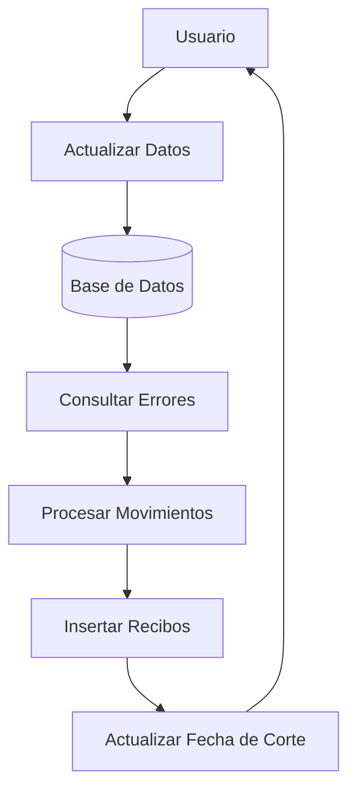

## Module: CD0011spcActualizaCarga.sql
# Análisis Integral del Módulo CD0011spcActualizaCarga

## Nombre del Componente SQL
Procedimiento almacenado `CD0011spcActualizaCarga`

## Objetivos Primarios
Este procedimiento almacenado tiene como objetivo principal realizar actualizaciones del filtro de carga de transacciones, específicamente para el manejo de seguros y beneficiarios. Gestiona la actualización de datos de seguros adicionales, beneficiarios, y registra movimientos en cajas relacionados con diferentes tipos de transacciones.

## Funciones, Métodos y Consultas Críticas
- **Actualización de datos de seguros adicionales**: Actualiza información de beneficiarios en la tabla `CarCargaTransacciones` desde `CarCargaBeneficiarios`.
- **Normalización de datos**: Establece valores predeterminados para campos nulos en las tablas de carga.
- **Inserción de registros de movimientos**: Realiza múltiples inserciones en `ctlRecibosCajaCte` desde diferentes fuentes:
  - `CaCarMovHistorial` para movimientos específicos
  - `CaSegurosClientesNuevosHistorial` para seguros de clientes nuevos
  - `TdTiempoAire` para transacciones de tiempo aire
- **Consolidación de recibos**: Inserta conteos de recibos en `ctlRecibosCajasTda`
- **Actualización de fechas de corte**: Gestiona la tabla `ctlMaestraFechas`

## Variables y Elementos Clave
- **Variables**: `@num_cajaTAcn` (número de caja para transacciones de tiempo aire)
- **Tablas principales**:
  - `CarCargaTransacciones`
  - `CarCargaBeneficiarios`
  - `CaCarMovHistorial`
  - `CaSegurosClientesNuevosHistorial`
  - `TdTiempoAire`
  - `ctlRecibosCajaCte`
  - `ctlRecibosCajasTda`
  - `ctlMaestraFechas`
  - `tmpTiendasErrores`
  - `ctlMensajesErrorTienda`
- **Columnas críticas**: `NumeroCliente`, `Folio`, `FechaMovimiento`, `TipoMovimiento`, `Clave`, `Recibo`, `Importe`, `NumeroTienda`

## Interdependencias y Relaciones
- Relación entre `CarCargaTransacciones` y `CarCargaBeneficiarios` para actualización de datos de seguros adicionales
- Validación de errores críticos mediante la relación entre `tmpTiendasErrores` y `ctlMensajesErrorTienda`
- Dependencia de la configuración en `ctl_configuracionCortesCajas` para obtener el número de caja
- Relación entre transacciones históricas y registros de recibos

## Operaciones Principales vs. Auxiliares
**Operaciones principales**:
- Actualización de datos de beneficiarios y seguros adicionales
- Inserción de registros de movimientos en `ctlRecibosCajaCte`
- Consolidación de recibos por caja en `ctlRecibosCajasTda`

**Operaciones auxiliares**:
- Normalización de datos nulos
- Validación de errores críticos en tiendas
- Actualización de fechas de corte

## Secuencia Operativa
1. Obtención del número de caja para transacciones de tiempo aire
2. Actualización de datos de seguros adicionales desde la tabla de beneficiarios
3. Normalización de campos nulos en beneficiarios y transacciones
4. Inserción de registros de movimientos desde `CaCarMovHistorial`
5. Inserción de registros de seguros de clientes nuevos
6. Inserción de registros de tiempo aire
7. Consolidación de recibos por caja y tienda
8. Actualización o inserción de la fecha de corte

## Aspectos de Rendimiento y Optimización
- Uso de la sugerencia de tabla `NOLOCK` en todas las consultas, lo que puede mejorar el rendimiento pero sacrifica consistencia transaccional
- Múltiples operaciones de actualización e inserción que podrían beneficiarse de índices adecuados
- Posibles cuellos de botella en las consultas de exclusión (`NOT EXISTS`) que verifican errores críticos
- Conversiones de tipos de datos en cálculos de importes que podrían optimizarse

## Reusabilidad y Adaptabilidad
- El procedimiento está altamente acoplado a la estructura específica de las tablas del sistema
- Baja modularidad, ya que combina múltiples operaciones en un solo procedimiento
- Limitada parametrización, solo utiliza una variable interna
- Difícil de adaptar a otros contextos sin modificaciones significativas

## Uso y Contexto
- Ejecutado por la aplicación `CD0011Filtro.EXE`
- Utilizado en el contexto de procesamiento de transacciones de seguros, beneficiarios y tiempo aire
- Forma parte de un sistema de gestión de cajas y recibos para tiendas

## Suposiciones y Limitaciones
- Asume la existencia y estructura específica de todas las tablas referenciadas
- Supone que los tipos de movimiento y claves de movimiento siguen una codificación específica
- Limitado a la lógica de negocio implementada para el filtrado de transacciones
- Depende de la correcta configuración de la tabla `ctl_configuracionCortesCajas`
- Asume que los errores críticos están correctamente registrados en las tablas de errores
## Flow Diagram [via mermaid]

