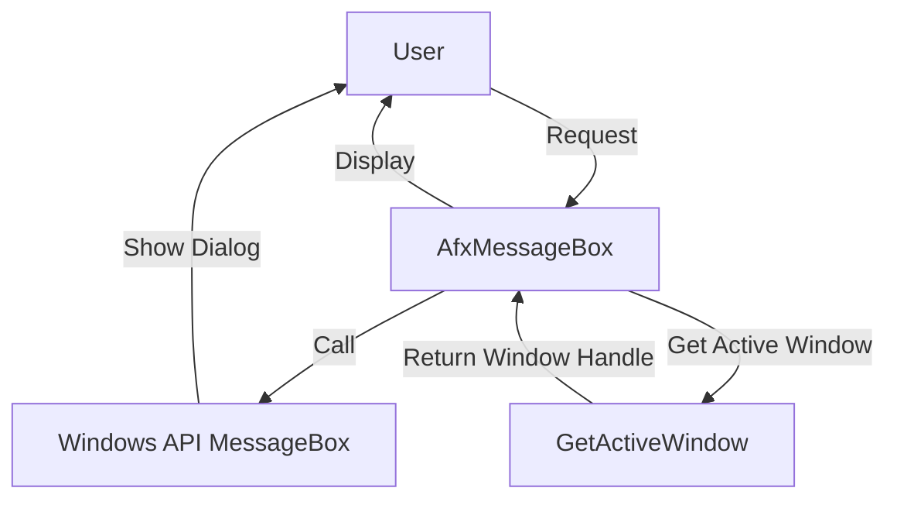

## Module: stdafx.cpp
# Comprehensive Analysis: stdafx.cpp

## Module Name
The module is `stdafx.cpp`, a standard precompiled header source file for a Windows application named "MenuConsultaRopa".

## Primary Objectives
This module serves as a precompiled header implementation file that:
1. Includes standard headers needed throughout the application
2. Provides a custom implementation of the `AfxMessageBox` function
3. Supports the precompiled header mechanism to improve compilation speed

## Critical Functions
- **`AfxMessageBox`**: An overridden version of the MFC (Microsoft Foundation Classes) message box function that customizes the title of message boxes to "COPPEL" and sets a default icon type of MB_ICONEXCLAMATION when none is specified.

## Key Variables
- **`lpszText`**: The message text to be displayed in the message box
- **`nType`**: The type/style of the message box (buttons and icons)
- **`nIDHelp`**: An unused parameter (commented as such) that would typically specify a help context ID

## Interdependencies
- Depends on `stdafx.h` - the precompiled header file
- Depends on `afxwin.h` - a core MFC header file for Windows functionality
- Interacts with Windows API functions like `MessageBox` and `GetActiveWindow`
- Provides services to the rest of the "MenuConsultaRopa" application

## Core vs. Auxiliary Operations
- **Core**: The precompiled header mechanism itself (implicit)
- **Auxiliary**: The custom `AfxMessageBox` implementation, which modifies standard MFC behavior

## Operational Sequence
The operational flow is straightforward:
1. The precompiled header is included
2. MFC Windows functionality is included
3. The `AfxMessageBox` function is defined to customize message boxes

## Performance Aspects
- The file implements the precompiled header pattern, which significantly improves compilation speed in large projects by caching compiled headers
- The custom message box function is minimal and should have negligible performance impact

## Reusability
- The custom `AfxMessageBox` function could be reused in other MFC applications that require a consistent message box title
- The precompiled header pattern itself is a standard reusable approach for C++ Windows applications

## Usage
- This file is compiled once to generate the precompiled header (.pch) file
- The resulting precompiled header is then used by other source files in the project
- The custom `AfxMessageBox` function would be used throughout the application to display messages to users with the "COPPEL" title

## Assumptions
1. The application is an MFC-based Windows application
2. "COPPEL" is the application or company name that should appear in all message box titles
3. The default message box style should include an exclamation icon when not otherwise specified
4. The application is named "MenuConsultaRopa" (based on the comment about the .pch file)
5. The help functionality of message boxes is not being used (the nIDHelp parameter is ignored)
## Flow Diagram [via mermaid]

