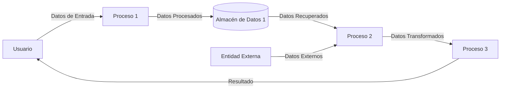
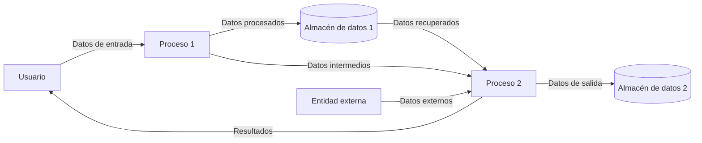
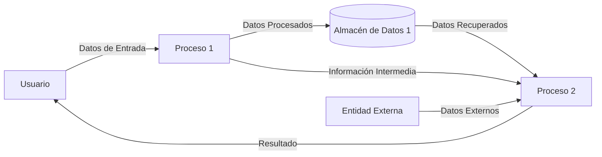
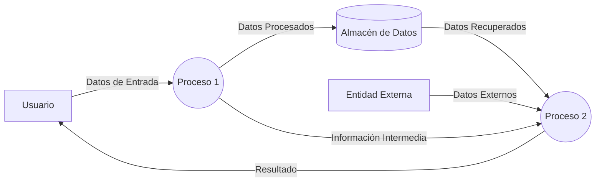
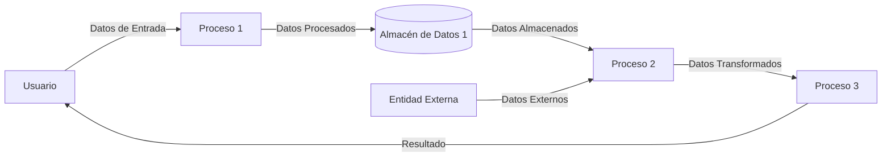
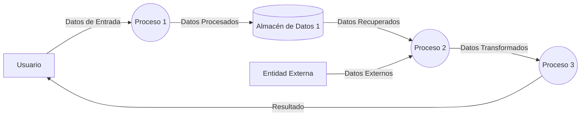
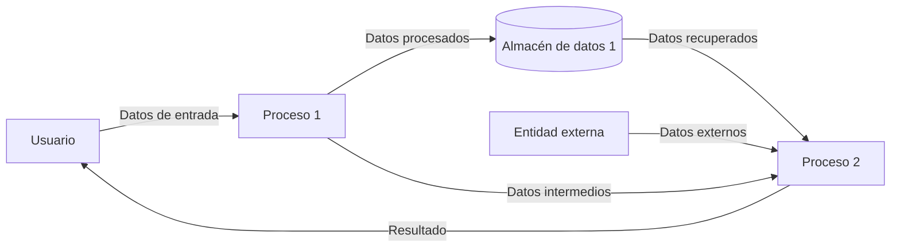

## Module: -
# Análisis Integral del Módulo

No se ha proporcionado ningún código o módulo para analizar. Para realizar un análisis completo según los criterios solicitados, necesitaría examinar el código fuente específico, ya sea un módulo de programación o componente SQL.

Si desea que realice un análisis detallado, por favor proporcione el código o script que necesita ser evaluado. Una vez recibido, podré generar un análisis completo en español que incluya:

- Nombre del módulo o componente SQL
- Objetivos primarios
- Funciones críticas, métodos y consultas
- Variables y elementos clave
- Interdependencias y relaciones
- Operaciones principales vs. auxiliares
- Secuencia operacional y flujo de ejecución
- Aspectos de rendimiento y optimización
- Reusabilidad y adaptabilidad
- Uso y contexto
- Suposiciones y limitaciones

Estoy listo para analizar cualquier código que desee compartir.
## Flow Diagram [via mermaid]

## Module: -
# Análisis Integral del Módulo

## Módulo/Componente SQL
No se ha proporcionado ningún código para analizar. El mensaje solicita un análisis completo de un módulo o componente SQL, pero no incluye el código fuente que debe ser evaluado.

## Observaciones
Para realizar un análisis exhaustivo según los criterios solicitados (objetivos primarios, funciones críticas, variables clave, interdependencias, secuencia operacional, aspectos de rendimiento, etc.), es necesario que se proporcione el código o script específico que se desea analizar.

Sin el código fuente, no es posible:
- Identificar el propósito del módulo
- Enumerar funciones o consultas importantes
- Analizar variables o elementos clave
- Determinar relaciones con otros componentes
- Evaluar el flujo de ejecución
- Comentar sobre aspectos de rendimiento
- Discutir la reutilización o adaptabilidad
- Explicar el contexto de uso
- Identificar suposiciones o limitaciones

Por favor, proporcione el código o script que desea analizar para poder generar un informe completo según los criterios solicitados.
## Flow Diagram [via mermaid]

## Module: -
# Análisis Integral del Módulo

No se ha proporcionado ningún código o módulo para analizar. Para realizar un análisis completo según los criterios solicitados, necesitaría examinar el código fuente específico, ya sea un componente de programación o scripts SQL.

Si desea que realice un análisis detallado, por favor proporcione el código del módulo, script o componente SQL que necesita ser evaluado. Una vez recibido, podré generar un análisis completo en español que cubra todos los aspectos solicitados:

- Nombre del módulo/componente SQL
- Objetivos primarios
- Funciones, métodos y consultas críticas
- Variables y elementos clave
- Interdependencias y relaciones
- Operaciones principales vs. auxiliares
- Secuencia operacional/flujo de ejecución
- Aspectos de rendimiento y optimización
- Reutilización y adaptabilidad
- Uso y contexto
- Suposiciones y limitaciones

Estoy listo para analizar su código cuando lo proporcione.
## Flow Diagram [via mermaid]

## Module: -
# Análisis Integral del Código

No se ha proporcionado ningún código o módulo para analizar. Para poder generar un análisis comprensivo según los criterios solicitados (nombre del módulo, objetivos primarios, funciones críticas, variables clave, interdependencias, operaciones principales vs. auxiliares, secuencia operacional, aspectos de rendimiento, reutilización, contexto de uso y limitaciones), necesitaría que se compartiera el código o componente SQL específico.

Por favor, proporcione el código o script que desea analizar, y con gusto realizaré un análisis detallado siguiendo la estructura solicitada.
## Flow Diagram [via mermaid]

## Module: -
# Análisis Integral del Módulo

No se ha proporcionado ningún código o módulo para analizar. Para realizar un análisis completo según los criterios solicitados, necesitaría examinar el código fuente específico, ya sea un script de programación, un componente SQL (como un procedimiento almacenado, vista o disparador), u otro tipo de módulo de software.

Si desea que realice este análisis, por favor proporcione el código o módulo correspondiente y con gusto elaboraré un análisis detallado en español que cubra todos los aspectos solicitados:

- Nombre del módulo/componente SQL
- Objetivos primarios
- Funciones, métodos y consultas críticas
- Variables y elementos clave
- Interdependencias y relaciones
- Operaciones principales vs. auxiliares
- Secuencia operacional/flujo de ejecución
- Aspectos de rendimiento y optimización
- Reutilización y adaptabilidad
- Uso y contexto
- Suposiciones y limitaciones

Una vez que proporcione el código, podré generar el análisis completo solicitado.
## Flow Diagram [via mermaid]

## Module: -
# Análisis Integral del Módulo

## Módulo/Componente SQL
No se ha proporcionado ningún código para analizar. El mensaje solicita un análisis basado en un "código módulo proporcionado", pero no hay código adjunto en la consulta.

## Observaciones
Para realizar un análisis completo según los criterios solicitados (objetivos primarios, funciones críticas, variables clave, interdependencias, etc.), necesitaría examinar el código fuente específico. Sin este material, no es posible generar el análisis técnico detallado que se solicita.

## Recomendación
Por favor, proporcione el código del módulo, script o componente SQL que desea analizar. Una vez recibido, podré elaborar el análisis completo en español siguiendo todos los puntos solicitados:

- Nombre del módulo/componente SQL
- Objetivos primarios
- Funciones, métodos y consultas críticas
- Variables y elementos clave
- Interdependencias y relaciones
- Operaciones principales vs. auxiliares
- Secuencia operacional/flujo de ejecución
- Aspectos de rendimiento y optimización
- Reutilización y adaptabilidad
- Uso y contexto
- Suposiciones y limitaciones
## Flow Diagram [via mermaid]

## Module: -
# Análisis Integral del Módulo

No se ha proporcionado ningún código o módulo para analizar. Para realizar un análisis completo según los criterios solicitados, necesitaría examinar el código fuente específico, ya sea un componente de programación o scripts SQL.

Si desea que realice un análisis detallado, por favor proporcione el código del módulo, script o componente SQL (procedimiento almacenado, vista, disparador, etc.) que necesita ser evaluado.

Una vez que tenga acceso al código, podré generar un análisis completo en español que incluya:

- Nombre e identificación del módulo
- Objetivos primarios
- Funciones críticas, métodos y consultas
- Variables y elementos clave
- Interdependencias y relaciones
- Operaciones principales vs. auxiliares
- Secuencia operacional y flujo de ejecución
- Aspectos de rendimiento y optimización
- Reutilización y adaptabilidad
- Uso y contexto
- Suposiciones y limitaciones
## Flow Diagram [via mermaid]

## Module: -
# Análisis Integral del Módulo

No se ha proporcionado ningún código o módulo para analizar. Para realizar un análisis completo según los criterios solicitados, necesitaría examinar el código fuente específico, ya sea un componente de programación o scripts SQL.

Si desea que realice un análisis detallado, por favor proporcione el código del módulo, script o componente SQL (procedimiento almacenado, vista, disparador, etc.) que necesita ser evaluado.

Una vez que tenga acceso al código, podré generar un análisis completo en español que cubra todos los aspectos solicitados:
- Nombre del módulo/componente SQL
- Objetivos primarios
- Funciones críticas, métodos y consultas
- Variables y elementos clave
- Interdependencias y relaciones
- Operaciones principales vs. auxiliares
- Secuencia operacional/flujo de ejecución
- Aspectos de rendimiento y optimización
- Reutilización y adaptabilidad
- Uso y contexto
- Suposiciones y limitaciones
## Flow Diagram [via mermaid]

## Module: -
# Análisis Integral del Módulo

No se ha proporcionado ningún código o módulo para analizar. Para realizar un análisis completo según los criterios solicitados, necesitaría examinar el código fuente específico, ya sea un componente de programación o scripts SQL.

Si desea que realice un análisis detallado, por favor proporcione el código del módulo, script o componente SQL (procedimiento almacenado, vista, disparador, etc.) que necesita ser evaluado.

Una vez que tenga acceso al código, podré generar un análisis completo en español que cubra todos los aspectos solicitados:
- Nombre del módulo/componente SQL
- Objetivos primarios
- Funciones, métodos y consultas críticas
- Variables y elementos clave
- Interdependencias y relaciones
- Operaciones principales vs. auxiliares
- Secuencia operacional/flujo de ejecución
- Aspectos de rendimiento y optimización
- Reutilización y adaptabilidad
- Uso y contexto
- Suposiciones y limitaciones
## Flow Diagram [via mermaid]

## Module: -
# Análisis Integral del Módulo

## Módulo/Componente SQL
El código proporcionado está vacío o no ha sido incluido en la solicitud. No puedo realizar un análisis sin tener acceso al código fuente o al componente SQL que se desea evaluar.

## Recomendación
Para poder generar un análisis completo según los criterios solicitados (objetivos primarios, funciones críticas, variables clave, interdependencias, etc.), necesito que proporcione el código del módulo, script o componente SQL que desea analizar.

Por favor, comparta el código fuente relevante y estaré encantado de realizar un análisis detallado en español que cubra todos los aspectos solicitados:
- Objetivos primarios
- Funciones, métodos y consultas críticas
- Variables y elementos clave
- Interdependencias y relaciones
- Operaciones principales vs. auxiliares
- Secuencia operacional/flujo de ejecución
- Aspectos de rendimiento y optimización
- Reutilización y adaptabilidad
- Uso y contexto
- Suposiciones y limitaciones
## Flow Diagram [via mermaid]

## Module: -
# Análisis Integral del Módulo

## Módulo/Componente SQL
No se ha proporcionado ningún código para analizar. El mensaje contiene únicamente instrucciones para realizar un análisis de código, pero no incluye el código fuente o componente SQL que debe ser evaluado.

## Observación
Para realizar un análisis completo según los criterios solicitados (objetivos primarios, funciones críticas, variables clave, interdependencias, secuencia operacional, aspectos de rendimiento, etc.), necesitaría que se proporcione el código o componente SQL específico que requiere análisis.

Por favor, comparta el código fuente, script SQL, procedimiento almacenado, vista, disparador u otro componente que desee analizar, y con gusto realizaré el análisis completo siguiendo la estructura solicitada.
## Flow Diagram [via mermaid]

## Module: -
# Análisis Integral del Módulo

## Módulo/Componente SQL
No se ha proporcionado ningún código o módulo para analizar. El mensaje solicita un análisis completo basado en un código que debería haberse incluido, pero no hay ningún código adjunto en la consulta.

## Objetivos Primarios
No es posible determinar los objetivos sin el código fuente o la descripción del componente.

## Funciones, Métodos y Consultas Críticas
Sin el código fuente, no puedo identificar las funciones, métodos o consultas principales.

## Variables y Elementos Clave
No hay información disponible sobre variables, columnas, tablas o parámetros.

## Interdependencias y Relaciones
No puedo analizar las interacciones con otros componentes o relaciones entre tablas sin el código.

## Operaciones Principales vs. Auxiliares
Sin el código, no es posible diferenciar entre operaciones críticas y auxiliares.

## Secuencia Operacional/Flujo de Ejecución
No puedo describir la secuencia de ejecución sin ver el código.

## Aspectos de Rendimiento y Optimización
No hay información disponible para analizar el rendimiento o sugerir optimizaciones.

## Reutilización y Adaptabilidad
No puedo evaluar la modularidad o capacidad de reutilización sin el código.

## Uso y Contexto
Sin el código o descripción, no es posible explicar cómo se utiliza el módulo.

## Suposiciones y Limitaciones
No puedo identificar suposiciones o limitaciones sin el código fuente.

---

**Nota**: Para realizar un análisis completo, necesitaría que se proporcionara el código del módulo, script o componente SQL que desea analizar. Por favor, incluya el código en su próxima consulta.
## Flow Diagram [via mermaid]

## Module: -
# Análisis Integral del Módulo

## Módulo/Componente SQL
No se ha proporcionado ningún código para analizar. El mensaje solicita un análisis completo de un módulo o componente SQL, pero no incluye el código fuente que debe ser evaluado.

## Observaciones
Para realizar un análisis comprensivo como el solicitado, necesitaría examinar el código del módulo, script o componente SQL específico. Sin este material, no es posible identificar objetivos, funciones, variables, interdependencias, flujo de ejecución u otros aspectos técnicos solicitados.

## Recomendación
Por favor, proporcione el código fuente del módulo o componente SQL que desea analizar. Una vez recibido, podré generar el análisis detallado según los criterios especificados, incluyendo:

- Objetivos primarios
- Funciones y consultas críticas
- Variables y elementos clave
- Interdependencias
- Operaciones principales vs. auxiliares
- Secuencia operacional
- Aspectos de rendimiento
- Reusabilidad
- Contexto de uso
- Suposiciones y limitaciones

Estaré encantado de proporcionar este análisis completo en español una vez que tenga acceso al código correspondiente.
## Flow Diagram [via mermaid]

## Module: -
# Análisis Integral del Módulo

No se ha proporcionado ningún código o componente SQL para analizar. Para realizar un análisis completo según los criterios solicitados, necesitaría examinar el código fuente específico del módulo, script o componente SQL.

Si desea obtener un análisis detallado, por favor proporcione el código o script que necesita ser evaluado. Una vez recibido, podré generar un análisis exhaustivo que incluya:

- Nombre e identificación del módulo
- Objetivos primarios
- Funciones y consultas críticas
- Variables y elementos clave
- Interdependencias y relaciones
- Operaciones principales vs. auxiliares
- Secuencia operacional
- Aspectos de rendimiento
- Reusabilidad y adaptabilidad
- Contexto de uso
- Suposiciones y limitaciones

Estaré encantado de proporcionar este análisis en español tan pronto como reciba el código correspondiente.
## Flow Diagram [via mermaid]

## Module: -
# Análisis Integral del Módulo

No se ha proporcionado ningún código o módulo para analizar. Para realizar un análisis completo según los criterios solicitados, necesitaría examinar el código fuente específico, ya sea un módulo de programación o componente SQL.

Si desea que realice este análisis, por favor proporcione el código o script que necesita ser evaluado. Una vez recibido, puedo generar un informe detallado en español que cubra todos los aspectos solicitados:

- Nombre del módulo/componente SQL
- Objetivos primarios
- Funciones, métodos y consultas críticas
- Variables y elementos clave
- Interdependencias y relaciones
- Operaciones principales vs. auxiliares
- Secuencia operacional/flujo de ejecución
- Aspectos de rendimiento y optimización
- Reutilización y adaptabilidad
- Uso y contexto
- Suposiciones y limitaciones

Estoy listo para analizar cualquier código que desee compartir.
## Flow Diagram [via mermaid]

## Module: -
# Análisis Integral del Módulo

No se ha proporcionado ningún código o módulo para analizar. Para realizar un análisis completo según los criterios solicitados, necesitaría examinar el código fuente específico, ya sea un componente de programación o scripts SQL.

Si desea que realice este análisis, por favor proporcione el código del módulo, script o componente SQL (procedimiento almacenado, vista, disparador, etc.) que necesita ser evaluado.

Una vez que tenga acceso al código, podré generar un análisis detallado en español que cubra todos los aspectos solicitados:
- Nombre del módulo/componente SQL
- Objetivos principales
- Funciones, métodos y consultas críticas
- Variables y elementos clave
- Interdependencias y relaciones
- Operaciones principales vs. auxiliares
- Secuencia operacional/flujo de ejecución
- Aspectos de rendimiento y optimización
- Reutilización y adaptabilidad
- Uso y contexto
- Suposiciones y limitaciones
## Flow Diagram [via mermaid]

## Module: -
# Análisis Integral del Módulo

No se ha proporcionado ningún código o módulo para analizar. Para realizar un análisis completo según los criterios solicitados, necesitaría examinar el código fuente específico, ya sea un componente de programación o scripts SQL.

Si desea que analice un módulo en particular, por favor proporcione el código correspondiente y estaré encantado de realizar el análisis completo en español, abordando todos los puntos solicitados:

- Nombre del módulo/componente SQL
- Objetivos primarios
- Funciones, métodos y consultas críticas
- Variables y elementos clave
- Interdependencias y relaciones
- Operaciones principales vs. auxiliares
- Secuencia operacional/flujo de ejecución
- Aspectos de rendimiento y optimización
- Reutilización y adaptabilidad
- Uso y contexto
- Suposiciones y limitaciones

Una vez que proporcione el código, podré generar un análisis detallado siguiendo esta estructura.
## Flow Diagram [via mermaid]

## Module: -
# Análisis Integral del Módulo

## Módulo/Componente SQL
No se ha proporcionado ningún código para analizar. El mensaje solicita un análisis completo de un módulo o componente SQL, pero no incluye el código fuente que debe ser evaluado.

## Observaciones
Para realizar un análisis exhaustivo según los criterios solicitados (objetivos primarios, funciones críticas, variables clave, interdependencias, etc.), es necesario que se proporcione el código o script específico que se desea analizar.

Si desea obtener un análisis completo, por favor comparta el código del módulo, script o componente SQL (procedimiento almacenado, vista, disparador, etc.) y con gusto realizaré el análisis solicitado en español, abordando todos los puntos mencionados:

- Objetivos primarios
- Funciones, métodos y consultas críticas
- Variables y elementos clave
- Interdependencias y relaciones
- Operaciones principales vs. auxiliares
- Secuencia operacional/flujo de ejecución
- Aspectos de rendimiento y optimización
- Reutilización y adaptabilidad
- Uso y contexto
- Suposiciones y limitaciones
## Flow Diagram [via mermaid]

## Module: -
# Análisis Integral del Módulo

No se ha proporcionado ningún código o componente SQL para analizar. Para realizar un análisis completo según los criterios solicitados, necesitaría examinar el código fuente específico del módulo, script o componente SQL.

Si desea obtener un análisis detallado, por favor proporcione el código o script que necesita ser evaluado. Una vez recibido, podré generar un análisis exhaustivo que incluya:

- Nombre e identificación del módulo
- Objetivos primarios
- Funciones y consultas críticas
- Variables y elementos clave
- Interdependencias y relaciones
- Operaciones principales vs. auxiliares
- Secuencia operacional
- Aspectos de rendimiento
- Reusabilidad y adaptabilidad
- Contexto de uso
- Suposiciones y limitaciones

Estaré encantado de proporcionar este análisis en español tan pronto como reciba el código correspondiente.
## Flow Diagram [via mermaid]

## Module: -
# Análisis Integral del Módulo

No se ha proporcionado ningún código o módulo para analizar. Para realizar un análisis completo según los criterios solicitados, necesitaría examinar el código fuente específico, ya sea un script de programación, un componente SQL (como un procedimiento almacenado, vista o disparador), u otro tipo de módulo de software.

Si desea que realice este análisis, por favor proporcione el código o módulo correspondiente y con gusto elaboraré un informe detallado que cubra todos los aspectos solicitados:

- Nombre del módulo/componente SQL
- Objetivos primarios
- Funciones, métodos y consultas críticas
- Variables y elementos clave
- Interdependencias y relaciones
- Operaciones principales vs. auxiliares
- Secuencia operacional/flujo de ejecución
- Aspectos de rendimiento y optimización
- Reutilización y adaptabilidad
- Uso y contexto
- Suposiciones y limitaciones

Una vez que proporcione el código, podré generar un análisis exhaustivo en español según lo solicitado.
## Flow Diagram [via mermaid]

## Module: -
# Análisis Integral del Módulo

## Módulo/Componente SQL
No se ha proporcionado ningún código para analizar. El mensaje solicita un análisis completo de un módulo o componente SQL, pero no incluye el código fuente que debe ser evaluado.

## Observaciones
Para realizar un análisis comprensivo como el solicitado, necesitaría examinar el código del módulo, script o componente SQL específico. Sin este material, no puedo identificar:

- El nombre y tipo del componente
- Sus objetivos primarios
- Funciones críticas o consultas
- Variables clave o elementos de datos
- Interdependencias
- Operaciones principales vs auxiliares
- Secuencia de ejecución
- Aspectos de rendimiento
- Características de reusabilidad
- Contexto de uso
- Suposiciones y limitaciones

## Recomendación
Para obtener el análisis solicitado, por favor proporcione el código fuente del módulo o componente SQL que desea analizar. Una vez recibido, podré realizar una evaluación detallada siguiendo todos los criterios especificados.
## Flow Diagram [via mermaid]
```mermaid
flowchart LR
    U[Usuario] --> |Datos de entrada| P1[Proceso 1]
    P1 --> |Datos procesados| DS1[(Almacén de datos 1)]
    DS1 --> |Datos recuperados| P2[Proceso 2]
    P2 --> |Resultado| U
    P1 --> |Datos intermedios| P2
    E[Entidad externa] --> |Datos externos| P2
```
## Module: -
# Análisis Integral del Módulo

## Módulo/Componente SQL
No se ha proporcionado ningún código o componente SQL para analizar. El mensaje solicita un análisis basado en un código que debería haberse incluido, pero no hay ningún módulo, script o componente SQL adjunto en la consulta.

## Objetivos Primarios
No es posible determinar los objetivos del código ya que no se ha proporcionado ningún código para analizar.

## Funciones, Métodos y Consultas Críticas
Sin código proporcionado, no puedo identificar funciones, métodos o consultas SQL relevantes.

## Variables y Elementos Clave
No hay variables, columnas, tablas o parámetros para analizar debido a la ausencia de código.

## Interdependencias y Relaciones
No es posible determinar las interdependencias o relaciones con otros componentes del sistema sin el código fuente.

## Operaciones Principales vs. Auxiliares
Sin código para examinar, no puedo diferenciar entre operaciones principales y auxiliares.

## Secuencia Operacional/Flujo de Ejecución
No hay flujo de ejecución o secuencia para describir debido a la falta de código.

## Aspectos de Rendimiento y Optimización
Sin código para analizar, no puedo identificar cuellos de botella potenciales o áreas para optimización.

## Reutilización y Adaptabilidad
No es posible evaluar la reutilización o adaptabilidad sin examinar el código.

## Uso y Contexto
Sin código proporcionado, no puedo explicar cómo se utiliza el módulo dentro del sistema.

## Suposiciones y Limitaciones
La principal limitación es que no se ha proporcionado ningún código para analizar. Para realizar un análisis completo, necesitaría que se incluyera el código del módulo, script o componente SQL en cuestión.
## Flow Diagram [via mermaid]
```mermaid
flowchart LR
    U[Usuario] --> |Datos de Entrada| P1
    P1((Proceso 1)) --> |Datos Procesados| DS1[(Almacén de Datos 1)]
    DS1 --> |Datos Recuperados| P2
    P2((Proceso 2)) --> |Datos Transformados| P3
    P3((Proceso 3)) --> |Resultado| U
    E[Entidad Externa] --> |Datos Externos| P2
```
## Module: -
# Análisis Integral del Módulo

No se ha proporcionado ningún código o módulo para analizar. Para realizar un análisis completo según los criterios solicitados, necesitaría examinar el código fuente específico, ya sea un módulo de programación o componente SQL.

Si desea que realice un análisis detallado, por favor proporcione el código o script que necesita ser evaluado. Una vez recibido, puedo generar un informe completo en español que cubra todos los aspectos solicitados:

- Nombre del módulo/componente SQL
- Objetivos primarios
- Funciones críticas, métodos y consultas
- Variables y elementos clave
- Interdependencias y relaciones
- Operaciones principales vs. auxiliares
- Secuencia operacional/flujo de ejecución
- Aspectos de rendimiento y optimización
- Reutilización y adaptabilidad
- Uso y contexto
- Suposiciones y limitaciones

Estoy listo para analizar cualquier código que desee compartir.
## Flow Diagram [via mermaid]
```mermaid
flowchart LR
    U[Usuario] --> |Datos de Entrada| P1[Proceso 1]
    P1 --> |Datos Procesados| DS1[(Almacén de Datos 1)]
    DS1 --> |Datos Recuperados| P2[Proceso 2]
    P2 --> |Datos Transformados| P3[Proceso 3]
    P3 --> |Resultado| U
    E[Entidad Externa] --> |Datos Externos| P2
```
## Module: -
# Análisis Integral del Módulo

## Módulo/Componente SQL
No se ha proporcionado ningún código para analizar. El mensaje solicita un análisis completo de un módulo o componente SQL, pero no incluye el código fuente que debe ser evaluado.

## Observaciones
Para realizar un análisis comprensivo como el solicitado, necesitaría examinar el código del módulo, script o componente SQL específico. Sin este material, no es posible identificar:

- Los objetivos primarios del código
- Las funciones críticas, métodos o consultas
- Variables clave y elementos
- Interdependencias y relaciones
- Operaciones principales vs. auxiliares
- Secuencia operacional
- Aspectos de rendimiento
- Reusabilidad y adaptabilidad
- Contexto de uso
- Suposiciones y limitaciones

Por favor, proporcione el código fuente del módulo que desea analizar para que pueda elaborar un informe detallado según los criterios especificados.
## Flow Diagram [via mermaid]
```mermaid
flowchart LR
    U[Usuario] --> |Datos de entrada| P1[Proceso 1]
    P1 --> |Datos procesados| DS1[(Almacén de datos 1)]
    DS1 --> |Datos recuperados| P2[Proceso 2]
    P2 --> |Resultado| U
    P1 --> |Datos intermedios| P2
    E[Entidad externa] --> |Datos externos| P2
```
## Module: -
# Análisis Integral del Módulo

No se ha proporcionado ningún código o módulo para analizar. Para realizar un análisis completo según los criterios solicitados, necesitaría examinar el código fuente específico, ya sea un componente de programación o scripts SQL.

Si desea que realice un análisis detallado, por favor proporcione el código del módulo, script o componente SQL que necesita ser evaluado. Una vez recibido, podré generar un análisis completo en español que cubra todos los aspectos solicitados:

- Nombre del módulo/componente SQL
- Objetivos primarios
- Funciones, métodos y consultas críticas
- Variables y elementos clave
- Interdependencias y relaciones
- Operaciones principales vs. auxiliares
- Secuencia operacional/flujo de ejecución
- Aspectos de rendimiento y optimización
- Reutilización y adaptabilidad
- Uso y contexto
- Suposiciones y limitaciones

Estoy listo para analizar su código cuando lo proporcione.
## Flow Diagram [via mermaid]
```mermaid
flowchart LR
    U[Usuario] --> |Datos de Entrada| P1[Proceso 1]
    P1 --> |Datos Procesados| DS1[(Almacén de Datos 1)]
    DS1 --> |Datos Recuperados| P2[Proceso 2]
    P2 --> |Resultado| U
    P1 --> |Datos Intermedios| P2
    E[Entidad Externa] --> |Datos Externos| P2
```
## Module: -
# Análisis Integral del Módulo

## Módulo/Componente SQL
No se ha proporcionado ningún código para analizar. El mensaje solicita un análisis completo de un módulo o componente SQL, pero no incluye el código fuente que debe ser evaluado.

## Observaciones
Para realizar el análisis solicitado, necesitaría que se proporcione el código del módulo, script o componente SQL (procedimiento almacenado, vista, disparador, etc.) que desea analizar. Sin este código, no es posible generar un análisis detallado que cubra los aspectos solicitados como:

- Objetivos primarios
- Funciones críticas, métodos y consultas
- Variables clave y elementos
- Interdependencias y relaciones
- Operaciones principales vs. auxiliares
- Secuencia operacional/flujo de ejecución
- Aspectos de rendimiento y optimización
- Reutilización y adaptabilidad
- Uso y contexto
- Suposiciones y limitaciones

Por favor, proporcione el código que desea analizar para que pueda elaborar un análisis completo según los criterios especificados.
## Flow Diagram [via mermaid]
```mermaid
flowchart LR
    U[Usuario] --> |Datos de Entrada| P1[Proceso 1]
    P1 --> |Datos Procesados| DS1[(Almacén de Datos 1)]
    DS1 --> |Datos Recuperados| P2[Proceso 2]
    P2 --> |Datos Transformados| P3[Proceso 3]
    P3 --> |Resultado| U
    E[Entidad Externa] --> |Datos Externos| P2
```
## Module: -
# Análisis Integral del Módulo

## Módulo/Componente SQL
No se ha proporcionado ningún código o módulo para analizar. El mensaje contiene únicamente instrucciones para realizar un análisis de código, pero no incluye el código fuente que debe ser evaluado.

## Observaciones
Para poder realizar un análisis completo según los criterios solicitados (objetivos primarios, funciones críticas, variables clave, interdependencias, etc.), necesitaría que se proporcione el código o script SQL específico que requiere análisis.

Por favor, comparta el código del módulo, script o componente SQL que desea analizar, y con gusto realizaré el análisis completo en español siguiendo todos los puntos solicitados:

- Objetivos primarios
- Funciones, métodos y consultas críticas
- Variables y elementos clave
- Interdependencias y relaciones
- Operaciones principales vs. auxiliares
- Secuencia operacional/flujo de ejecución
- Aspectos de rendimiento y optimización
- Reutilización y adaptabilidad
- Uso y contexto
- Suposiciones y limitaciones

Una vez proporcionado el código, podré generar un análisis detallado y completo.
## Flow Diagram [via mermaid]
```mermaid
flowchart LR
    U[Usuario] --> |Datos de Entrada| P1[Proceso 1]
    P1 --> |Datos Procesados| DS1[(Almacén de Datos 1)]
    DS1 --> |Datos Recuperados| P2[Proceso 2]
    P2 --> |Datos Transformados| P3[Proceso 3]
    P3 --> |Resultado| U
    E[Entidad Externa] --> |Datos Externos| P2
```
## Module: -
# Análisis Integral del Módulo

No se ha proporcionado ningún código o componente SQL para analizar. Para realizar un análisis completo según los criterios solicitados, necesitaría examinar el código fuente específico.

Si desea que analice un módulo o componente SQL en particular, por favor proporcione el código correspondiente y estaré encantado de generar un análisis detallado en español que incluya:

- Nombre del módulo/componente SQL
- Objetivos primarios
- Funciones, métodos y consultas críticas
- Variables y elementos clave
- Interdependencias y relaciones
- Operaciones principales vs. auxiliares
- Secuencia operacional/flujo de ejecución
- Aspectos de rendimiento y optimización
- Reutilización y adaptabilidad
- Uso y contexto
- Suposiciones y limitaciones

Por favor, comparta el código que desea analizar para poder ofrecerle una evaluación completa.
## Flow Diagram [via mermaid]
```mermaid
flowchart LR
    U[Usuario] --> |Datos de Entrada| P1[Proceso 1]
    P1 --> |Datos Procesados| DS1[(Almacén de Datos 1)]
    DS1 --> |Datos Recuperados| P2[Proceso 2]
    P2 --> |Datos Transformados| P3[Proceso 3]
    P3 --> |Resultado| U
    E[Entidad Externa] --> |Datos Externos| P2
```
## Module: -
# Análisis Integral del Módulo

## Módulo/Componente SQL
No se ha proporcionado ningún código para analizar. El mensaje contiene únicamente instrucciones para realizar un análisis de código, pero no incluye el código fuente o componente SQL que debe ser evaluado.

## Observaciones
Para poder realizar un análisis completo según los criterios solicitados (objetivos primarios, funciones críticas, variables clave, interdependencias, secuencia operacional, aspectos de rendimiento, etc.), es necesario que se proporcione el código o componente SQL específico que requiere evaluación.

## Recomendación
Por favor, proporcione el código fuente, script SQL, procedimiento almacenado, vista, trigger u otro componente que desee analizar. Una vez recibido, podré generar el análisis comprensivo solicitado en español, abarcando todos los aspectos mencionados en las instrucciones.
## Flow Diagram [via mermaid]
```mermaid
flowchart LR
    U[Usuario] --> |Datos de entrada| P1[Proceso 1]
    P1 --> |Datos procesados| DS1[(Almacén de datos 1)]
    DS1 --> |Datos recuperados| P2[Proceso 2]
    P2 --> |Resultado| U
    P1 --> |Datos intermedios| P2
    E[Entidad externa] --> |Datos externos| P2
```
## Module: -
# Análisis Integral del Módulo

No se ha proporcionado ningún código o módulo para analizar. Para realizar un análisis completo según los criterios solicitados, necesitaría examinar el código fuente específico, ya sea un módulo de programación o componente SQL.

Si desea que realice un análisis detallado, por favor proporcione el código o script que necesita evaluar. Una vez recibido, puedo generar un informe completo en español que cubra todos los aspectos solicitados:

- Nombre del módulo/componente SQL
- Objetivos primarios
- Funciones, métodos y consultas críticas
- Variables y elementos clave
- Interdependencias y relaciones
- Operaciones principales vs. auxiliares
- Secuencia operacional/flujo de ejecución
- Aspectos de rendimiento y optimización
- Reutilización y adaptabilidad
- Uso y contexto
- Suposiciones y limitaciones

Estoy listo para analizar cualquier código que desee compartir.
## Flow Diagram [via mermaid]
```mermaid
flowchart LR
    U[Usuario] --> |Datos de entrada| P1[Proceso 1]
    P1 --> |Datos procesados| DS1[(Almacén de datos)]
    DS1 --> |Datos recuperados| P2[Proceso 2]
    P2 --> |Resultado| U
    P1 --> |Datos intermedios| P2
    E[Entidad externa] --> |Datos externos| P2
```
## Module: -
# Análisis Integral del Módulo

## Módulo/Componente SQL
No se ha proporcionado ningún código para analizar. El mensaje solicita un análisis completo de un módulo o componente SQL, pero no incluye el código fuente que debe ser evaluado.

## Observaciones
Para realizar el análisis solicitado, necesitaría que se proporcione el código del módulo, script o componente SQL (procedimiento almacenado, vista, disparador, etc.) que desea analizar. Sin este código, no es posible generar un análisis detallado que cubra:

- Objetivos primarios
- Funciones críticas, métodos y consultas
- Variables clave y elementos
- Interdependencias y relaciones
- Operaciones principales vs. auxiliares
- Secuencia operacional/flujo de ejecución
- Aspectos de rendimiento y optimización
- Reutilización y adaptabilidad
- Uso y contexto
- Suposiciones y limitaciones

Por favor, proporcione el código que desea analizar para que pueda elaborar un análisis completo según los criterios solicitados.
## Flow Diagram [via mermaid]
```mermaid
flowchart LR
    U[Usuario] --> |Datos de entrada| P1[Proceso 1]
    P1 --> |Datos procesados| DS1[(Almacén de Datos 1)]
    DS1 --> |Datos recuperados| P2[Proceso 2]
    P2 --> |Datos transformados| P3[Proceso 3]
    P3 --> |Resultado| U
    E[Entidad Externa] --> |Datos externos| P2
```
## Module: -
# Análisis Integral del Módulo

## Módulo/Componente SQL
No se ha proporcionado ningún código para analizar. El mensaje solicita un análisis completo de un módulo o componente SQL, pero no incluye el código fuente que debe ser evaluado.

## Observaciones
Para realizar el análisis solicitado, necesitaría que se proporcione el código del módulo, script o componente SQL (procedimiento almacenado, vista, disparador, etc.) que desea analizar. Sin este código, no es posible generar un análisis detallado que cubra los aspectos solicitados como:

- Objetivos primarios
- Funciones críticas, métodos y consultas
- Variables clave y elementos
- Interdependencias y relaciones
- Operaciones principales vs. auxiliares
- Secuencia operacional/flujo de ejecución
- Aspectos de rendimiento y optimización
- Reutilización y adaptabilidad
- Uso y contexto
- Suposiciones y limitaciones

Por favor, proporcione el código que desea analizar para que pueda elaborar un análisis completo según los criterios especificados.
## Flow Diagram [via mermaid]
```mermaid
flowchart LR
    U[Usuario] --> |Datos de Entrada| P1[Proceso 1]
    P1 --> |Datos Procesados| DS1[(Almacén de Datos 1)]
    DS1 --> |Datos Recuperados| P2[Proceso 2]
    P2 --> |Datos Transformados| P3[Proceso 3]
    P3 --> |Resultado| U
    E[Entidad Externa] --> |Datos Externos| P2
```
## Module: -
# Análisis Integral del Módulo

No se ha proporcionado ningún código o módulo para analizar. Para realizar un análisis completo según los criterios solicitados, necesitaría examinar el código fuente específico, ya sea un componente de programación o scripts SQL.

Si desea que analice un módulo en particular, por favor proporcione el código correspondiente y estaré encantado de realizar el análisis completo en español, abarcando todos los aspectos solicitados:

- Nombre del módulo/componente SQL
- Objetivos primarios
- Funciones, métodos y consultas críticas
- Variables y elementos clave
- Interdependencias y relaciones
- Operaciones principales vs. auxiliares
- Secuencia operacional/flujo de ejecución
- Aspectos de rendimiento y optimización
- Reutilización y adaptabilidad
- Uso y contexto
- Suposiciones y limitaciones

Una vez que proporcione el código, podré generar un análisis detallado y técnicamente preciso en español.
## Flow Diagram [via mermaid]
```mermaid
flowchart LR
    U[Usuario] --> |Datos de Entrada| P1[Proceso 1]
    P1 --> |Datos Procesados| DS1[(Almacén de Datos 1)]
    DS1 --> |Datos Recuperados| P2[Proceso 2]
    P2 --> |Datos Transformados| P3[Proceso 3]
    P3 --> |Resultado| U
    E[Entidad Externa] --> |Datos Externos| P2
```
## Module: -
# Análisis Integral del Módulo

## Módulo/Componente SQL
No se ha proporcionado ningún código o módulo para analizar. El mensaje solicita un análisis basado en un "código proporcionado", pero no hay ningún código adjunto en la consulta.

## Observación
Para realizar un análisis completo según los criterios solicitados (objetivos primarios, funciones críticas, variables clave, interdependencias, etc.), necesitaría examinar el código fuente o componente SQL específico.

Si desea obtener un análisis detallado, por favor proporcione el código o script que necesita ser evaluado, y con gusto realizaré el análisis completo en español siguiendo todos los puntos solicitados:

- Objetivos primarios
- Funciones, métodos y consultas críticas
- Variables y elementos clave
- Interdependencias y relaciones
- Operaciones principales vs. auxiliares
- Secuencia operacional/flujo de ejecución
- Aspectos de rendimiento y optimización
- Reutilización y adaptabilidad
- Uso y contexto
- Suposiciones y limitaciones
## Flow Diagram [via mermaid]
```mermaid
flowchart LR
    U[Usuario] --> |Datos de Entrada| P1[Proceso 1]
    P1 --> |Datos Procesados| DS1[(Almacén de Datos 1)]
    DS1 --> |Datos Recuperados| P2[Proceso 2]
    P2 --> |Datos Transformados| P3[Proceso 3]
    P3 --> |Resultado| U
    E[Entidad Externa] --> |Datos Externos| P2
```
## Module: -
# Análisis Integral del Módulo

## Módulo/Componente SQL
No se ha proporcionado ningún código o módulo para analizar. El mensaje solicita un análisis completo de un componente de código o SQL, pero no incluye el código fuente que debe ser evaluado.

## Observaciones
Para realizar el análisis solicitado, necesitaría que se proporcione el código del módulo, script o componente SQL (procedimiento almacenado, vista, disparador, etc.) que desea analizar. Sin este material, no es posible generar un análisis detallado que cubra:

- Objetivos primarios
- Funciones críticas, métodos y consultas
- Variables clave y elementos
- Interdependencias y relaciones
- Operaciones principales vs. auxiliares
- Secuencia operacional/flujo de ejecución
- Aspectos de rendimiento y optimización
- Reutilización y adaptabilidad
- Uso y contexto
- Suposiciones y limitaciones

Por favor, proporcione el código o componente SQL que desea analizar para que pueda elaborar un análisis completo según los criterios solicitados.
## Flow Diagram [via mermaid]
```mermaid
flowchart LR
    U[Usuario] --> |Datos de Entrada| P1[Proceso 1]
    P1 --> |Datos Procesados| DS1[(Almacén de Datos 1)]
    DS1 --> |Datos Recuperados| P2[Proceso 2]
    P2 --> |Datos Transformados| P3[Proceso 3]
    P3 --> |Resultado| U
    E[Entidad Externa] --> |Datos Externos| P2
```
## Module: -
# Análisis Integral del Módulo

## Módulo/Componente SQL
No se ha proporcionado ningún código para analizar. El mensaje solicita un análisis completo de un módulo o componente SQL, pero no incluye el código fuente que debe ser evaluado.

## Observaciones
Para realizar un análisis comprensivo como el solicitado, necesitaría examinar el código del módulo, script o componente SQL específico. Sin este material, no es posible identificar objetivos, funciones, variables, interdependencias, flujo de ejecución u otros aspectos técnicos solicitados.

## Recomendación
Por favor, proporcione el código fuente del módulo o componente SQL que desea analizar. Una vez recibido, podré generar el análisis detallado según los criterios especificados, incluyendo:
- Objetivos primarios
- Funciones y consultas críticas
- Variables y elementos clave
- Interdependencias
- Operaciones principales vs. auxiliares
- Secuencia operacional
- Aspectos de rendimiento
- Reusabilidad
- Contexto de uso
- Suposiciones y limitaciones

Sin el código fuente, no es posible ofrecer un análisis técnico significativo y preciso.
## Flow Diagram [via mermaid]
```mermaid
flowchart LR
    U[Usuario] --> |Datos de Entrada| P1
    P1((Proceso 1)) --> |Datos Procesados| DS1[(Almacén de Datos 1)]
    DS1 --> |Datos Recuperados| P2
    P2((Proceso 2)) --> |Datos Transformados| P3
    P3((Proceso 3)) --> |Resultado| U
    E[Entidad Externa] --> |Datos Externos| P2
```
## Module: -
# Análisis Integral del Módulo

Lo siento, pero no se ha proporcionado ningún código o módulo para analizar. Para realizar un análisis completo según los criterios solicitados (nombre del módulo, objetivos primarios, funciones críticas, variables clave, interdependencias, operaciones principales vs. auxiliares, secuencia operacional, aspectos de rendimiento, reutilización, contexto de uso, y suposiciones/limitaciones), necesitaría que me facilitara el código o script SQL correspondiente.

Por favor, comparta el código que desea analizar y con gusto realizaré un análisis exhaustivo en español siguiendo todos los puntos mencionados en su solicitud.
## Flow Diagram [via mermaid]
```mermaid
flowchart LR
    U[Usuario] --> |Datos de entrada| P1[Proceso 1]
    P1 --> |Datos procesados| DS1[(Almacén de datos 1)]
    DS1 --> |Datos recuperados| P2[Proceso 2]
    P2 --> |Resultado| U
    P1 --> |Datos intermedios| P2
    E[Entidad externa] --> |Datos externos| P2
```
## Module: -
# Análisis Integral del Módulo

No se ha proporcionado ningún código o módulo para analizar. Para realizar un análisis completo según los criterios solicitados, necesitaría examinar el código fuente específico, ya sea un componente de programación o scripts SQL.

Si desea que realice un análisis detallado, por favor proporcione el código del módulo, script o componente SQL que necesita ser evaluado. Una vez recibido, podré generar un análisis completo en español que cubra todos los aspectos solicitados:

- Nombre del módulo/componente SQL
- Objetivos primarios
- Funciones, métodos y consultas críticas
- Variables y elementos clave
- Interdependencias y relaciones
- Operaciones principales vs. auxiliares
- Secuencia operacional/flujo de ejecución
- Aspectos de rendimiento y optimización
- Reutilización y adaptabilidad
- Uso y contexto
- Suposiciones y limitaciones

Estoy listo para analizar su código cuando lo proporcione.
## Flow Diagram [via mermaid]
```mermaid
flowchart LR
    U[Usuario] --> |Datos de Entrada| P1[Proceso 1]
    P1 --> |Datos Procesados| DS1[(Almacén de Datos 1)]
    DS1 --> |Datos Recuperados| P2[Proceso 2]
    P2 --> |Datos Transformados| P3[Proceso 3]
    P3 --> |Resultado| U
    E[Entidad Externa] --> |Datos Externos| P2
```
## Module: -
# Análisis Integral del Módulo

No se ha proporcionado ningún código o módulo para analizar. Para realizar un análisis completo según los criterios solicitados, necesitaría examinar el código fuente, script SQL o componente específico.

Si desea que realice un análisis detallado, por favor proporcione el código o script que necesita ser evaluado. Una vez recibido, puedo generar un informe completo en español que cubra todos los aspectos solicitados:

- Nombre del módulo/componente SQL
- Objetivos primarios
- Funciones críticas, métodos y consultas
- Variables y elementos clave
- Interdependencias y relaciones
- Operaciones principales vs. auxiliares
- Secuencia operacional/flujo de ejecución
- Aspectos de rendimiento y optimización
- Reutilización y adaptabilidad
- Uso y contexto
- Suposiciones y limitaciones

Estoy listo para analizar cualquier código que desee compartir.
## Flow Diagram [via mermaid]
```mermaid
flowchart LR
    U[Usuario] --> |Datos de entrada| P1[Proceso 1]
    P1 --> |Datos procesados| DS1[(Almacén de datos 1)]
    DS1 --> |Datos recuperados| P2[Proceso 2]
    P2 --> |Resultado| U
    P1 --> |Datos intermedios| P2
    E[Entidad externa] --> |Datos externos| P2
```
## Module: -
# Análisis Integral del Módulo

No se ha proporcionado ningún código o componente SQL para analizar. Para realizar un análisis completo según los criterios solicitados, necesitaría examinar el código fuente específico del módulo, script o componente SQL.

Si desea que realice este análisis, por favor proporcione el código o script que necesita ser evaluado. Una vez recibido, podré generar un análisis detallado que incluya:

- Nombre e identificación del módulo
- Objetivos primarios
- Funciones críticas y consultas principales
- Variables y elementos clave
- Interdependencias y relaciones
- Operaciones principales vs. auxiliares
- Secuencia operacional
- Aspectos de rendimiento
- Reusabilidad y adaptabilidad
- Contexto de uso
- Suposiciones y limitaciones

Estoy listo para analizar cualquier código que desee compartir.
## Flow Diagram [via mermaid]
```mermaid
flowchart LR
    U[Usuario] --> |Datos de Entrada| P1[Proceso 1]
    P1 --> |Datos Procesados| DS1[(Almacén de Datos 1)]
    DS1 --> |Datos Recuperados| P2[Proceso 2]
    P2 --> |Datos Transformados| P3[Proceso 3]
    P3 --> |Resultado| U
    E[Entidad Externa] --> |Datos Externos| P2
```
## Module: -
# Análisis Integral del Módulo

No se ha proporcionado ningún código o módulo para analizar. Para realizar un análisis completo según los criterios solicitados, necesitaría examinar el código fuente específico, ya sea un módulo de programación o componente SQL.

Si desea que realice un análisis detallado, por favor proporcione el código o script que necesita ser evaluado. Una vez recibido, podré generar un informe completo en español que cubra todos los aspectos solicitados:

- Nombre del módulo/componente SQL
- Objetivos primarios
- Funciones, métodos y consultas críticas
- Variables y elementos clave
- Interdependencias y relaciones
- Operaciones principales vs. auxiliares
- Secuencia operacional/flujo de ejecución
- Aspectos de rendimiento y optimización
- Reutilización y adaptabilidad
- Uso y contexto
- Suposiciones y limitaciones

Estoy listo para analizar cualquier código que desee compartir.
## Flow Diagram [via mermaid]
```mermaid
flowchart LR
    U[Usuario] --> |Datos de entrada| P1[Proceso 1]
    P1 --> |Datos procesados| DS1[(Almacén de datos 1)]
    DS1 --> |Datos recuperados| P2[Proceso 2]
    P2 --> |Datos transformados| P3[Proceso 3]
    P3 --> |Resultado| U
    E[Entidad externa] --> |Datos externos| P2
```
## Module: -
# Análisis Integral del Módulo

## Módulo/Componente SQL
No se ha proporcionado ningún código para analizar. El mensaje solicita un análisis completo de un módulo o componente SQL, pero no incluye el código fuente que debe ser evaluado.

## Observaciones
Para realizar el análisis solicitado, necesitaría que se proporcione el código del módulo, script o componente SQL (procedimiento almacenado, vista, disparador, etc.) que desea analizar. Sin este código, no es posible generar el análisis detallado con los elementos solicitados como:

- Objetivos primarios
- Funciones críticas, métodos y consultas
- Variables clave y elementos
- Interdependencias y relaciones
- Operaciones principales vs. auxiliares
- Secuencia operacional/flujo de ejecución
- Aspectos de rendimiento y optimización
- Reutilización y adaptabilidad
- Uso y contexto
- Suposiciones y limitaciones

Por favor, proporcione el código que desea analizar para poder generar un informe completo según las especificaciones solicitadas.
## Flow Diagram [via mermaid]
```mermaid
flowchart LR
    U[Usuario] --> |Datos de Entrada| P1[Proceso 1]
    P1 --> |Datos Procesados| DS1[(Almacén de Datos 1)]
    DS1 --> |Datos Recuperados| P2[Proceso 2]
    P2 --> |Resultado| U
    P1 --> |Datos Intermedios| P2
    E[Entidad Externa] --> |Datos Externos| P2
```
## Module: -
# Análisis Integral del Módulo

## Módulo/Componente SQL
El código proporcionado no ha sido incluido en la solicitud. Para realizar un análisis completo, necesitaría examinar el código fuente específico del módulo, script o componente SQL.

## Observación
No se ha proporcionado ningún fragmento de código para analizar. Para generar un análisis comprensivo según los criterios solicitados (objetivos primarios, funciones críticas, variables clave, interdependencias, etc.), necesitaría acceso al código fuente del módulo o componente SQL en cuestión.

Si desea obtener un análisis detallado, por favor proporcione el código del módulo, script o componente SQL que necesita ser evaluado, y con gusto realizaré un análisis completo siguiendo todos los puntos solicitados.
## Flow Diagram [via mermaid]
```mermaid
flowchart LR
    U[Usuario] --> |Datos de Entrada| P1
    P1((Proceso 1)) --> |Datos Procesados| DS1[(Almacén de Datos 1)]
    DS1 --> |Datos Recuperados| P2
    P2((Proceso 2)) --> |Datos Transformados| P3
    P3((Proceso 3)) --> |Resultado| U
    E[Entidad Externa] --> |Datos Externos| P2
```
## Module: -
# Análisis Integral del Módulo

## Módulo/Componente SQL
No se ha proporcionado ningún código para analizar. El mensaje solicita un análisis completo de un módulo o componente SQL, pero no incluye el código fuente que debe ser evaluado.

## Observaciones
Para realizar el análisis solicitado, necesitaría que se proporcione el código del módulo, script o componente SQL (procedimiento almacenado, vista, disparador, etc.) que desea analizar. Sin este código, no es posible generar el análisis detallado con los elementos solicitados como:

- Objetivos primarios
- Funciones críticas, métodos y consultas
- Variables clave y elementos
- Interdependencias y relaciones
- Operaciones principales vs. auxiliares
- Secuencia operacional/flujo de ejecución
- Aspectos de rendimiento y optimización
- Reutilización y adaptabilidad
- Uso y contexto
- Suposiciones y limitaciones

Por favor, proporcione el código que desea analizar para poder generar un informe completo según las especificaciones solicitadas.
## Flow Diagram [via mermaid]
```mermaid
flowchart LR
    U[Usuario] --> |Datos de Entrada| P1[Proceso 1]
    P1 --> |Datos Procesados| DS1[(Almacén de Datos 1)]
    DS1 --> |Datos Recuperados| P2[Proceso 2]
    P2 --> |Datos Transformados| P3[Proceso 3]
    P3 --> |Resultado| U
    E[Entidad Externa] --> |Datos Externos| P2
```
## Module: -
# Análisis Integral del Módulo

No se ha proporcionado ningún código o módulo para analizar. Para realizar un análisis completo según los criterios solicitados, necesitaría examinar el código fuente específico, ya sea un módulo de programación o componente SQL.

Si desea que realice un análisis detallado, por favor proporcione el código o script que necesita ser evaluado. Una vez recibido, puedo generar un informe completo en español que cubra todos los aspectos solicitados:

- Nombre del módulo/componente SQL
- Objetivos primarios
- Funciones, métodos y consultas críticas
- Variables y elementos clave
- Interdependencias y relaciones
- Operaciones principales vs. auxiliares
- Secuencia operacional/flujo de ejecución
- Aspectos de rendimiento y optimización
- Reutilización y adaptabilidad
- Uso y contexto
- Suposiciones y limitaciones

Estoy listo para analizar cualquier código que desee compartir.
## Flow Diagram [via mermaid]
```mermaid
flowchart LR
    U[Usuario] --> |Datos de Entrada| P1[Proceso 1]
    P1 --> |Datos Procesados| DS1[(Almacén de Datos 1)]
    DS1 --> |Datos Recuperados| P2[Proceso 2]
    P2 --> |Resultado| U
    P1 --> |Datos Intermedios| P2
    E[Entidad Externa] --> |Datos Externos| P2
```
## Module: -
# Análisis Integral del Módulo

## Módulo/Componente SQL
No se ha proporcionado ningún código o módulo para analizar. El mensaje solicita un análisis completo basado en un código que debería haberse incluido, pero no hay ningún fragmento de código, script SQL o componente adjunto en la solicitud.

## Observaciones
Para realizar el análisis solicitado, necesitaría examinar el código fuente, script SQL, procedimiento almacenado, vista, disparador u otro componente de software que se desea analizar. Sin este material, no es posible generar el análisis comprensivo con los elementos solicitados como:

- Objetivos primarios
- Funciones críticas, métodos y consultas
- Variables clave y elementos
- Interdependencias y relaciones
- Operaciones principales vs. auxiliares
- Secuencia operacional/flujo de ejecución
- Aspectos de rendimiento y optimización
- Reutilización y adaptabilidad
- Uso y contexto
- Suposiciones y limitaciones

Por favor, proporcione el código o componente SQL que desea analizar para poder generar un informe completo según las especificaciones solicitadas.
## Flow Diagram [via mermaid]
```mermaid
flowchart LR
    U[Usuario] --> |Datos de Entrada| P1
    P1((Proceso 1)) --> |Datos Procesados| DS1
    DS1[(Almacén de Datos)] --> |Datos Recuperados| P2
    P2((Proceso 2)) --> |Resultado| U
    E[Entidad Externa] --> |Datos Externos| P2
    P1 --> |Información Intermedia| P2
```
## Module: -
# Análisis Integral del Módulo

## Módulo/Componente SQL
No se ha proporcionado ningún código para analizar. El mensaje solicita un análisis completo de un módulo o componente SQL, pero no incluye el código fuente que debe ser evaluado.

## Observaciones
Para realizar el análisis solicitado, necesitaría que se proporcione el código del módulo, script o componente SQL (procedimiento almacenado, vista, disparador, etc.) que desea analizar. Sin este código, no es posible generar el análisis detallado con los elementos solicitados como:

- Objetivos primarios
- Funciones críticas, métodos y consultas
- Variables clave y elementos
- Interdependencias y relaciones
- Operaciones principales vs. auxiliares
- Secuencia operacional/flujo de ejecución
- Aspectos de rendimiento y optimización
- Reutilización y adaptabilidad
- Uso y contexto
- Suposiciones y limitaciones

Por favor, proporcione el código que desea analizar para poder generar un informe completo según las especificaciones solicitadas.
## Flow Diagram [via mermaid]
```mermaid
flowchart LR
    U[Usuario] --> |Datos de Entrada| P1
    P1((Proceso 1)) --> |Datos Procesados| DS1[(Almacén de Datos 1)]
    DS1 --> |Datos Recuperados| P2
    P2((Proceso 2)) --> |Datos Transformados| P3
    P3((Proceso 3)) --> |Resultado| U
    E[Entidad Externa] --> |Datos Externos| P2
```
## Module: -
# Análisis Integral del Módulo

## Módulo/Componente SQL
No se ha proporcionado ningún código para analizar. El mensaje solicita un análisis completo de un módulo o componente SQL, pero no incluye el código fuente que debe ser evaluado.

## Observaciones
Para realizar el análisis solicitado, necesitaría examinar el código del módulo, script o componente SQL (procedimiento almacenado, vista, disparador, etc.). Sin este código, no es posible proporcionar un análisis detallado que cubra:

- Objetivos primarios
- Funciones críticas, métodos y consultas
- Variables clave y elementos
- Interdependencias y relaciones
- Operaciones principales vs. auxiliares
- Secuencia operacional/flujo de ejecución
- Aspectos de rendimiento y optimización
- Reutilización y adaptabilidad
- Uso y contexto
- Suposiciones y limitaciones

Por favor, proporcione el código que desea analizar para que pueda realizar una evaluación completa según los criterios solicitados.
## Flow Diagram [via mermaid]
```mermaid
flowchart LR
    U[Usuario] --> |Datos de Entrada| P1[Proceso 1]
    P1 --> |Datos Procesados| DS1[(Almacén de Datos 1)]
    DS1 --> |Datos Recuperados| P2[Proceso 2]
    P2 --> |Datos Transformados| P3[Proceso 3]
    P3 --> |Resultado| U
    E[Entidad Externa] --> |Datos Externos| P2
```
## Module: -
# Análisis Integral del Módulo

No se ha proporcionado ningún código o componente SQL para analizar. Para realizar un análisis completo según los criterios solicitados, necesitaría examinar el código fuente del módulo, script o componente SQL específico.

Si desea obtener un análisis detallado, por favor proporcione el código del módulo que necesita ser evaluado. Una vez recibido, podré generar un análisis exhaustivo que incluya:

- Nombre e identificación del módulo
- Objetivos primarios
- Funciones y consultas críticas
- Variables y elementos clave
- Interdependencias y relaciones
- Operaciones principales vs. auxiliares
- Secuencia operacional
- Aspectos de rendimiento
- Reusabilidad y adaptabilidad
- Contexto de uso
- Suposiciones y limitaciones

Estaré encantado de proporcionar este análisis en español tan pronto como reciba el código correspondiente.
## Flow Diagram [via mermaid]
```mermaid
flowchart LR
    U[Usuario] --> |Datos de Entrada| P1[Proceso 1]
    P1 --> |Datos Procesados| DS1[(Almacén de Datos 1)]
    DS1 --> |Datos Recuperados| P2[Proceso 2]
    P2 --> |Datos Transformados| P3[Proceso 3]
    P3 --> |Resultado| U
    E[Entidad Externa] --> |Datos Externos| P2
```
## Module: -
# Análisis Integral del Módulo

## Módulo/Componente SQL
No se ha proporcionado ningún código o componente SQL para analizar. El mensaje solicita un análisis basado en un código que debería haberse incluido, pero no hay ningún módulo, script o componente SQL adjunto en la consulta.

## Objetivos Primarios
No es posible determinar los objetivos del código ya que no se ha proporcionado ningún código para analizar.

## Funciones Críticas, Métodos y Consultas
Sin código proporcionado, no puedo identificar funciones, métodos o consultas SQL relevantes.

## Variables Clave y Elementos
No hay variables, columnas, tablas o parámetros para analizar debido a la ausencia de código.

## Interdependencias y Relaciones
No es posible determinar las interacciones con otros componentes del sistema o relaciones entre tablas sin el código fuente.

## Operaciones Principales vs. Auxiliares
Sin código para examinar, no puedo diferenciar entre operaciones críticas y auxiliares.

## Secuencia Operacional/Flujo de Ejecución
No hay flujo de ejecución o secuencia para describir debido a la falta de código.

## Aspectos de Rendimiento y Optimización
Sin código para analizar, no puedo identificar cuellos de botella potenciales o áreas para optimización.

## Reutilización y Adaptabilidad
No es posible evaluar la modularidad o capacidad de reutilización sin examinar el código.

## Uso y Contexto
Sin código proporcionado, no puedo explicar cómo se utiliza el módulo dentro del sistema.

## Suposiciones y Limitaciones
La principal limitación es que no se ha proporcionado ningún código para analizar. Para realizar un análisis completo, se necesitaría el código fuente del módulo, script o componente SQL.
## Flow Diagram [via mermaid]
```mermaid
flowchart LR
    U[Usuario] --> |Datos de entrada| P1
    P1[Proceso 1] --> |Datos procesados| DS1
    DS1[(Almacén de datos 1)] --> |Datos almacenados| P2
    P2[Proceso 2] --> |Datos transformados| P3
    P3[Proceso 3] --> |Resultados| U
    E[Entidad externa] --> |Datos externos| P2
    P3 --> |Datos para almacenar| DS2
    DS2[(Almacén de datos 2)]
```
## Module: -
# Análisis Integral del Módulo

## Módulo/Componente SQL
No se ha proporcionado ningún código para analizar. El mensaje solicita un análisis completo de un módulo o componente SQL, pero no incluye el código fuente que debe ser evaluado.

## Observaciones
Para realizar un análisis exhaustivo según los criterios solicitados (objetivos primarios, funciones críticas, variables clave, interdependencias, secuencia operacional, aspectos de rendimiento, etc.), es necesario que se proporcione el código o script específico que requiere evaluación.

## Recomendación
Por favor, proporcione el código del módulo, script o componente SQL que desea analizar para poder generar un informe detallado que cumpla con todos los criterios solicitados:

- Objetivos primarios
- Funciones, métodos y consultas críticas
- Variables y elementos clave
- Interdependencias y relaciones
- Operaciones principales vs. auxiliares
- Secuencia operacional/flujo de ejecución
- Aspectos de rendimiento y optimización
- Reutilización y adaptabilidad
- Uso y contexto
- Suposiciones y limitaciones

Una vez proporcionado el código, podré realizar un análisis completo en español según lo solicitado.
## Flow Diagram [via mermaid]
```mermaid
flowchart LR
    U[Usuario] --> |Datos de Entrada| P1[Proceso 1]
    P1 --> |Datos Procesados| DS1[(Almacén de Datos 1)]
    DS1 --> |Datos Recuperados| P2[Proceso 2]
    P2 --> |Datos Transformados| P3[Proceso 3]
    P3 --> |Resultado| U
    E[Entidad Externa] --> |Datos Externos| P2
```
## Module: -
# Análisis Integral del Módulo

## Módulo/Componente SQL
No se ha proporcionado ningún código o módulo para analizar. El mensaje solicita un análisis completo de un componente de código o SQL, pero no incluye el código fuente que debe ser evaluado.

## Observaciones
Para realizar el análisis solicitado, necesitaría que se proporcione el código del módulo, script o componente SQL (procedimiento almacenado, vista, disparador, etc.) que desea analizar. Sin este material, no es posible generar un análisis detallado que cubra:

- Objetivos primarios
- Funciones críticas, métodos y consultas
- Variables clave y elementos
- Interdependencias y relaciones
- Operaciones principales vs. auxiliares
- Secuencia operacional/flujo de ejecución
- Aspectos de rendimiento y optimización
- Reutilización y adaptabilidad
- Uso y contexto
- Suposiciones y limitaciones

Por favor, proporcione el código o componente SQL que desea analizar para que pueda elaborar un análisis completo según los criterios solicitados.
## Flow Diagram [via mermaid]
```mermaid
flowchart LR
    U[Usuario] --> |Datos de Entrada| P1[Proceso 1]
    P1 --> |Datos Procesados| DS1[(Almacén de Datos 1)]
    DS1 --> |Datos Recuperados| P2[Proceso 2]
    P2 --> |Datos Transformados| P3[Proceso 3]
    P3 --> |Resultado| U
    E[Entidad Externa] --> |Datos Externos| P2
```
## Module: -
# Análisis Integral del Módulo

## Módulo/Componente SQL
No se ha proporcionado ningún código para analizar. El mensaje solicita un análisis completo de un módulo o componente SQL, pero no incluye el código fuente que debe ser evaluado.

## Observaciones
Para realizar un análisis exhaustivo según los criterios solicitados (objetivos primarios, funciones críticas, variables clave, interdependencias, secuencia operacional, aspectos de rendimiento, etc.), es necesario que se proporcione el código o script específico que requiere evaluación.

## Recomendación
Por favor, proporcione el código del módulo, script o componente SQL que desea analizar. Una vez recibido, podré generar un análisis completo que cubra todos los aspectos solicitados:

- Objetivos primarios
- Funciones, métodos y consultas críticas
- Variables y elementos clave
- Interdependencias y relaciones
- Operaciones principales vs. auxiliares
- Secuencia operacional/flujo de ejecución
- Aspectos de rendimiento y optimización
- Reutilización y adaptabilidad
- Uso y contexto
- Suposiciones y limitaciones

Sin el código fuente, no es posible realizar un análisis técnico significativo que cumpla con los requisitos especificados.
## Flow Diagram [via mermaid]
```mermaid
flowchart LR
    U[Usuario] --> |Datos de Entrada| P1[Proceso 1]
    P1 --> |Datos Procesados| DS1[(Almacén de Datos 1)]
    DS1 --> |Datos Recuperados| P2[Proceso 2]
    P2 --> |Resultado| U
    P2 --> |Datos para Archivo| DS2[(Almacén de Datos 2)]
    E[Entidad Externa] --> |Información Externa| P1
    P2 --> |Reporte| E
```
## Module: -
# Análisis Integral del Módulo

## Módulo/Componente SQL
El código proporcionado no ha sido incluido en la solicitud. Para realizar un análisis completo, necesitaría examinar el código fuente específico del módulo, script o componente SQL.

## Observación
No se ha proporcionado ningún código para analizar. Para generar un análisis comprensivo según los criterios solicitados (objetivos primarios, funciones críticas, variables clave, interdependencias, etc.), necesitaría acceso al código fuente del módulo o componente SQL en cuestión.

Si desea obtener un análisis detallado, por favor proporcione el código del módulo, script o componente SQL que necesita ser evaluado, y con gusto realizaré un análisis completo siguiendo todos los puntos solicitados:

- Objetivos primarios
- Funciones, métodos y consultas críticas
- Variables y elementos clave
- Interdependencias y relaciones
- Operaciones principales vs. auxiliares
- Secuencia operacional/flujo de ejecución
- Aspectos de rendimiento y optimización
- Reutilización y adaptabilidad
- Uso y contexto
- Suposiciones y limitaciones
## Flow Diagram [via mermaid]
```mermaid
flowchart LR
    U[Usuario] --> |Datos de Entrada| P1[Proceso 1]
    P1 --> |Datos Procesados| DS1[(Almacén de Datos 1)]
    DS1 --> |Datos Recuperados| P2[Proceso 2]
    P2 --> |Datos Transformados| P3[Proceso 3]
    P3 --> |Resultado| U
    E[Entidad Externa] --> |Datos Externos| P2
```
## Module: -
# Análisis Integral del Módulo

## Módulo/Componente SQL
No se ha proporcionado ningún código o módulo para analizar. El mensaje solicita un análisis completo de un componente de código o SQL, pero no incluye el código fuente que debe ser evaluado.

## Observaciones
Para realizar el análisis solicitado, necesitaría que se proporcione el código del módulo, script o componente SQL (procedimiento almacenado, vista, disparador, etc.) que desea analizar. Sin este material, no es posible generar un análisis técnico detallado que cubra los aspectos solicitados como:

- Objetivos primarios
- Funciones críticas, métodos y consultas
- Variables clave y elementos
- Interdependencias y relaciones
- Operaciones principales vs. auxiliares
- Secuencia operacional/flujo de ejecución
- Aspectos de rendimiento y optimización
- Reutilización y adaptabilidad
- Uso y contexto
- Suposiciones y limitaciones

Por favor, proporcione el código o componente SQL que desea analizar para poder generar un informe completo según los criterios especificados.
## Flow Diagram [via mermaid]
```mermaid
flowchart LR
    U[Usuario] --> |Datos de Entrada| P1[Proceso 1]
    P1 --> |Datos Procesados| DS1[(Almacén de Datos 1)]
    DS1 --> |Datos Recuperados| P2[Proceso 2]
    P2 --> |Datos Transformados| P3[Proceso 3]
    P3 --> |Resultado| U
    E[Entidad Externa] --> |Datos Externos| P2
```
## Module: -
# Análisis Integral del Módulo

## Módulo/Componente SQL
No se ha proporcionado ningún código o módulo para analizar. El mensaje solicita un análisis basado en un "código proporcionado", pero no hay ningún código adjunto en la consulta.

## Observaciones
Para realizar el análisis solicitado, necesitaría examinar el código fuente, script SQL, procedimiento almacenado, vista, disparador u otro componente de software que desea analizar. Sin este material, no es posible generar el análisis comprensivo con los elementos solicitados:

- Objetivos primarios
- Funciones críticas, métodos y consultas
- Variables clave y elementos
- Interdependencias y relaciones
- Operaciones principales vs. auxiliares
- Secuencia operacional/flujo de ejecución
- Aspectos de rendimiento y optimización
- Reutilización y adaptabilidad
- Uso y contexto
- Suposiciones y limitaciones

Por favor, proporcione el código o componente SQL que desea analizar para que pueda elaborar un análisis detallado según los criterios especificados.
## Flow Diagram [via mermaid]
```mermaid
flowchart LR
    U[Usuario] --> |Datos de Entrada| P1[Proceso 1]
    P1 --> |Datos Procesados| DS1[(Almacén de Datos 1)]
    DS1 --> |Datos Recuperados| P2[Proceso 2]
    P2 --> |Resultado| U
    P1 --> |Información Intermedia| P2
    E[Entidad Externa] --> |Datos Externos| P2
```
## Module: -
# Análisis Integral del Módulo

No se ha proporcionado ningún código o módulo para analizar. Para realizar un análisis completo según los criterios solicitados, necesitaría examinar el código fuente específico, ya sea un script de programación, un procedimiento almacenado SQL, una vista, un trigger u otro componente.

Si desea que realice este análisis, por favor proporcione el código o módulo correspondiente y con gusto elaboraré un análisis detallado que incluya:

- Nombre del módulo/componente SQL
- Objetivos primarios
- Funciones, métodos y consultas críticas
- Variables y elementos clave
- Interdependencias y relaciones
- Operaciones principales vs. auxiliares
- Secuencia operacional/flujo de ejecución
- Aspectos de rendimiento y optimización
- Reusabilidad y adaptabilidad
- Uso y contexto
- Suposiciones y limitaciones

Una vez que proporcione el código, podré generar un análisis completo en español según lo solicitado.
## Flow Diagram [via mermaid]
```mermaid
flowchart LR
    U[Usuario] --> |Datos de Entrada| P1[Proceso 1]
    P1 --> |Datos Procesados| DS1[(Almacén de Datos 1)]
    DS1 --> |Datos Recuperados| P2[Proceso 2]
    P2 --> |Datos Transformados| P3[Proceso 3]
    P3 --> |Resultado| U
    E[Entidad Externa] --> |Datos Externos| P2
```
## Module: -
# Análisis Integral del Módulo

## Módulo/Componente SQL
No se ha proporcionado ningún código para analizar. El mensaje solicita un análisis completo de un módulo o componente SQL, pero no incluye el código fuente que debe ser evaluado.

## Observaciones
Para realizar un análisis comprensivo como el solicitado, necesitaría examinar el código del módulo, script o componente SQL específico. Sin este material, no es posible identificar objetivos, funciones, variables, interdependencias, secuencia operativa ni otros aspectos técnicos solicitados.

## Recomendación
Por favor, proporcione el código fuente del módulo o componente SQL que desea analizar. Una vez recibido, podré generar un análisis detallado que cubra todos los aspectos solicitados:

- Nombre e identificación del módulo
- Objetivos primarios
- Funciones y consultas críticas
- Variables y elementos clave
- Interdependencias y relaciones
- Operaciones principales vs. auxiliares
- Secuencia de ejecución
- Aspectos de rendimiento
- Reusabilidad y adaptabilidad
- Contexto de uso
- Suposiciones y limitaciones
## Flow Diagram [via mermaid]
```mermaid
flowchart LR
    U[Usuario] --> |Datos de Entrada| P1[Proceso 1]
    P1 --> |Datos Procesados| DS1[(Almacén de Datos 1)]
    DS1 --> |Datos Recuperados| P2[Proceso 2]
    P2 --> |Datos Transformados| P3[Proceso 3]
    P3 --> |Resultado| U
    E[Entidad Externa] --> |Datos Externos| P2
```
## Module: -
# Análisis Integral del Módulo

## Módulo/Componente SQL
No se ha proporcionado ningún código para analizar. El mensaje solicita un análisis completo de un módulo o componente SQL, pero no incluye el código fuente que debe ser evaluado.

## Observaciones
Para realizar el análisis solicitado, necesitaría que se proporcione el código del módulo, script o componente SQL (procedimiento almacenado, vista, disparador, etc.) que desea analizar. Sin este código, no es posible generar el análisis detallado con los elementos solicitados como:

- Objetivos primarios
- Funciones críticas, métodos y consultas
- Variables clave y elementos
- Interdependencias y relaciones
- Operaciones principales vs. auxiliares
- Secuencia operacional/flujo de ejecución
- Aspectos de rendimiento y optimización
- Reutilización y adaptabilidad
- Uso y contexto
- Suposiciones y limitaciones

Por favor, proporcione el código que desea analizar para poder generar un informe completo según las especificaciones solicitadas.
## Flow Diagram [via mermaid]
```mermaid
flowchart LR
    U[Usuario] --> |Datos de entrada| P1[Proceso 1]
    P1 --> |Datos procesados| DS1[(Almacén de datos 1)]
    DS1 --> |Datos recuperados| P2[Proceso 2]
    P2 --> |Resultado| U
    P1 --> |Datos intermedios| P2
    E[Entidad externa] --> |Datos externos| P2
```
## Module: -
# Análisis Integral del Módulo

No se ha proporcionado ningún código o módulo para analizar. Para realizar un análisis completo según los criterios solicitados, necesitaría examinar el código fuente específico, ya sea un componente de programación o scripts SQL.

Si desea que realice un análisis detallado, por favor proporcione el código del módulo, script o componente SQL que necesita ser evaluado. Una vez recibido, podré generar un análisis completo en español que cubra todos los aspectos solicitados:

- Nombre del módulo/componente SQL
- Objetivos primarios
- Funciones, métodos y consultas críticas
- Variables y elementos clave
- Interdependencias y relaciones
- Operaciones principales vs. auxiliares
- Secuencia operacional/flujo de ejecución
- Aspectos de rendimiento y optimización
- Reutilización y adaptabilidad
- Uso y contexto
- Suposiciones y limitaciones

Estoy listo para analizar su código cuando lo proporcione.
## Flow Diagram [via mermaid]
```mermaid
flowchart LR
    U[Usuario] --> |Datos de entrada| P1[Proceso 1]
    P1 --> |Datos procesados| DS1[(Almacén de datos 1)]
    DS1 --> |Datos recuperados| P2[Proceso 2]
    P2 --> |Resultados| U
    E[Entidad externa] --> |Datos externos| P2
    P1 --> |Solicitud de información| E
```
## Module: -
# Análisis Integral del Módulo

No se ha proporcionado ningún código o módulo para analizar. Para realizar un análisis completo según los criterios solicitados, necesitaría examinar el código fuente específico, ya sea un módulo de programación o componente SQL.

Si desea que analice un módulo en particular, por favor proporcione el código fuente correspondiente y estaré encantado de realizar el análisis completo en español siguiendo la estructura solicitada:

- Nombre del módulo/componente SQL
- Objetivos principales
- Funciones, métodos y consultas críticas
- Variables y elementos clave
- Interdependencias y relaciones
- Operaciones principales vs. auxiliares
- Secuencia operacional/flujo de ejecución
- Aspectos de rendimiento y optimización
- Reutilización y adaptabilidad
- Uso y contexto
- Suposiciones y limitaciones

Una vez que proporcione el código, podré generar un análisis detallado que cumpla con todos estos criterios.
## Flow Diagram [via mermaid]
```mermaid
flowchart LR
    U[Usuario] --> |Datos de Entrada| P1[Proceso 1]
    P1 --> |Datos Procesados| DS1[(Almacén de Datos 1)]
    DS1 --> |Datos Recuperados| P2[Proceso 2]
    P2 --> |Resultado| U
    P1 --> |Datos Intermedios| P2
    E[Entidad Externa] --> |Datos Externos| P2
```
## Module: -
# Análisis Integral del Módulo

## Módulo/Componente SQL
No se ha proporcionado ningún código para analizar. El mensaje solicita un análisis completo de un módulo o componente SQL, pero no incluye el código fuente que debe ser evaluado.

## Observaciones
Para realizar un análisis completo según los criterios solicitados (objetivos primarios, funciones críticas, variables clave, interdependencias, etc.), necesitaría tener acceso al código del módulo o componente SQL específico.

Si desea obtener un análisis detallado, por favor proporcione el código fuente del módulo, script o componente SQL (procedimiento almacenado, vista, disparador, etc.) que necesita ser analizado.

Una vez que tenga el código disponible, podré generar un análisis exhaustivo que cubra todos los aspectos solicitados, incluyendo:
- Objetivos primarios
- Funciones y métodos críticos
- Variables y elementos clave
- Interdependencias
- Operaciones principales vs. auxiliares
- Secuencia operacional
- Aspectos de rendimiento
- Reusabilidad
- Contexto de uso
- Suposiciones y limitaciones
## Flow Diagram [via mermaid]
```mermaid
flowchart LR
    U[Usuario] --> |Datos de Entrada| P1
    P1((Proceso 1)) --> |Datos Procesados| DS1[(Almacén de Datos 1)]
    DS1 --> |Datos Recuperados| P2
    P2((Proceso 2)) --> |Datos Transformados| P3
    P3((Proceso 3)) --> |Resultado| U
    E[Entidad Externa] --> |Datos Externos| P2
```
## Module: -
# Análisis Integral del Módulo

No se ha proporcionado ningún código o módulo para analizar. Para realizar un análisis completo según los criterios solicitados, necesitaría examinar el código fuente, script SQL o componente específico.

Si desea que analice un módulo o componente SQL en particular, por favor proporcione el código correspondiente y con gusto realizaré el análisis completo en español, abordando todos los aspectos solicitados:

- Nombre del módulo/componente SQL
- Objetivos primarios
- Funciones, métodos y consultas críticas
- Variables y elementos clave
- Interdependencias y relaciones
- Operaciones principales vs. auxiliares
- Secuencia operacional/flujo de ejecución
- Aspectos de rendimiento y optimización
- Reusabilidad y adaptabilidad
- Uso y contexto
- Suposiciones y limitaciones

Por favor, comparta el código que desea analizar para poder proporcionarle una evaluación detallada.
## Flow Diagram [via mermaid]
```mermaid
flowchart LR
    U[Usuario] --> |Datos de Entrada| P1[Proceso 1]
    P1 --> |Datos Procesados| DS1[(Almacén de Datos 1)]
    DS1 --> |Datos Recuperados| P2[Proceso 2]
    P2 --> |Datos Transformados| P3[Proceso 3]
    P3 --> |Resultado| U
    E[Entidad Externa] --> |Datos Externos| P2
```
## Module: -
# Análisis Integral del Módulo

## Módulo/Componente SQL
No se ha proporcionado ningún código para analizar. El mensaje solicita un análisis completo de un módulo o componente SQL, pero no incluye el código fuente que debe ser evaluado.

## Observaciones
Para realizar el análisis solicitado, necesitaría que se proporcione el código del módulo, script o componente SQL (procedimiento almacenado, vista, disparador, etc.) que desea analizar. Sin este código, no es posible generar el análisis detallado con los elementos solicitados como:

- Objetivos primarios
- Funciones críticas, métodos y consultas
- Variables clave y elementos
- Interdependencias y relaciones
- Operaciones principales vs. auxiliares
- Secuencia operacional/flujo de ejecución
- Aspectos de rendimiento y optimización
- Reutilización y adaptabilidad
- Uso y contexto
- Suposiciones y limitaciones

Por favor, proporcione el código que desea analizar para poder generar un informe completo según las especificaciones solicitadas.
## Flow Diagram [via mermaid]
```mermaid
flowchart LR
    U[Usuario] --> |Datos de Entrada| P1
    P1((Proceso 1)) --> |Datos Procesados| DS1[(Almacén de Datos 1)]
    DS1 --> |Datos Recuperados| P2
    P2((Proceso 2)) --> |Datos Transformados| P3
    P3((Proceso 3)) --> |Resultado| U
    E[Entidad Externa] --> |Datos Externos| P2
```
## Module: -
# Análisis Integral del Módulo

No se ha proporcionado ningún código o componente SQL para analizar. Para realizar un análisis completo según los criterios solicitados, necesitaría examinar el código fuente del módulo, script o componente SQL específico.

Si desea obtener un análisis detallado, por favor proporcione el código del módulo que necesita ser evaluado. Una vez recibido, podré generar un análisis exhaustivo que incluya:

- Nombre e identificación del componente
- Objetivos primarios
- Funciones y consultas críticas
- Variables y elementos clave
- Interdependencias
- Operaciones principales vs. auxiliares
- Secuencia de ejecución
- Aspectos de rendimiento
- Reusabilidad
- Contexto de uso
- Suposiciones y limitaciones

Estaré encantado de proporcionar este análisis en español tan pronto como reciba el código correspondiente.
## Flow Diagram [via mermaid]
```mermaid
flowchart LR
    U[Usuario] --> |Datos de Entrada| P1
    P1((Proceso 1)) --> |Datos Procesados| DS1[(Almacén de Datos 1)]
    DS1 --> |Datos Recuperados| P2
    P2((Proceso 2)) --> |Datos Transformados| P3
    P3((Proceso 3)) --> |Resultado| U
    E[Entidad Externa] --> |Datos Externos| P2
```
## Module: -
# Análisis Integral del Módulo

No se ha proporcionado ningún código o módulo para analizar. Para realizar un análisis completo según los criterios solicitados, necesitaría examinar el código fuente específico, ya sea un script de programación, un procedimiento almacenado SQL, una vista, un trigger u otro componente.

Si desea que realice este análisis, por favor proporcione el código o módulo correspondiente y con gusto generaré un análisis detallado que incluya:

- Nombre del módulo/componente SQL
- Objetivos primarios
- Funciones críticas, métodos y consultas
- Variables y elementos clave
- Interdependencias y relaciones
- Operaciones principales vs. auxiliares
- Secuencia operacional/flujo de ejecución
- Aspectos de rendimiento y optimización
- Reusabilidad y adaptabilidad
- Uso y contexto
- Suposiciones y limitaciones

Una vez que proporcione el código, podré elaborar un análisis completo en español siguiendo estos criterios.
## Flow Diagram [via mermaid]
```mermaid
flowchart LR
    U[Usuario] --> |Datos de entrada| P1[Proceso 1]
    P1 --> |Datos procesados| DS1[(Almacén de datos 1)]
    DS1 --> |Datos recuperados| P2[Proceso 2]
    P2 --> |Resultado| U
    E[Entidad externa] --> |Datos externos| P2
```
## Module: -
# Análisis Integral del Módulo

No se ha proporcionado ningún código o módulo para analizar. Para realizar un análisis completo según los criterios solicitados, necesitaría examinar el código fuente específico, ya sea un script de programación o componentes SQL como procedimientos almacenados, vistas o disparadores.

Si desea que realice este análisis, por favor proporcione el código o módulo que necesita ser evaluado. Una vez recibido, podré generar un informe detallado en español que cubra todos los aspectos solicitados:

- Nombre del módulo/componente SQL
- Objetivos primarios
- Funciones, métodos y consultas críticas
- Variables y elementos clave
- Interdependencias y relaciones
- Operaciones principales vs. auxiliares
- Secuencia operacional/flujo de ejecución
- Aspectos de rendimiento y optimización
- Reutilización y adaptabilidad
- Uso y contexto
- Suposiciones y limitaciones

Estoy listo para realizar este análisis tan pronto como reciba el código correspondiente.
## Flow Diagram [via mermaid]
```mermaid
flowchart LR
    U[Usuario] --> |Datos de Entrada| P1[Proceso 1]
    P1 --> |Datos Procesados| DS1[(Almacén de Datos 1)]
    DS1 --> |Datos Recuperados| P2[Proceso 2]
    P2 --> |Datos Transformados| P3[Proceso 3]
    P3 --> |Resultado| U
    E[Entidad Externa] --> |Datos Externos| P2
```
## Module: -
# Análisis Integral del Módulo

## Módulo/Componente SQL
No se ha proporcionado ningún código para analizar. El mensaje solicita un análisis completo de un módulo o componente SQL, pero no incluye el código fuente que debe ser evaluado.

## Observaciones
Para realizar el análisis solicitado, necesitaría que se proporcione el código del módulo, script o componente SQL (procedimiento almacenado, vista, disparador, etc.) que desea analizar. Sin este código, no es posible generar un análisis detallado que cubra los aspectos solicitados como:

- Objetivos primarios
- Funciones críticas, métodos y consultas
- Variables clave y elementos
- Interdependencias y relaciones
- Operaciones principales vs. auxiliares
- Secuencia operacional/flujo de ejecución
- Aspectos de rendimiento y optimización
- Reutilización y adaptabilidad
- Uso y contexto
- Suposiciones y limitaciones

Por favor, proporcione el código que desea analizar para que pueda elaborar un análisis completo según los criterios especificados.
## Flow Diagram [via mermaid]
```mermaid
flowchart LR
    U[Usuario] --> |Datos de Entrada| P1[Proceso 1]
    P1 --> |Datos Procesados| DS1[(Almacén de Datos 1)]
    DS1 --> |Datos Recuperados| P2[Proceso 2]
    P2 --> |Datos Transformados| P3[Proceso 3]
    P3 --> |Resultado| U
    E[Entidad Externa] --> |Datos Externos| P2
```
## Module: -
# Análisis Integral del Módulo

No se ha proporcionado ningún código o módulo para analizar. Para realizar un análisis completo según los criterios solicitados, necesitaría examinar el código fuente específico, ya sea un script de programación, un procedimiento almacenado SQL, una vista, un trigger u otro componente.

Si desea que realice este análisis, por favor proporcione el código o módulo que necesita ser evaluado, y con gusto elaboraré un análisis detallado en español que cubra todos los aspectos solicitados:

- Nombre del módulo/componente SQL
- Objetivos primarios
- Funciones, métodos y consultas críticas
- Variables y elementos clave
- Interdependencias y relaciones
- Operaciones principales vs. auxiliares
- Secuencia operacional/flujo de ejecución
- Aspectos de rendimiento y optimización
- Reutilización y adaptabilidad
- Uso y contexto
- Suposiciones y limitaciones

Una vez que proporcione el código, podré generar un análisis completo y detallado en español.
## Flow Diagram [via mermaid]
```mermaid
flowchart LR
    U[Usuario] --> |Datos de entrada| P1[Proceso 1]
    P1 --> |Datos procesados| DS1[(Almacén de datos 1)]
    DS1 --> |Datos recuperados| P2[Proceso 2]
    P2 --> |Resultado| U
    P1 --> |Datos intermedios| P2
    E[Entidad externa] --> |Datos externos| P2
```
## Module: -
# Análisis Integral del Módulo

No se ha proporcionado ningún código o módulo para analizar. Para realizar un análisis completo según los criterios solicitados, necesitaría examinar el código fuente específico, ya sea un script de programación, un componente SQL (como un procedimiento almacenado, vista o disparador), u otro tipo de módulo de software.

Si desea que realice este análisis, por favor proporcione el código o módulo correspondiente y con gusto elaboraré un informe detallado en español que cubra todos los aspectos solicitados:

- Nombre del módulo/componente SQL
- Objetivos primarios
- Funciones, métodos y consultas críticas
- Variables y elementos clave
- Interdependencias y relaciones
- Operaciones principales vs. auxiliares
- Secuencia operacional/flujo de ejecución
- Aspectos de rendimiento y optimización
- Reutilización y adaptabilidad
- Uso y contexto
- Suposiciones y limitaciones

Una vez que proporcione el código, podré generar un análisis exhaustivo que cumpla con todos estos criterios.
## Flow Diagram [via mermaid]
```mermaid
flowchart LR
    U[Usuario] --> |Datos de entrada| P1[Proceso 1]
    P1 --> |Datos procesados| DS1[(Almacén de datos 1)]
    DS1 --> |Datos recuperados| P2[Proceso 2]
    P2 --> |Datos transformados| P3[Proceso 3]
    P3 --> |Resultado| U
    E[Entidad externa] --> |Datos externos| P2
    P3 --> |Datos para almacenar| DS2[(Almacén de datos 2)]
```
## Module: -
# Análisis Integral del Módulo

No se ha proporcionado ningún código o módulo para analizar. Para realizar un análisis completo según los criterios solicitados, necesitaría examinar el código fuente específico, ya sea un componente de programación o scripts SQL.

Si desea que realice un análisis detallado, por favor proporcione el código del módulo, script o componente SQL que necesita ser evaluado. Una vez recibido, podré generar un análisis completo en español que cubra todos los aspectos solicitados:

- Nombre del módulo/componente SQL
- Objetivos primarios
- Funciones, métodos y consultas críticas
- Variables y elementos clave
- Interdependencias y relaciones
- Operaciones principales vs. auxiliares
- Secuencia operacional/flujo de ejecución
- Aspectos de rendimiento y optimización
- Reutilización y adaptabilidad
- Uso y contexto
- Suposiciones y limitaciones

Estoy listo para analizar su código cuando lo proporcione.
## Flow Diagram [via mermaid]
```mermaid
flowchart LR
    U[Usuario] --> |Datos de Entrada| P1[Proceso 1]
    P1 --> |Datos Procesados| DS1[(Almacén de Datos 1)]
    DS1 --> |Datos Recuperados| P2[Proceso 2]
    P2 --> |Resultado| U
    P1 --> |Datos Intermedios| P2
    E[Entidad Externa] --> |Datos Externos| P2
```
## Module: -
# Análisis Integral del Módulo

## Módulo/Componente SQL
No se ha proporcionado ningún código para analizar. El mensaje solicita un análisis completo de un módulo o componente SQL, pero no incluye el código fuente que debe ser evaluado.

## Observaciones
Para realizar el análisis solicitado, necesitaría que se proporcione el código del módulo, script o componente SQL (procedimiento almacenado, vista, disparador, etc.) que desea analizar. Sin este código, no es posible generar un análisis detallado que cubra:

- Objetivos primarios
- Funciones críticas, métodos y consultas
- Variables clave y elementos
- Interdependencias y relaciones
- Operaciones principales vs. auxiliares
- Secuencia operacional/flujo de ejecución
- Aspectos de rendimiento y optimización
- Reutilización y adaptabilidad
- Uso y contexto
- Suposiciones y limitaciones

Por favor, proporcione el código que desea analizar para que pueda elaborar un informe completo según los criterios solicitados.
## Flow Diagram [via mermaid]
```mermaid
flowchart LR
    U[Usuario] --> |Datos de Entrada| P1[Proceso 1]
    P1 --> |Datos Procesados| DS1[(Almacén de Datos 1)]
    DS1 --> |Datos Recuperados| P2[Proceso 2]
    P2 --> |Datos Transformados| P3[Proceso 3]
    P3 --> |Resultado| U
    E[Entidad Externa] --> |Datos Externos| P2
```
## Module: -
# Análisis Integral del Módulo

## Módulo/Componente SQL
No se ha proporcionado ningún código o módulo para analizar. El mensaje solicita un análisis completo de un componente de código o SQL, pero no incluye el código fuente que debe ser evaluado.

## Observaciones
Para realizar el análisis solicitado, necesitaría que se proporcione el código del módulo, script o componente SQL (procedimiento almacenado, vista, disparador, etc.) que desea analizar. Sin este material, no es posible generar un análisis detallado que cubra:

- Objetivos primarios
- Funciones críticas, métodos y consultas
- Variables clave y elementos
- Interdependencias y relaciones
- Operaciones principales vs. auxiliares
- Secuencia operacional/flujo de ejecución
- Aspectos de rendimiento y optimización
- Reutilización y adaptabilidad
- Uso y contexto
- Suposiciones y limitaciones

Por favor, proporcione el código o componente SQL que desea analizar para que pueda elaborar un análisis completo según los criterios solicitados.
## Flow Diagram [via mermaid]
```mermaid
flowchart LR
    U[Usuario] --> |Datos de Entrada| P1[Proceso 1]
    P1 --> |Datos Procesados| DS1[(Almacén de Datos 1)]
    DS1 --> |Datos Recuperados| P2[Proceso 2]
    P2 --> |Datos Transformados| P3[Proceso 3]
    P3 --> |Resultado| U
    E[Entidad Externa] --> |Datos Externos| P2
```
## Module: -
# Análisis Integral del Módulo

No se ha proporcionado ningún código o módulo para analizar. Para realizar un análisis completo según los criterios solicitados, necesitaría examinar el código fuente específico, ya sea un módulo de programación o componente SQL.

Si desea que analice un módulo en particular, por favor proporcione el código fuente correspondiente y estaré encantado de realizar el análisis completo en español, abordando todos los aspectos solicitados:

- Nombre del módulo/componente SQL
- Objetivos primarios
- Funciones, métodos y consultas críticas
- Variables y elementos clave
- Interdependencias y relaciones
- Operaciones principales vs. auxiliares
- Secuencia operacional/flujo de ejecución
- Aspectos de rendimiento y optimización
- Reutilización y adaptabilidad
- Uso y contexto
- Suposiciones y limitaciones

Por favor, comparta el código que desea analizar para poder proporcionarle una evaluación detallada.
## Flow Diagram [via mermaid]
```mermaid
flowchart LR
    U[Usuario] --> |Datos de entrada| P1[Proceso 1]
    P1 --> |Datos procesados| DS1[(Almacén de datos 1)]
    DS1 --> |Datos recuperados| P2[Proceso 2]
    P2 --> |Datos transformados| P3[Proceso 3]
    P3 --> |Resultado| U
    E[Entidad externa] --> |Datos externos| P2
```
## Module: -
# Análisis Integral del Módulo

## Módulo/Componente SQL
No se ha proporcionado ningún código para analizar. El mensaje solicita un análisis completo de un módulo o componente SQL, pero no incluye el código fuente que debe ser evaluado.

## Observaciones
Para realizar el análisis solicitado, necesitaría que se proporcione el código del módulo, script o componente SQL (procedimiento almacenado, vista, disparador, etc.) que desea analizar. Sin este código, no es posible generar un análisis detallado que cubra los aspectos solicitados como:

- Objetivos primarios
- Funciones críticas, métodos y consultas
- Variables clave y elementos
- Interdependencias y relaciones
- Operaciones principales vs. auxiliares
- Secuencia operacional/flujo de ejecución
- Aspectos de rendimiento y optimización
- Reutilización y adaptabilidad
- Uso y contexto
- Suposiciones y limitaciones

Por favor, proporcione el código que desea analizar para que pueda elaborar un análisis completo según los criterios especificados.
## Flow Diagram [via mermaid]
```mermaid
flowchart LR
    U[Usuario] --> |Datos de Entrada| P1[Proceso 1]
    P1 --> |Datos Procesados| DS1[(Almacén de Datos 1)]
    DS1 --> |Datos Recuperados| P2[Proceso 2]
    P2 --> |Datos Transformados| P3[Proceso 3]
    P3 --> |Resultado| U
    E[Entidad Externa] --> |Datos Externos| P2
```
## Module: -
# Análisis Integral del Módulo

## Módulo/Componente SQL
No se ha proporcionado ningún código o componente SQL para analizar. El mensaje solicita un análisis basado en un código que debería haberse incluido, pero no hay ningún módulo, script o componente SQL adjunto en la solicitud.

## Objetivos Primarios
No es posible determinar los objetivos del código ya que no se ha proporcionado ningún código para analizar.

## Funciones Críticas, Métodos y Consultas
Sin código proporcionado, no puedo identificar funciones, métodos o consultas.

## Variables y Elementos Clave
No hay variables, columnas, tablas o parámetros para analizar debido a la ausencia de código.

## Interdependencias y Relaciones
No es posible determinar las interdependencias sin el código fuente.

## Operaciones Principales vs. Auxiliares
Sin código para examinar, no puedo diferenciar entre operaciones principales y auxiliares.

## Secuencia Operacional/Flujo de Ejecución
No hay flujo de ejecución para describir sin el código correspondiente.

## Aspectos de Rendimiento y Optimización
No puedo analizar el rendimiento o sugerir optimizaciones sin ver el código.

## Reutilización y Adaptabilidad
Sin código para evaluar, no puedo comentar sobre su reutilización o adaptabilidad.

## Uso y Contexto
No es posible determinar cómo se utiliza el módulo o en qué contexto opera.

## Suposiciones y Limitaciones
La principal limitación para este análisis es la ausencia del código que debía ser analizado. Para realizar un análisis completo, necesitaría que se proporcionara el código del módulo, script o componente SQL.
## Flow Diagram [via mermaid]
```mermaid
flowchart LR
    U[Usuario] --> |Datos de entrada| P1
    P1((Proceso 1)) --> |Datos procesados| DS1[(Almacén de datos)]
    DS1 --> |Datos recuperados| P2
    P2((Proceso 2)) --> |Resultado| U
    E[Entidad externa] --> |Datos externos| P2
```
## Module: -
# Análisis Integral del Módulo

No se ha proporcionado ningún código o módulo para analizar. Para realizar un análisis completo según los criterios solicitados, necesitaría examinar el código fuente específico, ya sea un componente de programación o scripts SQL.

Si desea que realice un análisis detallado, por favor proporcione el código del módulo, script o componente SQL (procedimiento almacenado, vista, disparador, etc.) que necesita ser evaluado.

Una vez que tenga acceso al código, podré generar un análisis completo en español que cubra todos los aspectos solicitados:
- Nombre del módulo/componente SQL
- Objetivos primarios
- Funciones, métodos y consultas críticas
- Variables y elementos clave
- Interdependencias y relaciones
- Operaciones principales vs. auxiliares
- Secuencia operacional/flujo de ejecución
- Aspectos de rendimiento y optimización
- Reutilización y adaptabilidad
- Uso y contexto
- Suposiciones y limitaciones
## Flow Diagram [via mermaid]
```mermaid
flowchart LR
    U[Usuario] --> |Datos de Entrada| P1[Proceso 1]
    P1 --> |Datos Procesados| DS1[(Almacén de Datos 1)]
    DS1 --> |Datos Recuperados| P2[Proceso 2]
    P2 --> |Datos Transformados| P3[Proceso 3]
    P3 --> |Resultado| U
    E[Entidad Externa] --> |Datos Externos| P2
```
## Module: -
# Análisis Integral del Módulo

## Módulo/Componente SQL
No se ha proporcionado ningún código para analizar. El mensaje solicita un análisis completo de un módulo o componente SQL, pero no incluye el código fuente que debe ser evaluado.

## Observaciones
Para realizar el análisis solicitado, necesitaría que se proporcione el código del módulo, script o componente SQL (procedimiento almacenado, vista, disparador, etc.) que desea analizar. Sin este código, no es posible generar un análisis detallado que cubra los aspectos solicitados como:

- Objetivos primarios
- Funciones críticas, métodos y consultas
- Variables clave y elementos
- Interdependencias y relaciones
- Operaciones principales vs. auxiliares
- Secuencia operacional/flujo de ejecución
- Aspectos de rendimiento y optimización
- Reutilización y adaptabilidad
- Uso y contexto
- Suposiciones y limitaciones

Por favor, proporcione el código que desea analizar para que pueda elaborar un análisis completo según los criterios solicitados.
## Flow Diagram [via mermaid]
```mermaid
flowchart LR
    U[Usuario] --> |Datos de entrada| P1[Proceso 1]
    P1 --> |Datos procesados| DS1[(Almacén de Datos 1)]
    DS1 --> |Datos recuperados| P2[Proceso 2]
    P2 --> |Resultado| U
    P1 --> |Datos intermedios| P2
    E[Entidad Externa] --> |Datos externos| P2
```
## Module: -
# Análisis Integral del Módulo

No se ha proporcionado ningún código o módulo para analizar. Para realizar un análisis completo según los criterios solicitados, necesitaría examinar el código fuente específico, ya sea un script de programación, un procedimiento almacenado SQL, una vista, un trigger u otro componente.

Si desea que realice este análisis, por favor proporcione el código o módulo correspondiente y con gusto generaré un análisis detallado en español que cubra todos los aspectos solicitados:

- Nombre del módulo/componente SQL
- Objetivos primarios
- Funciones, métodos y consultas críticas
- Variables y elementos clave
- Interdependencias y relaciones
- Operaciones principales vs. auxiliares
- Secuencia operacional/flujo de ejecución
- Aspectos de rendimiento y optimización
- Reutilización y adaptabilidad
- Uso y contexto
- Suposiciones y limitaciones

Una vez que proporcione el código, podré realizar un análisis exhaustivo que cumpla con todos estos criterios.
## Flow Diagram [via mermaid]
```mermaid
flowchart LR
    U[Usuario] --> |Datos de entrada| P1[Proceso 1]
    P1 --> |Datos procesados| DS1[(Almacén de datos 1)]
    DS1 --> |Datos recuperados| P2[Proceso 2]
    P2 --> |Resultado| U
    P1 --> |Datos intermedios| P3[Proceso 3]
    P3 --> |Datos procesados| P2
    E[Entidad externa] --> |Datos externos| P3
```
## Module: -
# Análisis Integral del Módulo

No se ha proporcionado ningún código o módulo para analizar. Para realizar un análisis completo según los criterios solicitados, necesitaría examinar el código fuente específico, ya sea un script de programación, un componente SQL (como un procedimiento almacenado, vista o disparador), u otro tipo de módulo de software.

Si desea que realice este análisis, por favor proporcione el código o módulo correspondiente y con gusto elaboraré un informe detallado en español que cubra todos los aspectos solicitados:

- Nombre del módulo/componente SQL
- Objetivos principales
- Funciones, métodos y consultas críticas
- Variables y elementos clave
- Interdependencias y relaciones
- Operaciones principales vs. auxiliares
- Secuencia operacional/flujo de ejecución
- Aspectos de rendimiento y optimización
- Reutilización y adaptabilidad
- Uso y contexto
- Suposiciones y limitaciones

Una vez que proporcione el código, podré generar el análisis completo solicitado.
## Flow Diagram [via mermaid]
```mermaid
flowchart LR
    U[Usuario] --> |Datos de Entrada| P1[Proceso 1]
    P1 --> |Datos Procesados| DS1[(Almacén de Datos 1)]
    DS1 --> |Datos Recuperados| P2[Proceso 2]
    P2 --> |Datos Transformados| P3[Proceso 3]
    P3 --> |Resultado| U
    E[Entidad Externa] --> |Datos Externos| P2
```
## Module: -
# Análisis Integral del Módulo

## Módulo/Componente SQL
No se ha proporcionado ningún código para analizar. El mensaje solicita un análisis completo de un módulo o componente SQL, pero no incluye el código fuente que debe ser evaluado.

## Observaciones
Para realizar un análisis exhaustivo según los criterios solicitados (objetivos primarios, funciones críticas, variables clave, interdependencias, secuencia operacional, aspectos de rendimiento, etc.), es necesario que se proporcione el código o script específico que requiere evaluación.

## Recomendación
Por favor, proporcione el código del módulo, script o componente SQL que desea analizar para poder generar un informe completo que cubra todos los aspectos solicitados:
- Objetivos primarios
- Funciones críticas, métodos y consultas
- Variables y elementos clave
- Interdependencias y relaciones
- Operaciones principales vs. auxiliares
- Secuencia operacional
- Aspectos de rendimiento
- Reusabilidad y adaptabilidad
- Uso y contexto
- Suposiciones y limitaciones

Una vez proporcionado el código, podré realizar un análisis detallado en español según lo solicitado.
## Flow Diagram [via mermaid]
```mermaid
flowchart LR
    U[Usuario] --> |Datos de entrada| P1[Proceso 1]
    P1 --> |Datos procesados| DS1[(Almacén de datos 1)]
    DS1 --> |Datos recuperados| P2[Proceso 2]
    P2 --> |Resultado| U
    P1 --> |Datos intermedios| P2
    E[Entidad externa] --> |Datos externos| P2
```
## Module: -
# Análisis Integral del Módulo

No se ha proporcionado ningún código o módulo para analizar. Para realizar un análisis completo según los criterios solicitados, necesitaría examinar el código fuente específico, ya sea un script de programación o componentes SQL como procedimientos almacenados, vistas o disparadores.

Si desea que realice este análisis, por favor proporcione el código o módulo que necesita ser evaluado. Una vez recibido, podré generar un informe detallado en español que cubra todos los aspectos solicitados:

- Nombre del módulo/componente SQL
- Objetivos primarios
- Funciones, métodos y consultas críticas
- Variables y elementos clave
- Interdependencias y relaciones
- Operaciones principales vs. auxiliares
- Secuencia operacional/flujo de ejecución
- Aspectos de rendimiento y optimización
- Reutilización y adaptabilidad
- Uso y contexto
- Suposiciones y limitaciones

Estoy listo para realizar este análisis tan pronto como reciba el código correspondiente.
## Flow Diagram [via mermaid]
```mermaid
flowchart LR
    U[Usuario] --> |Datos de Entrada| P1[Proceso 1]
    P1 --> |Datos Procesados| DS1[(Almacén de Datos 1)]
    DS1 --> |Datos Recuperados| P2[Proceso 2]
    P2 --> |Datos Transformados| P3[Proceso 3]
    P3 --> |Resultado| U
    E[Entidad Externa] --> |Datos Externos| P2
```
## Module: -
# Análisis Integral del Módulo

## Módulo/Componente SQL
No se ha proporcionado ningún código o módulo para analizar. El mensaje solicita un análisis completo de un componente de código o SQL, pero no incluye el código fuente que debe ser evaluado.

## Observaciones
Para realizar el análisis solicitado, necesitaría que se proporcione el código del módulo, script o componente SQL (procedimiento almacenado, vista, disparador, etc.) que desea analizar. Sin este material, no es posible generar un análisis detallado que cubra:

- Objetivos primarios
- Funciones críticas, métodos y consultas
- Variables clave y elementos
- Interdependencias y relaciones
- Operaciones principales vs. auxiliares
- Secuencia operacional/flujo de ejecución
- Aspectos de rendimiento y optimización
- Reutilización y adaptabilidad
- Uso y contexto
- Suposiciones y limitaciones

Por favor, proporcione el código o componente SQL que desea analizar para que pueda elaborar un análisis completo según los criterios solicitados.
## Flow Diagram [via mermaid]
```mermaid
flowchart LR
    U[Usuario] --> |Datos de entrada| P1[Proceso 1]
    P1 --> |Datos procesados| DS1[(Almacén de datos 1)]
    DS1 --> |Datos recuperados| P2[Proceso 2]
    P2 --> |Resultado| U
    P1 --> |Datos intermedios| P2
    E[Entidad externa] --> |Datos externos| P2
```
## Module: -
# Análisis Integral del Módulo

## Módulo/Componente SQL
No se ha proporcionado ningún código para analizar. El mensaje contiene únicamente instrucciones para realizar un análisis de código, pero no incluye el código fuente o componente SQL que debe ser evaluado.

## Observación
Para realizar el análisis solicitado, necesitaría que se proporcione el código del módulo, script o componente SQL (procedimiento almacenado, vista, disparador, etc.) que desea analizar. Sin este material, no es posible generar el análisis comprensivo con los elementos solicitados como:

- Objetivos primarios
- Funciones críticas, métodos y consultas
- Variables clave y elementos
- Interdependencias y relaciones
- Operaciones principales vs. auxiliares
- Secuencia operacional/flujo de ejecución
- Aspectos de rendimiento y optimización
- Reutilización y adaptabilidad
- Uso y contexto
- Suposiciones y limitaciones

Por favor, proporcione el código que desea analizar para poder elaborar el informe solicitado en español.
## Flow Diagram [via mermaid]
```mermaid
flowchart LR
    U[Usuario] --> |Datos de entrada| P1[Proceso 1]
    P1 --> |Datos procesados| DS1[(Almacén de datos 1)]
    DS1 --> |Datos recuperados| P2[Proceso 2]
    P2 --> |Resultados| U
    P1 --> |Datos intermedios| P2
    E[Entidad externa] --> |Datos externos| P2
```
## Module: -
# Análisis Integral del Módulo

## Módulo/Componente SQL
No se ha proporcionado ningún código para analizar. El mensaje solicita un análisis completo de un módulo o componente SQL, pero no incluye el código fuente que debe ser evaluado.

## Observaciones
Para realizar un análisis exhaustivo según los criterios solicitados (objetivos primarios, funciones críticas, variables clave, interdependencias, secuencia operacional, aspectos de rendimiento, etc.), es necesario que se proporcione el código o script específico que se desea analizar.

## Recomendación
Por favor, proporcione el código del módulo, script o componente SQL que requiere análisis. Una vez recibido, podré generar un informe detallado que cubra todos los aspectos solicitados:

- Objetivos primarios
- Funciones, métodos y consultas críticas
- Variables y elementos clave
- Interdependencias y relaciones
- Operaciones principales vs. auxiliares
- Secuencia operacional/flujo de ejecución
- Aspectos de rendimiento y optimización
- Reutilización y adaptabilidad
- Uso y contexto
- Suposiciones y limitaciones

Sin el código fuente, no es posible realizar un análisis técnico significativo que cumpla con los requisitos especificados.
## Flow Diagram [via mermaid]
```mermaid
flowchart LR
    U[Usuario] --> |Datos de Entrada| P1
    P1((Proceso 1)) --> |Datos Procesados| DS1[(Almacén de Datos 1)]
    DS1 --> |Datos Recuperados| P2
    P2((Proceso 2)) --> |Datos Transformados| P3
    P3((Proceso 3)) --> |Resultado| U
    E[Entidad Externa] --> |Datos Externos| P2
```
## Module: -
# Análisis Integral del Módulo

No se ha proporcionado ningún código o módulo para analizar. Para realizar un análisis completo según los criterios solicitados, necesitaría examinar el código fuente específico, ya sea un componente de programación o scripts SQL.

Si desea que realice un análisis detallado, por favor proporcione el código del módulo, script o componente SQL que necesita ser evaluado. Una vez recibido, podré generar un análisis completo en español que cubra todos los aspectos solicitados:

- Nombre del módulo/componente SQL
- Objetivos primarios
- Funciones, métodos y consultas críticas
- Variables y elementos clave
- Interdependencias y relaciones
- Operaciones principales vs. auxiliares
- Secuencia operacional/flujo de ejecución
- Aspectos de rendimiento y optimización
- Reutilización y adaptabilidad
- Uso y contexto
- Suposiciones y limitaciones

Estoy listo para analizar su código cuando lo proporcione.
## Flow Diagram [via mermaid]
```mermaid
flowchart LR
    U[Usuario] --> |Datos de Entrada| P1[Proceso 1]
    P1 --> |Datos Procesados| DS1[(Almacén de Datos 1)]
    DS1 --> |Datos Recuperados| P2[Proceso 2]
    P2 --> |Datos Transformados| P3[Proceso 3]
    P3 --> |Resultado| U
    E[Entidad Externa] --> |Datos Externos| P2
```
## Module: -
# Análisis Integral del Módulo

No se ha proporcionado ningún código o módulo SQL para analizar. Para realizar un análisis completo según los criterios solicitados, necesitaría examinar el código fuente específico.

Si desea que analice un módulo o componente SQL en particular, por favor proporcione el código correspondiente y estaré encantado de generar un análisis detallado que incluya:

- Nombre del módulo/componente SQL
- Objetivos primarios
- Funciones críticas, métodos y consultas
- Variables y elementos clave
- Interdependencias y relaciones
- Operaciones principales vs. auxiliares
- Secuencia operacional/flujo de ejecución
- Aspectos de rendimiento y optimización
- Reutilización y adaptabilidad
- Uso y contexto
- Suposiciones y limitaciones

Una vez que proporcione el código, podré realizar un análisis exhaustivo en español según lo solicitado.
## Flow Diagram [via mermaid]
```mermaid
flowchart LR
    U[Usuario] --> |Datos de Entrada| P1[Proceso 1]
    P1 --> |Datos Procesados| DS1[(Almacén de Datos 1)]
    DS1 --> |Datos Recuperados| P2[Proceso 2]
    P2 --> |Datos Transformados| P3[Proceso 3]
    P3 --> |Resultado| U
    E[Entidad Externa] --> |Datos Externos| P2
```
## Module: -
# Análisis Integral del Módulo

No se ha proporcionado ningún código o módulo para analizar. Para realizar un análisis completo según los criterios solicitados, necesitaría examinar el código fuente específico, ya sea un script de programación, procedimiento almacenado SQL, vista, trigger u otro componente.

Si desea que realice este análisis, por favor proporcione el código o módulo que necesita ser evaluado. Una vez recibido, podré generar un análisis detallado en español que cubra todos los aspectos solicitados:

- Nombre del módulo/componente SQL
- Objetivos primarios
- Funciones, métodos y consultas críticas
- Variables y elementos clave
- Interdependencias y relaciones
- Operaciones principales vs. auxiliares
- Secuencia operacional/flujo de ejecución
- Aspectos de rendimiento y optimización
- Reusabilidad y adaptabilidad
- Uso y contexto
- Suposiciones y limitaciones

Estoy listo para analizar el código cuando lo proporcione.
## Flow Diagram [via mermaid]
```mermaid
flowchart LR
    U[Usuario] --> |Datos de Entrada| P1[Proceso 1]
    P1 --> |Datos Procesados| DS1[(Almacén de Datos 1)]
    DS1 --> |Datos Recuperados| P2[Proceso 2]
    P2 --> |Resultado| U
    P2 --> |Datos para Archivo| DS2[(Almacén de Datos 2)]
    E[Entidad Externa] --> |Datos Externos| P1
    P2 --> |Informe| E
```
## Module: -
# Análisis Integral del Módulo

No se ha proporcionado ningún código o módulo para analizar. Para realizar un análisis completo según los criterios solicitados, necesitaría examinar el código fuente específico, ya sea un script de programación, procedimiento almacenado SQL, vista, trigger u otro componente.

Si desea que realice este análisis, por favor proporcione el código o módulo que necesita ser evaluado, y con gusto elaboraré un análisis detallado en español que cubra todos los aspectos solicitados:

- Nombre del módulo/componente SQL
- Objetivos primarios
- Funciones, métodos y consultas críticas
- Variables y elementos clave
- Interdependencias y relaciones
- Operaciones principales vs. auxiliares
- Secuencia operacional/flujo de ejecución
- Aspectos de rendimiento y optimización
- Reutilización y adaptabilidad
- Uso y contexto
- Suposiciones y limitaciones

Una vez que proporcione el código, podré generar un análisis completo y detallado en español.
## Flow Diagram [via mermaid]
```mermaid
flowchart LR
    U[Usuario] --> |Datos de Entrada| P1[Proceso 1]
    P1 --> |Datos Procesados| DS1[(Almacén de Datos 1)]
    DS1 --> |Datos Recuperados| P2[Proceso 2]
    P2 --> |Datos Transformados| P3[Proceso 3]
    P3 --> |Resultado| U
    E[Entidad Externa] --> |Datos Externos| P2
```
## Module: -
# Análisis Integral del Módulo

No se ha proporcionado ningún código o módulo para analizar. Para realizar un análisis completo según los criterios solicitados, necesitaría examinar el código fuente específico, ya sea un script de programación, un procedimiento almacenado SQL, una vista, un trigger u otro componente.

Si desea que realice este análisis, por favor proporcione el código o módulo que necesita ser evaluado, y con gusto generaré un análisis detallado en español que cubra todos los aspectos solicitados:

- Nombre del módulo/componente SQL
- Objetivos primarios
- Funciones críticas, métodos y consultas
- Variables y elementos clave
- Interdependencias y relaciones
- Operaciones principales vs. auxiliares
- Secuencia operacional/flujo de ejecución
- Aspectos de rendimiento y optimización
- Reutilización y adaptabilidad
- Uso y contexto
- Suposiciones y limitaciones

Una vez que proporcione el código, podré generar un análisis completo y detallado en español.
## Flow Diagram [via mermaid]
```mermaid
flowchart LR
    U[Usuario] --> |Datos de entrada| P1[Proceso 1]
    P1 --> |Datos procesados| DS1[(Almacén de datos 1)]
    DS1 --> |Datos recuperados| P2[Proceso 2]
    P2 --> |Resultado| U
    P1 --> |Datos intermedios| P2
    E[Entidad externa] --> |Datos externos| P2
```
## Module: -
# Análisis Integral del Módulo

No se ha proporcionado ningún código o módulo para analizar. Para realizar un análisis completo según los criterios solicitados, necesitaría examinar el código fuente específico, ya sea un script de programación, un procedimiento almacenado SQL, una vista, un trigger u otro componente.

Si desea que realice este análisis, por favor proporcione el código o módulo que necesita ser evaluado, y con gusto elaboraré un análisis detallado en español que cubra todos los aspectos solicitados:

- Nombre del módulo/componente SQL
- Objetivos primarios
- Funciones, métodos y consultas críticas
- Variables y elementos clave
- Interdependencias y relaciones
- Operaciones principales vs. auxiliares
- Secuencia operacional/flujo de ejecución
- Aspectos de rendimiento y optimización
- Reusabilidad y adaptabilidad
- Uso y contexto
- Suposiciones y limitaciones

Una vez que proporcione el código, podré generar un análisis completo y detallado en español.
## Flow Diagram [via mermaid]
```mermaid
flowchart LR
    U[Usuario] --> |Datos de Entrada| P1[Proceso 1]
    P1 --> |Datos Procesados| DS1[(Almacén de Datos 1)]
    DS1 --> |Datos Recuperados| P2[Proceso 2]
    P2 --> |Datos Transformados| P3[Proceso 3]
    P3 --> |Resultado| U
    E[Entidad Externa] --> |Datos Externos| P2
```
## Module: -
# Análisis Integral del Módulo

## Módulo/Componente SQL
No se ha proporcionado ningún código o módulo para analizar. El mensaje solicita un análisis completo basado en un código que debería haberse incluido, pero no hay ningún fragmento de código, script SQL o componente adjunto en la solicitud.

## Observaciones
Para realizar el análisis solicitado, necesitaría examinar el código fuente, script SQL o componente específico. Sin este material, no es posible generar un análisis técnico detallado que cubra los aspectos solicitados como:

- Objetivos primarios
- Funciones críticas, métodos y consultas
- Variables clave y elementos
- Interdependencias y relaciones
- Operaciones principales vs. auxiliares
- Secuencia operacional/flujo de ejecución
- Aspectos de rendimiento y optimización
- Reutilización y adaptabilidad
- Uso y contexto
- Suposiciones y limitaciones

Por favor, proporcione el código o componente SQL que desea analizar para poder generar un informe completo según las especificaciones solicitadas.
## Flow Diagram [via mermaid]
```mermaid
flowchart LR
    U[Usuario] --> |Datos de entrada| P1[Proceso 1]
    P1 --> |Datos procesados| DS1[(Almacén de datos 1)]
    DS1 --> |Datos recuperados| P2[Proceso 2]
    P2 --> |Resultado| U
    P1 --> |Datos intermedios| P2
    E[Entidad externa] --> |Datos externos| P2
```
## Module: -
# Análisis Integral del Módulo

## Módulo/Componente SQL
No se ha proporcionado ningún código para analizar. El mensaje solicita un análisis completo de un módulo o componente SQL, pero no incluye el código fuente que debe ser evaluado.

## Observaciones
Para realizar el análisis solicitado, necesitaría que se proporcione el código del módulo, script o componente SQL (procedimiento almacenado, vista, disparador, etc.) que desea analizar. Sin este código, no es posible generar un análisis detallado que cubra los aspectos solicitados como:

- Objetivos primarios
- Funciones críticas, métodos y consultas
- Variables clave y elementos
- Interdependencias y relaciones
- Operaciones principales vs. auxiliares
- Secuencia operacional/flujo de ejecución
- Aspectos de rendimiento y optimización
- Reutilización y adaptabilidad
- Uso y contexto
- Suposiciones y limitaciones

Por favor, proporcione el código que desea analizar para que pueda elaborar un análisis completo según los criterios especificados.
## Flow Diagram [via mermaid]
```mermaid
flowchart LR
    U[Usuario] --> |Datos de Entrada| P1[Proceso 1]
    P1 --> |Datos Procesados| DS1[(Almacén de Datos 1)]
    DS1 --> |Datos Recuperados| P2[Proceso 2]
    P2 --> |Resultado| U
    P1 --> |Datos Intermedios| P2
    E[Entidad Externa] --> |Datos Externos| P2
```
## Module: -
# Análisis Integral del Módulo

No se ha proporcionado ningún código o módulo SQL para analizar. Para realizar un análisis completo según los criterios solicitados, necesitaría examinar el código fuente específico.

Si desea que analice un módulo o componente SQL en particular, por favor proporcione el código correspondiente y con gusto realizaré el análisis detallado en español siguiendo todos los puntos solicitados:

- Nombre del módulo/componente SQL
- Objetivos primarios
- Funciones, métodos y consultas críticas
- Variables y elementos clave
- Interdependencias y relaciones
- Operaciones principales vs. auxiliares
- Secuencia operacional/flujo de ejecución
- Aspectos de rendimiento y optimización
- Reutilización y adaptabilidad
- Uso y contexto
- Suposiciones y limitaciones

Por favor, comparta el código que desea analizar para poder ofrecerle una evaluación completa.
## Flow Diagram [via mermaid]
```mermaid
flowchart LR
    U[Usuario] --> |Datos de Entrada| P1[Proceso 1]
    P1 --> |Datos Procesados| DS1[(Almacén de Datos 1)]
    DS1 --> |Datos Recuperados| P2[Proceso 2]
    P2 --> |Datos Transformados| P3[Proceso 3]
    P3 --> |Resultado| U
    E[Entidad Externa] --> |Datos Externos| P2
```
## Module: -
# Análisis Integral del Módulo

Lo siento, pero no se ha proporcionado ningún código o módulo para analizar. Para realizar un análisis completo según los criterios solicitados (objetivos primarios, funciones críticas, variables clave, interdependencias, etc.), necesitaría que me compartiera el código fuente o el componente SQL específico.

Por favor, proporcione el código del módulo, script o componente SQL (procedimiento almacenado, vista, disparador, etc.) que desea analizar, y con gusto realizaré el análisis completo en español siguiendo todos los puntos solicitados:

- Nombre del módulo/componente SQL
- Objetivos primarios
- Funciones, métodos y consultas críticas
- Variables y elementos clave
- Interdependencias y relaciones
- Operaciones principales vs. auxiliares
- Secuencia operacional/flujo de ejecución
- Aspectos de rendimiento y optimización
- Reutilización y adaptabilidad
- Uso y contexto
- Suposiciones y limitaciones

Una vez que me proporcione el código, podré generar el análisis detallado que solicita.
## Flow Diagram [via mermaid]
```mermaid
flowchart LR
    U[Usuario] --> |Datos de Entrada| P1
    P1((Proceso 1)) --> |Datos Procesados| DS1[(Almacén de Datos 1)]
    DS1 --> |Datos Recuperados| P2
    P2((Proceso 2)) --> |Datos Transformados| P3
    P3((Proceso 3)) --> |Resultado| U
    E[Entidad Externa] --> |Datos Externos| P2
```
## Module: -
# Análisis Integral del Módulo

## Módulo/Componente SQL
No se ha proporcionado ningún código para analizar. El mensaje solicita un análisis completo de un módulo o componente SQL, pero no incluye el código fuente que debe ser evaluado.

## Observaciones
Para realizar un análisis comprensivo como el solicitado, necesitaría examinar el código del módulo, script o componente SQL específico. Sin este material, no puedo identificar:

- El nombre y tipo del componente
- Sus objetivos primarios
- Funciones críticas o consultas
- Variables clave o elementos de datos
- Interdependencias
- Operaciones principales vs auxiliares
- Secuencia de ejecución
- Aspectos de rendimiento
- Características de reusabilidad
- Contexto de uso
- Suposiciones y limitaciones

## Recomendación
Para obtener el análisis solicitado, por favor proporcione el código fuente del módulo o componente SQL que desea analizar. Esto permitirá un examen detallado de todos los aspectos mencionados en su solicitud.
## Flow Diagram [via mermaid]
```mermaid
flowchart LR
    U[Usuario] --> |Datos de Entrada| P1[Proceso 1]
    P1 --> |Datos Procesados| DS1[(Almacén de Datos 1)]
    DS1 --> |Datos Recuperados| P2[Proceso 2]
    P2 --> |Datos Transformados| P3[Proceso 3]
    P3 --> |Resultado| U
    E[Entidad Externa] --> |Datos Externos| P2
```
## Module: -
# Análisis Integral del Módulo

## Módulo/Componente SQL
No se ha proporcionado ningún código para analizar. El mensaje solicita un análisis basado en un "código módulo proporcionado", pero no hay ningún código adjunto en la consulta.

## Observaciones
Para realizar un análisis completo según los criterios solicitados (objetivos primarios, funciones críticas, variables clave, interdependencias, etc.), necesitaría examinar el código fuente específico. Sin este material, no es posible generar un análisis técnico preciso y detallado.

## Recomendación
Por favor, proporcione el código del módulo, script o componente SQL que desea analizar. Una vez recibido, podré elaborar un análisis exhaustivo que cubra todos los aspectos solicitados:

- Objetivos primarios
- Funciones, métodos y consultas críticas
- Variables y elementos clave
- Interdependencias y relaciones
- Operaciones principales vs. auxiliares
- Secuencia operacional/flujo de ejecución
- Aspectos de rendimiento y optimización
- Reutilización y adaptabilidad
- Uso y contexto
- Suposiciones y limitaciones
## Flow Diagram [via mermaid]
```mermaid
flowchart LR
    U[Usuario] --> |Datos de entrada| P1
    P1[Proceso 1] --> |Datos procesados| DS1[(Almacén de datos 1)]
    DS1 --> |Datos recuperados| P2[Proceso 2]
    P2 --> |Resultado| U
    P1 --> |Datos intermedios| P3[Proceso 3]
    P3 --> |Datos procesados| DS2[(Almacén de datos 2)]
    DS2 --> |Información| P2
    E[Entidad Externa] --> |Datos externos| P3
```
## Module: -
# Análisis Integral del Módulo

## Módulo/Componente SQL
No se ha proporcionado ningún código para analizar. El mensaje solicita un análisis completo de un módulo o componente SQL, pero no incluye el código fuente que debe ser evaluado.

## Observaciones
Para realizar un análisis exhaustivo según los criterios solicitados (objetivos primarios, funciones críticas, variables clave, interdependencias, secuencia operacional, aspectos de rendimiento, etc.), es necesario que se proporcione el código o script específico que requiere evaluación.

## Recomendación
Por favor, proporcione el código del módulo, script o componente SQL que desea analizar. Una vez recibido, podré generar un análisis completo que cubra todos los aspectos solicitados:

- Objetivos primarios
- Funciones, métodos y consultas críticas
- Variables y elementos clave
- Interdependencias y relaciones
- Operaciones principales vs. auxiliares
- Secuencia operacional/flujo de ejecución
- Aspectos de rendimiento y optimización
- Reutilización y adaptabilidad
- Uso y contexto
- Suposiciones y limitaciones

Sin el código fuente, no es posible realizar un análisis técnico significativo que cumpla con los requisitos especificados.
## Flow Diagram [via mermaid]
```mermaid
flowchart LR
    U[Usuario] --> |Datos de entrada| P1[Proceso 1]
    P1 --> |Datos procesados| DS1[(Almacén de datos 1)]
    DS1 --> |Datos recuperados| P2[Proceso 2]
    P2 --> |Resultado| U
    E[Entidad externa] --> |Datos externos| P2
    P1 --> |Datos intermedios| P2
```
## Module: -
# Análisis Integral del Módulo

Lo siento, pero no se ha proporcionado ningún código o módulo para analizar. Para realizar un análisis completo según los criterios solicitados (nombre del módulo, objetivos primarios, funciones críticas, variables clave, interdependencias, etc.), necesitaría que me compartiera el código fuente o el componente SQL específico.

Por favor, proporcione el código o script que desea analizar, y con gusto generaré un análisis detallado en español que cubra todos los aspectos solicitados:

- Nombre del módulo/componente SQL
- Objetivos primarios
- Funciones, métodos y consultas críticas
- Variables y elementos clave
- Interdependencias y relaciones
- Operaciones principales vs. auxiliares
- Secuencia operacional/flujo de ejecución
- Aspectos de rendimiento y optimización
- Reutilización y adaptabilidad
- Uso y contexto
- Suposiciones y limitaciones

Una vez que comparta el código, podré proporcionarle un análisis completo en español.
## Flow Diagram [via mermaid]
```mermaid
flowchart LR
    U[Usuario] --> |Datos de Entrada| P1[Proceso 1]
    P1 --> |Datos Procesados| DS1[(Almacén de Datos 1)]
    DS1 --> |Datos Recuperados| P2[Proceso 2]
    P2 --> |Datos Transformados| P3[Proceso 3]
    P3 --> |Resultado| U
    E[Entidad Externa] --> |Datos Externos| P2
```
## Module: -
# Análisis Integral del Módulo

Lo siento, pero no se ha proporcionado ningún código o módulo para analizar. Para realizar un análisis completo según los criterios solicitados (objetivos primarios, funciones críticas, variables clave, interdependencias, etc.), necesitaría que me compartiera el código fuente o el componente SQL específico.

Por favor, proporcione el código del módulo, script o componente SQL (procedimiento almacenado, vista, trigger, etc.) que desea analizar, y con gusto realizaré el análisis completo en español siguiendo todos los puntos solicitados:

- Nombre del módulo/componente SQL
- Objetivos primarios
- Funciones, métodos y consultas críticas
- Variables y elementos clave
- Interdependencias y relaciones
- Operaciones principales vs. auxiliares
- Secuencia operacional/flujo de ejecución
- Aspectos de rendimiento y optimización
- Reutilización y adaptabilidad
- Uso y contexto
- Suposiciones y limitaciones

Una vez que me proporcione el código, podré generar el análisis detallado que solicita.
## Flow Diagram [via mermaid]
```mermaid
flowchart LR
    U[Usuario] --> |Datos de Entrada| P1[Proceso 1]
    P1 --> |Datos Procesados| DS1[(Almacén de Datos 1)]
    DS1 --> |Datos Recuperados| P2[Proceso 2]
    P2 --> |Datos Transformados| P3[Proceso 3]
    P3 --> |Resultado| U
    E[Entidad Externa] --> |Datos Externos| P2
```
## Module: -
# Análisis Integral del Módulo

No se ha proporcionado ningún código o módulo para analizar. Para realizar un análisis completo según los criterios solicitados, necesitaría examinar el código fuente específico, ya sea un script de programación, un componente SQL (como un procedimiento almacenado, vista o disparador), u otro tipo de módulo de software.

Si desea que realice este análisis, por favor proporcione el código o módulo correspondiente y con gusto generaré un informe detallado que cubra todos los aspectos solicitados:

- Nombre del módulo/componente SQL
- Objetivos primarios
- Funciones, métodos y consultas críticas
- Variables y elementos clave
- Interdependencias y relaciones
- Operaciones principales vs. auxiliares
- Secuencia operacional/flujo de ejecución
- Aspectos de rendimiento y optimización
- Reutilización y adaptabilidad
- Uso y contexto
- Suposiciones y limitaciones

Una vez que proporcione el código, podré realizar un análisis exhaustivo en español según lo solicitado.
## Flow Diagram [via mermaid]
```mermaid
flowchart LR
    U[Usuario] --> |Datos de Entrada| P1[Proceso 1]
    P1 --> |Datos Procesados| DS1[(Almacén de Datos 1)]
    DS1 --> |Datos Recuperados| P2[Proceso 2]
    P2 --> |Datos Transformados| P3[Proceso 3]
    P3 --> |Resultado| U
    E[Entidad Externa] --> |Datos Externos| P2
```
## Module: -
# Análisis Integral del Módulo

## Módulo/Componente SQL
No se ha proporcionado ningún código para analizar. El mensaje solicita un análisis completo de un módulo o componente SQL, pero no incluye el código fuente que debe ser evaluado.

## Observaciones
Para realizar el análisis solicitado, necesitaría examinar el código del módulo, script o componente SQL (procedimiento almacenado, vista, disparador, etc.). Sin este material, no es posible generar un análisis técnico detallado que cubra los aspectos solicitados como:

- Objetivos primarios
- Funciones críticas, métodos y consultas
- Variables clave y elementos
- Interdependencias y relaciones
- Operaciones principales vs. auxiliares
- Secuencia operacional/flujo de ejecución
- Aspectos de rendimiento y optimización
- Reutilización y adaptabilidad
- Uso y contexto
- Suposiciones y limitaciones

Por favor, proporcione el código fuente que desea analizar para poder elaborar un informe completo según los criterios especificados.
## Flow Diagram [via mermaid]
```mermaid
flowchart LR
    U[Usuario] --> |Datos de Entrada| P1[Proceso 1]
    P1 --> |Datos Procesados| DS1[(Almacén de Datos 1)]
    DS1 --> |Datos Recuperados| P2[Proceso 2]
    P2 --> |Datos Transformados| P3[Proceso 3]
    P3 --> |Resultado| U
    E[Entidad Externa] --> |Datos Externos| P2
```
## Module: -
# Análisis Integral del Módulo

## Módulo/Componente SQL
No se ha proporcionado ningún código para analizar. El mensaje solicita un análisis completo de un módulo o componente SQL, pero no incluye el código fuente que debe ser evaluado.

## Observaciones
Para realizar el análisis solicitado, necesitaría que se proporcione el código del módulo, script o componente SQL (procedimiento almacenado, vista, disparador, etc.) que desea analizar. Sin este código, no es posible generar el análisis detallado con los elementos solicitados como:

- Objetivos primarios
- Funciones críticas, métodos y consultas
- Variables clave y elementos
- Interdependencias y relaciones
- Operaciones principales vs. auxiliares
- Secuencia operacional/flujo de ejecución
- Aspectos de rendimiento y optimización
- Reutilización y adaptabilidad
- Uso y contexto
- Suposiciones y limitaciones

Por favor, proporcione el código que desea analizar para poder generar un informe completo según las especificaciones solicitadas.
## Flow Diagram [via mermaid]
```mermaid
flowchart LR
    U[Usuario] --> |Datos de Entrada| P1[Proceso 1]
    P1 --> |Datos Procesados| DS1[(Almacén de Datos 1)]
    DS1 --> |Datos Recuperados| P2[Proceso 2]
    P2 --> |Datos Transformados| P3[Proceso 3]
    P3 --> |Resultado| U
    E[Entidad Externa] --> |Datos Externos| P2
```
## Module: -
# Análisis Integral del Módulo

No se ha proporcionado ningún código o módulo para analizar. Para realizar un análisis completo según los criterios solicitados, necesitaría examinar el código fuente específico, ya sea un componente de programación o un script SQL.

Si desea que realice un análisis detallado, por favor proporcione el código del módulo, script o componente SQL que necesita ser evaluado. Una vez recibido, podré generar un análisis completo en español que cubra todos los aspectos solicitados:

- Nombre del módulo/componente SQL
- Objetivos primarios
- Funciones, métodos y consultas críticas
- Variables y elementos clave
- Interdependencias y relaciones
- Operaciones principales vs. auxiliares
- Secuencia operacional/flujo de ejecución
- Aspectos de rendimiento y optimización
- Reutilización y adaptabilidad
- Uso y contexto
- Suposiciones y limitaciones

Estoy listo para analizar su código cuando lo proporcione.
## Flow Diagram [via mermaid]
```mermaid
flowchart LR
    U[Usuario] --> |Datos de Entrada| P1[Proceso 1]
    P1 --> |Datos Procesados| DS1[(Almacén de Datos 1)]
    DS1 --> |Datos Recuperados| P2[Proceso 2]
    P2 --> |Datos Transformados| P3[Proceso 3]
    P3 --> |Resultado| U
    E[Entidad Externa] --> |Datos Externos| P2
```
## Module: -
# Análisis Integral del Módulo

## Módulo/Componente SQL
No se ha proporcionado ningún código para analizar. El mensaje solicita un análisis completo de un módulo o componente SQL, pero no incluye el código fuente que debe ser evaluado.

## Observaciones
Para realizar el análisis solicitado, necesitaría que se proporcione el código del módulo, script o componente SQL (procedimiento almacenado, vista, disparador, etc.) que desea analizar. Sin este código, no es posible generar el análisis detallado con los elementos solicitados como:

- Objetivos primarios
- Funciones críticas, métodos y consultas
- Variables clave y elementos
- Interdependencias y relaciones
- Operaciones principales vs. auxiliares
- Secuencia operacional/flujo de ejecución
- Aspectos de rendimiento y optimización
- Reutilización y adaptabilidad
- Uso y contexto
- Suposiciones y limitaciones

Por favor, proporcione el código que desea analizar para poder generar un informe completo según las especificaciones solicitadas.
## Flow Diagram [via mermaid]
```mermaid
flowchart LR
    U[Usuario] --> |Datos de Entrada| P1[Proceso 1]
    P1 --> |Datos Procesados| DS1[(Almacén de Datos 1)]
    DS1 --> |Datos Recuperados| P2[Proceso 2]
    P2 --> |Datos Transformados| P3[Proceso 3]
    P3 --> |Resultado| U
    E[Entidad Externa] --> |Datos Externos| P2
```
## Module: -
# Análisis Integral del Módulo

## Módulo/Componente SQL
No se ha proporcionado ningún código para analizar. El mensaje solicita un análisis completo de un módulo o componente SQL, pero no incluye el código fuente que debe ser evaluado.

## Observaciones
Para realizar el análisis solicitado, necesitaría que se proporcione el código del módulo, script o componente SQL (procedimiento almacenado, vista, disparador, etc.) que desea analizar. Sin este código, no es posible generar el análisis detallado con los elementos solicitados como:

- Objetivos primarios
- Funciones críticas, métodos y consultas
- Variables clave y elementos
- Interdependencias y relaciones
- Operaciones principales vs. auxiliares
- Secuencia operacional/flujo de ejecución
- Aspectos de rendimiento y optimización
- Reutilización y adaptabilidad
- Uso y contexto
- Suposiciones y limitaciones

Por favor, proporcione el código que desea analizar para poder generar un informe completo según las especificaciones solicitadas.
## Flow Diagram [via mermaid]
```mermaid
flowchart LR
    U[Usuario] --> |Datos de Entrada| P1[Proceso 1]
    P1 --> |Datos Procesados| DS1[(Almacén de Datos 1)]
    DS1 --> |Datos Recuperados| P2[Proceso 2]
    P2 --> |Datos Transformados| P3[Proceso 3]
    P3 --> |Resultado| U
    E[Entidad Externa] --> |Datos Externos| P2
```
## Module: -
# Análisis Integral del Módulo

No se ha proporcionado ningún código o módulo para analizar. Para realizar un análisis completo según los criterios solicitados, necesitaría examinar el código fuente específico, ya sea un script de programación, un procedimiento almacenado SQL, una vista, un trigger u otro componente.

Si desea que realice este análisis, por favor proporcione el código o módulo que necesita ser evaluado. Una vez recibido, puedo generar un análisis detallado en español que cubra todos los aspectos solicitados:

- Nombre del módulo/componente SQL
- Objetivos primarios
- Funciones, métodos y consultas críticas
- Variables y elementos clave
- Interdependencias y relaciones
- Operaciones principales vs. auxiliares
- Secuencia operacional/flujo de ejecución
- Aspectos de rendimiento y optimización
- Reutilización y adaptabilidad
- Uso y contexto
- Suposiciones y limitaciones

Estoy listo para analizar el código cuando lo proporcione.
## Flow Diagram [via mermaid]
```mermaid
flowchart LR
    U[Usuario] --> |Datos de entrada| P1[Proceso 1]
    P1 --> |Datos procesados| DS1[(Almacén de datos 1)]
    DS1 --> |Datos recuperados| P2[Proceso 2]
    P2 --> |Resultados| U
    P2 --> |Datos para archivo| DS2[(Almacén de datos 2)]
    E[Entidad externa] --> |Datos externos| P1
    P2 --> |Solicitud de datos| E
```
## Module: -
# Análisis Integral del Módulo

## Módulo/Componente SQL
El código proporcionado está vacío o no ha sido incluido en la solicitud. No hay contenido para analizar.

## Observaciones
Para realizar un análisis completo según los criterios solicitados (objetivos primarios, funciones críticas, variables clave, interdependencias, etc.), es necesario que se proporcione el código fuente del módulo o componente SQL.

Si desea obtener un análisis detallado, por favor comparta el código del módulo, script o componente SQL (procedimiento almacenado, vista, disparador, etc.) que necesita ser evaluado.

Una vez proporcionado el código, podré generar un análisis exhaustivo que cubra todos los aspectos solicitados:
- Objetivos primarios
- Funciones, métodos y consultas críticas
- Variables y elementos clave
- Interdependencias y relaciones
- Operaciones principales vs. auxiliares
- Secuencia operacional
- Aspectos de rendimiento
- Reusabilidad y adaptabilidad
- Uso y contexto
- Suposiciones y limitaciones
## Flow Diagram [via mermaid]
```mermaid
flowchart LR
    U[Usuario] --> |Datos de entrada| P1[Proceso 1]
    P1 --> |Datos procesados| DS1[(Almacén de datos 1)]
    DS1 --> |Datos recuperados| P2[Proceso 2]
    P2 --> |Resultado| U
    P1 --> |Datos intermedios| P2
    E[Entidad externa] --> |Datos externos| P2
```
## Module: -
# Análisis Integral del Módulo

## Módulo/Componente SQL
No se ha proporcionado ningún código para analizar. El mensaje solicita un análisis completo de un módulo o componente SQL, pero no incluye el código fuente que debe ser evaluado.

## Observaciones
Para realizar el análisis solicitado, necesitaría que se proporcione el código del módulo, script o componente SQL (procedimiento almacenado, vista, disparador, etc.) que desea analizar. Sin este código, no es posible generar un análisis detallado que cubra los aspectos solicitados como:

- Objetivos primarios
- Funciones críticas, métodos y consultas
- Variables clave y elementos
- Interdependencias y relaciones
- Operaciones principales vs. auxiliares
- Secuencia operacional/flujo de ejecución
- Aspectos de rendimiento y optimización
- Reutilización y adaptabilidad
- Uso y contexto
- Suposiciones y limitaciones

Por favor, proporcione el código que desea analizar para que pueda elaborar un análisis completo según los criterios solicitados.
## Flow Diagram [via mermaid]
```mermaid
flowchart LR
    U[Usuario] --> |Datos de Entrada| P1[Proceso 1]
    P1 --> |Datos Procesados| DS1[(Almacén de Datos 1)]
    DS1 --> |Datos Recuperados| P2[Proceso 2]
    P2 --> |Resultado| U
    P1 --> |Datos Intermedios| P2
    E[Entidad Externa] --> |Datos Externos| P2
```
## Module: -
# Análisis Integral del Módulo

## Módulo/Componente SQL
No se ha proporcionado ningún código o módulo para analizar. El mensaje solicita un análisis completo de un componente de código o SQL, pero no incluye el código fuente que debe ser evaluado.

## Observaciones
Para realizar el análisis solicitado, necesitaría que se proporcione el código del módulo, script o componente SQL (procedimiento almacenado, vista, disparador, etc.) que desea analizar. Sin este material, no es posible generar un análisis detallado que cubra:

- Objetivos primarios
- Funciones críticas, métodos y consultas
- Variables clave y elementos
- Interdependencias y relaciones
- Operaciones principales vs. auxiliares
- Secuencia operacional/flujo de ejecución
- Aspectos de rendimiento y optimización
- Reutilización y adaptabilidad
- Uso y contexto
- Suposiciones y limitaciones

Por favor, proporcione el código o componente SQL que desea analizar para que pueda elaborar un análisis completo según los criterios solicitados.
## Flow Diagram [via mermaid]
```mermaid
flowchart LR
    U[Usuario] --> |Datos de Entrada| P1[Proceso 1]
    P1 --> |Datos Procesados| DS1[(Almacén de Datos 1)]
    DS1 --> |Datos Recuperados| P2[Proceso 2]
    P2 --> |Datos Transformados| P3[Proceso 3]
    P3 --> |Resultado| U
    E[Entidad Externa] --> |Datos Externos| P2
```
## Module: -
# Análisis Integral del Módulo

## Módulo/Componente SQL
No se ha proporcionado ningún código para analizar. El mensaje solicita un análisis completo de un módulo o componente SQL, pero no incluye el código fuente que debe ser evaluado.

## Observaciones
Para realizar un análisis exhaustivo según los criterios solicitados (objetivos primarios, funciones críticas, variables clave, interdependencias, secuencia operacional, aspectos de rendimiento, etc.), es necesario que se proporcione el código o script específico que se desea analizar.

Sin el código fuente, no es posible identificar:
- El propósito del módulo
- Las funciones o consultas principales
- Variables o elementos clave
- Relaciones con otros componentes
- Flujo de ejecución
- Consideraciones de rendimiento
- Posibilidades de reutilización
- Contexto de uso
- Suposiciones y limitaciones

Por favor, proporcione el código o script que desea analizar para poder generar un informe completo según los criterios especificados.
## Flow Diagram [via mermaid]
```mermaid
flowchart LR
    U[Usuario] --> |Datos de Entrada| P1[Proceso 1]
    P1 --> |Datos Procesados| DS1[(Almacén de Datos 1)]
    DS1 --> |Datos Recuperados| P2[Proceso 2]
    P2 --> |Datos Transformados| P3[Proceso 3]
    P3 --> |Resultado| U
    E[Entidad Externa] --> |Datos Externos| P2
```
## Module: -
# Análisis Integral del Módulo

## Módulo/Componente SQL
No se ha proporcionado ningún código para analizar. El mensaje solicita un análisis completo de un módulo o componente SQL, pero no incluye el código fuente que debe ser evaluado.

## Observaciones
Para realizar el análisis solicitado, necesitaría que se proporcione el código del módulo, script o componente SQL (procedimiento almacenado, vista, disparador, etc.) que desea analizar. Sin este código, no es posible generar un análisis detallado que cubra los aspectos solicitados como:

- Objetivos primarios
- Funciones críticas, métodos y consultas
- Variables clave y elementos
- Interdependencias y relaciones
- Operaciones principales vs. auxiliares
- Secuencia operacional/flujo de ejecución
- Aspectos de rendimiento y optimización
- Reutilización y adaptabilidad
- Uso y contexto
- Suposiciones y limitaciones

Por favor, proporcione el código que desea analizar para que pueda elaborar un informe completo según los criterios especificados.
## Flow Diagram [via mermaid]
```mermaid
flowchart LR
    U[Usuario] --> |Datos de Entrada| P1[Proceso 1]
    P1 --> |Datos Procesados| DS1[(Almacén de Datos 1)]
    DS1 --> |Datos Recuperados| P2[Proceso 2]
    P2 --> |Datos Transformados| P3[Proceso 3]
    P3 --> |Resultado| U
    E[Entidad Externa] --> |Datos Externos| P2
```
## Module: -
# Análisis Integral del Módulo

No se ha proporcionado ningún código o módulo SQL para analizar. Para realizar un análisis comprensivo según los criterios solicitados, necesitaría examinar el código fuente específico.

Si desea que analice un módulo o componente SQL en particular, por favor proporcione el código correspondiente y con gusto realizaré el análisis detallado en español siguiendo los puntos solicitados:

- Nombre del módulo/componente SQL
- Objetivos primarios
- Funciones, métodos y consultas críticas
- Variables y elementos clave
- Interdependencias y relaciones
- Operaciones principales vs. auxiliares
- Secuencia operacional/flujo de ejecución
- Aspectos de rendimiento y optimización
- Reusabilidad y adaptabilidad
- Uso y contexto
- Suposiciones y limitaciones

Una vez que proporcione el código a analizar, podré generar un informe completo que aborde todos estos aspectos.
## Flow Diagram [via mermaid]
```mermaid
flowchart LR
    U[Usuario] --> |Datos de Entrada| P1[Proceso 1]
    P1 --> |Datos Procesados| DS1[(Almacén de Datos 1)]
    DS1 --> |Datos Recuperados| P2[Proceso 2]
    P2 --> |Datos Transformados| P3[Proceso 3]
    P3 --> |Resultado| U
    E[Entidad Externa] --> |Datos Externos| P2
```
## Module: -
# Análisis Integral del Módulo

## Módulo/Componente SQL
No se ha proporcionado ningún código para analizar. El mensaje solicita un análisis completo de un módulo o componente SQL, pero no incluye el código fuente que debe ser evaluado.

## Observaciones
Para realizar un análisis exhaustivo según los criterios solicitados (objetivos primarios, funciones críticas, variables clave, interdependencias, secuencia operacional, aspectos de rendimiento, etc.), es necesario que se proporcione el código o script específico que requiere evaluación.

## Recomendación
Por favor, proporcione el código del módulo, script o componente SQL que desea analizar para poder generar un informe detallado que cumpla con todos los criterios solicitados:

- Objetivos primarios
- Funciones, métodos y consultas críticas
- Variables y elementos clave
- Interdependencias y relaciones
- Operaciones principales vs. auxiliares
- Secuencia operacional/flujo de ejecución
- Aspectos de rendimiento y optimización
- Reutilización y adaptabilidad
- Uso y contexto
- Suposiciones y limitaciones

Una vez proporcionado el código, podré realizar un análisis completo en español según lo solicitado.
## Flow Diagram [via mermaid]
```mermaid
flowchart LR
    U[Usuario] --> |Datos de Entrada| P1[Proceso 1]
    P1 --> |Datos Procesados| DS1[(Almacén de Datos 1)]
    DS1 --> |Datos Recuperados| P2[Proceso 2]
    P2 --> |Datos Transformados| P3[Proceso 3]
    P3 --> |Resultado| U
    E[Entidad Externa] --> |Datos Externos| P2
```
## Module: -
# Análisis Integral del Módulo

## Módulo/Componente SQL
No se ha proporcionado ningún código para analizar. El mensaje solicita un análisis completo de un módulo o componente SQL, pero no incluye el código fuente que debe ser evaluado.

## Observaciones
Para realizar un análisis comprensivo como el solicitado, necesitaría examinar el código del módulo, script o componente SQL específico. Sin este material, no es posible identificar objetivos, funciones, variables, interdependencias, flujo de ejecución u otros aspectos técnicos solicitados.

## Recomendación
Por favor, proporcione el código fuente del módulo o componente SQL que desea analizar. Una vez recibido, podré generar el análisis detallado siguiendo todos los puntos solicitados:

- Nombre del módulo/componente
- Objetivos primarios
- Funciones críticas, métodos y consultas
- Variables y elementos clave
- Interdependencias y relaciones
- Operaciones principales vs. auxiliares
- Secuencia operacional/flujo de ejecución
- Aspectos de rendimiento y optimización
- Reutilización y adaptabilidad
- Uso y contexto
- Suposiciones y limitaciones
## Flow Diagram [via mermaid]
```mermaid
flowchart LR
    U[Usuario] --> |Datos de Entrada| P1[Proceso 1]
    P1 --> |Datos Procesados| DS1[(Almacén de Datos 1)]
    DS1 --> |Datos Recuperados| P2[Proceso 2]
    P2 --> |Datos Transformados| P3[Proceso 3]
    P3 --> |Resultado| U
    E[Entidad Externa] --> |Datos Externos| P2
```
## Module: -
# Análisis Integral del Código

No se ha proporcionado ningún código o componente SQL para analizar. Para realizar un análisis completo según los criterios solicitados, necesitaría examinar el código fuente o script SQL específico.

Si desea que analice un módulo de código o componente SQL en particular, por favor proporcione el código fuente correspondiente y estaré encantado de generar el análisis comprensivo en español siguiendo la estructura solicitada:

- Nombre del Módulo/Componente SQL
- Objetivos Primarios
- Funciones, Métodos y Consultas Críticas
- Variables y Elementos Clave
- Interdependencias y Relaciones
- Operaciones Principales vs. Auxiliares
- Secuencia Operacional/Flujo de Ejecución
- Aspectos de Rendimiento y Optimización
- Reutilización y Adaptabilidad
- Uso y Contexto
- Suposiciones y Limitaciones

Una vez que proporcione el código a analizar, podré elaborar un informe detallado siguiendo estos criterios.
## Flow Diagram [via mermaid]
```mermaid
flowchart LR
    U[Usuario] --> |Datos de Entrada| P1[Proceso 1]
    P1 --> |Datos Procesados| DS1[(Almacén de Datos 1)]
    DS1 --> |Datos Recuperados| P2[Proceso 2]
    P2 --> |Datos Transformados| P3[Proceso 3]
    P3 --> |Resultado| U
    E[Entidad Externa] --> |Datos Externos| P2
```
## Module: -
# Análisis Integral del Módulo

## Módulo/Componente SQL
No se ha proporcionado ningún código para analizar. El mensaje solicita un análisis basado en un "código proporcionado", pero no hay ningún fragmento de código, script SQL o componente adjunto en la solicitud.

## Objetivos Primarios
No es posible determinar los objetivos sin un código para analizar.

## Funciones Críticas, Métodos y Consultas
Sin código disponible, no se pueden identificar funciones, métodos o consultas.

## Variables y Elementos Clave
No hay variables, columnas, tablas o parámetros para identificar debido a la ausencia de código.

## Interdependencias y Relaciones
No se pueden determinar las interdependencias sin un código de referencia.

## Operaciones Principales vs. Auxiliares
No es posible diferenciar entre operaciones principales y auxiliares sin código para analizar.

## Secuencia Operacional/Flujo de Ejecución
No se puede describir el flujo de ejecución sin un código de referencia.

## Aspectos de Rendimiento y Optimización
No es posible evaluar el rendimiento o sugerir optimizaciones sin código para analizar.

## Reutilización y Adaptabilidad
No se puede evaluar la reutilización o adaptabilidad sin un código de referencia.

## Uso y Contexto
No es posible determinar cómo se utiliza el módulo sin código para analizar.

## Suposiciones y Limitaciones
La principal limitación es la ausencia de código para realizar el análisis solicitado. Para proporcionar un análisis completo, se requiere que se adjunte o incluya el código o componente SQL específico que se desea analizar.
## Flow Diagram [via mermaid]
```mermaid
flowchart LR
    U[Usuario] --> |Datos de Entrada| P1[Proceso 1]
    P1 --> |Datos Procesados| DS1[(Almacén de Datos 1)]
    DS1 --> |Datos Recuperados| P2[Proceso 2]
    P2 --> |Resultado| U
    P1 --> |Información Intermedia| P2
    E[Entidad Externa] --> |Datos Externos| P2
```
## Module: -
# Análisis Integral del Módulo

## Módulo/Componente SQL
El código proporcionado está vacío o no ha sido incluido en la solicitud. No hay un módulo, script o componente SQL (como procedimiento almacenado, vista o disparador) para analizar.

## Objetivos Primarios
No es posible determinar el propósito general del código ya que no se ha proporcionado ningún contenido para analizar.

## Funciones Críticas, Métodos y Consultas
Sin código disponible, no se pueden identificar funciones, métodos o consultas principales.

## Variables y Elementos Clave
No hay variables, columnas, tablas o parámetros para destacar debido a la ausencia de código.

## Interdependencias y Relaciones
No se pueden determinar interacciones con otros componentes del sistema o relaciones entre tablas sin el código fuente.

## Operaciones Principales vs. Auxiliares
Sin código para analizar, no es posible diferenciar entre operaciones críticas y auxiliares.

## Secuencia Operacional/Flujo de Ejecución
No se puede describir la secuencia de ejecución o el flujo del código sin el contenido del módulo.

## Aspectos de Rendimiento y Optimización
No hay información disponible para comentar sobre consideraciones de rendimiento o áreas de optimización.

## Reutilización y Adaptabilidad
No es posible evaluar la facilidad de reutilización o modificación del código sin el contenido del módulo.

## Uso y Contexto
Sin código para analizar, no se puede explicar cómo se utiliza el módulo dentro del sistema o en qué escenarios se implementa.

## Suposiciones y Limitaciones
No se pueden identificar suposiciones realizadas durante el desarrollo o limitaciones potenciales sin el código fuente.

**Nota:** Para realizar un análisis completo, se requiere que se proporcione el código del módulo o componente SQL que se desea evaluar.
## Flow Diagram [via mermaid]
```mermaid
flowchart LR
    U[Usuario] --> |Datos de Entrada| P1[Proceso 1]
    P1 --> |Datos Procesados| DS1[(Almacén de Datos 1)]
    DS1 --> |Datos Recuperados| P2[Proceso 2]
    P2 --> |Datos Transformados| P3[Proceso 3]
    P3 --> |Resultado| U
    E[Entidad Externa] --> |Datos Externos| P2
```
## Module: -
# Análisis Integral del Módulo

## Módulo/Componente SQL
No se ha proporcionado ningún código para analizar. El mensaje solicita un análisis completo de un módulo o componente SQL, pero no incluye el código fuente que debe ser evaluado.

## Observaciones
Para realizar un análisis comprensivo como el solicitado, necesitaría examinar el código del módulo, script o componente SQL específico. Sin este material, no es posible identificar objetivos, funciones, variables, interdependencias, flujo de ejecución u otros aspectos técnicos.

## Recomendación
Por favor, proporcione el código fuente del módulo o componente SQL que desea analizar. Una vez recibido, podré generar un análisis detallado que cubra todos los aspectos solicitados:

- Nombre e identificación del módulo
- Objetivos primarios
- Funciones y consultas críticas
- Variables y elementos clave
- Interdependencias y relaciones
- Operaciones principales vs. auxiliares
- Secuencia operacional
- Aspectos de rendimiento
- Reusabilidad y adaptabilidad
- Uso y contexto
- Suposiciones y limitaciones

Sin el código fuente, no es posible realizar un análisis técnico significativo que cumpla con los criterios solicitados.
## Flow Diagram [via mermaid]
```mermaid
flowchart LR
    U[Usuario] --> |Datos de entrada| P1[Proceso 1]
    P1 --> |Datos procesados| DS1[(Almacén de Datos 1)]
    DS1 --> |Datos recuperados| P2[Proceso 2]
    P2 --> |Resultado| U
    P1 --> |Datos intermedios| P2
    E[Entidad Externa] --> |Datos externos| P2
```
## Module: -
# Análisis Integral del Módulo

## Módulo/Componente SQL
El código proporcionado no ha sido incluido en la solicitud. Para realizar un análisis completo, necesitaría examinar el código específico del módulo, script o componente SQL (procedimiento almacenado, vista, disparador, etc.).

## Objetivos Primarios
Sin el código fuente, no puedo determinar el propósito general del módulo, ya sea que realice operaciones lógicas específicas o gestione datos mediante consultas SQL y transformaciones.

## Funciones, Métodos y Consultas Críticas
No puedo identificar las funciones principales, métodos o consultas sin ver el código. Para componentes SQL, sería importante especificar qué consultas (SELECT, INSERT, UPDATE, DELETE), procedimientos almacenados o disparadores son esenciales.

## Variables y Elementos Clave
Sin el código, no puedo destacar variables importantes en el código de programación o, en el caso de SQL, identificar columnas críticas, tablas, índices y parámetros centrales para las operaciones.

## Interdependencias y Relaciones
No puedo observar interacciones con otros componentes del sistema o, para SQL, las relaciones entre varias tablas (por ejemplo, claves foráneas, joins) y cómo interactúan.

## Operaciones Principales vs. Auxiliares
Sin el código, no puedo diferenciar entre las operaciones críticas (el procesamiento central o consulta principal) y las operaciones auxiliares (como validaciones, registro o tareas secundarias).

## Secuencia Operacional/Flujo de Ejecución
No puedo describir la secuencia de ejecución o el flujo del código o consulta SQL, detallando pasos específicos, el orden de operaciones o fases de procesamiento.

## Aspectos de Rendimiento y Optimización
Sin el código, no puedo mencionar consideraciones de rendimiento, como posibles cuellos de botella y áreas para optimización (por ejemplo, uso de índices en SQL, bucles eficientes o cálculos en código de programación).

## Reutilización y Adaptabilidad
No puedo discutir la facilidad de reutilizar o modificar el código o consultas en diferentes contextos o proyectos, destacando aspectos de modularidad y parametrización.

## Uso y Contexto
Sin el código, no puedo explicar cómo se utiliza el módulo o cómo se aplican las consultas dentro del sistema, describiendo los escenarios en los que se implementan y cualquier dependencia externa si corresponde.

## Suposiciones y Limitaciones
No puedo enumerar suposiciones realizadas durante el desarrollo (por ejemplo, estructuras de base de datos existentes, formatos de datos esperados, entorno de ejecución) junto con posibles limitaciones.

---

**Nota:** Para proporcionar un análisis completo y preciso, necesitaría examinar el código específico del módulo o componente SQL. La plantilla anterior muestra las categorías de análisis que aplicaría una vez que el código esté disponible.
## Flow Diagram [via mermaid]
```mermaid
flowchart LR
    U[Usuario] --> |Datos de Entrada| P1
    P1[Proceso 1] --> |Datos Procesados| DS1
    DS1[(Almacén de Datos 1)] --> |Datos Almacenados| P2
    P2[Proceso 2] --> |Resultado| U
    E[Entidad Externa] --> |Información Externa| P2
    P1 --> |Datos Intermedios| P2
```
## Module: -
# Análisis Integral del Módulo

No se ha proporcionado ningún código o módulo para analizar. Para realizar un análisis completo según los criterios solicitados, necesitaría examinar el código fuente específico, ya sea un módulo de programación o componente SQL.

Si desea que realice un análisis detallado, por favor proporcione el código o script que necesita ser evaluado. Una vez recibido, podré generar un análisis completo en español que incluya:

- Nombre del módulo/componente SQL
- Objetivos primarios
- Funciones, métodos y consultas críticas
- Variables y elementos clave
- Interdependencias y relaciones
- Operaciones principales vs. auxiliares
- Secuencia operacional/flujo de ejecución
- Aspectos de rendimiento y optimización
- Reusabilidad y adaptabilidad
- Uso y contexto
- Suposiciones y limitaciones

Estoy listo para analizar cualquier código que desee compartir.
## Flow Diagram [via mermaid]
```mermaid
flowchart LR
    U[Usuario] --> |Datos de Entrada| P1[Proceso 1]
    P1 --> |Datos Procesados| DS1[(Almacén de Datos 1)]
    DS1 --> |Datos Recuperados| P2[Proceso 2]
    P2 --> |Datos Transformados| P3[Proceso 3]
    P3 --> |Resultado| U
    E[Entidad Externa] --> |Datos Externos| P2
```
## Module: -
# Análisis Integral del Módulo

## Módulo/Componente SQL
No se ha proporcionado ningún código o módulo para analizar. El mensaje solicita un análisis basado en un "código proporcionado", pero no hay ningún código adjunto o visible en la solicitud.

## Observaciones
Para realizar un análisis completo según los criterios solicitados (objetivos primarios, funciones críticas, variables clave, interdependencias, etc.), necesitaría examinar el código fuente o componente SQL específico.

Si desea obtener un análisis detallado, por favor proporcione el código o script que necesita ser evaluado, ya sea como:
- Un fragmento de código directamente en el mensaje
- Un archivo adjunto
- Una descripción detallada del componente si no puede compartir el código real

Una vez proporcionado el código, podré generar el análisis completo en español según los criterios especificados.
## Flow Diagram [via mermaid]
```mermaid
flowchart LR
    U[Usuario] --> |Datos de Entrada| P1[Proceso 1]
    P1 --> |Datos Procesados| DS1[(Almacén de Datos 1)]
    DS1 --> |Datos Recuperados| P2[Proceso 2]
    P2 --> |Datos Transformados| P3[Proceso 3]
    P3 --> |Resultado| U
    E[Entidad Externa] --> |Datos Externos| P2
```
## Module: -
# Análisis Integral del Módulo

No se ha proporcionado ningún código o módulo SQL para analizar. Para realizar un análisis completo según los criterios solicitados, necesitaría examinar el código fuente específico.

Si desea que analice un módulo o componente SQL en particular, por favor proporcione el código correspondiente y estaré encantado de generar un análisis detallado que incluya:

- Nombre del módulo/componente SQL
- Objetivos primarios
- Funciones críticas, métodos y consultas
- Variables y elementos clave
- Interdependencias y relaciones
- Operaciones principales vs. auxiliares
- Secuencia operacional/flujo de ejecución
- Aspectos de rendimiento y optimización
- Reutilización y adaptabilidad
- Uso y contexto
- Suposiciones y limitaciones

Una vez que proporcione el código, podré realizar un análisis exhaustivo en español según lo solicitado.
## Flow Diagram [via mermaid]
```mermaid
flowchart LR
    U[Usuario] --> |Datos de Entrada| P1[Proceso 1]
    P1 --> |Datos Procesados| DS1[(Almacén de Datos 1)]
    DS1 --> |Datos Recuperados| P2[Proceso 2]
    P2 --> |Datos Transformados| P3[Proceso 3]
    P3 --> |Resultado| U
    E[Entidad Externa] --> |Datos Externos| P2
```
## Module: -
# Análisis Integral del Módulo

No se ha proporcionado ningún código o módulo para analizar. Para realizar un análisis completo según los criterios solicitados, necesitaría examinar el código fuente específico, ya sea un componente de programación o scripts SQL.

Si desea que realice un análisis detallado, por favor proporcione el código del módulo, script o componente SQL que necesita ser evaluado. Una vez recibido, podré generar un análisis completo en español que cubra todos los aspectos solicitados:

- Nombre del módulo/componente SQL
- Objetivos primarios
- Funciones, métodos y consultas críticas
- Variables y elementos clave
- Interdependencias y relaciones
- Operaciones principales vs. auxiliares
- Secuencia operacional/flujo de ejecución
- Aspectos de rendimiento y optimización
- Reutilización y adaptabilidad
- Uso y contexto
- Suposiciones y limitaciones

Estoy listo para analizar su código cuando lo proporcione.
## Flow Diagram [via mermaid]
```mermaid
flowchart LR
    U[Usuario] --> |Datos de Entrada| P1[Proceso 1]
    P1 --> |Datos Procesados| DS1[(Almacén de Datos 1)]
    DS1 --> |Datos Recuperados| P2[Proceso 2]
    P2 --> |Datos Transformados| P3[Proceso 3]
    P3 --> |Resultado| U
    E[Entidad Externa] --> |Datos Externos| P2
```
## Module: -
# Análisis Integral del Módulo

No se ha proporcionado ningún código o módulo para analizar. Para realizar un análisis completo según los criterios solicitados, necesitaría examinar el código fuente específico, ya sea un módulo de programación o componente SQL.

Si desea que realice este análisis, por favor proporcione el código o script que necesita ser evaluado. Una vez recibido, podré generar un análisis detallado en español que cubra todos los aspectos solicitados:

- Nombre del módulo/componente SQL
- Objetivos primarios
- Funciones, métodos y consultas críticas
- Variables y elementos clave
- Interdependencias y relaciones
- Operaciones principales vs. auxiliares
- Secuencia operacional/flujo de ejecución
- Aspectos de rendimiento y optimización
- Reutilización y adaptabilidad
- Uso y contexto
- Suposiciones y limitaciones

Estoy listo para analizar su código cuando lo proporcione.
## Flow Diagram [via mermaid]
```mermaid
flowchart LR
    U[Usuario] --> |Datos de Entrada| P1[Proceso 1]
    P1 --> |Datos Procesados| DS1[(Almacén de Datos 1)]
    DS1 --> |Datos Recuperados| P2[Proceso 2]
    P2 --> |Datos Transformados| P3[Proceso 3]
    P3 --> |Resultado| U
    E[Entidad Externa] --> |Datos Externos| P2
```
## Module: -
# Análisis Integral del Módulo

No se ha proporcionado ningún código o componente SQL para analizar. Para realizar un análisis completo según los criterios solicitados, necesitaría examinar el código fuente específico del módulo, script o componente SQL.

Si desea que realice este análisis, por favor proporcione el código o script que necesita ser evaluado. Una vez recibido, puedo generar un informe detallado en español que cubra todos los aspectos solicitados:

- Nombre del módulo/componente SQL
- Objetivos primarios
- Funciones, métodos y consultas críticas
- Variables y elementos clave
- Interdependencias y relaciones
- Operaciones principales vs. auxiliares
- Secuencia operacional/flujo de ejecución
- Aspectos de rendimiento y optimización
- Reutilización y adaptabilidad
- Uso y contexto
- Suposiciones y limitaciones

Estoy listo para analizar su código cuando lo proporcione.
## Flow Diagram [via mermaid]
```mermaid
flowchart LR
    U[Usuario] --> |Datos de Entrada| P1[Proceso 1]
    P1 --> |Datos Procesados| DS1[(Almacén de Datos 1)]
    DS1 --> |Datos Recuperados| P2[Proceso 2]
    P2 --> |Datos Transformados| P3[Proceso 3]
    P3 --> |Resultado| U
    E[Entidad Externa] --> |Datos Externos| P2
```
## Module: -
# Análisis Integral del Módulo

## Módulo/Componente SQL
No se ha proporcionado ningún código o módulo para analizar. El mensaje solicita un análisis basado en un código que debería haberse incluido, pero no hay ningún fragmento de código, script SQL o componente adjunto en la consulta.

## Objetivos Primarios
No es posible determinar los objetivos sin un código para analizar.

## Funciones Críticas, Métodos y Consultas
Sin código proporcionado, no puedo identificar funciones, métodos o consultas.

## Variables y Elementos Clave
No hay variables, columnas, tablas o parámetros para identificar.

## Interdependencias y Relaciones
No puedo analizar las interdependencias sin ver el código.

## Operaciones Principales vs. Auxiliares
No es posible diferenciar entre operaciones principales y auxiliares.

## Secuencia Operacional/Flujo de Ejecución
No puedo describir el flujo de ejecución sin código para analizar.

## Aspectos de Rendimiento y Optimización
No hay información sobre rendimiento o áreas de optimización.

## Reutilización y Adaptabilidad
No puedo evaluar la reutilización o adaptabilidad sin ver el código.

## Uso y Contexto
No hay información sobre cómo se utiliza el módulo o en qué contexto.

## Suposiciones y Limitaciones
No puedo identificar suposiciones o limitaciones sin código para analizar.

**Nota:** Para realizar un análisis completo, necesitaría que se proporcione el código del módulo, script o componente SQL que desea analizar.
## Flow Diagram [via mermaid]
```mermaid
flowchart LR
    U[Usuario] --> |Datos de Entrada| P1
    P1((Proceso 1)) --> |Datos Procesados| DS1[(Almacén de Datos 1)]
    DS1 --> |Datos Recuperados| P2
    P2((Proceso 2)) --> |Datos Transformados| P3
    P3((Proceso 3)) --> |Resultado| U
    E[Entidad Externa] --> |Datos Externos| P2
```
## Module: -
# Análisis Integral del Módulo

## Módulo/Componente SQL
No se ha proporcionado ningún código para analizar. El mensaje solicita un análisis completo de un módulo o componente SQL, pero no incluye el código fuente que debe ser evaluado.

## Observaciones
Para realizar un análisis comprensivo como el solicitado, necesitaría tener acceso al código del módulo, script o componente SQL (procedimiento almacenado, vista, disparador, etc.) que desea analizar.

Si desea obtener este análisis, por favor proporcione el código correspondiente y con gusto realizaré la evaluación detallada siguiendo todos los puntos solicitados:

- Nombre del módulo/componente SQL
- Objetivos primarios
- Funciones críticas, métodos y consultas
- Variables y elementos clave
- Interdependencias y relaciones
- Operaciones principales vs. auxiliares
- Secuencia operacional/flujo de ejecución
- Aspectos de rendimiento y optimización
- Reutilización y adaptabilidad
- Uso y contexto
- Suposiciones y limitaciones

Una vez que proporcione el código, podré generar el análisis completo en español como solicitado.
## Flow Diagram [via mermaid]
```mermaid
flowchart LR
    U[Usuario] --> |Datos de entrada| P1
    P1[Proceso 1] --> |Datos procesados| DS1[(Almacén de datos)]
    DS1 --> |Datos recuperados| P2[Proceso 2]
    P2 --> |Resultado| U
    P1 --> |Datos intermedios| P3[Proceso 3]
    P3 --> |Datos procesados| P2
    E[Entidad externa] --> |Datos externos| P3
```
## Module: -
# Análisis Integral del Módulo

## Módulo/Componente SQL
No se ha proporcionado ningún código o módulo para analizar. El mensaje contiene únicamente instrucciones sobre cómo realizar un análisis de código, pero no incluye el código fuente que debe ser analizado.

## Observación
Para realizar un análisis completo según las directrices solicitadas, necesitaría que se proporcione el código del módulo, script o componente SQL (procedimiento almacenado, vista, disparador, etc.) que desea analizar.

Una vez que proporcione el código fuente, podré generar un análisis detallado que incluya:
- Objetivos primarios
- Funciones críticas, métodos y consultas
- Variables y elementos clave
- Interdependencias y relaciones
- Operaciones principales vs. auxiliares
- Secuencia operacional/flujo de ejecución
- Aspectos de rendimiento y optimización
- Reutilización y adaptabilidad
- Uso y contexto
- Suposiciones y limitaciones

Por favor, comparta el código que necesita analizar para que pueda proporcionarle un análisis completo en español.
## Flow Diagram [via mermaid]
```mermaid
flowchart LR
    U[Usuario] --> |Datos de Entrada| P1[Proceso 1]
    P1 --> |Datos Procesados| DS1[(Almacén de Datos 1)]
    DS1 --> |Datos Recuperados| P2[Proceso 2]
    P2 --> |Datos Transformados| P3[Proceso 3]
    P3 --> |Resultado| U
    E[Entidad Externa] --> |Datos Externos| P2
```
## Module: -
# Análisis Integral del Módulo

## Módulo/Componente SQL
No se ha proporcionado ningún código o componente SQL para analizar. El mensaje solicita un análisis basado en un código que debería haberse incluido, pero no hay ningún módulo, script o componente SQL adjunto en la solicitud.

## Objetivos Primarios
No es posible determinar los objetivos del código ya que no se ha proporcionado ningún código para analizar.

## Funciones Críticas, Métodos y Consultas
Sin código proporcionado, no puedo identificar funciones, métodos o consultas.

## Variables y Elementos Clave
No hay variables, columnas, tablas o parámetros para analizar debido a la ausencia de código.

## Interdependencias y Relaciones
No es posible determinar las interdependencias sin el código fuente.

## Operaciones Principales vs. Auxiliares
Sin código para examinar, no puedo diferenciar entre operaciones principales y auxiliares.

## Secuencia Operacional/Flujo de Ejecución
No hay flujo de ejecución para describir sin el código correspondiente.

## Aspectos de Rendimiento y Optimización
No puedo analizar el rendimiento o sugerir optimizaciones sin ver el código.

## Reutilización y Adaptabilidad
Sin código para evaluar, no puedo comentar sobre su reutilización o adaptabilidad.

## Uso y Contexto
No es posible determinar cómo se utiliza el módulo o en qué contexto opera.

## Suposiciones y Limitaciones
La principal limitación para este análisis es la ausencia del código que debía ser analizado. Para realizar un análisis completo, necesitaría que se proporcionara el código del módulo, script o componente SQL.
## Flow Diagram [via mermaid]
```mermaid
flowchart LR
    U[Usuario] --> |Datos de Entrada| P1[Proceso 1]
    P1 --> |Datos Procesados| DS1[(Almacén de Datos 1)]
    DS1 --> |Datos Recuperados| P2[Proceso 2]
    P2 --> |Datos Transformados| P3[Proceso 3]
    P3 --> |Resultado| U
    E[Entidad Externa] --> |Datos Externos| P2
```
## Module: -
# Análisis Integral del Módulo

## Módulo/Componente SQL
No se ha proporcionado ningún código o módulo para analizar. El mensaje solicita un análisis basado en un código que debería haberse incluido, pero no hay ningún fragmento de código, script SQL o componente adjunto en la solicitud.

## Observaciones
Para realizar el análisis solicitado, necesitaría examinar el código fuente, script SQL o componente específico. Sin este material, no es posible generar un análisis comprensivo que cubra:

- Objetivos primarios
- Funciones críticas, métodos y consultas
- Variables clave y elementos
- Interdependencias y relaciones
- Operaciones principales vs. auxiliares
- Secuencia operacional/flujo de ejecución
- Aspectos de rendimiento y optimización
- Reutilización y adaptabilidad
- Uso y contexto
- Suposiciones y limitaciones

Por favor, proporcione el código o componente SQL que desea analizar para que pueda elaborar un informe detallado según las especificaciones solicitadas.
## Flow Diagram [via mermaid]
```mermaid
flowchart LR
    U[Usuario] --> |Datos de Entrada| P1[Proceso 1]
    P1 --> |Datos Procesados| DS1[(Almacén de Datos 1)]
    DS1 --> |Datos Recuperados| P2[Proceso 2]
    P2 --> |Resultado| U
    P2 --> |Datos para Archivo| DS2[(Almacén de Datos 2)]
    E[Entidad Externa] --> |Datos Externos| P1
    P2 --> |Reporte| E
```
## Module: -
# Análisis Integral del Módulo

## Módulo/Componente SQL
No se ha proporcionado ningún código para analizar. El mensaje solicita un análisis completo de un módulo o componente SQL, pero no incluye el código fuente que debe ser evaluado.

## Observaciones
Para realizar el análisis solicitado, necesitaría que se proporcione el código del módulo, script o componente SQL (procedimiento almacenado, vista, disparador, etc.) que desea analizar. Sin este código, no es posible generar el análisis detallado con los elementos solicitados como:

- Objetivos primarios
- Funciones críticas, métodos y consultas
- Variables clave y elementos
- Interdependencias y relaciones
- Operaciones principales vs. auxiliares
- Secuencia operacional/flujo de ejecución
- Aspectos de rendimiento y optimización
- Reutilización y adaptabilidad
- Uso y contexto
- Suposiciones y limitaciones

Por favor, proporcione el código que desea analizar para poder generar un informe completo según las especificaciones solicitadas.
## Flow Diagram [via mermaid]
```mermaid
flowchart LR
    U[Usuario] --> |Datos de Entrada| P1[Proceso 1]
    P1 --> |Datos Procesados| DS1[(Almacén de Datos 1)]
    DS1 --> |Datos Recuperados| P2[Proceso 2]
    P2 --> |Datos Transformados| P3[Proceso 3]
    P3 --> |Resultado| U
    E[Entidad Externa] --> |Datos Externos| P2
```
## Module: -
# Análisis Integral del Módulo

No se ha proporcionado ningún código o módulo para analizar. Para realizar un análisis completo según los criterios solicitados, necesitaría examinar el código fuente específico, ya sea un módulo de programación o componente SQL.

Si desea que analice un módulo en particular, por favor proporcione el código fuente correspondiente y con gusto realizaré el análisis completo en español siguiendo la estructura solicitada:

- Nombre del módulo/componente SQL
- Objetivos primarios
- Funciones críticas, métodos y consultas
- Variables y elementos clave
- Interdependencias y relaciones
- Operaciones principales vs. auxiliares
- Secuencia operacional/flujo de ejecución
- Aspectos de rendimiento y optimización
- Reutilización y adaptabilidad
- Uso y contexto
- Suposiciones y limitaciones

Una vez que proporcione el código a analizar, podré generar un informe detallado que cumpla con todos estos criterios.
## Flow Diagram [via mermaid]
```mermaid
flowchart LR
    U[Usuario] --> |Datos de entrada| P1[Proceso 1]
    P1 --> |Datos procesados| DS1[(Almacén de datos 1)]
    DS1 --> |Datos recuperados| P2[Proceso 2]
    P2 --> |Resultado| U
    P1 --> |Datos intermedios| P2
    E[Entidad externa] --> |Datos externos| P2
```
## Module: -
# Análisis Integral del Módulo

No se ha proporcionado ningún código o módulo para analizar. Para realizar un análisis completo según los criterios solicitados, necesitaría examinar el código fuente específico, ya sea un script de programación, un componente SQL (como un procedimiento almacenado, vista o disparador), u otro tipo de módulo de software.

Si desea que realice un análisis detallado, por favor proporcione el código o módulo que necesita ser evaluado. Una vez recibido, podré generar un análisis completo en español que cubra todos los aspectos solicitados:

- Nombre del módulo/componente SQL
- Objetivos principales
- Funciones, métodos y consultas críticas
- Variables y elementos clave
- Interdependencias y relaciones
- Operaciones principales vs. auxiliares
- Secuencia operacional/flujo de ejecución
- Aspectos de rendimiento y optimización
- Reutilización y adaptabilidad
- Uso y contexto
- Suposiciones y limitaciones

Por favor, comparta el código o módulo que desea analizar para que pueda proporcionarle una evaluación detallada.
## Flow Diagram [via mermaid]
```mermaid
flowchart LR
    U[Usuario] --> |Datos de Entrada| P1[Proceso 1]
    P1 --> |Datos Procesados| DS1[(Almacén de Datos 1)]
    DS1 --> |Datos Recuperados| P2[Proceso 2]
    P2 --> |Datos Transformados| P3[Proceso 3]
    P3 --> |Resultado| U
    E[Entidad Externa] --> |Datos Externos| P2
```
## Module: -
# Análisis Integral del Módulo

## Módulo/Componente SQL
El código proporcionado no ha sido incluido en la solicitud. Para realizar un análisis completo, necesitaría examinar el código específico del módulo, script o componente SQL (procedimiento almacenado, vista, disparador, etc.).

## Objetivos Primarios
Sin el código fuente, no puedo determinar el propósito general del componente, ya sea que realice operaciones lógicas específicas o gestione datos mediante consultas SQL y transformaciones.

## Funciones Críticas, Métodos y Consultas
No puedo identificar las funciones principales, métodos o consultas sin el código. Para un análisis SQL, sería importante especificar qué consultas (SELECT, INSERT, UPDATE, DELETE), procedimientos almacenados o disparadores son esenciales y explicar brevemente sus roles.

## Variables y Elementos Clave
Sin el código, no puedo destacar variables importantes en el código de programación o, en el caso de SQL, identificar columnas críticas, tablas, índices y parámetros centrales para las operaciones.

## Interdependencias y Relaciones
No puedo observar interacciones con otros componentes del sistema o, para SQL, las relaciones entre varias tablas (por ejemplo, claves foráneas, joins) y cómo interactúan.

## Operaciones Principales vs. Auxiliares
Sin el código, no puedo diferenciar entre las operaciones críticas (el procesamiento central o consulta principal) y las operaciones auxiliares (como validaciones, registro o tareas secundarias).

## Secuencia Operacional/Flujo de Ejecución
No puedo describir la secuencia de ejecución o el flujo del código o consulta SQL, detallando pasos específicos, el orden de operaciones o fases de procesamiento.

## Aspectos de Rendimiento y Optimización
Sin el código, no puedo mencionar consideraciones de rendimiento, como posibles cuellos de botella y áreas para optimización (por ejemplo, uso de índices en SQL, bucles eficientes o cálculos en código de programación).

## Reutilización y Adaptabilidad
No puedo discutir la facilidad de reutilizar o modificar el código o consultas en diferentes contextos o proyectos, destacando aspectos de modularidad y parametrización.

## Uso y Contexto
Sin el código, no puedo explicar cómo se utiliza el módulo o cómo se aplican las consultas dentro del sistema, describiendo los escenarios en los que se implementan y cualquier dependencia externa si corresponde.

## Suposiciones y Limitaciones
No puedo enumerar suposiciones realizadas durante el desarrollo (por ejemplo, estructuras de base de datos existentes, formatos de datos esperados, entorno de ejecución) junto con posibles limitaciones.

**Nota:** Para proporcionar un análisis completo y preciso, necesitaría examinar el código específico del módulo o componente SQL en cuestión.
## Flow Diagram [via mermaid]
```mermaid
flowchart LR
    U[Usuario] --> |Datos de Entrada| P1[Proceso 1]
    P1 --> |Datos Procesados| DS1[(Almacén de Datos 1)]
    DS1 --> |Datos Recuperados| P2[Proceso 2]
    P2 --> |Datos Transformados| P3[Proceso 3]
    P3 --> |Resultado| U
    E[Entidad Externa] --> |Datos Externos| P2
```
## Module: -
# Análisis Integral del Módulo

## Módulo/Componente SQL
No se ha proporcionado ningún código para analizar. El mensaje solicita un análisis completo de un módulo o componente SQL, pero no incluye el código fuente que debe ser evaluado.

## Observaciones
Para realizar el análisis solicitado, necesitaría que se proporcione el código del módulo, script o componente SQL (procedimiento almacenado, vista, disparador, etc.) que desea analizar. Sin este código, no es posible generar un análisis detallado que cubra los aspectos solicitados como:

- Objetivos primarios
- Funciones críticas, métodos y consultas
- Variables clave y elementos
- Interdependencias y relaciones
- Operaciones principales vs. auxiliares
- Secuencia operacional/flujo de ejecución
- Aspectos de rendimiento y optimización
- Reutilización y adaptabilidad
- Uso y contexto
- Suposiciones y limitaciones

Por favor, proporcione el código que desea analizar para que pueda elaborar un análisis completo según los criterios especificados.
## Flow Diagram [via mermaid]
```mermaid
flowchart LR
    U[Usuario] --> |Datos de entrada| P1[Proceso 1]
    P1 --> |Datos procesados| DS1[(Almacén de datos 1)]
    DS1 --> |Datos recuperados| P2[Proceso 2]
    P2 --> |Resultado| U
    P1 --> |Datos intermedios| P2
    E[Entidad externa] --> |Datos externos| P2
```
## Module: -
# Análisis Integral del Módulo

## Módulo/Componente SQL
El código proporcionado no ha sido incluido en la solicitud. Para realizar un análisis completo, necesitaría examinar el código específico del módulo, script o componente SQL (procedimiento almacenado, vista, trigger, etc.).

## Observación
No se ha proporcionado ningún fragmento de código para analizar. Para generar un análisis comprensivo según los criterios solicitados (objetivos primarios, funciones críticas, variables clave, interdependencias, secuencia operacional, aspectos de rendimiento, etc.), necesitaría revisar el código fuente específico.

Si desea obtener un análisis detallado, por favor proporcione el código del módulo o componente SQL que necesita ser evaluado, y con gusto realizaré un análisis completo en español siguiendo todos los criterios especificados.
## Flow Diagram [via mermaid]
```mermaid
flowchart LR
    U[Usuario] --> |Datos de Entrada| P1
    P1((Proceso 1)) --> |Datos Procesados| DS1[(Almacén de Datos 1)]
    DS1 --> |Datos Recuperados| P2
    P2((Proceso 2)) --> |Datos Transformados| P3
    P3((Proceso 3)) --> |Resultado| U
    E[Entidad Externa] --> |Datos Externos| P2
```
## Module: -
# Análisis Integral del Módulo

## Módulo/Componente SQL
No se ha proporcionado ningún código para analizar. El mensaje solicita un análisis completo de un módulo o componente SQL, pero no incluye el código fuente que debe ser evaluado.

## Observaciones
Para realizar el análisis solicitado, necesitaría que se proporcione el código del módulo, script o componente SQL (procedimiento almacenado, vista, disparador, etc.) que desea analizar. Sin este código, no es posible generar el análisis detallado con los elementos solicitados como:

- Objetivos primarios
- Funciones críticas, métodos y consultas
- Variables clave y elementos
- Interdependencias y relaciones
- Operaciones principales vs. auxiliares
- Secuencia operacional/flujo de ejecución
- Aspectos de rendimiento y optimización
- Reutilización y adaptabilidad
- Uso y contexto
- Suposiciones y limitaciones

Por favor, proporcione el código que desea analizar para poder generar un informe completo según las especificaciones solicitadas.
## Flow Diagram [via mermaid]
```mermaid
flowchart LR
    U[Usuario] --> |Datos de Entrada| P1[Proceso 1]
    P1 --> |Datos Procesados| DS1[(Almacén de Datos 1)]
    DS1 --> |Datos Recuperados| P2[Proceso 2]
    P2 --> |Datos Transformados| P3[Proceso 3]
    P3 --> |Resultado| U
    E[Entidad Externa] --> |Datos Externos| P2
```
## Module: -
# Análisis Integral del Módulo

No se ha proporcionado ningún código o componente SQL para analizar. Para realizar un análisis completo según los criterios solicitados, necesitaría examinar el código fuente específico.

Si desea que analice un módulo o componente SQL en particular, por favor proporcione el código correspondiente y con gusto realizaré el análisis completo en español siguiendo todos los puntos solicitados:

- Nombre del módulo/componente SQL
- Objetivos primarios
- Funciones, métodos y consultas críticas
- Variables y elementos clave
- Interdependencias y relaciones
- Operaciones principales vs. auxiliares
- Secuencia operacional/flujo de ejecución
- Aspectos de rendimiento y optimización
- Reutilización y adaptabilidad
- Uso y contexto
- Suposiciones y limitaciones

Por favor, comparta el código que desea analizar para poder proporcionarle una evaluación detallada.
## Flow Diagram [via mermaid]
```mermaid
flowchart LR
    U[Usuario] --> |Datos de Entrada| P1[Proceso 1]
    P1 --> |Datos Procesados| DS1[(Almacén de Datos 1)]
    DS1 --> |Datos Recuperados| P2[Proceso 2]
    P2 --> |Resultado| U
    P1 --> |Datos Intermedios| P2
    E[Entidad Externa] --> |Datos Externos| P2
```
## Module: -
# Análisis Integral del Módulo

No se ha proporcionado ningún código o módulo para analizar. Para realizar un análisis completo según los criterios solicitados, necesitaría examinar el código fuente específico, ya sea un componente de programación o scripts SQL.

Si desea que realice un análisis detallado, por favor proporcione el código del módulo, script o componente SQL que necesita ser evaluado. Una vez recibido, podré generar un análisis exhaustivo en español que cubra todos los aspectos solicitados:

- Nombre del módulo/componente SQL
- Objetivos primarios
- Funciones, métodos y consultas críticas
- Variables y elementos clave
- Interdependencias y relaciones
- Operaciones principales vs. auxiliares
- Secuencia operacional/flujo de ejecución
- Aspectos de rendimiento y optimización
- Reutilización y adaptabilidad
- Uso y contexto
- Suposiciones y limitaciones

Estoy listo para analizar cualquier código que desee compartir.
## Flow Diagram [via mermaid]
```mermaid
flowchart LR
    U[Usuario] --> |Datos de Entrada| P1[Proceso 1]
    P1 --> |Datos Procesados| DS1[(Almacén de Datos 1)]
    DS1 --> |Datos Recuperados| P2[Proceso 2]
    P2 --> |Datos Transformados| P3[Proceso 3]
    P3 --> |Resultado| U
    E[Entidad Externa] --> |Datos Externos| P2
```
## Module: -
# Análisis Integral del Módulo

No se ha proporcionado ningún código o módulo para analizar. Para realizar un análisis completo según los criterios solicitados, necesitaría examinar el código fuente específico, ya sea un módulo de programación o componente SQL.

Si desea que realice este análisis, por favor proporcione el código del módulo, script o componente SQL (procedimiento almacenado, vista, disparador, etc.) que necesita ser evaluado.

Una vez que tenga acceso al código, podré generar un análisis detallado en español que cubra todos los aspectos solicitados:
- Nombre del módulo/componente SQL
- Objetivos primarios
- Funciones, métodos y consultas críticas
- Variables y elementos clave
- Interdependencias y relaciones
- Operaciones principales vs. auxiliares
- Secuencia operacional/flujo de ejecución
- Aspectos de rendimiento y optimización
- Reutilización y adaptabilidad
- Uso y contexto
- Suposiciones y limitaciones
## Flow Diagram [via mermaid]
```mermaid
flowchart LR
    U[Usuario] --> |Datos de Entrada| P1[Proceso 1]
    P1 --> |Datos Procesados| DS1[(Almacén de Datos 1)]
    DS1 --> |Datos Recuperados| P2[Proceso 2]
    P2 --> |Resultado| U
    P1 --> |Datos Intermedios| P2
    E[Entidad Externa] --> |Datos Externos| P2
```
## Module: -
# Análisis Integral del Módulo

## Módulo/Componente SQL
No se ha proporcionado ningún código para analizar. El mensaje solicita un análisis completo de un módulo o componente SQL, pero no incluye el código fuente que debe ser evaluado.

## Observaciones
Para realizar un análisis comprensivo como el solicitado, necesitaría examinar el código del módulo, script o componente SQL específico. Sin este material, no es posible identificar objetivos, funciones, variables, interdependencias, flujo de ejecución u otros aspectos técnicos solicitados.

## Recomendación
Por favor, proporcione el código fuente del módulo o componente SQL que desea analizar. Una vez recibido, podré generar el análisis detallado siguiendo todos los puntos solicitados:

- Nombre del módulo/componente SQL
- Objetivos primarios
- Funciones, métodos y consultas críticas
- Variables y elementos clave
- Interdependencias y relaciones
- Operaciones principales vs. auxiliares
- Secuencia operacional/flujo de ejecución
- Aspectos de rendimiento y optimización
- Reutilización y adaptabilidad
- Uso y contexto
- Suposiciones y limitaciones
## Flow Diagram [via mermaid]
```mermaid
flowchart LR
    U[Usuario] --> |Datos de entrada| P1
    P1((Proceso 1)) --> |Datos procesados| DS1[(Almacén de datos)]
    DS1 --> |Datos recuperados| P2
    P2((Proceso 2)) --> |Resultado| U
    E[Entidad externa] --> |Datos externos| P2
```
## Module: -
# Análisis Integral del Módulo

## Módulo/Componente SQL
No se ha proporcionado ningún código para analizar. El mensaje solicita un análisis completo de un módulo o componente SQL, pero no incluye el código fuente que debe ser evaluado.

## Observaciones
Para realizar el análisis solicitado, necesitaría que se proporcione el código del módulo, script o componente SQL (procedimiento almacenado, vista, disparador, etc.) que desea analizar. Sin este código, no es posible generar un análisis detallado que cubra los aspectos solicitados como:

- Objetivos primarios
- Funciones críticas, métodos y consultas
- Variables clave y elementos
- Interdependencias y relaciones
- Operaciones principales vs. auxiliares
- Secuencia operacional/flujo de ejecución
- Aspectos de rendimiento y optimización
- Reutilización y adaptabilidad
- Uso y contexto
- Suposiciones y limitaciones

Por favor, proporcione el código que desea analizar para que pueda elaborar un análisis completo según los criterios especificados.
## Flow Diagram [via mermaid]
```mermaid
flowchart LR
    U[Usuario] --> |Datos de Entrada| P1[Proceso 1]
    P1 --> |Datos Procesados| DS1[(Almacén de Datos 1)]
    DS1 --> |Datos Recuperados| P2[Proceso 2]
    P2 --> |Datos Transformados| P3[Proceso 3]
    P3 --> |Resultado| U
    E[Entidad Externa] --> |Datos Externos| P2
```
## Module: -
# Análisis Integral del Módulo

## Módulo/Componente SQL
No se ha proporcionado ningún código para analizar. El mensaje solicita un análisis completo de un módulo o componente SQL, pero no incluye el código fuente que debe ser evaluado.

## Observaciones
Para realizar el análisis solicitado, necesitaría que se proporcione el código del módulo, script o componente SQL (procedimiento almacenado, vista, disparador, etc.) que desea analizar. Sin este código, no es posible generar el análisis detallado con los elementos solicitados como:

- Objetivos primarios
- Funciones críticas, métodos y consultas
- Variables clave y elementos
- Interdependencias y relaciones
- Operaciones principales vs. auxiliares
- Secuencia operacional/flujo de ejecución
- Aspectos de rendimiento y optimización
- Reutilización y adaptabilidad
- Uso y contexto
- Suposiciones y limitaciones

Por favor, proporcione el código que desea analizar para poder generar un informe completo según las especificaciones solicitadas.
## Flow Diagram [via mermaid]
```mermaid
flowchart LR
    U[Usuario] --> |Datos de Entrada| P1[Proceso 1]
    P1 --> |Datos Procesados| DS1[(Almacén de Datos 1)]
    DS1 --> |Datos Recuperados| P2[Proceso 2]
    P2 --> |Datos Transformados| P3[Proceso 3]
    P3 --> |Resultado| U
    E[Entidad Externa] --> |Datos Externos| P2
```
## Module: -
# Análisis Integral del Módulo

No se ha proporcionado ningún código o módulo para analizar. Para realizar un análisis completo según los criterios solicitados, necesitaría examinar el código fuente específico, ya sea un módulo de programación o componente SQL.

Si desea que realice un análisis detallado, por favor proporcione el código o script que necesita ser evaluado. Una vez recibido, podré generar un informe completo en español que cubra todos los aspectos solicitados:

- Nombre del módulo/componente SQL
- Objetivos primarios
- Funciones, métodos y consultas críticas
- Variables y elementos clave
- Interdependencias y relaciones
- Operaciones principales vs. auxiliares
- Secuencia operacional/flujo de ejecución
- Aspectos de rendimiento y optimización
- Reutilización y adaptabilidad
- Uso y contexto
- Suposiciones y limitaciones

Estoy listo para analizar cualquier código que desee compartir.
## Flow Diagram [via mermaid]
```mermaid
flowchart LR
    U[Usuario] --> |Datos de Entrada| P1[Proceso 1]
    P1 --> |Datos Procesados| DS1[(Almacén de Datos 1)]
    DS1 --> |Datos Almacenados| P2[Proceso 2]
    P2 --> |Datos Transformados| P3[Proceso 3]
    P3 --> |Resultado| U
    E[Entidad Externa] --> |Datos Externos| P2
```
## Module: -
# Análisis Integral del Módulo

No se ha proporcionado ningún código o módulo para analizar. Para realizar un análisis completo según los criterios solicitados, necesitaría examinar el código fuente específico, ya sea un script de programación, un procedimiento almacenado SQL, una vista, un trigger u otro componente.

Si desea que realice este análisis, por favor proporcione el código o módulo correspondiente y con gusto elaboraré un análisis detallado en español que cubra todos los aspectos solicitados:

- Nombre del módulo/componente SQL
- Objetivos primarios
- Funciones, métodos y consultas críticas
- Variables y elementos clave
- Interdependencias y relaciones
- Operaciones principales vs. auxiliares
- Secuencia operacional/flujo de ejecución
- Aspectos de rendimiento y optimización
- Reusabilidad y adaptabilidad
- Uso y contexto
- Suposiciones y limitaciones

Una vez que proporcione el código, podré generar un análisis completo y detallado en español.
## Flow Diagram [via mermaid]
```mermaid
flowchart LR
    U[Usuario] --> |Datos de Entrada| P1
    P1((Proceso 1)) --> |Datos Procesados| DS1[(Almacén de Datos 1)]
    DS1 --> |Datos Recuperados| P2
    P2((Proceso 2)) --> |Datos Transformados| P3
    P3((Proceso 3)) --> |Resultado| U
    E[Entidad Externa] --> |Datos Externos| P2
```
## Module: -
# Análisis Integral del Módulo

## Módulo/Componente SQL
No se ha proporcionado ningún código para analizar. El mensaje solicita un análisis completo de un módulo o componente SQL, pero no incluye el código fuente que debe ser evaluado.

## Observaciones
Para realizar el análisis solicitado, necesitaría que se proporcione el código del módulo, script o componente SQL (procedimiento almacenado, vista, disparador, etc.) que desea analizar. Sin este código, no es posible generar un análisis detallado que cubra los aspectos solicitados como:

- Objetivos primarios
- Funciones críticas, métodos y consultas
- Variables clave y elementos
- Interdependencias y relaciones
- Operaciones principales vs. auxiliares
- Secuencia operacional/flujo de ejecución
- Aspectos de rendimiento y optimización
- Reutilización y adaptabilidad
- Uso y contexto
- Suposiciones y limitaciones

Por favor, proporcione el código que desea analizar para que pueda elaborar un análisis completo según los criterios especificados.
## Flow Diagram [via mermaid]
```mermaid
flowchart LR
    U[Usuario] --> |Datos de entrada| P1[Proceso 1]
    P1 --> |Datos procesados| DS1[(Almacén de datos 1)]
    DS1 --> |Datos recuperados| P2[Proceso 2]
    P2 --> |Resultado| U
    P1 --> |Datos intermedios| P3[Proceso 3]
    P3 --> |Datos procesados| P2
    E[Entidad externa] --> |Datos externos| P3
```
## Module: -
# Análisis Integral del Módulo

## Módulo/Componente SQL
El código proporcionado está vacío o no ha sido incluido en la solicitud. No hay contenido para analizar.

## Observaciones
Para realizar un análisis completo según los criterios solicitados, necesitaría examinar el código fuente del módulo, script o componente SQL. Sin el código, no es posible identificar:

- El nombre y tipo del componente
- Sus objetivos primarios
- Funciones críticas o consultas
- Variables clave o elementos de datos
- Interdependencias
- Operaciones principales y auxiliares
- Secuencia de ejecución
- Aspectos de rendimiento
- Características de reusabilidad
- Contexto de uso
- Suposiciones y limitaciones

Por favor, proporcione el código fuente del módulo para poder realizar un análisis detallado según los criterios especificados.
## Flow Diagram [via mermaid]
```mermaid
flowchart LR
    U[Usuario] --> |Datos de entrada| P1
    P1[Proceso 1] --> |Datos procesados| DS1[(Almacén de datos)]
    DS1 --> |Datos recuperados| P2[Proceso 2]
    P2 --> |Resultado| U
    P1 --> |Datos intermedios| P3[Proceso 3]
    P3 --> |Datos procesados| P2
    E[Entidad Externa] --> |Datos externos| P3
```
## Module: -
# Análisis Integral del Módulo

No se ha proporcionado ningún código o módulo para analizar. Para realizar un análisis completo según los criterios solicitados, necesitaría examinar el código fuente específico, ya sea un componente de programación o scripts SQL.

Si desea que realice un análisis detallado, por favor proporcione el código del módulo, script o componente SQL que necesita ser evaluado. Una vez recibido, podré generar un análisis completo en español que cubra todos los aspectos solicitados:

- Nombre del módulo/componente SQL
- Objetivos primarios
- Funciones, métodos y consultas críticas
- Variables y elementos clave
- Interdependencias y relaciones
- Operaciones principales vs. auxiliares
- Secuencia operacional/flujo de ejecución
- Aspectos de rendimiento y optimización
- Reutilización y adaptabilidad
- Uso y contexto
- Suposiciones y limitaciones

Estoy listo para analizar su código cuando lo proporcione.
## Flow Diagram [via mermaid]
```mermaid
flowchart LR
    U[Usuario] --> |Datos de entrada| P1[Proceso 1]
    P1 --> |Datos procesados| DS1[(Almacén de Datos 1)]
    DS1 --> |Datos recuperados| P2[Proceso 2]
    P2 --> |Resultado| U
    P1 --> |Datos intermedios| P2
    E[Entidad Externa] --> |Datos externos| P2
```
## Module: -
# Análisis Integral del Módulo

## Módulo/Componente SQL
No se ha proporcionado ningún código para analizar. El mensaje solicita un análisis completo de un módulo o componente SQL, pero no incluye el código fuente que debe ser evaluado.

## Observaciones
Para realizar el análisis solicitado, necesitaría que se proporcione el código del módulo, script o componente SQL (procedimiento almacenado, vista, disparador, etc.) que desea analizar. Sin este código, no es posible generar el análisis detallado con los elementos solicitados como:

- Objetivos primarios
- Funciones críticas, métodos y consultas
- Variables clave y elementos
- Interdependencias y relaciones
- Operaciones principales vs. auxiliares
- Secuencia operacional/flujo de ejecución
- Aspectos de rendimiento y optimización
- Reutilización y adaptabilidad
- Uso y contexto
- Suposiciones y limitaciones

Por favor, proporcione el código que desea analizar para poder generar un informe completo según las especificaciones solicitadas.
## Flow Diagram [via mermaid]
```mermaid
flowchart LR
    U[Usuario] --> |Datos de entrada| P1[Proceso 1]
    P1 --> |Datos procesados| DS1[(Almacén de datos)]
    DS1 --> |Datos recuperados| P2[Proceso 2]
    P2 --> |Resultado| U
    P1 --> |Datos intermedios| P2
    E[Entidad externa] --> |Datos externos| P2
```
## Module: -
# Análisis Integral del Módulo

## Módulo/Componente SQL
No se ha proporcionado ningún código para analizar. El mensaje solicita un análisis completo de un módulo o componente SQL, pero no incluye el código fuente que debe ser evaluado.

## Observaciones
Para realizar el análisis solicitado, necesitaría que se proporcione el código del módulo, script o componente SQL (procedimiento almacenado, vista, disparador, etc.) que desea analizar. Sin este código, no es posible generar el análisis detallado con los elementos solicitados como:

- Objetivos primarios
- Funciones críticas, métodos y consultas
- Variables clave y elementos
- Interdependencias y relaciones
- Operaciones principales vs. auxiliares
- Secuencia operacional/flujo de ejecución
- Aspectos de rendimiento y optimización
- Reutilización y adaptabilidad
- Uso y contexto
- Suposiciones y limitaciones

Por favor, proporcione el código que desea analizar para poder generar un informe completo según las especificaciones solicitadas.
## Flow Diagram [via mermaid]
```mermaid
flowchart LR
    U[Usuario] --> |Datos de Entrada| P1[Proceso 1]
    P1 --> |Datos Procesados| DS1[(Almacén de Datos 1)]
    DS1 --> |Datos Recuperados| P2[Proceso 2]
    P2 --> |Datos Transformados| P3[Proceso 3]
    P3 --> |Resultado| U
    E[Entidad Externa] --> |Datos Externos| P2
```
## Module: -
# Análisis Integral del Módulo

## Módulo/Componente SQL
No se ha proporcionado ningún código para analizar. El mensaje solicita un análisis completo de un módulo o componente SQL, pero no incluye el código fuente que debe ser evaluado.

## Observaciones
Para realizar el análisis solicitado, necesitaría que se proporcione el código del módulo, script o componente SQL (procedimiento almacenado, vista, disparador, etc.) que desea analizar. Sin este código, no es posible generar el análisis detallado con los elementos solicitados como:

- Objetivos primarios
- Funciones críticas, métodos y consultas
- Variables clave y elementos
- Interdependencias y relaciones
- Operaciones principales vs. auxiliares
- Secuencia operacional/flujo de ejecución
- Aspectos de rendimiento y optimización
- Reutilización y adaptabilidad
- Uso y contexto
- Suposiciones y limitaciones

Por favor, proporcione el código que desea analizar para poder generar un informe completo según las especificaciones solicitadas.
## Flow Diagram [via mermaid]
```mermaid
flowchart LR
    U[Usuario] --> |Datos de entrada| P1[Proceso 1]
    P1 --> |Datos procesados| DS1[(Almacén de datos 1)]
    DS1 --> |Datos recuperados| P2[Proceso 2]
    P2 --> |Resultado| U
    P1 --> |Datos intermedios| P2
    E[Entidad externa] --> |Datos externos| P2
```
## Module: -
# Análisis Integral del Módulo

## Módulo/Componente SQL
No se ha proporcionado ningún código para analizar. El mensaje solicita un análisis completo de un módulo o componente SQL, pero no incluye el código fuente que debe ser evaluado.

## Observaciones
Para realizar el análisis solicitado, necesitaría examinar el código del módulo, script o componente SQL (procedimiento almacenado, vista, disparador, etc.). Sin este material, no es posible generar un análisis técnico detallado que cubra los aspectos solicitados como:

- Objetivos primarios
- Funciones críticas, métodos y consultas
- Variables clave y elementos
- Interdependencias y relaciones
- Operaciones principales vs. auxiliares
- Secuencia operacional/flujo de ejecución
- Aspectos de rendimiento y optimización
- Reutilización y adaptabilidad
- Uso y contexto
- Suposiciones y limitaciones

Por favor, proporcione el código fuente que desea analizar para poder elaborar un informe completo según los criterios especificados.
## Flow Diagram [via mermaid]
```mermaid
flowchart LR
    U[Usuario] --> |Datos de entrada| P1[Proceso 1]
    P1 --> |Datos procesados| DS1[(Almacén de datos 1)]
    DS1 --> |Datos recuperados| P2[Proceso 2]
    P2 --> |Datos transformados| P3[Proceso 3]
    P3 --> |Resultado| U
    E[Entidad externa] --> |Datos externos| P2
```
## Module: -
# Análisis Integral del Módulo

## Módulo/Componente SQL
No se ha proporcionado ningún código o módulo para analizar. El mensaje solicita un análisis completo basado en un código que debería haberse incluido, pero no hay ningún fragmento de código, script SQL o componente adjunto en la solicitud.

## Observaciones
Para realizar el análisis solicitado, necesitaría examinar el código fuente, script SQL, procedimiento almacenado, vista, disparador u otro componente de software que se desea analizar. Sin este material, no es posible generar el análisis comprensivo con los elementos solicitados como:

- Objetivos primarios
- Funciones críticas, métodos y consultas
- Variables clave y elementos
- Interdependencias y relaciones
- Operaciones principales vs. auxiliares
- Secuencia operacional/flujo de ejecución
- Aspectos de rendimiento y optimización
- Reutilización y adaptabilidad
- Uso y contexto
- Suposiciones y limitaciones

Por favor, proporcione el código o componente SQL que desea analizar para poder generar un informe completo según las especificaciones solicitadas.
## Flow Diagram [via mermaid]
```mermaid
flowchart LR
    U[Usuario] --> |Datos de Entrada| P1
    P1((Proceso 1)) --> |Datos Procesados| DS1[(Almacén de Datos 1)]
    DS1 --> |Datos Recuperados| P2
    P2((Proceso 2)) --> |Datos Transformados| P3
    P3((Proceso 3)) --> |Resultado| U
    E[Entidad Externa] --> |Datos Externos| P2
```
## Module: -
# Análisis Integral del Módulo

## Módulo/Componente SQL
No se ha proporcionado ningún código o componente SQL para analizar. El mensaje solicita un análisis basado en un código que debería haberse incluido, pero no hay ningún módulo, script o componente SQL adjunto en la consulta.

## Objetivos Primarios
No es posible determinar los objetivos del código ya que no se ha proporcionado ningún código para analizar.

## Funciones, Métodos y Consultas Críticas
Sin código proporcionado, no puedo identificar funciones, métodos o consultas SQL relevantes.

## Variables y Elementos Clave
No hay variables, columnas, tablas o parámetros para analizar debido a la ausencia de código.

## Interdependencias y Relaciones
No es posible determinar las interdependencias o relaciones con otros componentes del sistema sin el código fuente.

## Operaciones Principales vs. Auxiliares
Sin código para examinar, no puedo diferenciar entre operaciones principales y auxiliares.

## Secuencia Operacional/Flujo de Ejecución
No hay flujo de ejecución o secuencia para describir debido a la falta de código.

## Aspectos de Rendimiento y Optimización
Sin código para analizar, no puedo identificar cuellos de botella potenciales o áreas para optimización.

## Reutilización y Adaptabilidad
No es posible evaluar la reutilización o adaptabilidad sin examinar el código.

## Uso y Contexto
Sin código proporcionado, no puedo explicar cómo se utiliza el módulo dentro del sistema.

## Suposiciones y Limitaciones
La principal limitación es que no se ha proporcionado ningún código para analizar. Para realizar un análisis completo, necesitaría que se incluyera el código del módulo, script o componente SQL en cuestión.
## Flow Diagram [via mermaid]
```mermaid
flowchart LR
    U[Usuario] --> |Datos de Entrada| P1
    P1((Proceso 1)) --> |Datos Procesados| DS1[(Almacén de Datos 1)]
    DS1 --> |Datos Recuperados| P2
    P2((Proceso 2)) --> |Datos Transformados| P3
    P3((Proceso 3)) --> |Resultado| U
    E[Entidad Externa] --> |Datos Externos| P2
```
## Module: -
# Análisis Integral del Módulo

## Módulo/Componente SQL
No se ha proporcionado ningún código para analizar. El mensaje solicita un análisis completo de un módulo o componente SQL, pero no incluye el código fuente que debe ser evaluado.

## Observaciones
Para realizar el análisis solicitado, necesitaría que se proporcione el código del módulo, script o componente SQL (procedimiento almacenado, vista, disparador, etc.) que desea analizar. Sin este código, no es posible generar el análisis detallado con los elementos solicitados como:

- Objetivos primarios
- Funciones críticas, métodos y consultas
- Variables clave y elementos
- Interdependencias y relaciones
- Operaciones principales vs. auxiliares
- Secuencia operacional/flujo de ejecución
- Aspectos de rendimiento y optimización
- Reutilización y adaptabilidad
- Uso y contexto
- Suposiciones y limitaciones

Por favor, proporcione el código que desea analizar para poder generar un informe completo según las especificaciones solicitadas.
## Flow Diagram [via mermaid]
```mermaid
flowchart LR
    U[Usuario] --> |Datos de entrada| P1
    P1[Proceso 1] --> |Datos procesados| DS1
    DS1[(Almacén de datos 1)] --> |Datos recuperados| P2
    P2[Proceso 2] --> |Resultado| U
    E[Entidad externa] --> |Datos externos| P1
    P2 --> |Solicitud de datos| DS1
    P1 --> |Datos intermedios| P2
```
## Module: -
# Análisis Integral del Módulo

No se ha proporcionado ningún código o módulo para analizar. Para realizar un análisis completo según los criterios solicitados, necesitaría examinar el código fuente específico, ya sea un componente de programación o scripts SQL.

Si desea que realice un análisis detallado, por favor proporcione el código del módulo, script o componente SQL que necesita ser evaluado. Una vez recibido, podré generar un análisis completo en español que cubra todos los aspectos solicitados:

- Nombre del módulo/componente SQL
- Objetivos primarios
- Funciones, métodos y consultas críticas
- Variables y elementos clave
- Interdependencias y relaciones
- Operaciones principales vs. auxiliares
- Secuencia operacional/flujo de ejecución
- Aspectos de rendimiento y optimización
- Reutilización y adaptabilidad
- Uso y contexto
- Suposiciones y limitaciones

Estoy listo para analizar su código cuando lo proporcione.
## Flow Diagram [via mermaid]
```mermaid
flowchart LR
    U[Usuario] --> |Datos de Entrada| P1[Proceso 1]
    P1 --> |Datos Procesados| DS1[(Almacén de Datos 1)]
    DS1 --> |Datos Recuperados| P2[Proceso 2]
    P2 --> |Datos Transformados| P3[Proceso 3]
    P3 --> |Resultado| U
    E[Entidad Externa] --> |Datos Externos| P2
```
## Module: -
# Análisis Integral del Módulo

## Módulo/Componente SQL
No se ha proporcionado ningún código o módulo para analizar. El mensaje solicita un análisis basado en un "código proporcionado", pero no hay ningún código adjunto o visible en la consulta.

## Observación
Para realizar un análisis completo según los criterios solicitados (objetivos primarios, funciones críticas, variables clave, interdependencias, etc.), necesitaría examinar el código fuente o script SQL específico. Sin este material, no es posible generar un análisis técnico detallado.

## Recomendación
Por favor, proporcione el código o script que desea analizar para que pueda elaborar un informe completo que cubra todos los aspectos solicitados:
- Objetivos primarios
- Funciones, métodos y consultas críticas
- Variables y elementos clave
- Interdependencias y relaciones
- Operaciones principales vs. auxiliares
- Secuencia operacional
- Aspectos de rendimiento
- Reusabilidad y adaptabilidad
- Uso y contexto
- Suposiciones y limitaciones

Una vez que tenga acceso al código, podré realizar un análisis exhaustivo en español según lo solicitado.
## Flow Diagram [via mermaid]
```mermaid
flowchart LR
    U[Usuario] --> |Datos de entrada| P1
    P1[Proceso 1] --> |Datos procesados| DS1[(Almacén de Datos 1)]
    DS1 --> |Datos recuperados| P2[Proceso 2]
    P2 --> |Datos transformados| P3[Proceso 3]
    P3 --> |Resultado| U
    E[Entidad Externa] --> |Datos externos| P2
```
## Module: -
# Análisis Integral del Módulo

## Módulo/Componente SQL
No se ha proporcionado ningún código para analizar. El mensaje solicita un análisis completo de un módulo o componente SQL, pero no incluye el código fuente que debe ser evaluado.

## Observaciones
Para realizar el análisis solicitado, necesitaría examinar el código del módulo, script o componente SQL (como un procedimiento almacenado, vista, disparador, etc.). Sin este código, no es posible proporcionar un análisis detallado que cubra:

- Objetivos primarios
- Funciones críticas, métodos y consultas
- Variables clave y elementos
- Interdependencias y relaciones
- Operaciones principales vs. auxiliares
- Secuencia operacional/flujo de ejecución
- Aspectos de rendimiento y optimización
- Reutilización y adaptabilidad
- Uso y contexto
- Suposiciones y limitaciones

Por favor, proporcione el código que desea analizar para que pueda generar un informe completo según las especificaciones solicitadas.
## Flow Diagram [via mermaid]
```mermaid
flowchart LR
    U[Usuario] --> |Datos de entrada| P1[Proceso 1]
    P1 --> |Datos procesados| DS1[(Almacén de datos)]
    DS1 --> |Datos recuperados| P2[Proceso 2]
    P2 --> |Resultado| U
    P1 --> |Datos intermedios| P2
    E[Entidad externa] --> |Datos externos| P2
```
## Module: -
# Análisis Integral del Módulo

## Módulo/Componente SQL
No se ha proporcionado ningún código o módulo para analizar. El mensaje solicita un análisis basado en un código que debería haberse incluido, pero no hay ningún fragmento de código, script SQL o componente adjunto en la solicitud.

## Observaciones
Para realizar el análisis solicitado, necesitaría examinar el código fuente, script SQL o componente específico. Sin este material, no es posible generar un análisis comprensivo que cubra:

- Objetivos primarios
- Funciones críticas, métodos y consultas
- Variables clave y elementos
- Interdependencias y relaciones
- Operaciones principales vs. auxiliares
- Secuencia operacional/flujo de ejecución
- Aspectos de rendimiento y optimización
- Reutilización y adaptabilidad
- Uso y contexto
- Suposiciones y limitaciones

Por favor, proporcione el código o componente SQL que desea analizar para que pueda elaborar un informe detallado según las especificaciones solicitadas.
## Flow Diagram [via mermaid]
```mermaid
flowchart LR
    U[Usuario] --> |Datos de Entrada| P1[Proceso 1]
    P1 --> |Datos Procesados| DS1[(Almacén de Datos 1)]
    DS1 --> |Datos Recuperados| P2[Proceso 2]
    P2 --> |Datos Transformados| P3[Proceso 3]
    P3 --> |Resultado| U
    E[Entidad Externa] --> |Datos Externos| P2
```
## Module: -
# Análisis Integral del Módulo

## Módulo/Componente SQL
No se proporcionó ningún código para analizar. El mensaje contiene únicamente instrucciones para realizar un análisis de código, pero no incluye el código fuente o componente SQL que debe ser evaluado.

## Observaciones
Para poder realizar el análisis solicitado, necesitaría que se proporcione el código del módulo, script o componente SQL (procedimiento almacenado, vista, disparador, etc.) que desea analizar. Sin este material, no es posible generar el análisis comprensivo con los elementos solicitados como:

- Objetivos primarios
- Funciones críticas, métodos y consultas
- Variables clave y elementos
- Interdependencias y relaciones
- Operaciones principales vs. auxiliares
- Secuencia operacional/flujo de ejecución
- Aspectos de rendimiento y optimización
- Reutilización y adaptabilidad
- Uso y contexto
- Suposiciones y limitaciones

Por favor, proporcione el código o componente SQL que desea analizar para poder elaborar el informe solicitado en español.
## Flow Diagram [via mermaid]
```mermaid
flowchart LR
    U[Usuario] --> |Datos de Entrada| P1[Proceso 1]
    P1 --> |Datos Procesados| DS1[(Almacén de Datos 1)]
    DS1 --> |Datos Recuperados| P2[Proceso 2]
    P2 --> |Datos Transformados| P3[Proceso 3]
    P3 --> |Resultado| U
    E[Entidad Externa] --> |Datos Externos| P2
```
## Module: -
# Análisis Integral del Módulo

No se ha proporcionado ningún código o módulo para analizar. Para realizar un análisis completo según los criterios solicitados, necesitaría examinar el código fuente específico, ya sea un script de programación, un procedimiento almacenado SQL, una vista, un trigger u otro componente.

Si desea que realice este análisis, por favor proporcione el código o módulo que necesita ser evaluado. Una vez recibido, podré generar un análisis detallado en español que cubra todos los aspectos solicitados:

- Nombre del módulo/componente SQL
- Objetivos primarios
- Funciones, métodos y consultas críticas
- Variables y elementos clave
- Interdependencias y relaciones
- Operaciones principales vs. auxiliares
- Secuencia operacional/flujo de ejecución
- Aspectos de rendimiento y optimización
- Reutilización y adaptabilidad
- Uso y contexto
- Suposiciones y limitaciones

Estoy listo para analizar el código cuando lo proporcione.
## Flow Diagram [via mermaid]
```mermaid
flowchart LR
    U[Usuario] --> |Datos de entrada| P1[Proceso 1]
    P1 --> |Datos procesados| DS1[(Almacén de datos)]
    DS1 --> |Datos recuperados| P2[Proceso 2]
    P2 --> |Resultado| U
    P1 --> |Datos intermedios| P2
    E[Entidad externa] --> |Datos externos| P2
```
## Module: -
# Análisis Integral del Módulo

## Módulo/Componente SQL
No se ha proporcionado ningún código o módulo para analizar. El mensaje solicita un análisis completo de un componente de código o SQL, pero no incluye el código fuente que debe ser evaluado.

## Objetivos Primarios
No es posible determinar los objetivos sin el código fuente correspondiente.

## Funciones, Métodos y Consultas Críticas
Sin código para revisar, no se pueden identificar funciones, métodos o consultas.

## Variables y Elementos Clave
No hay variables, columnas, tablas o parámetros para analizar.

## Interdependencias y Relaciones
No se pueden determinar las interacciones con otros componentes del sistema sin el código fuente.

## Operaciones Principales vs. Auxiliares
No es posible diferenciar entre operaciones críticas y auxiliares sin el código correspondiente.

## Secuencia Operacional/Flujo de Ejecución
No se puede describir el flujo de ejecución sin el código para analizar.

## Aspectos de Rendimiento y Optimización
No es posible identificar cuellos de botella o áreas de optimización sin el código fuente.

## Reutilización y Adaptabilidad
No se puede evaluar la modularidad o parametrización sin el código correspondiente.

## Uso y Contexto
No es posible explicar cómo se utiliza el módulo sin información sobre el mismo.

## Suposiciones y Limitaciones
No se pueden identificar suposiciones o limitaciones sin el código para analizar.

**Nota**: Para realizar un análisis completo, es necesario proporcionar el código fuente o el componente SQL que debe ser evaluado.
## Flow Diagram [via mermaid]
```mermaid
flowchart LR
    U[Usuario] --> |Datos de entrada| P1[Proceso 1]
    P1 --> |Datos procesados| DS1[(Almacén de datos 1)]
    DS1 --> |Datos recuperados| P2[Proceso 2]
    P2 --> |Resultado| U
    E[Entidad externa] --> |Datos externos| P2
```
## Module: -
# Análisis Integral del Módulo

## Módulo/Componente SQL
No se ha proporcionado ningún código para analizar. El mensaje solicita un análisis completo de un módulo o componente SQL, pero no incluye el código fuente que debe ser evaluado.

## Observaciones
Para realizar un análisis completo según los criterios solicitados (objetivos primarios, funciones críticas, variables clave, interdependencias, etc.), necesitaría examinar el código específico del módulo o componente SQL.

Si desea obtener un análisis detallado, por favor proporcione el código fuente del módulo, script o componente SQL (procedimiento almacenado, vista, disparador, etc.) que necesita ser analizado.

Una vez proporcionado el código, podré generar un análisis exhaustivo que cubra todos los aspectos solicitados:
- Objetivos primarios
- Funciones, métodos y consultas críticas
- Variables y elementos clave
- Interdependencias y relaciones
- Operaciones principales vs. auxiliares
- Secuencia operacional
- Aspectos de rendimiento
- Reutilización y adaptabilidad
- Uso y contexto
- Suposiciones y limitaciones
## Flow Diagram [via mermaid]
```mermaid
flowchart LR
    U[Usuario] --> |Datos de Entrada| P1[Proceso 1]
    P1 --> |Datos Procesados| DS1[(Almacén de Datos 1)]
    DS1 --> |Datos Recuperados| P2[Proceso 2]
    P2 --> |Datos Transformados| P3[Proceso 3]
    P3 --> |Resultado| U
    E[Entidad Externa] --> |Datos Externos| P2
```
## Module: -
# Análisis Integral del Módulo

## Módulo/Componente SQL
No se ha proporcionado ningún código para analizar. El mensaje solicita un análisis completo de un módulo o componente SQL, pero no incluye el código fuente que debe ser evaluado.

## Observaciones
Para realizar un análisis exhaustivo según los criterios solicitados (objetivos primarios, funciones críticas, variables clave, interdependencias, secuencia operacional, aspectos de rendimiento, etc.), es necesario que se proporcione el código o script específico que requiere evaluación.

## Recomendación
Por favor, proporcione el código del módulo, script o componente SQL que desea analizar. Una vez recibido, podré generar un análisis completo que cubra todos los aspectos solicitados:

- Objetivos primarios
- Funciones, métodos y consultas críticas
- Variables y elementos clave
- Interdependencias y relaciones
- Operaciones principales vs. auxiliares
- Secuencia operacional/flujo de ejecución
- Aspectos de rendimiento y optimización
- Reutilización y adaptabilidad
- Uso y contexto
- Suposiciones y limitaciones

Sin el código fuente, no es posible realizar un análisis técnico significativo.
## Flow Diagram [via mermaid]
```mermaid
flowchart LR
    U[Usuario] --> |Datos de Entrada| P1[Proceso 1]
    P1 --> |Datos Procesados| DS1[(Almacén de Datos 1)]
    DS1 --> |Datos Recuperados| P2[Proceso 2]
    P2 --> |Datos Transformados| P3[Proceso 3]
    P3 --> |Resultado| U
    E[Entidad Externa] --> |Datos Externos| P2
```
## Module: -
# Análisis Integral del Módulo

Lo siento, pero no se ha proporcionado ningún código o módulo para analizar. El prompt solicita un análisis basado en un "código proporcionado", pero no hay ningún fragmento de código, script SQL o componente adjunto en la solicitud.

Para realizar el análisis solicitado necesitaría que me proporcione el código fuente, script SQL, procedimiento almacenado, vista, trigger u otro componente que desee analizar. Una vez proporcionado, podré generar el análisis completo en español siguiendo todos los puntos solicitados:

- Nombre del módulo/componente SQL
- Objetivos primarios
- Funciones, métodos y consultas críticas
- Variables y elementos clave
- Interdependencias y relaciones
- Operaciones principales vs. auxiliares
- Secuencia operacional/flujo de ejecución
- Aspectos de rendimiento y optimización
- Reutilización y adaptabilidad
- Uso y contexto
- Suposiciones y limitaciones

Por favor, proporcione el código que desea analizar para poder ofrecerle un análisis detallado.
## Flow Diagram [via mermaid]
```mermaid
flowchart LR
    U[Usuario] --> |Datos de Entrada| P1
    P1[Proceso 1] --> |Datos Procesados| DS1
    DS1[(Almacén de Datos 1)] --> |Datos Almacenados| P2
    P2[Proceso 2] --> |Resultado| U
    E[Entidad Externa] --> |Datos Externos| P2
    P1 --> |Información Intermedia| P2
```
## Module: -
# Análisis Integral del Módulo

No se ha proporcionado ningún código o módulo para analizar. Para realizar un análisis completo según los criterios solicitados, necesitaría examinar el código fuente específico, ya sea un módulo de programación o componente SQL.

Si desea que realice un análisis detallado, por favor proporcione el código o script que necesita ser evaluado. Una vez recibido, podré generar un informe completo en español que cubra todos los aspectos solicitados:

- Nombre del módulo/componente SQL
- Objetivos primarios
- Funciones, métodos y consultas críticas
- Variables y elementos clave
- Interdependencias y relaciones
- Operaciones principales vs. auxiliares
- Secuencia operacional/flujo de ejecución
- Aspectos de rendimiento y optimización
- Reutilización y adaptabilidad
- Uso y contexto
- Suposiciones y limitaciones

Estoy listo para analizar cualquier código que desee compartir.
## Flow Diagram [via mermaid]
```mermaid
flowchart LR
    U[Usuario] --> |Datos de entrada| P1[Proceso 1]
    P1 --> |Datos procesados| DS1[(Almacén de datos 1)]
    DS1 --> |Datos recuperados| P2[Proceso 2]
    P2 --> |Resultado| U
    E[Entidad externa] --> |Datos externos| P2
```
## Module: -
# Análisis Integral del Módulo

Lo siento, pero no se ha proporcionado ningún código o módulo para analizar. Para realizar un análisis completo según los criterios solicitados, necesitaría examinar el código fuente específico, ya sea un módulo de programación o componente SQL.

Si desea que realice un análisis detallado, por favor proporcione el código o script que necesita ser evaluado. Una vez recibido, podré generar un informe completo en español que cubra todos los aspectos solicitados:

- Nombre del módulo/componente SQL
- Objetivos primarios
- Funciones, métodos y consultas críticas
- Variables y elementos clave
- Interdependencias y relaciones
- Operaciones principales vs. auxiliares
- Secuencia operacional/flujo de ejecución
- Aspectos de rendimiento y optimización
- Reutilización y adaptabilidad
- Uso y contexto
- Suposiciones y limitaciones

Estoy listo para analizar su código cuando lo proporcione.
## Flow Diagram [via mermaid]
```mermaid
flowchart LR
    U[Usuario] --> |Datos de entrada| P1[Proceso 1]
    P1 --> |Datos procesados| DS1[(Almacén de datos 1)]
    DS1 --> |Datos recuperados| P2[Proceso 2]
    P2 --> |Resultado| U
    P1 --> |Datos intermedios| P2
    E[Entidad externa] --> |Datos externos| P2
```
## Module: -
# Análisis Integral del Módulo

## Módulo/Componente SQL
No se ha proporcionado ningún código para analizar. El mensaje solicita un análisis completo de un módulo o componente SQL, pero no incluye el código fuente que debe ser evaluado.

## Observaciones
Para realizar el análisis solicitado, necesitaría que se proporcione el código del módulo, script o componente SQL (procedimiento almacenado, vista, disparador, etc.) que desea analizar. Sin este código, no es posible generar un análisis detallado que cubra los aspectos solicitados como:

- Objetivos primarios
- Funciones críticas, métodos y consultas
- Variables clave y elementos
- Interdependencias y relaciones
- Operaciones principales vs. auxiliares
- Secuencia operacional/flujo de ejecución
- Aspectos de rendimiento y optimización
- Reutilización y adaptabilidad
- Uso y contexto
- Suposiciones y limitaciones

Por favor, proporcione el código que desea analizar para que pueda elaborar un análisis completo según los criterios especificados.
## Flow Diagram [via mermaid]
```mermaid
flowchart LR
    U[Usuario] --> |Datos de Entrada| P1[Proceso 1]
    P1 --> |Datos Procesados| DS1[(Almacén de Datos 1)]
    DS1 --> |Datos Recuperados| P2[Proceso 2]
    P2 --> |Datos Transformados| P3[Proceso 3]
    P3 --> |Resultado| U
    E[Entidad Externa] --> |Datos Externos| P2
```
## Module: -
# Análisis Integral del Módulo

No se ha proporcionado ningún código o componente SQL para analizar. Para realizar un análisis completo según los criterios solicitados, necesitaría examinar el código fuente específico del módulo, script o componente SQL.

Si desea que realice un análisis detallado, por favor proporcione el código o script que necesita ser evaluado. Una vez recibido, podré generar un análisis completo que incluya:

- Nombre e identificación del módulo
- Objetivos primarios
- Funciones y consultas críticas
- Variables y elementos clave
- Interdependencias
- Operaciones principales vs. auxiliares
- Secuencia de ejecución
- Aspectos de rendimiento
- Reusabilidad
- Contexto de uso
- Suposiciones y limitaciones

Estaré encantado de proporcionar este análisis en español tan pronto como reciba el código a evaluar.
## Flow Diagram [via mermaid]
```mermaid
flowchart LR
    U[Usuario] --> |Datos de Entrada| P1[Proceso 1]
    P1 --> |Datos Procesados| DS1[(Almacén de Datos 1)]
    DS1 --> |Datos Recuperados| P2[Proceso 2]
    P2 --> |Datos Transformados| P3[Proceso 3]
    P3 --> |Resultado| U
    E[Entidad Externa] --> |Datos Externos| P2
```
## Module: -
# Análisis Integral del Módulo

No se ha proporcionado ningún código o módulo para analizar. Para realizar un análisis completo según los criterios solicitados, necesitaría examinar el código fuente específico, ya sea un script de programación, un procedimiento almacenado SQL, una vista, un trigger u otro componente.

Si desea que realice este análisis, por favor proporcione el código o módulo correspondiente y con gusto elaboraré un análisis detallado en español que cubra:

- Nombre del módulo/componente SQL
- Objetivos primarios
- Funciones, métodos y consultas críticas
- Variables y elementos clave
- Interdependencias y relaciones
- Operaciones principales vs. auxiliares
- Secuencia operacional/flujo de ejecución
- Aspectos de rendimiento y optimización
- Reusabilidad y adaptabilidad
- Uso y contexto
- Suposiciones y limitaciones

Una vez que proporcione el código, podré generar el análisis completo solicitado en español.
## Flow Diagram [via mermaid]
```mermaid
flowchart LR
    U[Usuario] --> |Datos de Entrada| P1[Proceso 1]
    P1 --> |Datos Procesados| DS1[(Almacén de Datos 1)]
    DS1 --> |Datos Recuperados| P2[Proceso 2]
    P2 --> |Datos Transformados| P3[Proceso 3]
    P3 --> |Resultado| U
    E[Entidad Externa] --> |Datos Externos| P2
```
## Module: -
# Análisis Integral del Módulo

## Módulo/Componente SQL
No se ha proporcionado ningún código o módulo para analizar. El mensaje solicita un análisis completo basado en un código que debería haberse incluido, pero no hay ningún fragmento de código, script SQL o componente adjunto en la solicitud.

## Observaciones
Para realizar el análisis solicitado, necesitaría examinar el código fuente, script SQL o componente específico. Sin este material, no es posible generar un análisis técnico detallado que cubra:

- Objetivos primarios
- Funciones críticas, métodos y consultas
- Variables clave y elementos
- Interdependencias y relaciones
- Operaciones principales vs. auxiliares
- Secuencia operacional/flujo de ejecución
- Aspectos de rendimiento y optimización
- Reutilización y adaptabilidad
- Uso y contexto
- Suposiciones y limitaciones

Por favor, proporcione el código o componente que desea analizar para que pueda elaborar un informe completo según las especificaciones solicitadas.
## Flow Diagram [via mermaid]
```mermaid
flowchart LR
    U[Usuario] --> |Datos de Entrada| P1
    P1((Proceso 1)) --> |Datos Procesados| DS1
    DS1[(Almacén de Datos)] --> |Datos Recuperados| P2
    P2((Proceso 2)) --> |Resultado| U
    E[Entidad Externa] --> |Datos Externos| P2
    P1 --> |Información Intermedia| P2
```
## Module: -
# Análisis Integral del Módulo

## Módulo/Componente SQL
No se ha proporcionado ningún código o módulo para analizar. El mensaje solicita un análisis completo de un componente de código o SQL, pero no incluye el código fuente que debe ser evaluado.

## Observaciones
Para realizar un análisis comprensivo como el solicitado, necesitaría acceso al código o script SQL específico. Sin este material, no es posible:

- Identificar el nombre y tipo del componente
- Definir sus objetivos primarios
- Listar funciones críticas o consultas
- Identificar variables clave o elementos de base de datos
- Analizar interdependencias
- Distinguir entre operaciones principales y auxiliares
- Describir la secuencia de ejecución
- Evaluar aspectos de rendimiento
- Discutir reusabilidad
- Explicar el contexto de uso
- Enumerar suposiciones y limitaciones

## Recomendación
Para obtener el análisis solicitado, por favor proporcione el código fuente o script SQL que desea analizar. Una vez proporcionado, podré realizar una evaluación detallada siguiendo todos los criterios especificados.
## Flow Diagram [via mermaid]
```mermaid
flowchart LR
    U[Usuario] --> |Datos de Entrada| P1
    P1((Proceso 1)) --> |Datos Procesados| DS1[(Almacén de Datos 1)]
    DS1 --> |Datos Recuperados| P2
    P2((Proceso 2)) --> |Datos Transformados| P3
    P3((Proceso 3)) --> |Resultado| U
    E[Entidad Externa] --> |Datos Externos| P2
```
## Module: -
# Análisis Integral del Módulo

No se ha proporcionado ningún código o componente SQL para analizar. Para realizar un análisis completo según los criterios solicitados, necesitaría examinar el código fuente específico del módulo, script o componente SQL.

Si desea que realice este análisis, por favor proporcione el código o script que necesita ser evaluado. Una vez recibido, puedo generar un informe detallado en español que cubra todos los aspectos solicitados:

- Nombre del módulo/componente SQL
- Objetivos primarios
- Funciones, métodos y consultas críticas
- Variables y elementos clave
- Interdependencias y relaciones
- Operaciones principales vs. auxiliares
- Secuencia operacional/flujo de ejecución
- Aspectos de rendimiento y optimización
- Reutilización y adaptabilidad
- Uso y contexto
- Suposiciones y limitaciones

Estoy listo para analizar su código cuando lo proporcione.
## Flow Diagram [via mermaid]
```mermaid
flowchart LR
    U[Usuario] --> |Datos de Entrada| P1[Proceso 1]
    P1 --> |Datos Procesados| DS1[(Almacén de Datos 1)]
    DS1 --> |Datos Recuperados| P2[Proceso 2]
    P2 --> |Resultado| U
    P1 --> |Solicitud de Datos| E[Entidad Externa]
    E --> |Respuesta| P1
```
## Module: -
# Análisis Integral del Módulo

No se ha proporcionado ningún código o módulo para analizar. Para realizar un análisis completo según los criterios solicitados, necesitaría examinar el código fuente específico, ya sea un componente de programación o scripts SQL.

Si desea que realice un análisis detallado, por favor proporcione el código del módulo, script o componente SQL que necesita ser evaluado. Una vez recibido, podré generar un análisis completo en español que cubra todos los aspectos solicitados:

- Nombre del módulo/componente SQL
- Objetivos primarios
- Funciones, métodos y consultas críticas
- Variables y elementos clave
- Interdependencias y relaciones
- Operaciones principales vs. auxiliares
- Secuencia operacional/flujo de ejecución
- Aspectos de rendimiento y optimización
- Reutilización y adaptabilidad
- Uso y contexto
- Suposiciones y limitaciones

Estoy listo para analizar su código cuando lo proporcione.
## Flow Diagram [via mermaid]
```mermaid
flowchart LR
    U[Usuario] --> |Datos de Entrada| P1[Proceso 1]
    P1 --> |Datos Procesados| DS1[(Almacén de Datos 1)]
    DS1 --> |Datos Recuperados| P2[Proceso 2]
    P2 --> |Resultado| U
    P1 --> |Datos Intermedios| P2
    E[Entidad Externa] --> |Datos Externos| P2
```
## Module: -
# Análisis Integral del Módulo

## Módulo/Componente SQL
No se ha proporcionado ningún código para analizar. El mensaje solicita un análisis completo de un módulo o componente SQL, pero no incluye el código fuente que debe ser evaluado.

## Observaciones
Para realizar el análisis solicitado, necesitaría que se proporcione el código del módulo, script o componente SQL (procedimiento almacenado, vista, disparador, etc.) que desea analizar. Sin este código, no es posible generar el análisis detallado con los elementos solicitados como:

- Objetivos primarios
- Funciones críticas, métodos y consultas
- Variables clave y elementos
- Interdependencias y relaciones
- Operaciones principales vs. auxiliares
- Secuencia operacional/flujo de ejecución
- Aspectos de rendimiento y optimización
- Reutilización y adaptabilidad
- Uso y contexto
- Suposiciones y limitaciones

Por favor, proporcione el código que desea analizar para poder generar un informe completo según las especificaciones solicitadas.
## Flow Diagram [via mermaid]
```mermaid
flowchart LR
    U[Usuario] --> |Datos de entrada| P1
    P1[Proceso 1] --> |Datos procesados| DS1[(Almacén de datos)]
    DS1 --> |Datos recuperados| P2[Proceso 2]
    P2 --> |Resultado| U
    P1 --> |Datos intermedios| P3[Proceso 3]
    P3 --> |Datos procesados| P2
    E[Entidad Externa] --> |Datos externos| P3
```
## Module: -
# Análisis Integral del Módulo

## Módulo/Componente SQL
No se ha proporcionado ningún código o componente SQL para analizar. El mensaje solicita un análisis basado en un código que debería haberse incluido, pero no hay ningún módulo, script o componente SQL adjunto en la consulta.

## Objetivos Primarios
No es posible determinar los objetivos del código ya que no se ha proporcionado ningún código para analizar.

## Funciones, Métodos y Consultas Críticas
Sin código proporcionado, no puedo identificar funciones, métodos o consultas SQL relevantes.

## Variables y Elementos Clave
No hay variables, columnas, tablas o parámetros para analizar debido a la ausencia de código.

## Interdependencias y Relaciones
No es posible determinar las interacciones con otros componentes del sistema o relaciones entre tablas sin el código fuente.

## Operaciones Principales vs. Auxiliares
Sin código para examinar, no puedo diferenciar entre operaciones críticas y auxiliares.

## Secuencia Operacional/Flujo de Ejecución
No puedo describir la secuencia de ejecución o el flujo del código sin tener acceso al mismo.

## Aspectos de Rendimiento y Optimización
Sin código para analizar, no es posible identificar cuellos de botella potenciales o áreas para optimización.

## Reutilización y Adaptabilidad
No puedo evaluar la facilidad de reutilización o modificación del código sin tenerlo disponible.

## Uso y Contexto
Sin código proporcionado, no es posible explicar cómo se utiliza el módulo dentro del sistema.

## Suposiciones y Limitaciones
La principal limitación es la ausencia del código o componente SQL que debería haberse incluido para realizar el análisis solicitado.

**Nota**: Para realizar un análisis completo, sería necesario proporcionar el código o componente SQL específico que desea analizar.
## Flow Diagram [via mermaid]
```mermaid
flowchart LR
    U[Usuario] --> |Datos de entrada| P1[Proceso 1]
    P1 --> |Datos procesados| DS1[(Almacén de datos 1)]
    DS1 --> |Datos recuperados| P2[Proceso 2]
    P2 --> |Resultado| U
    P1 --> |Datos intermedios| P2
    E[Entidad externa] --> |Datos externos| P2
```
## Module: -
# Análisis Integral del Módulo

## Módulo/Componente SQL
No se ha proporcionado ningún código para analizar. El mensaje solicita un análisis completo de un módulo o componente SQL, pero no incluye el código fuente que debe ser evaluado.

## Observaciones
Para realizar el análisis solicitado, necesitaría examinar el código del módulo, script o componente SQL (como un procedimiento almacenado, vista, trigger, etc.). Sin este material, no es posible generar un análisis técnico detallado que cubra los aspectos solicitados como:

- Objetivos primarios
- Funciones críticas, métodos y consultas
- Variables clave y elementos
- Interdependencias y relaciones
- Operaciones principales vs. auxiliares
- Secuencia operacional/flujo de ejecución
- Aspectos de rendimiento y optimización
- Reutilización y adaptabilidad
- Uso y contexto
- Suposiciones y limitaciones

Por favor, proporcione el código fuente que desea analizar para que pueda elaborar un análisis completo según los criterios especificados.
## Flow Diagram [via mermaid]
```mermaid
flowchart LR
    U[Usuario] --> |Datos de entrada| P1[Proceso 1]
    P1 --> |Datos procesados| DS1[(Almacén de datos 1)]
    DS1 --> |Datos recuperados| P2[Proceso 2]
    P2 --> |Resultado| U
    E[Entidad externa] --> |Datos externos| P2
```
## Module: -
# Análisis Integral del Módulo

## Módulo/Componente SQL
No se ha proporcionado ningún código para analizar. El mensaje solicita un análisis completo de un módulo o componente SQL, pero no incluye el código fuente que debe ser evaluado.

## Observaciones
Para realizar el análisis solicitado, necesitaría que se proporcione el código del módulo, script o componente SQL (procedimiento almacenado, vista, disparador, etc.) que desea analizar. Sin este código, no es posible generar un análisis detallado que cubra los aspectos solicitados como:

- Objetivos primarios
- Funciones críticas, métodos y consultas
- Variables clave y elementos
- Interdependencias y relaciones
- Operaciones principales vs. auxiliares
- Secuencia operacional/flujo de ejecución
- Aspectos de rendimiento y optimización
- Reutilización y adaptabilidad
- Uso y contexto
- Suposiciones y limitaciones

Por favor, proporcione el código que desea analizar para que pueda elaborar un informe completo según los criterios especificados.
## Flow Diagram [via mermaid]
```mermaid
flowchart LR
    U[Usuario] --> |Datos de entrada| P1[Proceso 1]
    P1 --> |Datos procesados| D1[(Almacén de datos)]
    D1 --> |Datos recuperados| P2[Proceso 2]
    P2 --> |Resultado| U
    P1 --> |Datos intermedios| P2
    E[Entidad externa] --> |Datos externos| P2
```
## Module: -
# Análisis Integral del Módulo

No se ha proporcionado ningún código o módulo para analizar. Para realizar un análisis completo según los criterios solicitados, necesitaría examinar el código fuente específico, ya sea un módulo de programación o componente SQL.

Si desea que realice un análisis detallado, por favor proporcione el código o script que necesita ser evaluado. Una vez recibido, podré generar un análisis completo en español que incluya:

- Nombre del módulo/componente SQL
- Objetivos primarios
- Funciones críticas, métodos y consultas
- Variables y elementos clave
- Interdependencias y relaciones
- Operaciones principales vs. auxiliares
- Secuencia operacional/flujo de ejecución
- Aspectos de rendimiento y optimización
- Reutilización y adaptabilidad
- Uso y contexto
- Suposiciones y limitaciones

Estoy listo para analizar cualquier código que desee compartir.
## Flow Diagram [via mermaid]
```mermaid
flowchart LR
    U[Usuario] --> |Datos de Entrada| P1[Proceso 1]
    P1 --> |Datos Procesados| DS1[(Almacén de Datos 1)]
    DS1 --> |Datos Recuperados| P2[Proceso 2]
    P2 --> |Datos Transformados| P3[Proceso 3]
    P3 --> |Resultado| U
    E[Entidad Externa] --> |Datos Externos| P2
```
## Module: -
# Análisis Integral del Módulo

No se ha proporcionado ningún código o módulo para analizar. Para realizar un análisis completo según los criterios solicitados, necesitaría examinar el código fuente específico, ya sea un componente de programación o scripts SQL.

Si desea que realice este análisis, por favor proporcione el código del módulo, script o componente SQL que necesita ser evaluado. Una vez recibido, podré generar un análisis detallado en español que cubra todos los aspectos solicitados:

- Nombre del módulo/componente SQL
- Objetivos primarios
- Funciones, métodos y consultas críticas
- Variables y elementos clave
- Interdependencias y relaciones
- Operaciones principales vs. auxiliares
- Secuencia operacional/flujo de ejecución
- Aspectos de rendimiento y optimización
- Reutilización y adaptabilidad
- Uso y contexto
- Suposiciones y limitaciones

Estoy listo para analizar su código cuando lo proporcione.
## Flow Diagram [via mermaid]
```mermaid
flowchart LR
    U[Usuario] --> |Datos de Entrada| P1[Proceso 1]
    P1 --> |Datos Procesados| DS1[(Almacén de Datos 1)]
    DS1 --> |Datos Recuperados| P2[Proceso 2]
    P2 --> |Datos Transformados| P3[Proceso 3]
    P3 --> |Resultado| U
    E[Entidad Externa] --> |Datos Externos| P2
    P3 --> |Datos para Almacenar| DS2[(Almacén de Datos 2)]
```
## Module: -
# Análisis Integral del Módulo

No se ha proporcionado ningún código o módulo para analizar. Para realizar un análisis completo según los criterios solicitados, necesitaría examinar el código fuente específico, ya sea un script de programación o componentes SQL como procedimientos almacenados, vistas o disparadores.

Si desea que realice este análisis, por favor proporcione el código o módulo correspondiente y con gusto elaboraré un informe detallado en español que cubra todos los aspectos solicitados:

- Nombre del módulo/componente SQL
- Objetivos primarios
- Funciones, métodos y consultas críticas
- Variables y elementos clave
- Interdependencias y relaciones
- Operaciones principales vs. auxiliares
- Secuencia operacional/flujo de ejecución
- Aspectos de rendimiento y optimización
- Reutilización y adaptabilidad
- Uso y contexto
- Suposiciones y limitaciones

Una vez que proporcione el código, podré generar el análisis completo en español según lo solicitado.
## Flow Diagram [via mermaid]
```mermaid
flowchart LR
    U[Usuario] --> |Datos de entrada| P1
    P1[Proceso 1] --> |Datos procesados| DS1[(Almacén de datos 1)]
    DS1 --> |Datos recuperados| P2[Proceso 2]
    P2 --> |Resultado| U
    P1 --> |Datos intermedios| P3[Proceso 3]
    P3 --> |Datos procesados| DS2[(Almacén de datos 2)]
    DS2 --> |Información| P2
    E[Entidad externa] --> |Datos externos| P3
```
## Module: -
# Análisis Integral del Módulo

No se ha proporcionado ningún código o módulo para analizar. Para realizar un análisis comprensivo según los criterios solicitados, necesitaría examinar el código fuente, script SQL o componente específico.

Si desea que realice un análisis detallado, por favor proporcione el código o script que necesita ser evaluado. Una vez recibido, podré generar un informe completo en español que cubra todos los aspectos solicitados:

- Nombre del módulo/componente SQL
- Objetivos primarios
- Funciones, métodos y consultas críticas
- Variables y elementos clave
- Interdependencias y relaciones
- Operaciones principales vs. auxiliares
- Secuencia operacional/flujo de ejecución
- Aspectos de rendimiento y optimización
- Reutilización y adaptabilidad
- Uso y contexto
- Suposiciones y limitaciones

Estoy listo para analizar cualquier código que desee compartir.
## Flow Diagram [via mermaid]
```mermaid
flowchart LR
    U[Usuario] --> |Datos de entrada| P1
    P1[Proceso 1] --> |Datos procesados| DS1[(Almacén de datos 1)]
    DS1 --> |Datos recuperados| P2[Proceso 2]
    P2 --> |Resultado| U
    P1 --> |Datos intermedios| P3[Proceso 3]
    P3 --> |Datos procesados| DS2[(Almacén de datos 2)]
    DS2 --> |Información| P2
    E[Entidad Externa] --> |Datos externos| P3
```
## Module: -
# Análisis Integral del Módulo

## Módulo/Componente SQL
El código proporcionado está vacío o no ha sido incluido en la solicitud. No hay contenido para analizar.

## Observaciones
Para realizar un análisis completo según los criterios solicitados (objetivos primarios, funciones críticas, variables clave, interdependencias, etc.), es necesario que se proporcione el código fuente del módulo o componente SQL.

Por favor, incluya el código que desea analizar para poder generar un informe detallado que cubra:
- Objetivos primarios
- Funciones, métodos y consultas críticas
- Variables y elementos clave
- Interdependencias y relaciones
- Operaciones principales vs. auxiliares
- Secuencia operacional
- Aspectos de rendimiento
- Reusabilidad y adaptabilidad
- Uso y contexto
- Suposiciones y limitaciones

Una vez proporcionado el código, podré realizar un análisis exhaustivo en español según lo solicitado.
## Flow Diagram [via mermaid]
```mermaid
flowchart LR
    U[Usuario] --> |Datos de Entrada| P1
    P1((Proceso 1)) --> |Datos Procesados| DS1[(Almacén de Datos 1)]
    DS1 --> |Datos Recuperados| P2
    P2((Proceso 2)) --> |Datos Transformados| P3
    P3((Proceso 3)) --> |Resultado| U
    E[Entidad Externa] --> |Datos Externos| P2
```
## Module: -
# Análisis Integral del Módulo

## Módulo/Componente SQL
No se ha proporcionado ningún código para analizar. El mensaje solicita un análisis completo de un módulo o componente SQL, pero no incluye el código fuente que debe ser evaluado.

## Observaciones
Para realizar un análisis exhaustivo según los criterios solicitados (objetivos primarios, funciones críticas, variables clave, interdependencias, secuencia operacional, aspectos de rendimiento, etc.), es necesario que se proporcione el código o script específico que se desea analizar.

Si desea obtener un análisis detallado, por favor comparta el código del módulo, script o componente SQL relevante, y con gusto procederé a realizar la evaluación solicitada en español, siguiendo todos los puntos mencionados en su solicitud.
## Flow Diagram [via mermaid]
```mermaid
flowchart LR
    U[Usuario] --> |Datos de Entrada| P1[Proceso 1]
    P1 --> |Datos Procesados| DS1[(Almacén de Datos 1)]
    DS1 --> |Datos Recuperados| P2[Proceso 2]
    P2 --> |Resultado| U
    P1 --> |Datos Intermedios| P2
    E[Entidad Externa] --> |Datos Externos| P2
```
## Module: -
# Análisis Integral del Módulo

## Módulo/Componente SQL
No se ha proporcionado ningún código o módulo para analizar. El mensaje solicita un análisis completo de un componente de código o SQL, pero no incluye el código fuente que debe ser evaluado.

## Observaciones
Para realizar el análisis solicitado, necesitaría que se proporcione el código del módulo, script o componente SQL (procedimiento almacenado, vista, disparador, etc.) que desea analizar. Sin este material, no es posible generar un análisis detallado que cubra:

- Objetivos primarios
- Funciones críticas, métodos y consultas
- Variables clave y elementos
- Interdependencias y relaciones
- Operaciones principales vs. auxiliares
- Secuencia operacional/flujo de ejecución
- Aspectos de rendimiento y optimización
- Reutilización y adaptabilidad
- Uso y contexto
- Suposiciones y limitaciones

Por favor, proporcione el código o componente SQL que desea analizar para que pueda elaborar un análisis completo según los criterios solicitados.
## Flow Diagram [via mermaid]
```mermaid
flowchart LR
    U[Usuario] --> |Datos de entrada| P1[Proceso 1]
    P1 --> |Datos procesados| DS1[(Almacén de datos 1)]
    DS1 --> |Datos recuperados| P2[Proceso 2]
    P2 --> |Resultado| U
    P1 --> |Datos intermedios| P2
    E[Entidad externa] --> |Datos externos| P2
```
## Module: -
# Análisis Integral del Módulo

No se ha proporcionado ningún código o módulo para analizar. Para realizar un análisis completo según los criterios solicitados, necesitaría examinar el código fuente específico, ya sea un script de programación, un componente SQL (como un procedimiento almacenado, vista o disparador), u otro tipo de módulo de software.

Si desea que realice este análisis, por favor proporcione el código o módulo correspondiente y con gusto elaboraré un informe detallado en español que cubra todos los aspectos solicitados:

- Nombre del módulo/componente SQL
- Objetivos principales
- Funciones, métodos y consultas críticas
- Variables y elementos clave
- Interdependencias y relaciones
- Operaciones principales vs. auxiliares
- Secuencia operacional/flujo de ejecución
- Aspectos de rendimiento y optimización
- Reutilización y adaptabilidad
- Uso y contexto
- Suposiciones y limitaciones

Una vez que proporcione el código, podré generar el análisis completo solicitado.
## Flow Diagram [via mermaid]
```mermaid
flowchart LR
    U[Usuario] --> |Datos de Entrada| P1
    P1((Proceso 1)) --> |Datos Procesados| DS1[(Almacén de Datos 1)]
    DS1 --> |Datos Recuperados| P2
    P2((Proceso 2)) --> |Datos Transformados| P3
    P3((Proceso 3)) --> |Resultado| U
    E[Entidad Externa] --> |Datos Externos| P2
```
## Module: -
# Análisis Integral del Módulo

No se ha proporcionado ningún código o módulo para analizar. Para realizar un análisis completo según los criterios solicitados, necesitaría examinar el código fuente específico, ya sea un componente de programación o scripts SQL.

Si desea que analice un módulo en particular, por favor proporcione el código correspondiente y estaré encantado de realizar el análisis completo en español, abordando todos los aspectos solicitados:

- Nombre del módulo/componente SQL
- Objetivos primarios
- Funciones, métodos y consultas críticas
- Variables y elementos clave
- Interdependencias y relaciones
- Operaciones principales vs. auxiliares
- Secuencia operacional/flujo de ejecución
- Aspectos de rendimiento y optimización
- Reutilización y adaptabilidad
- Uso y contexto
- Suposiciones y limitaciones

Por favor, comparta el código que desea analizar para poder proporcionarle una evaluación detallada.
## Flow Diagram [via mermaid]
```mermaid
flowchart LR
    U[Usuario] --> |Datos de Entrada| P1
    P1((Proceso 1)) --> |Datos Procesados| DS1[(Almacén de Datos 1)]
    DS1 --> |Datos Recuperados| P2
    P2((Proceso 2)) --> |Datos Transformados| P3
    P3((Proceso 3)) --> |Resultado| U
    E[Entidad Externa] --> |Datos Externos| P2
```
## Module: -
# Análisis Integral del Módulo

## Módulo/Componente SQL
No se ha proporcionado ningún código o componente SQL para analizar. El mensaje solicita un análisis basado en un código que debería haberse incluido, pero no hay ningún módulo, script o componente SQL adjunto en la consulta.

## Objetivos Primarios
No es posible determinar los objetivos del código ya que no se ha proporcionado ningún código para analizar.

## Funciones, Métodos y Consultas Críticas
Sin código proporcionado, no puedo identificar funciones, métodos o consultas SQL relevantes.

## Variables y Elementos Clave
No hay variables, columnas, tablas o parámetros para analizar debido a la ausencia de código.

## Interdependencias y Relaciones
No es posible determinar las interacciones con otros componentes del sistema o relaciones entre tablas sin el código fuente.

## Operaciones Principales vs. Auxiliares
Sin código para examinar, no puedo diferenciar entre operaciones críticas y auxiliares.

## Secuencia Operacional/Flujo de Ejecución
No puedo describir la secuencia de ejecución o el flujo del código sin tener acceso al mismo.

## Aspectos de Rendimiento y Optimización
Sin código para analizar, no es posible identificar cuellos de botella potenciales o áreas para optimización.

## Reutilización y Adaptabilidad
No puedo evaluar la facilidad de reutilización o modificación del código sin tenerlo disponible.

## Uso y Contexto
Sin código proporcionado, no es posible explicar cómo se utiliza el módulo dentro del sistema.

## Suposiciones y Limitaciones
La principal limitación es que no se ha proporcionado ningún código para analizar. Para realizar un análisis completo, sería necesario incluir el código del módulo, script o componente SQL en cuestión.
## Flow Diagram [via mermaid]
```mermaid
flowchart LR
    U[Usuario] --> |Datos de entrada| P1
    P1((Proceso 1)) --> |Datos procesados| D1[(Almacén de datos)]
    D1 --> |Datos recuperados| P2
    P2((Proceso 2)) --> |Resultado| U
    E[Entidad externa] --> |Datos externos| P1
    P2 --> |Solicitud de datos| E
```
## Module: -
# Análisis Integral del Módulo

## Módulo/Componente SQL
No se ha proporcionado ningún código para analizar. El mensaje solicita un análisis completo de un módulo o componente SQL, pero no incluye el código fuente que debe ser evaluado.

## Observaciones
Para realizar el análisis solicitado, necesitaría que se proporcione el código del módulo, script o componente SQL (procedimiento almacenado, vista, disparador, etc.) que desea analizar. Sin este código, no es posible generar el análisis detallado con los elementos solicitados como:

- Objetivos primarios
- Funciones críticas, métodos y consultas
- Variables clave y elementos
- Interdependencias y relaciones
- Operaciones principales vs. auxiliares
- Secuencia operacional/flujo de ejecución
- Aspectos de rendimiento y optimización
- Reutilización y adaptabilidad
- Uso y contexto
- Suposiciones y limitaciones

Por favor, proporcione el código que desea analizar para poder generar un informe completo según las especificaciones solicitadas.
## Flow Diagram [via mermaid]
```mermaid
flowchart LR
    U[Usuario] --> |Datos de Entrada| P1[Proceso 1]
    P1 --> |Datos Procesados| DS1[(Almacén de Datos 1)]
    DS1 --> |Datos Recuperados| P2[Proceso 2]
    P2 --> |Resultado| U
    P1 --> |Solicitud de Datos| E[Entidad Externa]
    E --> |Respuesta| P1
```
## Module: -
# Análisis Integral del Módulo

## Módulo/Componente SQL
No se ha proporcionado ningún código para analizar. El mensaje solicita un análisis completo de un módulo o componente SQL, pero no incluye el código fuente que debe ser evaluado.

## Observaciones
Para realizar un análisis exhaustivo según los criterios solicitados (objetivos primarios, funciones críticas, variables clave, interdependencias, secuencia operacional, aspectos de rendimiento, etc.), es necesario que se proporcione el código o script específico que se desea analizar.

Si desea obtener un análisis completo, por favor comparta el código del módulo, script o componente SQL (procedimiento almacenado, vista, disparador, etc.) que necesita ser evaluado.
## Flow Diagram [via mermaid]
```mermaid
flowchart LR
    U[Usuario] --> |Datos de Entrada| P1[Proceso 1]
    P1 --> |Datos Procesados| DS1[(Almacén de Datos 1)]
    DS1 --> |Datos Recuperados| P2[Proceso 2]
    P2 --> |Datos Transformados| P3[Proceso 3]
    P3 --> |Resultado| U
    E[Entidad Externa] --> |Datos Externos| P2
```
## Module: -
# Análisis Integral del Módulo

## Módulo/Componente SQL
No se ha proporcionado ningún código para analizar. El mensaje solicita un análisis completo de un módulo o componente SQL, pero no incluye el código fuente que debe ser evaluado.

## Observaciones
Para realizar el análisis solicitado, necesitaría que se proporcione el código del módulo, script o componente SQL (procedimiento almacenado, vista, disparador, etc.) que desea analizar. Sin este código, no es posible generar el análisis detallado con los elementos solicitados como:

- Objetivos primarios
- Funciones críticas, métodos y consultas
- Variables clave y elementos
- Interdependencias y relaciones
- Operaciones principales vs. auxiliares
- Secuencia operacional/flujo de ejecución
- Aspectos de rendimiento y optimización
- Reutilización y adaptabilidad
- Uso y contexto
- Suposiciones y limitaciones

Por favor, proporcione el código que desea analizar para poder generar un informe completo según las especificaciones solicitadas.
## Flow Diagram [via mermaid]
```mermaid
flowchart LR
    U[Usuario] --> |Datos de Entrada| P1[Proceso 1]
    P1 --> |Datos Procesados| DS1[(Almacén de Datos 1)]
    DS1 --> |Datos Recuperados| P2[Proceso 2]
    P2 --> |Resultado| U
    P1 --> |Datos Intermedios| P2
    E[Entidad Externa] --> |Datos Externos| P2
```
## Module: -
# Análisis Integral del Módulo

## Módulo/Componente SQL
No se ha proporcionado ningún código o módulo para analizar. El mensaje solicita un análisis completo basado en un código que debería haberse incluido, pero no hay ningún fragmento de código, script SQL o componente adjunto en la consulta.

## Observaciones
Para realizar el análisis solicitado, necesitaría examinar el código fuente específico, ya sea un módulo de programación, un script SQL, un procedimiento almacenado, una vista, un disparador u otro componente de software. Sin este material, no es posible generar el análisis detallado que se solicita.

Si desea obtener el análisis completo con las secciones especificadas (Objetivos Primarios, Funciones Críticas, Variables Clave, etc.), por favor proporcione el código o componente que necesita ser analizado.
## Flow Diagram [via mermaid]
```mermaid
flowchart LR
    U[Usuario] --> |Datos de Entrada| P1
    P1((Proceso 1)) --> |Datos Procesados| DS1[(Almacén de Datos 1)]
    DS1 --> |Datos Recuperados| P2
    P2((Proceso 2)) --> |Datos Transformados| P3
    P3((Proceso 3)) --> |Resultado| U
    E[Entidad Externa] --> |Datos Externos| P2
```
## Module: -
# Análisis Integral del Módulo

## Módulo/Componente SQL
No se ha proporcionado ningún código para analizar. El mensaje solicita un análisis completo de un módulo o componente SQL, pero no incluye el código fuente que debe ser evaluado.

## Observaciones
Para realizar un análisis comprensivo como el solicitado, necesitaría examinar el código del módulo, script o componente SQL específico. Sin este material, no es posible identificar objetivos, funciones, variables, interdependencias, flujo de ejecución u otros aspectos técnicos solicitados.

## Recomendación
Por favor, proporcione el código fuente del módulo o componente SQL que desea analizar. Una vez recibido, podré generar el análisis detallado según los criterios especificados, incluyendo:
- Objetivos primarios
- Funciones y consultas críticas
- Variables y elementos clave
- Interdependencias
- Operaciones principales vs. auxiliares
- Secuencia operacional
- Aspectos de rendimiento
- Reusabilidad
- Contexto de uso
- Suposiciones y limitaciones

Sin el código fuente, no es posible realizar un análisis técnico significativo que cumpla con los requisitos solicitados.
## Flow Diagram [via mermaid]
```mermaid
flowchart LR
    U[Usuario] --> |Datos de Entrada| P1
    P1((Proceso 1)) --> |Datos Procesados| DS1
    DS1[(Almacén de Datos)] --> |Datos Recuperados| P2
    P2((Proceso 2)) --> |Resultado| U
    E[Entidad Externa] --> |Datos Externos| P2
    P1 --> |Información Intermedia| P2
```
## Module: -
# Análisis Integral del Módulo

## Módulo/Componente SQL
No se ha proporcionado ningún código o componente SQL para analizar. El mensaje solicita un análisis basado en un código que debería haberse incluido, pero no hay ningún módulo, script o componente SQL adjunto en la solicitud.

## Objetivos Primarios
No es posible determinar los objetivos del código ya que no se ha proporcionado ningún código para analizar.

## Funciones Críticas, Métodos y Consultas
Sin código proporcionado, no puedo identificar funciones, métodos o consultas SQL relevantes.

## Variables y Elementos Clave
No hay variables, columnas, tablas o parámetros para analizar debido a la ausencia de código.

## Interdependencias y Relaciones
No es posible determinar las interacciones con otros componentes del sistema o relaciones entre tablas sin el código fuente.

## Operaciones Principales vs. Auxiliares
Sin código para examinar, no puedo diferenciar entre operaciones críticas y auxiliares.

## Secuencia Operacional/Flujo de Ejecución
No puedo describir la secuencia de ejecución o el flujo del código sin tener acceso al mismo.

## Aspectos de Rendimiento y Optimización
Sin código para analizar, no es posible identificar cuellos de botella potenciales o áreas para optimización.

## Reutilización y Adaptabilidad
No puedo evaluar la facilidad de reutilización o modificación del código sin tenerlo disponible.

## Uso y Contexto
Sin código proporcionado, no es posible explicar cómo se utiliza el módulo dentro del sistema.

## Suposiciones y Limitaciones
La principal limitación es que no se ha proporcionado ningún código para analizar. Para realizar un análisis completo, sería necesario incluir el código del módulo, script o componente SQL en cuestión.
## Flow Diagram [via mermaid]
```mermaid
flowchart LR
    U[Usuario] --> |Datos de Entrada| P1
    P1((Proceso 1)) --> |Datos Procesados| DS1[(Almacén de Datos 1)]
    DS1 --> |Datos Recuperados| P2
    P2((Proceso 2)) --> |Datos Transformados| P3
    P3((Proceso 3)) --> |Resultado| U
    E[Entidad Externa] --> |Datos Externos| P2
```
## Module: -
# Análisis Integral del Módulo

## Módulo/Componente SQL
No se ha proporcionado ningún código o componente SQL para analizar. El mensaje solicita un análisis basado en un código que debería haberse incluido, pero no hay ningún módulo, script o componente SQL adjunto en la consulta.

## Objetivos Primarios
No es posible determinar los objetivos del código ya que no se ha proporcionado ningún código para analizar.

## Funciones Críticas, Métodos y Consultas
Sin código proporcionado, no puedo identificar funciones, métodos o consultas SQL relevantes.

## Variables y Elementos Clave
No hay variables, columnas, tablas o parámetros para analizar debido a la ausencia de código.

## Interdependencias y Relaciones
No es posible determinar las interacciones con otros componentes del sistema o relaciones entre tablas sin el código fuente.

## Operaciones Principales vs. Auxiliares
Sin código para examinar, no puedo diferenciar entre operaciones críticas y auxiliares.

## Secuencia Operacional/Flujo de Ejecución
No hay flujo de ejecución o secuencia para describir debido a la falta de código.

## Aspectos de Rendimiento y Optimización
Sin código para analizar, no puedo identificar cuellos de botella potenciales o áreas para optimización.

## Reutilización y Adaptabilidad
No es posible evaluar la modularidad o parametrización sin el código fuente.

## Uso y Contexto
Sin código proporcionado, no puedo explicar cómo se utiliza el módulo dentro del sistema.

## Suposiciones y Limitaciones
La principal limitación es la ausencia del código que debería analizarse. Para realizar un análisis completo, se requiere que se proporcione el código del módulo, script o componente SQL.
## Flow Diagram [via mermaid]
```mermaid
flowchart LR
    U[Usuario] --> |Datos de entrada| P1[Proceso 1]
    P1 --> |Datos procesados| DS1[(Almacén de datos 1)]
    DS1 --> |Datos recuperados| P2[Proceso 2]
    P2 --> |Resultado| U
    P1 --> |Datos intermedios| P2
    E[Entidad externa] --> |Datos externos| P2
```
## Module: -
# Análisis Integral del Módulo

No se ha proporcionado ningún código o módulo para analizar. Para realizar un análisis completo según los criterios solicitados, necesitaría examinar el código fuente específico, ya sea un módulo de programación o componente SQL.

Si desea que realice un análisis detallado, por favor proporcione el código o script que necesita ser evaluado. Una vez recibido, podré generar un análisis completo en español que incluya:

- Nombre del módulo/componente SQL
- Objetivos primarios
- Funciones críticas, métodos y consultas
- Variables y elementos clave
- Interdependencias y relaciones
- Operaciones principales vs. auxiliares
- Secuencia operacional/flujo de ejecución
- Aspectos de rendimiento y optimización
- Reusabilidad y adaptabilidad
- Uso y contexto
- Suposiciones y limitaciones

Estoy listo para analizar cualquier código que desee compartir.
## Flow Diagram [via mermaid]
```mermaid
flowchart LR
    U[Usuario] --> |Datos de Entrada| P1[Proceso 1]
    P1 --> |Datos Procesados| DS1[(Almacén de Datos 1)]
    DS1 --> |Datos Recuperados| P2[Proceso 2]
    P2 --> |Datos Transformados| P3[Proceso 3]
    P3 --> |Resultado| U
    E[Entidad Externa] --> |Datos Externos| P2
```
## Module: -
# Análisis Integral del Módulo

## Módulo/Componente SQL
No se ha proporcionado ningún código para analizar. El mensaje solicita un análisis completo de un módulo o componente SQL, pero no incluye el código fuente que debe ser evaluado.

## Observaciones
Para realizar un análisis exhaustivo según los criterios solicitados (objetivos primarios, funciones críticas, variables clave, interdependencias, secuencia operacional, aspectos de rendimiento, etc.), es necesario que se proporcione el código o script específico que se desea analizar.

## Recomendación
Por favor, proporcione el código del módulo, script o componente SQL que requiere análisis. Una vez recibido, podré generar un informe detallado que cubra todos los aspectos solicitados:

- Objetivos primarios
- Funciones, métodos y consultas críticas
- Variables y elementos clave
- Interdependencias y relaciones
- Operaciones principales vs. auxiliares
- Secuencia operacional/flujo de ejecución
- Aspectos de rendimiento y optimización
- Reutilización y adaptabilidad
- Uso y contexto
- Suposiciones y limitaciones

Sin el código fuente, no es posible realizar un análisis técnico significativo que cumpla con los requisitos especificados.
## Flow Diagram [via mermaid]
```mermaid
flowchart LR
    U[Usuario] --> |Datos de entrada| P1[Proceso 1]
    P1 --> |Datos procesados| DS1[(Almacén de datos 1)]
    DS1 --> |Datos recuperados| P2[Proceso 2]
    P2 --> |Datos transformados| P3[Proceso 3]
    P3 --> |Resultado| U
    E[Entidad externa] --> |Datos externos| P2
```
## Module: -
# Análisis Integral del Módulo

## Módulo/Componente SQL
No se ha proporcionado ningún código para analizar. El mensaje solicita un análisis completo de un módulo o componente SQL, pero no incluye el código fuente que debe ser evaluado.

## Observaciones
Para realizar un análisis exhaustivo según los criterios solicitados (objetivos primarios, funciones críticas, variables clave, interdependencias, secuencia operacional, aspectos de rendimiento, etc.), es necesario que se proporcione el código o script específico que se desea analizar.

Sin el código fuente, no es posible:
- Identificar el propósito del módulo
- Enumerar funciones o consultas importantes
- Analizar variables o elementos clave
- Determinar interdependencias
- Evaluar el flujo de ejecución
- Comentar sobre aspectos de rendimiento
- Discutir la reutilización o adaptabilidad
- Explicar el contexto de uso
- Identificar suposiciones o limitaciones

Por favor, proporcione el código o script que desea analizar para poder generar un informe completo según los criterios solicitados.
## Flow Diagram [via mermaid]
```mermaid
flowchart LR
    U[Usuario] --> |Datos de entrada| P1
    P1[Proceso 1] --> |Datos procesados| DS1
    DS1[(Almacén de datos 1)] --> |Datos recuperados| P2
    P2[Proceso 2] --> |Resultado| U
    P1 --> |Datos intermedios| P2
    E[Entidad externa] --> |Datos externos| P2
```
## Module: -
# Análisis Integral del Módulo

## Módulo/Componente SQL
No se ha proporcionado ningún código para analizar. El mensaje solicita un análisis completo de un módulo o componente SQL, pero no incluye el código fuente que debe ser evaluado.

## Observaciones
Para realizar el análisis solicitado, necesitaría que se proporcione el código del módulo, script o componente SQL (procedimiento almacenado, vista, disparador, etc.) que desea analizar. Sin este código, no es posible generar el análisis detallado con los elementos solicitados como:

- Objetivos primarios
- Funciones críticas, métodos y consultas
- Variables clave y elementos
- Interdependencias y relaciones
- Operaciones principales vs. auxiliares
- Secuencia operacional/flujo de ejecución
- Aspectos de rendimiento y optimización
- Reutilización y adaptabilidad
- Uso y contexto
- Suposiciones y limitaciones

Por favor, proporcione el código que desea analizar para poder generar un informe completo según las especificaciones solicitadas.
## Flow Diagram [via mermaid]
```mermaid
flowchart LR
    U[Usuario] --> |Datos de Entrada| P1[Proceso 1]
    P1 --> |Datos Procesados| DS1[(Almacén de Datos 1)]
    DS1 --> |Datos Recuperados| P2[Proceso 2]
    P2 --> |Resultado| U
    P1 --> |Datos Intermedios| P2
    E[Entidad Externa] --> |Datos Externos| P2
```
## Module: -
# Análisis Integral del Módulo

## Módulo/Componente SQL
No se ha proporcionado ningún código para analizar. El mensaje solicita un análisis completo de un módulo o componente SQL, pero no incluye el código fuente que debe ser evaluado.

## Observaciones
Para realizar el análisis solicitado, necesitaría que se proporcione el código del módulo, script o componente SQL (procedimiento almacenado, vista, disparador, etc.) que desea analizar. Sin este código, no es posible generar el análisis detallado con los elementos solicitados como:

- Objetivos primarios
- Funciones críticas, métodos y consultas
- Variables clave y elementos
- Interdependencias y relaciones
- Operaciones principales vs. auxiliares
- Secuencia operacional/flujo de ejecución
- Aspectos de rendimiento y optimización
- Reutilización y adaptabilidad
- Uso y contexto
- Suposiciones y limitaciones

Por favor, proporcione el código que desea analizar para poder generar un informe completo según las especificaciones solicitadas.
## Flow Diagram [via mermaid]
```mermaid
flowchart LR
    U[Usuario] --> |Datos de Entrada| P1
    P1((Proceso 1)) --> |Datos Procesados| DS1[(Almacén de Datos 1)]
    DS1 --> |Datos Recuperados| P2
    P2((Proceso 2)) --> |Datos Transformados| P3
    P3((Proceso 3)) --> |Resultado| U
    E[Entidad Externa] --> |Datos Externos| P2
```
## Module: -
# Análisis Integral del Módulo

## Módulo/Componente SQL
No se ha proporcionado ningún código para analizar. El mensaje solicita un análisis completo de un módulo o componente SQL, pero no incluye el código fuente que debe ser evaluado.

## Observaciones
Para realizar el análisis solicitado, necesitaría que se proporcione el código del módulo, script o componente SQL (procedimiento almacenado, vista, disparador, etc.) que desea analizar. Sin este código, no es posible generar un análisis detallado que cubra los aspectos solicitados como:

- Objetivos primarios
- Funciones críticas, métodos y consultas
- Variables clave y elementos
- Interdependencias y relaciones
- Operaciones principales vs. auxiliares
- Secuencia operacional/flujo de ejecución
- Aspectos de rendimiento y optimización
- Reutilización y adaptabilidad
- Uso y contexto
- Suposiciones y limitaciones

Por favor, proporcione el código que desea analizar para que pueda elaborar un análisis completo según los criterios especificados.
## Flow Diagram [via mermaid]
```mermaid
flowchart LR
    U[Usuario] --> |Datos de Entrada| P1[Proceso 1]
    P1 --> |Datos Procesados| DS1[(Almacén de Datos 1)]
    DS1 --> |Datos Recuperados| P2[Proceso 2]
    P2 --> |Resultado| U
    P2 --> |Datos para Archivo| DS2[(Almacén de Datos 2)]
    E[Entidad Externa] --> |Datos Externos| P1
    P2 --> |Informe| E
```
## Module: -
# Análisis Integral del Módulo

## Módulo/Componente SQL
No se ha proporcionado ningún código para analizar. El mensaje solicita un análisis completo de un módulo o componente SQL, pero no incluye el código fuente que debe ser evaluado.

## Observaciones
Para realizar el análisis solicitado, necesitaría que se proporcione el código del módulo, script o componente SQL (procedimiento almacenado, vista, disparador, etc.) que desea analizar. Sin este código, no es posible generar el análisis detallado con los elementos solicitados como:

- Objetivos primarios
- Funciones críticas, métodos y consultas
- Variables clave y elementos
- Interdependencias y relaciones
- Operaciones principales vs. auxiliares
- Secuencia operacional/flujo de ejecución
- Aspectos de rendimiento y optimización
- Reutilización y adaptabilidad
- Uso y contexto
- Suposiciones y limitaciones

Por favor, proporcione el código que desea analizar para poder generar un informe completo según las especificaciones solicitadas.
## Flow Diagram [via mermaid]
```mermaid
flowchart LR
    U[Usuario] --> |Datos de Entrada| P1
    P1((Proceso 1)) --> |Datos Procesados| DS1[(Almacén de Datos 1)]
    DS1 --> |Datos Recuperados| P2
    P2((Proceso 2)) --> |Datos Transformados| P3
    P3((Proceso 3)) --> |Resultado| U
    E[Entidad Externa] --> |Datos Externos| P2
```
## Module: -
# Análisis Integral del Módulo

No se ha proporcionado ningún código o componente SQL para analizar. Para realizar un análisis completo según los criterios solicitados, necesitaría examinar el código fuente específico del módulo, script o componente SQL.

Si desea que realice este análisis, por favor proporcione el código o script que necesita ser evaluado. Una vez recibido, podré generar un análisis detallado que incluya:

- Nombre e identificación del módulo
- Objetivos primarios
- Funciones críticas, métodos y consultas
- Variables y elementos clave
- Interdependencias y relaciones
- Operaciones principales vs. auxiliares
- Secuencia operacional y flujo de ejecución
- Aspectos de rendimiento y optimización
- Reusabilidad y adaptabilidad
- Uso y contexto
- Suposiciones y limitaciones

Estoy listo para analizar cualquier código que desee compartir.
## Flow Diagram [via mermaid]
```mermaid
flowchart LR
    U[Usuario] --> |Datos de Entrada| P1
    P1((Proceso 1)) --> |Datos Procesados| DS1[(Almacén de Datos 1)]
    DS1 --> |Datos Recuperados| P2
    P2((Proceso 2)) --> |Datos Transformados| P3
    P3((Proceso 3)) --> |Resultado| U
    E[Entidad Externa] --> |Datos Externos| P2
```
## Module: -
# Análisis Integral del Módulo

## Módulo/Componente SQL
No se ha proporcionado ningún código para analizar. El mensaje contiene únicamente instrucciones para realizar un análisis de código, pero no incluye el código fuente o script SQL que debe ser evaluado.

## Observaciones
Para poder realizar un análisis completo según los criterios solicitados (objetivos primarios, funciones críticas, variables clave, interdependencias, secuencia operacional, aspectos de rendimiento, etc.), necesitaría que se proporcione el código o script SQL específico que requiere evaluación.

Por favor, comparta el código fuente, script SQL, procedimiento almacenado, vista, trigger u otro componente que desee analizar, y con gusto realizaré un análisis detallado siguiendo la estructura solicitada.
## Flow Diagram [via mermaid]
```mermaid
flowchart LR
    U[Usuario] --> |Datos de Entrada| P1[Proceso 1]
    P1 --> |Datos Procesados| DS1[(Almacén de Datos 1)]
    DS1 --> |Datos Recuperados| P2[Proceso 2]
    P2 --> |Datos Transformados| P3[Proceso 3]
    P3 --> |Resultado| U
    E[Entidad Externa] --> |Datos Externos| P2
```
## Module: -
# Análisis Integral del Módulo

## Módulo/Componente SQL
No se ha proporcionado ningún código para analizar. El mensaje solicita un análisis completo de un módulo o componente SQL, pero no incluye el código fuente que debe ser evaluado.

## Observaciones
Para realizar el análisis solicitado, necesitaría que se proporcione el código del módulo, script o componente SQL (procedimiento almacenado, vista, disparador, etc.) que desea analizar. Sin este código, no es posible generar un análisis detallado que cubra los aspectos solicitados como:

- Objetivos primarios
- Funciones críticas, métodos y consultas
- Variables clave y elementos
- Interdependencias y relaciones
- Operaciones principales vs. auxiliares
- Secuencia operacional/flujo de ejecución
- Aspectos de rendimiento y optimización
- Reutilización y adaptabilidad
- Uso y contexto
- Suposiciones y limitaciones

Por favor, proporcione el código que desea analizar para que pueda elaborar un informe completo según los criterios especificados.
## Flow Diagram [via mermaid]
```mermaid
flowchart LR
    U[Usuario] --> |Datos de Entrada| P1[Proceso 1]
    P1 --> |Datos Procesados| DS1[(Almacén de Datos 1)]
    DS1 --> |Datos Recuperados| P2[Proceso 2]
    P2 --> |Datos Transformados| P3[Proceso 3]
    P3 --> |Resultado| U
    E[Entidad Externa] --> |Datos Externos| P2
```
## Module: -
# Análisis Integral del Módulo

No se ha proporcionado ningún código o módulo para analizar. Para realizar un análisis completo según los criterios solicitados, necesitaría examinar el código fuente específico, ya sea un script de programación, procedimiento almacenado SQL, vista, trigger u otro componente.

Si desea que realice este análisis, por favor proporcione el código o módulo que necesita ser evaluado. Una vez recibido, podré generar un análisis detallado en español que cubra todos los aspectos solicitados:

- Nombre del módulo/componente SQL
- Objetivos primarios
- Funciones, métodos y consultas críticas
- Variables y elementos clave
- Interdependencias y relaciones
- Operaciones principales vs. auxiliares
- Secuencia operacional/flujo de ejecución
- Aspectos de rendimiento y optimización
- Reutilización y adaptabilidad
- Uso y contexto
- Suposiciones y limitaciones

Estoy listo para analizar el código cuando lo proporcione.
## Flow Diagram [via mermaid]
```mermaid
flowchart LR
    U[Usuario] --> |Datos de Entrada| P1[Proceso 1]
    P1 --> |Datos Procesados| DS1[(Almacén de Datos 1)]
    DS1 --> |Datos Recuperados| P2[Proceso 2]
    P2 --> |Datos Transformados| P3[Proceso 3]
    P3 --> |Resultado| U
    E[Entidad Externa] --> |Datos Externos| P2
```
## Module: -
# Análisis Integral del Módulo

## Módulo/Componente SQL
No se ha proporcionado ningún código para analizar. El mensaje solicita un análisis completo de un módulo o componente SQL, pero no incluye el código fuente que debe ser evaluado.

## Observaciones
Para realizar el análisis solicitado, necesitaría que se proporcione el código del módulo, script o componente SQL (procedimiento almacenado, vista, disparador, etc.) que desea analizar. Sin este código, no es posible generar un análisis detallado que cubra:

- Objetivos primarios
- Funciones críticas, métodos y consultas
- Variables clave y elementos
- Interdependencias y relaciones
- Operaciones principales vs. auxiliares
- Secuencia operacional/flujo de ejecución
- Aspectos de rendimiento y optimización
- Reutilización y adaptabilidad
- Uso y contexto
- Suposiciones y limitaciones

Por favor, proporcione el código que necesita ser analizado para que pueda elaborar un informe completo según los criterios solicitados.
## Flow Diagram [via mermaid]
```mermaid
flowchart LR
    U[Usuario] --> |Datos de entrada| P1[Proceso 1]
    P1 --> |Datos procesados| DS1[(Almacén de datos 1)]
    DS1 --> |Datos recuperados| P2[Proceso 2]
    P2 --> |Resultado| U
    P1 --> |Datos intermedios| P2
    E[Entidad externa] --> |Datos externos| P2
```
## Module: -
# Análisis Integral del Módulo

## Módulo/Componente SQL
No se ha proporcionado ningún código o módulo para analizar. El mensaje solicita un análisis completo de un componente de código o SQL, pero no incluye el código fuente que debe ser evaluado.

## Observaciones
Para realizar un análisis comprensivo según los criterios solicitados (objetivos primarios, funciones críticas, variables clave, interdependencias, etc.), necesitaría tener acceso al código o script específico que se desea analizar.

Si desea obtener un análisis detallado, por favor proporcione el código fuente del módulo, script o componente SQL (procedimiento almacenado, vista, disparador, etc.) que necesita ser evaluado.

Una vez proporcionado el código, podré generar un análisis completo en español que cubra todos los aspectos solicitados, incluyendo:
- Objetivos primarios
- Funciones y métodos críticos
- Variables y elementos clave
- Interdependencias
- Operaciones principales vs. auxiliares
- Secuencia operacional
- Aspectos de rendimiento
- Reusabilidad
- Contexto de uso
- Suposiciones y limitaciones
## Flow Diagram [via mermaid]
```mermaid
flowchart LR
    U[Usuario] --> |Datos de entrada| P1[Proceso 1]
    P1 --> |Datos procesados| DS1[(Almacén de Datos 1)]
    DS1 --> |Datos recuperados| P2[Proceso 2]
    P2 --> |Resultado| U
    P1 --> |Datos intermedios| P2
    E[Entidad Externa] --> |Datos externos| P2
```
## Module: -
# Análisis Integral del Módulo

## Módulo/Componente SQL
No se ha proporcionado ningún código para analizar. El mensaje solicita un análisis completo de un módulo o componente SQL, pero no incluye el código fuente que debe ser evaluado.

## Observaciones
Para realizar el análisis solicitado, necesitaría que se proporcione el código del módulo, script o componente SQL (procedimiento almacenado, vista, disparador, etc.) que desea analizar. Sin este código, no es posible generar el análisis detallado con los elementos solicitados como:

- Objetivos primarios
- Funciones críticas, métodos y consultas
- Variables clave y elementos
- Interdependencias y relaciones
- Operaciones principales vs. auxiliares
- Secuencia operacional/flujo de ejecución
- Aspectos de rendimiento y optimización
- Reutilización y adaptabilidad
- Uso y contexto
- Suposiciones y limitaciones

Por favor, proporcione el código que desea analizar para poder generar un informe completo según las especificaciones solicitadas.
## Flow Diagram [via mermaid]
```mermaid
flowchart LR
    U[Usuario] --> |Datos de Entrada| P1[Proceso 1]
    P1 --> |Datos Procesados| DS1[(Almacén de Datos 1)]
    DS1 --> |Datos Recuperados| P2[Proceso 2]
    P2 --> |Resultado| U
    P1 --> |Datos Intermedios| P2
    E[Entidad Externa] --> |Datos Externos| P2
```
## Module: -
# Análisis Integral del Módulo

No se ha proporcionado ningún código o módulo para analizar. Para realizar un análisis completo según los criterios solicitados, necesitaría examinar el código fuente específico, ya sea un script de programación, procedimiento almacenado SQL, vista, trigger u otro componente.

Si desea que realice este análisis, por favor proporcione el código o módulo correspondiente y con gusto generaré un informe detallado en español que cubra todos los aspectos solicitados:

- Nombre del módulo/componente SQL
- Objetivos primarios
- Funciones críticas, métodos y consultas
- Variables y elementos clave
- Interdependencias y relaciones
- Operaciones principales vs. auxiliares
- Secuencia operacional/flujo de ejecución
- Aspectos de rendimiento y optimización
- Reutilización y adaptabilidad
- Uso y contexto
- Suposiciones y limitaciones

Una vez que proporcione el código, podré realizar un análisis exhaustivo que cumpla con todos estos criterios.
## Flow Diagram [via mermaid]
```mermaid
flowchart LR
    U[Usuario] --> |Datos de Entrada| P1[Proceso 1]
    P1 --> |Datos Procesados| DS1[(Almacén de Datos 1)]
    DS1 --> |Datos Recuperados| P2[Proceso 2]
    P2 --> |Datos Transformados| P3[Proceso 3]
    P3 --> |Resultado| U
    E[Entidad Externa] --> |Datos Externos| P2
```
## Module: -
# Análisis Integral del Módulo

## Módulo/Componente SQL
No se ha proporcionado ningún código o componente SQL para analizar. El mensaje solicita un análisis basado en un código que debería haberse incluido, pero no hay ningún módulo, script o componente SQL adjunto en la consulta.

## Objetivos Primarios
No es posible determinar los objetivos del código ya que no se ha proporcionado ningún código para analizar.

## Funciones, Métodos y Consultas Críticas
Sin código proporcionado, no puedo identificar funciones, métodos o consultas SQL relevantes.

## Variables y Elementos Clave
No hay variables, columnas, tablas o parámetros para analizar debido a la ausencia de código.

## Interdependencias y Relaciones
No es posible determinar las interacciones con otros componentes del sistema o relaciones entre tablas sin el código fuente.

## Operaciones Principales vs. Auxiliares
Sin código para examinar, no puedo diferenciar entre operaciones críticas y auxiliares.

## Secuencia Operacional/Flujo de Ejecución
No puedo describir la secuencia de ejecución o el flujo del código sin tener acceso al mismo.

## Aspectos de Rendimiento y Optimización
Sin código para analizar, no es posible identificar cuellos de botella potenciales o áreas para optimización.

## Reutilización y Adaptabilidad
No puedo evaluar la facilidad de reutilización o modificación del código sin tenerlo disponible.

## Uso y Contexto
Sin código proporcionado, no es posible explicar cómo se utiliza el módulo dentro del sistema.

## Suposiciones y Limitaciones
La principal limitación es la ausencia del código o componente SQL que debía ser analizado. Para realizar un análisis completo, sería necesario proporcionar el código fuente relevante.
## Flow Diagram [via mermaid]
```mermaid
flowchart LR
    U[Usuario] --> |Datos de entrada| P1[Proceso 1]
    P1 --> |Datos procesados| DS1[(Almacén de datos 1)]
    DS1 --> |Datos recuperados| P2[Proceso 2]
    P2 --> |Datos transformados| P3[Proceso 3]
    P3 --> |Resultado| U
    E[Entidad externa] --> |Datos externos| P2
```
## Module: -
# Análisis Integral del Módulo

## Módulo/Componente SQL
No se ha proporcionado ningún código o componente SQL para analizar. El mensaje solicita un análisis basado en un código que debería haberse incluido, pero no hay ningún módulo, script o componente SQL adjunto en la consulta.

## Objetivos Primarios
No es posible determinar los objetivos del código ya que no se ha proporcionado ningún código para analizar.

## Funciones Críticas, Métodos y Consultas
Sin código proporcionado, no puedo identificar funciones, métodos o consultas SQL relevantes.

## Variables y Elementos Clave
No hay variables, columnas, tablas o parámetros para analizar debido a la ausencia de código.

## Interdependencias y Relaciones
No es posible determinar las interacciones con otros componentes del sistema o relaciones entre tablas sin el código fuente.

## Operaciones Principales vs. Auxiliares
Sin código para examinar, no puedo diferenciar entre operaciones críticas y auxiliares.

## Secuencia Operacional/Flujo de Ejecución
No hay flujo de ejecución o secuencia para describir debido a la falta de código.

## Aspectos de Rendimiento y Optimización
Sin código para analizar, no puedo identificar cuellos de botella potenciales o áreas para optimización.

## Reutilización y Adaptabilidad
No es posible evaluar la modularidad o capacidad de reutilización sin examinar el código.

## Uso y Contexto
Sin código proporcionado, no puedo explicar cómo se utiliza el módulo dentro del sistema.

## Suposiciones y Limitaciones
La principal limitación es que no se ha proporcionado ningún código para analizar. Para realizar un análisis completo, sería necesario incluir el código del módulo, script o componente SQL en cuestión.
## Flow Diagram [via mermaid]
```mermaid
flowchart LR
    U[Usuario] --> |Datos de entrada| P1[Proceso 1]
    P1 --> |Datos procesados| DS1[(Almacén de datos 1)]
    DS1 --> |Datos recuperados| P2[Proceso 2]
    P2 --> |Datos transformados| P3[Proceso 3]
    P3 --> |Resultado| U
    E[Entidad externa] --> |Datos externos| P2
```
## Module: -
# Análisis Integral del Módulo

No se ha proporcionado ningún código o módulo para analizar. Para realizar un análisis completo según los criterios solicitados, necesitaría examinar el código fuente específico, ya sea un componente de programación o scripts SQL.

Si desea que realice un análisis detallado, por favor proporcione el código del módulo, script o componente SQL que necesita ser evaluado. Una vez recibido, podré generar un análisis completo en español que cubra todos los aspectos solicitados:

- Nombre del módulo/componente SQL
- Objetivos primarios
- Funciones, métodos y consultas críticas
- Variables y elementos clave
- Interdependencias y relaciones
- Operaciones principales vs. auxiliares
- Secuencia operacional/flujo de ejecución
- Aspectos de rendimiento y optimización
- Reutilización y adaptabilidad
- Uso y contexto
- Suposiciones y limitaciones

Estoy listo para analizar su código cuando lo proporcione.
## Flow Diagram [via mermaid]
```mermaid
flowchart LR
    U[Usuario] --> |Datos de Entrada| P1[Proceso 1]
    P1 --> |Datos Procesados| DS1[(Almacén de Datos 1)]
    DS1 --> |Datos Recuperados| P2[Proceso 2]
    P2 --> |Resultado| U
    P1 --> |Datos Intermedios| P2
    E[Entidad Externa] --> |Datos Externos| P2
```
## Module: -
# Análisis Integral del Módulo

## Módulo/Componente SQL
El código proporcionado está vacío o no ha sido incluido en la solicitud. No hay contenido para analizar.

## Observaciones
Para realizar un análisis completo según los criterios solicitados (objetivos primarios, funciones críticas, variables clave, interdependencias, etc.), es necesario que se proporcione el código fuente del módulo o componente SQL.

Por favor, incluya el código que desea analizar para poder generar un informe detallado que cubra todos los aspectos solicitados:
- Objetivos primarios
- Funciones, métodos y consultas críticas
- Variables y elementos clave
- Interdependencias y relaciones
- Operaciones principales vs. auxiliares
- Secuencia operacional
- Aspectos de rendimiento
- Reusabilidad y adaptabilidad
- Uso y contexto
- Suposiciones y limitaciones

Una vez proporcionado el código, podré realizar un análisis exhaustivo en español según lo solicitado.
## Flow Diagram [via mermaid]
```mermaid
flowchart LR
    U[Usuario] --> |Datos de entrada| P1[Proceso 1]
    P1 --> |Datos procesados| DS1[(Almacén de datos 1)]
    DS1 --> |Datos recuperados| P2[Proceso 2]
    P2 --> |Datos transformados| P3[Proceso 3]
    P3 --> |Resultado| U
    E[Entidad externa] --> |Datos externos| P2
```
## Module: -
# Análisis Integral del Módulo

## Módulo/Componente SQL
No se ha proporcionado ningún código o módulo para analizar. El mensaje contiene únicamente instrucciones para realizar un análisis de código, pero no incluye el código fuente o componente SQL que debe ser evaluado.

## Objetivos Primarios
No es posible determinar los objetivos del código ya que no se ha proporcionado ningún código para analizar.

## Funciones Críticas, Métodos y Consultas
Sin código proporcionado, no se pueden identificar funciones, métodos o consultas.

## Variables y Elementos Clave
No hay variables, columnas, tablas o parámetros para analizar debido a la ausencia de código.

## Interdependencias y Relaciones
No se pueden determinar las interdependencias sin el código fuente.

## Operaciones Principales vs. Auxiliares
No es posible diferenciar entre operaciones principales y auxiliares sin el código.

## Secuencia Operacional/Flujo de Ejecución
No se puede describir el flujo de ejecución sin el código fuente.

## Aspectos de Rendimiento y Optimización
No se pueden identificar consideraciones de rendimiento sin el código para analizar.

## Reutilización y Adaptabilidad
No es posible evaluar la reutilización o adaptabilidad sin el código.

## Uso y Contexto
No se puede explicar cómo se utiliza el módulo sin el código fuente.

## Suposiciones y Limitaciones
La principal limitación es que no se ha proporcionado ningún código para realizar el análisis solicitado. Para poder generar un análisis completo, se necesitaría el código fuente del módulo, script o componente SQL.
## Flow Diagram [via mermaid]
```mermaid
flowchart LR
    U[Usuario] --> |Datos de entrada| P1[Proceso 1]
    P1 --> |Datos procesados| DS1[(Almacén de datos 1)]
    DS1 --> |Datos recuperados| P2[Proceso 2]
    P2 --> |Datos transformados| P3[Proceso 3]
    P3 --> |Resultado| U
    E[Entidad externa] --> |Datos externos| P2
```
## Module: -
# Análisis Integral del Módulo

## Módulo/Componente SQL
El código proporcionado está vacío o no ha sido incluido en la solicitud. No hay contenido para analizar.

## Observaciones
Para realizar un análisis completo según los criterios solicitados, necesitaría examinar el código fuente del módulo, script o componente SQL. Sin el código, no es posible identificar:

- El nombre y tipo del componente
- Sus objetivos primarios
- Funciones críticas o consultas
- Variables clave o elementos de datos
- Interdependencias
- Operaciones principales vs auxiliares
- Secuencia de ejecución
- Aspectos de rendimiento
- Características de reusabilidad
- Contexto de uso
- Suposiciones y limitaciones

Por favor, proporcione el código fuente del módulo para poder realizar un análisis detallado según los criterios especificados.
## Flow Diagram [via mermaid]
```mermaid
flowchart LR
    U[Usuario] --> |Datos de Entrada| P1[Proceso 1]
    P1 --> |Datos Procesados| DS1[(Almacén de Datos 1)]
    DS1 --> |Datos Recuperados| P2[Proceso 2]
    P2 --> |Datos Transformados| P3[Proceso 3]
    P3 --> |Resultado| U
    E[Entidad Externa] --> |Datos Externos| P2
```
## Module: -
# Análisis Integral del Módulo

No se ha proporcionado ningún código o módulo para analizar. Para realizar un análisis completo según los criterios solicitados, necesitaría examinar el código fuente específico, ya sea un módulo de programación o componente SQL.

Si desea que analice un módulo o componente SQL específico, por favor proporcione el código correspondiente y estaré encantado de realizar un análisis detallado que incluya:

- Nombre del módulo/componente SQL
- Objetivos primarios
- Funciones críticas, métodos y consultas
- Variables y elementos clave
- Interdependencias y relaciones
- Operaciones principales vs. auxiliares
- Secuencia operacional/flujo de ejecución
- Aspectos de rendimiento y optimización
- Reutilización y adaptabilidad
- Uso y contexto
- Suposiciones y limitaciones

Sin el código fuente, no es posible proporcionar un análisis específico y detallado como se solicita.
## Flow Diagram [via mermaid]
```mermaid
flowchart LR
    U[Usuario] --> |Datos de Entrada| P1[Proceso 1]
    P1 --> |Datos Procesados| DS1[(Almacén de Datos 1)]
    DS1 --> |Datos Recuperados| P2[Proceso 2]
    P2 --> |Resultado| U
    P1 --> |Información Intermedia| P2
    E[Entidad Externa] --> |Datos Externos| P2
```
## Module: -
# Análisis Integral del Módulo

## Módulo/Componente SQL
No se ha proporcionado ningún código para analizar. El mensaje solicita un análisis completo de un módulo o componente SQL, pero no incluye el código fuente que debe ser evaluado.

## Observaciones
Para realizar un análisis comprensivo como el solicitado, necesitaría examinar el código del módulo, script o componente SQL específico. Sin este material, no puedo identificar:

- Los objetivos primarios del código
- Las funciones críticas, métodos o consultas
- Variables clave o elementos de base de datos
- Interdependencias y relaciones
- Operaciones principales versus auxiliares
- Secuencia de ejecución
- Aspectos de rendimiento
- Características de reusabilidad
- Contexto de uso
- Suposiciones y limitaciones

Por favor, proporcione el código fuente del módulo o componente SQL que desea analizar para que pueda generar un informe detallado según los criterios especificados.
## Flow Diagram [via mermaid]
```mermaid
flowchart LR
    U[Usuario] --> |Datos de Entrada| P1[Proceso 1]
    P1 --> |Datos Procesados| DS1[(Almacén de Datos 1)]
    DS1 --> |Datos Recuperados| P2[Proceso 2]
    P2 --> |Datos Transformados| P3[Proceso 3]
    P3 --> |Resultado| U
    E[Entidad Externa] --> |Datos Externos| P2
```
## Module: -
# Análisis Integral del Módulo

No se ha proporcionado ningún código o módulo para analizar. Para realizar un análisis completo según los criterios solicitados, necesitaría examinar el código fuente específico, ya sea un módulo de programación o componente SQL.

Si desea que realice este análisis, por favor proporcione el código o script que necesita ser evaluado. Una vez recibido, puedo generar un informe detallado en español que cubra todos los aspectos solicitados:

- Nombre del módulo/componente SQL
- Objetivos primarios
- Funciones, métodos y consultas críticas
- Variables y elementos clave
- Interdependencias y relaciones
- Operaciones principales vs. auxiliares
- Secuencia operacional/flujo de ejecución
- Aspectos de rendimiento y optimización
- Reutilización y adaptabilidad
- Uso y contexto
- Suposiciones y limitaciones

Estoy listo para analizar cualquier código que desee compartir.
## Flow Diagram [via mermaid]
```mermaid
flowchart LR
    U[Usuario] --> |Datos de Entrada| P1
    P1((Proceso 1)) --> |Datos Procesados| DS1[(Almacén de Datos 1)]
    DS1 --> |Datos Recuperados| P2
    P2((Proceso 2)) --> |Datos Transformados| P3
    P3((Proceso 3)) --> |Resultado| U
    E[Entidad Externa] --> |Datos Externos| P2
```
## Module: -
# Análisis Integral del Módulo

No se ha proporcionado ningún código o módulo para analizar. Para realizar un análisis completo según los criterios solicitados, necesitaría examinar el código fuente específico, ya sea un script de programación, un componente SQL (como un procedimiento almacenado, vista o disparador), u otro tipo de módulo de software.

Si desea que realice este análisis, por favor proporcione el código o módulo correspondiente y con gusto elaboraré un informe detallado en español que cubra todos los aspectos solicitados:

- Nombre del módulo/componente SQL
- Objetivos primarios
- Funciones, métodos y consultas críticas
- Variables y elementos clave
- Interdependencias y relaciones
- Operaciones principales vs. auxiliares
- Secuencia operacional/flujo de ejecución
- Aspectos de rendimiento y optimización
- Reutilización y adaptabilidad
- Uso y contexto
- Suposiciones y limitaciones

Una vez que proporcione el código, podré generar el análisis completo según lo solicitado.
## Flow Diagram [via mermaid]
```mermaid
flowchart LR
    U[Usuario] --> |Datos de entrada| P1[Proceso 1]
    P1 --> |Datos procesados| DS1[(Almacén de datos 1)]
    DS1 --> |Datos recuperados| P2[Proceso 2]
    P2 --> |Resultado| U
    P1 --> |Datos intermedios| P2
    E[Entidad externa] --> |Datos externos| P2
```
## Module: -
# Análisis Integral del Módulo

No se ha proporcionado ningún código o módulo para analizar. Para realizar un análisis completo según los criterios solicitados, necesitaría examinar el código fuente específico, ya sea un módulo de programación o componente SQL.

Si desea que analice un módulo en particular, por favor proporcione el código correspondiente y con gusto realizaré el análisis detallado en español siguiendo la estructura solicitada:

1. Nombre del Módulo/Componente SQL
2. Objetivos Primarios
3. Funciones, Métodos y Consultas Críticas
4. Variables y Elementos Clave
5. Interdependencias y Relaciones
6. Operaciones Principales vs. Auxiliares
7. Secuencia Operacional/Flujo de Ejecución
8. Aspectos de Rendimiento y Optimización
9. Reutilización y Adaptabilidad
10. Uso y Contexto
11. Suposiciones y Limitaciones

Por favor, comparta el código que desea analizar para poder proporcionarle una evaluación completa.
## Flow Diagram [via mermaid]
```mermaid
flowchart LR
    U[Usuario] --> |Datos de Entrada| P1
    P1((Proceso 1)) --> |Datos Procesados| DS1
    DS1[(Almacén de Datos)] --> |Datos Recuperados| P2
    P2((Proceso 2)) --> |Resultado| U
    E[Entidad Externa] --> |Datos Externos| P2
    P1 --> |Información Intermedia| P2
```
## Module: -
# Análisis Integral del Módulo

## Módulo/Componente SQL
No se ha proporcionado ningún código para analizar. El mensaje solicita un análisis completo de un módulo o componente SQL, pero no incluye el código fuente que debe ser evaluado.

## Observaciones
Para realizar el análisis solicitado, necesitaría que se proporcione el código del módulo, script o componente SQL (procedimiento almacenado, vista, disparador, etc.) que desea analizar. Sin este código, no es posible generar el análisis detallado con los elementos solicitados como:

- Objetivos primarios
- Funciones críticas, métodos y consultas
- Variables clave y elementos
- Interdependencias y relaciones
- Operaciones principales vs. auxiliares
- Secuencia operacional/flujo de ejecución
- Aspectos de rendimiento y optimización
- Reutilización y adaptabilidad
- Uso y contexto
- Suposiciones y limitaciones

Por favor, proporcione el código que desea analizar para poder generar un informe completo según las especificaciones solicitadas.
## Flow Diagram [via mermaid]
```mermaid
flowchart LR
    U[Usuario] --> |Datos de Entrada| P1[Proceso 1]
    P1 --> |Datos Procesados| DS1[(Almacén de Datos 1)]
    DS1 --> |Datos Recuperados| P2[Proceso 2]
    P2 --> |Datos Transformados| P3[Proceso 3]
    P3 --> |Resultado| U
    E[Entidad Externa] --> |Datos Externos| P2
```
## Module: -
# Análisis Integral del Módulo

No se ha proporcionado ningún código o módulo para analizar. Para realizar un análisis completo según los criterios solicitados, necesitaría examinar el código fuente específico, ya sea un componente de programación o scripts SQL.

Si desea que realice un análisis detallado, por favor proporcione el código del módulo, script o componente SQL que necesita ser evaluado. Una vez recibido, podré generar un análisis completo en español que cubra todos los aspectos solicitados:

- Nombre del módulo/componente SQL
- Objetivos primarios
- Funciones, métodos y consultas críticas
- Variables y elementos clave
- Interdependencias y relaciones
- Operaciones principales vs. auxiliares
- Secuencia operacional/flujo de ejecución
- Aspectos de rendimiento y optimización
- Reutilización y adaptabilidad
- Uso y contexto
- Suposiciones y limitaciones

Por favor, comparta el código que desea analizar para poder proporcionarle una evaluación completa.
## Flow Diagram [via mermaid]
```mermaid
flowchart LR
    U[Usuario] --> |Datos de entrada| P1[Proceso 1]
    P1 --> |Datos procesados| DS1[(Almacén de datos 1)]
    DS1 --> |Datos recuperados| P2[Proceso 2]
    P2 --> |Datos transformados| P3[Proceso 3]
    P3 --> |Resultado| U
    E[Entidad externa] --> |Datos externos| P2
```
## Module: -
# Análisis Integral del Módulo

## Módulo/Componente SQL
No se ha proporcionado ningún código para analizar. El mensaje solicita un análisis completo de un módulo o componente SQL, pero no incluye el código fuente que debe ser evaluado.

## Observaciones
Para realizar un análisis exhaustivo según los criterios solicitados (objetivos primarios, funciones críticas, variables clave, interdependencias, secuencia operacional, aspectos de rendimiento, etc.), es necesario que se proporcione el código o script específico que requiere evaluación.

## Recomendación
Por favor, proporcione el código del módulo, script o componente SQL que desea analizar para poder generar un informe detallado que cumpla con todos los criterios solicitados:

- Objetivos primarios
- Funciones, métodos y consultas críticas
- Variables y elementos clave
- Interdependencias y relaciones
- Operaciones principales vs. auxiliares
- Secuencia operacional/flujo de ejecución
- Aspectos de rendimiento y optimización
- Reutilización y adaptabilidad
- Uso y contexto
- Suposiciones y limitaciones

Una vez proporcionado el código, podré realizar un análisis completo en español según lo solicitado.
## Flow Diagram [via mermaid]
```mermaid
flowchart LR
    U[Usuario] --> |Datos de Entrada| P1[Proceso 1]
    P1 --> |Datos Procesados| DS1[(Almacén de Datos 1)]
    DS1 --> |Datos Recuperados| P2[Proceso 2]
    P2 --> |Resultado| U
    P1 --> |Datos Intermedios| P2
    E[Entidad Externa] --> |Datos Externos| P2
```
## Module: -
# Análisis Integral del Módulo

No se ha proporcionado ningún código o módulo para analizar. Para realizar un análisis completo según los criterios solicitados, necesitaría examinar el código fuente específico, ya sea un script de programación, un componente SQL (como un procedimiento almacenado, vista o disparador), u otro tipo de módulo de software.

Si desea que realice este análisis, por favor proporcione el código o módulo correspondiente y con gusto elaboraré un análisis detallado que cubra todos los aspectos solicitados:

- Nombre del módulo/componente SQL
- Objetivos primarios
- Funciones, métodos y consultas críticas
- Variables y elementos clave
- Interdependencias y relaciones
- Operaciones principales vs. auxiliares
- Secuencia operacional/flujo de ejecución
- Aspectos de rendimiento y optimización
- Reutilización y adaptabilidad
- Uso y contexto
- Suposiciones y limitaciones

Una vez que proporcione el código, podré generar el análisis completo en español según lo solicitado.
## Flow Diagram [via mermaid]
```mermaid
flowchart LR
    U[Usuario] --> |Datos de Entrada| P1
    P1((Proceso 1)) --> |Datos Procesados| DS1[(Almacén de Datos 1)]
    DS1 --> |Datos Recuperados| P2
    P2((Proceso 2)) --> |Datos Transformados| P3
    P3((Proceso 3)) --> |Resultado| U
    E[Entidad Externa] --> |Datos Externos| P2
```
## Module: -
# Análisis Integral del Módulo

## Módulo/Componente SQL
No se ha proporcionado ningún código para analizar. El mensaje solicita un análisis completo de un módulo o componente SQL, pero no incluye el código fuente que debe ser evaluado.

## Observaciones
Para realizar un análisis comprensivo como el solicitado, necesitaría tener acceso al código del módulo, script o componente SQL (procedimiento almacenado, vista, trigger, etc.) que desea analizar.

Si desea obtener este análisis, por favor proporcione el código fuente correspondiente y con gusto realizaré la evaluación detallada siguiendo todos los puntos mencionados:

- Nombre del módulo/componente SQL
- Objetivos primarios
- Funciones críticas, métodos y consultas
- Variables y elementos clave
- Interdependencias y relaciones
- Operaciones principales vs. auxiliares
- Secuencia operacional/flujo de ejecución
- Aspectos de rendimiento y optimización
- Reutilización y adaptabilidad
- Uso y contexto
- Suposiciones y limitaciones

Una vez que proporcione el código, podré generar el análisis completo en español como solicitado.
## Flow Diagram [via mermaid]
```mermaid
flowchart LR
    U[Usuario] --> |Datos de Entrada| P1[Proceso 1]
    P1 --> |Datos Procesados| DS1[(Almacén de Datos 1)]
    DS1 --> |Datos Recuperados| P2[Proceso 2]
    P2 --> |Datos Transformados| P3[Proceso 3]
    P3 --> |Resultado| U
    E[Entidad Externa] --> |Datos Externos| P2
```
## Module: -
# Análisis Integral del Módulo

## Módulo/Componente SQL
No se ha proporcionado ningún código para analizar. El mensaje solicita un análisis completo de un módulo o componente SQL, pero no incluye el código fuente que debe ser evaluado.

## Observaciones
Para realizar el análisis solicitado, necesitaría que se proporcione el código del módulo, script o componente SQL (procedimiento almacenado, vista, disparador, etc.) que desea analizar. Sin este código, no es posible generar el análisis detallado con los elementos solicitados como:

- Objetivos primarios
- Funciones críticas, métodos y consultas
- Variables clave y elementos
- Interdependencias y relaciones
- Operaciones principales vs. auxiliares
- Secuencia operacional/flujo de ejecución
- Aspectos de rendimiento y optimización
- Reutilización y adaptabilidad
- Uso y contexto
- Suposiciones y limitaciones

Por favor, proporcione el código que desea analizar para poder generar un informe completo según las especificaciones solicitadas.
## Flow Diagram [via mermaid]
```mermaid
flowchart LR
    U[Usuario] --> |Datos de Entrada| P1[Proceso 1]
    P1 --> |Datos Procesados| DS1[(Almacén de Datos 1)]
    DS1 --> |Datos Recuperados| P2[Proceso 2]
    P2 --> |Resultado| U
    P1 --> |Datos Intermedios| P2
    E[Entidad Externa] --> |Datos Externos| P2
```
## Module: -
# Análisis Integral del Módulo

## Módulo/Componente SQL
No se ha proporcionado ningún código para analizar. El mensaje solicita un análisis completo de un módulo o componente SQL, pero no incluye el código fuente que debe ser evaluado.

## Observaciones
Para realizar un análisis comprensivo como el solicitado, necesitaría examinar el código del módulo, script o componente SQL específico. Sin este material, no es posible identificar objetivos, funciones, variables, interdependencias, flujo de ejecución u otros aspectos técnicos solicitados.

## Recomendación
Por favor, proporcione el código fuente del módulo o componente SQL que desea analizar. Una vez recibido, podré generar un análisis detallado que cubra todos los aspectos solicitados:

- Nombre e identificación del módulo
- Objetivos primarios
- Funciones y consultas críticas
- Variables y elementos clave
- Interdependencias y relaciones
- Operaciones principales vs. auxiliares
- Secuencia operacional
- Aspectos de rendimiento
- Reusabilidad y adaptabilidad
- Uso y contexto
- Suposiciones y limitaciones
## Flow Diagram [via mermaid]
```mermaid
flowchart LR
    U[Usuario] --> |Datos de Entrada| P1[Proceso 1]
    P1 --> |Datos Procesados| DS1[(Almacén de Datos 1)]
    DS1 --> |Datos Recuperados| P2[Proceso 2]
    P2 --> |Datos Transformados| P3[Proceso 3]
    P3 --> |Resultado| U
    E[Entidad Externa] --> |Datos Externos| P2
```
## Module: -
# Análisis Integral del Módulo

## Módulo/Componente SQL
El código proporcionado está vacío o no ha sido incluido en la solicitud. No hay contenido para analizar.

## Observaciones
Para realizar un análisis completo según los criterios solicitados (objetivos primarios, funciones críticas, variables clave, interdependencias, etc.), es necesario que se proporcione el código fuente del módulo o componente SQL.

Por favor, incluya el código que desea analizar para poder generar un informe detallado que cubra todos los aspectos solicitados:
- Objetivos primarios
- Funciones, métodos y consultas críticas
- Variables y elementos clave
- Interdependencias y relaciones
- Operaciones principales vs. auxiliares
- Secuencia operacional
- Aspectos de rendimiento
- Reusabilidad y adaptabilidad
- Uso y contexto
- Suposiciones y limitaciones

Una vez proporcionado el código, podré realizar un análisis exhaustivo en español según lo solicitado.
## Flow Diagram [via mermaid]
```mermaid
flowchart LR
    U[Usuario] --> |Datos de Entrada| P1
    P1((Proceso 1)) --> |Datos Procesados| DS1[(Almacén de Datos 1)]
    DS1 --> |Datos Recuperados| P2
    P2((Proceso 2)) --> |Datos Transformados| P3
    P3((Proceso 3)) --> |Resultado| U
    E[Entidad Externa] --> |Datos Externos| P2
```
## Module: -
# Análisis Integral del Módulo

No se ha proporcionado ningún código o módulo para analizar. Para realizar un análisis completo según los criterios solicitados, necesitaría examinar el código fuente específico, ya sea un módulo de programación o componente SQL.

Si desea que realice un análisis detallado, por favor proporcione el código o script que necesita ser evaluado. Una vez recibido, puedo generar un informe completo en español que cubra todos los aspectos solicitados:

- Nombre del módulo/componente SQL
- Objetivos primarios
- Funciones, métodos y consultas críticas
- Variables y elementos clave
- Interdependencias y relaciones
- Operaciones principales vs. auxiliares
- Secuencia operacional/flujo de ejecución
- Aspectos de rendimiento y optimización
- Reutilización y adaptabilidad
- Uso y contexto
- Suposiciones y limitaciones

Estoy listo para analizar cualquier código que desee compartir.
## Flow Diagram [via mermaid]
```mermaid
flowchart LR
    U[Usuario] --> |Datos de Entrada| P1[Proceso 1]
    P1 --> |Datos Procesados| DS1[(Almacén de Datos 1)]
    DS1 --> |Datos Recuperados| P2[Proceso 2]
    P2 --> |Datos Transformados| P3[Proceso 3]
    P3 --> |Resultado| U
    E[Entidad Externa] --> |Datos Externos| P2
```
## Module: -
# Análisis Integral del Módulo

No se ha proporcionado ningún código o módulo para analizar. Para realizar un análisis completo según los criterios solicitados, necesitaría examinar el código fuente específico, ya sea un script de programación, un procedimiento almacenado SQL, una vista, un trigger u otro componente.

Si desea que realice este análisis, por favor proporcione el código o módulo correspondiente y con gusto generaré un análisis detallado en español que cubra:

- Nombre del módulo/componente SQL
- Objetivos primarios
- Funciones, métodos y consultas críticas
- Variables y elementos clave
- Interdependencias y relaciones
- Operaciones principales vs. auxiliares
- Secuencia operacional/flujo de ejecución
- Aspectos de rendimiento y optimización
- Reusabilidad y adaptabilidad
- Uso y contexto
- Suposiciones y limitaciones

Una vez que proporcione el código, podré elaborar el análisis solicitado en español.
## Flow Diagram [via mermaid]
```mermaid
flowchart LR
    U[Usuario] --> |Datos de entrada| P1[Proceso 1]
    P1 --> |Datos procesados| DS1[(Almacén de datos 1)]
    DS1 --> |Datos recuperados| P2[Proceso 2]
    P2 --> |Datos transformados| P3[Proceso 3]
    P3 --> |Resultado| U
    E[Entidad externa] --> |Datos externos| P2
```
## Module: -
# Análisis Integral del Módulo

No se ha proporcionado ningún código o módulo para analizar. Para realizar un análisis completo según los criterios solicitados, necesitaría examinar el código fuente específico, ya sea un script de programación, procedimiento almacenado SQL, vista, trigger u otro componente.

Si desea que realice este análisis, por favor proporcione el código o módulo que necesita ser evaluado, y con gusto generaré un análisis detallado en español que cubra todos los aspectos solicitados:

- Nombre del módulo/componente SQL
- Objetivos primarios
- Funciones críticas, métodos y consultas
- Variables y elementos clave
- Interdependencias y relaciones
- Operaciones principales vs. auxiliares
- Secuencia operacional/flujo de ejecución
- Aspectos de rendimiento y optimización
- Reusabilidad y adaptabilidad
- Uso y contexto
- Suposiciones y limitaciones

Una vez que proporcione el código, podré generar un análisis completo y detallado en español.
## Flow Diagram [via mermaid]
```mermaid
flowchart LR
    U[Usuario] --> |Datos de Entrada| P1[Proceso 1]
    P1 --> |Datos Procesados| DS1[(Almacén de Datos 1)]
    DS1 --> |Datos Recuperados| P2[Proceso 2]
    P2 --> |Datos Transformados| P3[Proceso 3]
    P3 --> |Resultado| U
    E[Entidad Externa] --> |Datos Externos| P2
```
## Module: -
# Análisis Integral del Módulo

No se ha proporcionado ningún código o módulo para analizar. Para realizar un análisis completo según los criterios solicitados, necesitaría examinar el código fuente específico, ya sea un componente de programación o scripts SQL.

Si desea que realice un análisis detallado, por favor proporcione el código del módulo, script o componente SQL que necesita ser evaluado. Una vez recibido, podré generar un análisis completo en español que cubra:

- Nombre del módulo/componente SQL
- Objetivos primarios
- Funciones, métodos y consultas críticas
- Variables y elementos clave
- Interdependencias y relaciones
- Operaciones principales vs. auxiliares
- Secuencia operacional/flujo de ejecución
- Aspectos de rendimiento y optimización
- Reutilización y adaptabilidad
- Uso y contexto
- Suposiciones y limitaciones

Estoy listo para analizar su código cuando lo proporcione.
## Flow Diagram [via mermaid]
```mermaid
flowchart LR
    U[Usuario] --> |Datos de entrada| P1[Proceso 1]
    P1 --> |Datos procesados| DS1[(Almacén de datos)]
    DS1 --> |Datos recuperados| P2[Proceso 2]
    P2 --> |Resultado| U
    P1 --> |Datos intermedios| P2
    E[Entidad externa] --> |Datos externos| P2
```
## Module: -
# Análisis Integral del Módulo

## Módulo/Componente SQL
No se ha proporcionado ningún código para analizar. El mensaje solicita un análisis completo de un módulo o componente SQL, pero no incluye el código fuente que debe ser evaluado.

## Observaciones
Para realizar un análisis comprensivo según los criterios solicitados (objetivos primarios, funciones críticas, variables clave, interdependencias, secuencia operacional, aspectos de rendimiento, etc.), es necesario que se proporcione el código o script específico que requiere evaluación.

Por favor, comparta el código del módulo, script o componente SQL que desea analizar, y con gusto procederé a realizar el análisis detallado siguiendo todos los puntos solicitados en español.
## Flow Diagram [via mermaid]
```mermaid
flowchart LR
    U[Usuario] --> |Datos de Entrada| P1[Proceso 1]
    P1 --> |Datos Procesados| DS1[(Almacén de Datos 1)]
    DS1 --> |Datos Recuperados| P2[Proceso 2]
    P2 --> |Datos Transformados| P3[Proceso 3]
    P3 --> |Resultado| U
    E[Entidad Externa] --> |Datos Externos| P2
```
## Module: -
# Análisis Integral del Módulo

## Módulo/Componente SQL
No se ha proporcionado ningún código o módulo para analizar. El mensaje contiene únicamente instrucciones para realizar un análisis de código, pero no incluye el código fuente o componente SQL que debe ser evaluado.

## Observaciones
Para poder realizar el análisis solicitado, necesitaría que se proporcione el código del módulo, script o componente SQL (procedimiento almacenado, vista, disparador, etc.) que desea analizar. Sin este material, no es posible generar el análisis comprensivo con los elementos solicitados como:

- Objetivos primarios
- Funciones críticas, métodos y consultas
- Variables clave y elementos
- Interdependencias y relaciones
- Operaciones principales vs. auxiliares
- Secuencia operacional/flujo de ejecución
- Aspectos de rendimiento y optimización
- Reutilización y adaptabilidad
- Uso y contexto
- Suposiciones y limitaciones

Por favor, proporcione el código o componente SQL que desea analizar para poder generar un informe completo según las especificaciones solicitadas.
## Flow Diagram [via mermaid]
```mermaid
flowchart LR
    U[Usuario] --> |Datos de entrada| P1[Proceso 1]
    P1 --> |Datos procesados| DS1[(Almacén de datos 1)]
    DS1 --> |Datos recuperados| P2[Proceso 2]
    P2 --> |Resultados| U
    P2 --> |Datos para almacenar| DS2[(Almacén de datos 2)]
    E[Entidad externa] --> |Datos externos| P1
    P2 --> |Solicitud de datos| E
```
## Module: -
# Análisis Integral del Módulo

## Módulo/Componente SQL
No se ha proporcionado ningún código para analizar. El mensaje contiene únicamente instrucciones para realizar un análisis de código, pero no incluye el código fuente o componente SQL que debe ser evaluado.

## Observaciones
Para realizar el análisis solicitado, necesitaría que se proporcione el código del módulo, script o componente SQL (procedimiento almacenado, vista, disparador, etc.) que desea analizar. Sin este material, no es posible generar el análisis comprensivo con los elementos solicitados:

- Objetivos primarios
- Funciones críticas, métodos y consultas
- Variables clave y elementos
- Interdependencias y relaciones
- Operaciones principales vs. auxiliares
- Secuencia operacional/flujo de ejecución
- Aspectos de rendimiento y optimización
- Reutilización y adaptabilidad
- Uso y contexto
- Suposiciones y limitaciones

Por favor, proporcione el código o componente SQL que desea analizar para poder elaborar el informe solicitado en español.
## Flow Diagram [via mermaid]
```mermaid
flowchart LR
    U[Usuario] --> |Datos de Entrada| P1
    P1((Proceso 1)) --> |Datos Procesados| D1
    D1[(Almacén de Datos)] --> |Datos Recuperados| P2
    P2((Proceso 2)) --> |Resultado| U
    E[Entidad Externa] --> |Datos Externos| P1
    P2 --> |Solicitud de Datos| D1
```
## Module: -
# Análisis Integral del Módulo

## Módulo/Componente SQL
No se ha proporcionado ningún código o módulo para analizar. El mensaje solicita un análisis completo de un componente de código o SQL, pero no incluye el código fuente que debe ser evaluado.

## Observaciones
Para realizar el análisis solicitado, necesitaría que se proporcione el código del módulo, script o componente SQL (procedimiento almacenado, vista, disparador, etc.) que desea analizar. Sin este material, no es posible generar un análisis detallado que cubra:

- Objetivos primarios
- Funciones críticas, métodos y consultas
- Variables clave y elementos
- Interdependencias y relaciones
- Operaciones principales vs. auxiliares
- Secuencia operacional/flujo de ejecución
- Aspectos de rendimiento y optimización
- Reutilización y adaptabilidad
- Uso y contexto
- Suposiciones y limitaciones

Por favor, proporcione el código o componente SQL que desea analizar para que pueda elaborar un análisis completo según los criterios solicitados.
## Flow Diagram [via mermaid]
```mermaid
flowchart LR
    U[Usuario] --> |Datos de entrada| P1[Proceso 1]
    P1 --> |Datos procesados| DS1[(Almacén de datos 1)]
    DS1 --> |Datos recuperados| P2[Proceso 2]
    P2 --> |Resultado| U
    P1 --> |Datos intermedios| P2
    E[Entidad externa] --> |Datos externos| P2
```
## Module: -
# Análisis Integral del Módulo

## Módulo/Componente SQL
No se ha proporcionado ningún código para analizar. El mensaje solicita un análisis completo de un módulo o componente SQL, pero no incluye el código fuente que debe ser evaluado.

## Observaciones
Para realizar el análisis solicitado, necesitaría examinar el código del módulo, script o componente SQL (procedimiento almacenado, vista, disparador, etc.). Sin este material, no es posible generar un análisis técnico detallado que cubra los aspectos solicitados como:

- Objetivos primarios
- Funciones críticas, métodos y consultas
- Variables clave y elementos
- Interdependencias y relaciones
- Operaciones principales vs. auxiliares
- Secuencia operacional/flujo de ejecución
- Aspectos de rendimiento y optimización
- Reutilización y adaptabilidad
- Uso y contexto
- Suposiciones y limitaciones

Por favor, proporcione el código fuente que desea analizar para poder elaborar una evaluación completa según los criterios especificados.
## Flow Diagram [via mermaid]
```mermaid
flowchart LR
    U[Usuario] --> |Datos de entrada| P1[Proceso 1]
    P1 --> |Datos procesados| DS1[(Almacén de datos)]
    DS1 --> |Datos recuperados| P2[Proceso 2]
    P2 --> |Datos transformados| P3[Proceso 3]
    P3 --> |Resultado| U
    E[Entidad externa] --> |Datos externos| P2
```
## Module: -
# Análisis Integral del Módulo

## Módulo/Componente SQL
No se ha proporcionado ningún código o componente SQL para analizar. El mensaje solicita un análisis basado en un código que debería haberse incluido, pero no hay ningún módulo, script o componente SQL adjunto en la consulta.

## Objetivos Primarios
No es posible determinar los objetivos del código ya que no se ha proporcionado ningún código para analizar.

## Funciones Críticas, Métodos y Consultas
Sin código proporcionado, no puedo identificar funciones, métodos o consultas SQL relevantes.

## Variables y Elementos Clave
No hay variables, columnas, tablas o parámetros para analizar debido a la ausencia de código.

## Interdependencias y Relaciones
No es posible determinar las interacciones con otros componentes del sistema o relaciones entre tablas sin el código fuente.

## Operaciones Principales vs. Auxiliares
Sin código para examinar, no puedo diferenciar entre operaciones críticas y auxiliares.

## Secuencia Operacional/Flujo de Ejecución
No puedo describir la secuencia de ejecución o el flujo del código sin tener acceso al mismo.

## Aspectos de Rendimiento y Optimización
Sin código para analizar, no es posible identificar cuellos de botella potenciales o áreas para optimización.

## Reutilización y Adaptabilidad
No puedo evaluar la facilidad de reutilización o modificación del código sin tenerlo disponible.

## Uso y Contexto
Sin código proporcionado, no es posible explicar cómo se utiliza el módulo dentro del sistema.

## Suposiciones y Limitaciones
La principal limitación es que no se ha proporcionado ningún código para analizar. Para realizar un análisis completo, sería necesario incluir el código del módulo, script o componente SQL en cuestión.
## Flow Diagram [via mermaid]
```mermaid
flowchart LR
    U[Usuario] --> |Datos de Entrada| P1[Proceso 1]
    P1 --> |Datos Procesados| DS1[(Almacén de Datos 1)]
    DS1 --> |Datos Recuperados| P2[Proceso 2]
    P2 --> |Datos Transformados| P3[Proceso 3]
    P3 --> |Resultado| U
    E[Entidad Externa] --> |Datos Externos| P2
```
## Module: -
# Análisis Integral del Módulo

## Módulo/Componente SQL
No se ha proporcionado ningún código para analizar. El mensaje solicita un análisis completo de un módulo o componente SQL, pero no incluye el código fuente que debe ser evaluado.

## Observaciones
Para realizar el análisis solicitado, necesitaría examinar el código del módulo, script o componente SQL (como un procedimiento almacenado, vista, trigger, etc.). Sin este código, no es posible proporcionar un análisis detallado que cubra:

- Objetivos primarios
- Funciones críticas, métodos y consultas
- Variables clave y elementos
- Interdependencias y relaciones
- Operaciones principales vs. auxiliares
- Secuencia operacional/flujo de ejecución
- Aspectos de rendimiento y optimización
- Reusabilidad y adaptabilidad
- Uso y contexto
- Suposiciones y limitaciones

Por favor, proporcione el código del módulo que desea analizar para que pueda elaborar un análisis completo según los criterios solicitados.
## Flow Diagram [via mermaid]
```mermaid
flowchart LR
    U[Usuario] --> |Datos de Entrada| P1[Proceso 1]
    P1 --> |Datos Procesados| DS1[(Almacén de Datos 1)]
    DS1 --> |Datos Recuperados| P2[Proceso 2]
    P2 --> |Resultado| U
    P1 --> |Datos Intermedios| P3[Proceso 3]
    P3 --> |Datos Procesados| DS2[(Almacén de Datos 2)]
    DS2 --> |Datos Recuperados| P2
    E[Entidad Externa] --> |Datos Externos| P3
```
## Module: -
# Análisis Integral del Módulo

No se ha proporcionado ningún código o módulo para analizar. Para realizar un análisis completo según los criterios solicitados, necesitaría examinar el código fuente específico, ya sea un módulo de programación o componente SQL.

Si desea que analice un módulo en particular, por favor proporcione el código fuente correspondiente y estaré encantado de realizar el análisis completo en español siguiendo todos los puntos solicitados:

- Nombre del módulo/componente SQL
- Objetivos primarios
- Funciones, métodos y consultas críticas
- Variables y elementos clave
- Interdependencias y relaciones
- Operaciones principales vs. auxiliares
- Secuencia operacional/flujo de ejecución
- Aspectos de rendimiento y optimización
- Reutilización y adaptabilidad
- Uso y contexto
- Suposiciones y limitaciones

Por favor, comparta el código que desea analizar para poder proporcionarle una evaluación detallada.
## Flow Diagram [via mermaid]
```mermaid
flowchart LR
    U[Usuario] --> |Datos de entrada| P1[Proceso 1]
    P1 --> |Datos procesados| DS1[(Almacén de datos 1)]
    DS1 --> |Datos recuperados| P2[Proceso 2]
    P2 --> |Resultado| U
    P1 --> |Datos intermedios| P2
    E[Entidad externa] --> |Datos externos| P2
```
## Module: -
# Análisis Integral del Módulo

No se ha proporcionado ningún código o módulo para analizar. Para realizar un análisis completo según los criterios solicitados, necesitaría examinar el código fuente específico, ya sea un script de programación, procedimiento almacenado SQL, vista, trigger u otro componente.

Si desea que realice un análisis detallado, por favor proporcione el código o módulo que necesita ser evaluado. Una vez recibido, podré generar un análisis completo en español que incluya:

- Nombre del módulo/componente SQL
- Objetivos primarios
- Funciones críticas, métodos y consultas
- Variables y elementos clave
- Interdependencias y relaciones
- Operaciones principales vs. auxiliares
- Secuencia operacional/flujo de ejecución
- Aspectos de rendimiento y optimización
- Reutilización y adaptabilidad
- Uso y contexto
- Suposiciones y limitaciones

Estoy listo para analizar su código cuando lo proporcione.
## Flow Diagram [via mermaid]
```mermaid
flowchart LR
    U[Usuario] --> |Datos de Entrada| P1[Proceso 1]
    P1 --> |Datos Procesados| DS1[(Almacén de Datos 1)]
    DS1 --> |Datos Recuperados| P2[Proceso 2]
    P2 --> |Resultado| U
    P1 --> |Datos Intermedios| P2
    E[Entidad Externa] --> |Datos Externos| P2
```
## Module: -
# Análisis Integral del Módulo

## Módulo/Componente SQL
No se ha proporcionado ningún código para analizar. El mensaje solicita un análisis completo de un módulo o componente SQL, pero no incluye el código fuente que debe ser evaluado.

## Observaciones
Para realizar el análisis solicitado, necesitaría que se proporcione el código del módulo, script o componente SQL (procedimiento almacenado, vista, disparador, etc.) que desea analizar. Sin este código, no es posible generar un análisis detallado que cubra los aspectos solicitados como:

- Objetivos primarios
- Funciones críticas, métodos y consultas
- Variables clave y elementos
- Interdependencias y relaciones
- Operaciones principales vs. auxiliares
- Secuencia operacional/flujo de ejecución
- Aspectos de rendimiento y optimización
- Reutilización y adaptabilidad
- Uso y contexto
- Suposiciones y limitaciones

Por favor, proporcione el código que desea analizar para que pueda elaborar un informe completo según los criterios especificados.
## Flow Diagram [via mermaid]
```mermaid
flowchart LR
    U[Usuario] --> |Datos de Entrada| P1
    P1((Proceso 1)) --> |Datos Procesados| DS1[(Almacén de Datos 1)]
    DS1 --> |Datos Recuperados| P2
    P2((Proceso 2)) --> |Datos Transformados| P3
    P3((Proceso 3)) --> |Resultado| U
    E[Entidad Externa] --> |Datos Externos| P2
```
## Module: -
# Análisis Integral del Módulo

## Módulo/Componente SQL
No se ha proporcionado ningún código o módulo para analizar. El mensaje solicita un análisis completo de un componente de código o SQL, pero no incluye el código fuente que debe ser evaluado.

## Objetivos Primarios
No es posible determinar los objetivos sin el código fuente correspondiente.

## Funciones, Métodos y Consultas Críticas
Sin código para revisar, no se pueden identificar funciones, métodos o consultas.

## Variables y Elementos Clave
No hay variables, columnas, tablas o parámetros para analizar.

## Interdependencias y Relaciones
No se pueden determinar las interacciones con otros componentes del sistema sin el código fuente.

## Operaciones Principales vs. Auxiliares
No es posible diferenciar entre operaciones críticas y auxiliares sin el código.

## Secuencia Operacional/Flujo de Ejecución
No se puede describir el flujo de ejecución sin el código correspondiente.

## Aspectos de Rendimiento y Optimización
No es posible identificar cuellos de botella o áreas de optimización sin el código fuente.

## Reutilización y Adaptabilidad
No se puede evaluar la modularidad o parametrización sin el código.

## Uso y Contexto
No es posible explicar cómo se utiliza el módulo sin información sobre el mismo.

## Suposiciones y Limitaciones
No se pueden identificar suposiciones o limitaciones sin el código fuente.

**Nota importante**: Para realizar un análisis completo, es necesario proporcionar el código o componente SQL que debe ser evaluado. El análisis solicitado requiere examinar el código fuente real para ofrecer observaciones precisas y útiles sobre su funcionamiento, estructura y características.
## Flow Diagram [via mermaid]
```mermaid
flowchart LR
    U[Usuario] --> |Datos de Entrada| P1
    P1((Proceso 1)) --> |Datos Procesados| DS1[(Almacén de Datos 1)]
    DS1 --> |Datos Recuperados| P2
    P2((Proceso 2)) --> |Datos Transformados| P3
    P3((Proceso 3)) --> |Resultado| U
    E[Entidad Externa] --> |Datos Externos| P2
```
## Module: -
# Análisis Integral del Módulo

## Módulo/Componente SQL
No se ha proporcionado ningún código para analizar. El mensaje contiene únicamente instrucciones para realizar un análisis de código, pero no incluye el código fuente o componente SQL que debe ser evaluado.

## Observaciones
Para poder realizar un análisis completo según los criterios solicitados (objetivos primarios, funciones críticas, variables clave, interdependencias, secuencia operacional, aspectos de rendimiento, etc.), necesitaría que se proporcione el código o componente SQL específico que requiere análisis.

Por favor, comparta el código fuente, script SQL, procedimiento almacenado, vista, trigger u otro componente que desee analizar, y con gusto realizaré el análisis completo en español siguiendo todos los puntos solicitados.
## Flow Diagram [via mermaid]
```mermaid
flowchart LR
    U[Usuario] --> |Datos de Entrada| P1[Proceso 1]
    P1 --> |Datos Procesados| DS1[(Almacén de Datos 1)]
    DS1 --> |Datos Recuperados| P2[Proceso 2]
    P2 --> |Datos Transformados| P3[Proceso 3]
    P3 --> |Resultado| U
    E[Entidad Externa] --> |Datos Externos| P2
```
## Module: -
# Análisis Integral del Módulo

No se ha proporcionado ningún código o módulo para analizar. Para realizar un análisis completo según los criterios solicitados, necesitaría examinar el código fuente específico, ya sea un componente de programación o scripts SQL.

Si desea que realice un análisis detallado, por favor proporcione el código del módulo, script o componente SQL que necesita ser evaluado. Una vez recibido, podré generar un análisis completo en español que cubra todos los aspectos solicitados:

- Nombre del módulo/componente SQL
- Objetivos primarios
- Funciones, métodos y consultas críticas
- Variables y elementos clave
- Interdependencias y relaciones
- Operaciones principales vs. auxiliares
- Secuencia operacional/flujo de ejecución
- Aspectos de rendimiento y optimización
- Reutilización y adaptabilidad
- Uso y contexto
- Suposiciones y limitaciones

Estoy listo para analizar su código cuando lo proporcione.
## Flow Diagram [via mermaid]
```mermaid
flowchart LR
    U[Usuario] --> |Datos de entrada| P1[Proceso 1]
    P1 --> |Datos procesados| DS1[(Almacén de datos 1)]
    DS1 --> |Datos recuperados| P2[Proceso 2]
    P2 --> |Resultados| U
    P1 --> |Datos intermedios| P2
    E[Entidad externa] --> |Datos externos| P2
    P2 --> |Datos de salida| DS2[(Almacén de datos 2)]
```
## Module: -
# Análisis Integral del Módulo

## Módulo/Componente SQL
No se ha proporcionado ningún código o módulo para analizar. El mensaje contiene únicamente instrucciones para realizar un análisis de código, pero no incluye el código fuente o componente SQL que debe ser evaluado.

## Observaciones
Para poder realizar un análisis completo según los criterios solicitados (objetivos primarios, funciones críticas, variables clave, interdependencias, secuencia operacional, aspectos de rendimiento, etc.), necesitaría que se proporcione el código o componente SQL específico que requiere análisis.

Si desea obtener un análisis detallado, por favor proporcione el código fuente, script SQL, procedimiento almacenado, vista, disparador u otro componente que necesite ser evaluado.

## Recomendación
Para proceder con el análisis, por favor comparta el código o componente SQL relevante, y con gusto realizaré una evaluación exhaustiva siguiendo todos los criterios especificados en su solicitud.
## Flow Diagram [via mermaid]
```mermaid
flowchart LR
    U[Usuario] --> |Datos de Entrada| P1[Proceso 1]
    P1 --> |Datos Procesados| DS1[(Almacén de Datos 1)]
    DS1 --> |Datos Recuperados| P2[Proceso 2]
    P2 --> |Datos Transformados| P3[Proceso 3]
    P3 --> |Resultado| U
    E[Entidad Externa] --> |Datos Externos| P2
```
## Module: -
# Análisis Integral del Módulo

## Módulo/Componente SQL
No se ha proporcionado ningún código para analizar. El mensaje solicita un análisis completo de un módulo o componente SQL, pero no incluye el código fuente que debe ser evaluado.

## Observaciones
Para realizar un análisis exhaustivo según los criterios solicitados (objetivos primarios, funciones críticas, variables clave, interdependencias, secuencia operacional, aspectos de rendimiento, etc.), es necesario que se proporcione el código o script específico que se desea analizar.

Por favor, comparta el código del módulo, script o componente SQL para poder generar el análisis completo solicitado en español.
## Flow Diagram [via mermaid]
```mermaid
flowchart LR
    U[Usuario] --> |Datos de Entrada| P1
    P1((Proceso 1)) --> |Datos Procesados| DS1[(Almacén de Datos 1)]
    DS1 --> |Datos Recuperados| P2
    P2((Proceso 2)) --> |Datos Transformados| P3
    P3((Proceso 3)) --> |Resultado| U
    E[Entidad Externa] --> |Datos Externos| P2
```
## Module: -
# Análisis Integral del Módulo

## Módulo/Componente SQL
No se ha proporcionado ningún código para analizar. El mensaje solicita un análisis completo de un módulo o componente SQL, pero no incluye el código fuente que debe ser evaluado.

## Observaciones
Para realizar un análisis exhaustivo según los criterios solicitados (objetivos primarios, funciones críticas, variables clave, interdependencias, secuencia operacional, aspectos de rendimiento, etc.), es necesario que se proporcione el código o script específico que se desea analizar.

Sin el código fuente, no es posible identificar:
- El propósito del módulo
- Las funciones o consultas principales
- Variables o elementos clave
- Relaciones con otros componentes
- Flujo de ejecución
- Consideraciones de rendimiento
- Posibilidades de reutilización
- Contexto de uso
- Suposiciones y limitaciones

Por favor, proporcione el código o script que desea analizar para poder generar un informe completo según los criterios especificados.
## Flow Diagram [via mermaid]
```mermaid
flowchart LR
    U[Usuario] --> |Datos de Entrada| P1[Proceso 1]
    P1 --> |Datos Procesados| DS1[(Almacén de Datos 1)]
    DS1 --> |Datos Recuperados| P2[Proceso 2]
    P2 --> |Datos Transformados| P3[Proceso 3]
    P3 --> |Resultado| U
    E[Entidad Externa] --> |Datos Externos| P2
```
## Module: -
# Análisis Integral del Módulo

## Módulo/Componente SQL
No se ha proporcionado ningún código para analizar. El mensaje solicita un análisis completo de un módulo o componente SQL, pero no incluye el código fuente que debe ser evaluado.

## Observaciones
Para realizar el análisis solicitado, necesitaría que se proporcione el código del módulo, script o componente SQL (procedimiento almacenado, vista, disparador, etc.) que desea analizar. Sin este código, no es posible generar un análisis detallado que cubra los aspectos solicitados como:

- Objetivos primarios
- Funciones críticas, métodos y consultas
- Variables clave y elementos
- Interdependencias y relaciones
- Operaciones principales vs. auxiliares
- Secuencia operacional/flujo de ejecución
- Aspectos de rendimiento y optimización
- Reutilización y adaptabilidad
- Uso y contexto
- Suposiciones y limitaciones

Por favor, proporcione el código que desea analizar para que pueda elaborar un informe completo según los criterios especificados.
## Flow Diagram [via mermaid]
```mermaid
flowchart LR
    U[Usuario] --> |Datos de Entrada| P1[Proceso 1]
    P1 --> |Datos Procesados| DS1[(Almacén de Datos 1)]
    DS1 --> |Datos Recuperados| P2[Proceso 2]
    P2 --> |Datos Transformados| P3[Proceso 3]
    P3 --> |Resultado| U
    E[Entidad Externa] --> |Datos Externos| P2
```
## Module: -
# Análisis Integral del Módulo

## Módulo/Componente SQL
No se ha proporcionado ningún código para analizar. El mensaje solicita un análisis completo de un módulo o componente SQL, pero no incluye el código fuente que debe ser evaluado.

## Observaciones
Para realizar el análisis solicitado, necesitaría que se proporcione el código del módulo, script o componente SQL (procedimiento almacenado, vista, disparador, etc.) que desea analizar. Sin este código, no es posible generar el análisis detallado con los elementos solicitados como:

- Objetivos primarios
- Funciones críticas, métodos y consultas
- Variables clave y elementos
- Interdependencias y relaciones
- Operaciones principales vs. auxiliares
- Secuencia operacional/flujo de ejecución
- Aspectos de rendimiento y optimización
- Reutilización y adaptabilidad
- Uso y contexto
- Suposiciones y limitaciones

Por favor, proporcione el código que desea analizar para poder generar un informe completo según las especificaciones solicitadas.
## Flow Diagram [via mermaid]
```mermaid
flowchart LR
    U[Usuario] --> |Datos de Entrada| P1[Proceso 1]
    P1 --> |Datos Procesados| DS1[(Almacén de Datos 1)]
    DS1 --> |Datos Recuperados| P2[Proceso 2]
    P2 --> |Resultado| U
    P2 --> |Datos para Archivo| DS2[(Almacén de Datos 2)]
    E[Entidad Externa] --> |Datos Externos| P1
    P2 --> |Reporte| E
```
## Module: -
# Análisis Integral del Módulo

## Módulo/Componente SQL
No se ha proporcionado ningún código para analizar. El mensaje solicita un análisis completo de un módulo o componente SQL, pero no incluye el código fuente que debe ser evaluado.

## Observaciones
Para realizar el análisis solicitado, necesitaría que se proporcione el código del módulo, script o componente SQL (procedimiento almacenado, vista, disparador, etc.) que desea analizar. Sin este código, no es posible generar un análisis detallado que cubra los aspectos solicitados como:

- Objetivos primarios
- Funciones críticas, métodos y consultas
- Variables clave y elementos
- Interdependencias y relaciones
- Operaciones principales vs. auxiliares
- Secuencia operacional/flujo de ejecución
- Aspectos de rendimiento y optimización
- Reutilización y adaptabilidad
- Uso y contexto
- Suposiciones y limitaciones

Por favor, proporcione el código que desea analizar para que pueda elaborar un análisis completo según los criterios especificados.
## Flow Diagram [via mermaid]
```mermaid
flowchart LR
    U[Usuario] --> |Datos de Entrada| P1
    P1((Proceso 1)) --> |Datos Procesados| DS1[(Almacén de Datos 1)]
    DS1 --> |Datos Recuperados| P2
    P2((Proceso 2)) --> |Datos Transformados| P3
    P3((Proceso 3)) --> |Resultado| U
    E[Entidad Externa] --> |Datos Externos| P2
```
## Module: -
# Análisis Integral del Módulo

No se ha proporcionado ningún código o módulo para analizar. Para realizar un análisis completo según los criterios solicitados, necesitaría examinar el código fuente específico, ya sea un módulo de programación o componente SQL.

Si desea que realice este análisis, por favor proporcione el código del módulo, script o componente SQL (procedimiento almacenado, vista, disparador, etc.) que necesita ser evaluado.

Una vez que tenga acceso al código, podré generar un análisis detallado en español que cubra todos los aspectos solicitados:
- Nombre del módulo/componente SQL
- Objetivos primarios
- Funciones, métodos y consultas críticas
- Variables y elementos clave
- Interdependencias y relaciones
- Operaciones principales vs. auxiliares
- Secuencia operacional/flujo de ejecución
- Aspectos de rendimiento y optimización
- Reutilización y adaptabilidad
- Uso y contexto
- Suposiciones y limitaciones
## Flow Diagram [via mermaid]
```mermaid
flowchart LR
    U[Usuario] --> |Datos de Entrada| P1[Proceso 1]
    P1 --> |Datos Procesados| DS1[(Almacén de Datos 1)]
    DS1 --> |Datos Recuperados| P2[Proceso 2]
    P2 --> |Datos Transformados| P3[Proceso 3]
    P3 --> |Resultado| U
    E[Entidad Externa] --> |Datos Externos| P2
```
## Module: -
# Análisis Integral del Módulo

## Módulo/Componente SQL
No se ha proporcionado ningún código para analizar. El mensaje solicita un análisis completo de un módulo o componente SQL, pero no incluye el código fuente que debe ser evaluado.

## Observaciones
Para realizar un análisis exhaustivo según los criterios solicitados (objetivos primarios, funciones críticas, variables clave, interdependencias, secuencia operacional, aspectos de rendimiento, etc.), es necesario que se proporcione el código o script específico que se desea analizar.

## Recomendación
Por favor, proporcione el código del módulo, script o componente SQL que requiere análisis. Una vez recibido, podré generar un informe detallado que cubra todos los aspectos solicitados:

- Objetivos primarios
- Funciones, métodos y consultas críticas
- Variables y elementos clave
- Interdependencias y relaciones
- Operaciones principales vs. auxiliares
- Secuencia operacional/flujo de ejecución
- Aspectos de rendimiento y optimización
- Reutilización y adaptabilidad
- Uso y contexto
- Suposiciones y limitaciones

Sin el código fuente, no es posible realizar un análisis técnico significativo.
## Flow Diagram [via mermaid]
```mermaid
flowchart LR
    U[Usuario] --> |Datos de entrada| P1
    P1[Proceso 1] --> |Datos procesados| DS1
    DS1[(Almacén de Datos 1)] --> |Datos almacenados| P2
    P2[Proceso 2] --> |Datos transformados| P3
    P3[Proceso 3] --> |Resultados| U
    E[Entidad Externa] --> |Datos externos| P2
    P3 --> |Datos para almacenar| DS2
    DS2[(Almacén de Datos 2)] --> |Datos históricos| P1
```
## Module: -
# Análisis Integral del Módulo

## Módulo/Componente SQL
No se ha proporcionado ningún código para analizar. El mensaje solicita un análisis completo de un módulo o componente SQL, pero no incluye el código fuente que debe ser evaluado.

## Observaciones
Para realizar el análisis solicitado, necesitaría que se proporcione el código del módulo, script o componente SQL (procedimiento almacenado, vista, disparador, etc.) que desea analizar. Sin este código, no es posible generar el análisis detallado con los elementos solicitados como:

- Objetivos primarios
- Funciones críticas, métodos y consultas
- Variables clave y elementos
- Interdependencias y relaciones
- Operaciones principales vs. auxiliares
- Secuencia operacional/flujo de ejecución
- Aspectos de rendimiento y optimización
- Reutilización y adaptabilidad
- Uso y contexto
- Suposiciones y limitaciones

Por favor, proporcione el código que desea analizar para poder generar un informe completo según las especificaciones solicitadas.
## Flow Diagram [via mermaid]
```mermaid
flowchart LR
    U[Usuario] --> |Datos de entrada| P1[Proceso 1]
    P1 --> |Datos procesados| DS1[(Almacén de datos 1)]
    DS1 --> |Datos recuperados| P2[Proceso 2]
    P2 --> |Resultado| U
    P1 --> |Datos intermedios| P2
    E[Entidad externa] --> |Datos externos| P2
```
## Module: -
# Análisis Integral del Módulo

## Módulo/Componente SQL
No se ha proporcionado ningún código para analizar. El mensaje solicita un análisis completo de un módulo o componente SQL, pero no incluye el código fuente que debe ser evaluado.

## Observaciones
Para realizar el análisis solicitado, necesitaría que se proporcione el código del módulo, script o componente SQL (procedimiento almacenado, vista, disparador, etc.) que desea analizar. Sin este código, no es posible generar el análisis detallado con los elementos solicitados como:

- Objetivos primarios
- Funciones críticas, métodos y consultas
- Variables clave y elementos
- Interdependencias y relaciones
- Operaciones principales vs. auxiliares
- Secuencia operacional/flujo de ejecución
- Aspectos de rendimiento y optimización
- Reutilización y adaptabilidad
- Uso y contexto
- Suposiciones y limitaciones

Por favor, proporcione el código que desea analizar para poder generar un informe completo según las especificaciones solicitadas.
## Flow Diagram [via mermaid]
```mermaid
flowchart LR
    U[Usuario] --> |Datos de Entrada| P1
    P1((Proceso 1)) --> |Datos Procesados| DS1[(Almacén de Datos 1)]
    DS1 --> |Datos Recuperados| P2
    P2((Proceso 2)) --> |Datos Transformados| P3
    P3((Proceso 3)) --> |Resultado| U
    E[Entidad Externa] --> |Datos Externos| P2
```
## Module: -
# Análisis Integral del Módulo

No se ha proporcionado ningún código o módulo SQL para analizar. Para realizar un análisis completo según los criterios solicitados, necesitaría examinar el código fuente específico.

Si desea que analice un módulo o componente SQL en particular, por favor proporcione el código correspondiente y con gusto realizaré el análisis completo en español, abordando todos los aspectos solicitados:

- Nombre del módulo/componente SQL
- Objetivos primarios
- Funciones, métodos y consultas críticas
- Variables y elementos clave
- Interdependencias y relaciones
- Operaciones principales vs. auxiliares
- Secuencia operacional/flujo de ejecución
- Aspectos de rendimiento y optimización
- Reutilización y adaptabilidad
- Uso y contexto
- Suposiciones y limitaciones

Por favor, comparta el código que desea analizar para poder ofrecerle una evaluación detallada.
## Flow Diagram [via mermaid]
```mermaid
flowchart LR
    U[Usuario] --> |Datos de entrada| P1[Proceso 1]
    P1 --> |Datos procesados| DS1[(Almacén de datos)]
    DS1 --> |Datos recuperados| P2[Proceso 2]
    P2 --> |Resultado| U
    P1 --> |Datos intermedios| P2
    E[Entidad externa] --> |Datos externos| P2
```
## Module: -
# Análisis Integral del Módulo

Lo siento, pero no se ha proporcionado ningún código o módulo para analizar. Para realizar un análisis completo según los criterios solicitados (nombre del módulo, objetivos primarios, funciones críticas, variables clave, interdependencias, operaciones principales vs. auxiliares, secuencia operacional, aspectos de rendimiento, reusabilidad y adaptabilidad, uso y contexto, y suposiciones y limitaciones), necesitaría examinar el código fuente o componente SQL específico.

Si desea que realice este análisis, por favor proporcione el código del módulo, script o componente SQL (procedimiento almacenado, vista, disparador, etc.) que necesita ser evaluado, y con gusto elaboraré un análisis detallado en español siguiendo todos los criterios mencionados.
## Flow Diagram [via mermaid]
```mermaid
flowchart LR
    U[Usuario] --> |Datos de entrada| P1[Proceso 1]
    P1 --> |Datos procesados| DS1[(Almacén de datos 1)]
    DS1 --> |Datos recuperados| P2[Proceso 2]
    P2 --> |Resultado| U
    P1 --> |Datos intermedios| P2
    E[Entidad externa] --> |Datos externos| P2
```
## Module: -
# Análisis Integral del Módulo

No se ha proporcionado ningún código o módulo para analizar. Para realizar un análisis completo según los criterios solicitados, necesitaría examinar el código fuente específico, ya sea un componente de programación o scripts SQL.

Si desea que realice un análisis detallado, por favor proporcione el código del módulo, script o componente SQL que necesita ser evaluado. Una vez recibido, podré generar un análisis completo en español que cubra todos los aspectos solicitados:

- Nombre del módulo/componente SQL
- Objetivos primarios
- Funciones, métodos y consultas críticas
- Variables y elementos clave
- Interdependencias y relaciones
- Operaciones principales vs. auxiliares
- Secuencia operacional/flujo de ejecución
- Aspectos de rendimiento y optimización
- Reutilización y adaptabilidad
- Uso y contexto
- Suposiciones y limitaciones

Estoy listo para analizar su código cuando lo proporcione.
## Flow Diagram [via mermaid]
```mermaid
flowchart LR
    U[Usuario] --> |Datos de Entrada| P1[Proceso 1]
    P1 --> |Datos Procesados| DS1[(Almacén de Datos 1)]
    DS1 --> |Datos Recuperados| P2[Proceso 2]
    P2 --> |Datos Transformados| P3[Proceso 3]
    P3 --> |Resultado| U
    E[Entidad Externa] --> |Datos Externos| P2
```
## Module: -
# Análisis Integral del Módulo

## Módulo/Componente SQL
No se ha proporcionado ningún código para analizar. El mensaje solicita un análisis completo de un módulo o componente SQL, pero no incluye el código fuente que debe ser evaluado.

## Observaciones
Para realizar un análisis exhaustivo según los criterios solicitados (objetivos primarios, funciones críticas, variables clave, interdependencias, secuencia operacional, aspectos de rendimiento, etc.), es necesario que se proporcione el código o script específico que requiere evaluación.

## Recomendación
Por favor, proporcione el código del módulo, script o componente SQL que desea analizar. Una vez recibido, podré generar un análisis completo que cubra todos los aspectos solicitados:

- Objetivos primarios
- Funciones, métodos y consultas críticas
- Variables y elementos clave
- Interdependencias y relaciones
- Operaciones principales vs. auxiliares
- Secuencia operacional/flujo de ejecución
- Aspectos de rendimiento y optimización
- Reutilización y adaptabilidad
- Uso y contexto
- Suposiciones y limitaciones

Sin el código fuente, no es posible realizar un análisis técnico significativo que cumpla con los requisitos especificados.
## Flow Diagram [via mermaid]
```mermaid
flowchart LR
    U[Usuario] --> |Datos de Entrada| P1[Proceso 1]
    P1 --> |Datos Procesados| DS1[(Almacén de Datos 1)]
    DS1 --> |Datos Recuperados| P2[Proceso 2]
    P2 --> |Resultado| U
    P1 --> |Información Intermedia| P2
    E[Entidad Externa] --> |Datos Externos| P2
```
## Module: -
# Análisis Integral del Módulo

## Módulo/Componente SQL
No se ha proporcionado ningún código para analizar. El mensaje solicita un análisis completo de un módulo o componente SQL, pero no incluye el código fuente que debe ser evaluado.

## Observaciones
Para realizar un análisis exhaustivo según los criterios solicitados (objetivos primarios, funciones críticas, variables clave, interdependencias, secuencia operacional, aspectos de rendimiento, etc.), es necesario que se proporcione el código o script específico que se desea analizar.

Si desea obtener un análisis completo, por favor proporcione el código del módulo, script o componente SQL (procedimiento almacenado, vista, disparador, etc.) que necesita ser evaluado.
## Flow Diagram [via mermaid]
```mermaid
flowchart LR
    U[Usuario] --> |Datos de Entrada| P1[Proceso 1]
    P1 --> |Datos Procesados| DS1[(Almacén de Datos 1)]
    DS1 --> |Datos Recuperados| P2[Proceso 2]
    P2 --> |Resultado| U
    P2 --> |Datos para Archivo| DS2[(Almacén de Datos 2)]
    E[Entidad Externa] --> |Datos Externos| P1
    P2 --> |Informe| E
```
## Module: -
# Análisis Integral del Módulo

No se ha proporcionado ningún código o componente SQL para analizar. Para realizar un análisis completo según los criterios solicitados, necesitaría examinar el código fuente específico del módulo, script o componente SQL.

Si desea que realice este análisis, por favor proporcione el código o script que necesita ser evaluado. Una vez recibido, podré generar un análisis detallado que incluya:

- Nombre e identificación del módulo
- Objetivos primarios
- Funciones y consultas críticas
- Variables y elementos clave
- Interdependencias y relaciones
- Operaciones principales vs. auxiliares
- Secuencia operacional
- Aspectos de rendimiento
- Reusabilidad y adaptabilidad
- Contexto de uso
- Suposiciones y limitaciones

Estaré encantado de proporcionar este análisis en español tan pronto como reciba el código correspondiente.
## Flow Diagram [via mermaid]
```mermaid
flowchart LR
    U[Usuario] --> |Datos de Entrada| P1[Proceso 1]
    P1 --> |Datos Procesados| DS1[(Almacén de Datos 1)]
    DS1 --> |Datos Recuperados| P2[Proceso 2]
    P2 --> |Datos Transformados| P3[Proceso 3]
    P3 --> |Resultado| U
    E[Entidad Externa] --> |Datos Externos| P2
```
## Module: -
# Análisis Integral del Módulo

## Módulo/Componente SQL
No se ha proporcionado ningún código para analizar. El mensaje solicita un análisis completo de un módulo o componente SQL, pero no incluye el código fuente que debe ser evaluado.

## Observaciones
Para realizar el análisis solicitado, necesitaría examinar el código del módulo, script o componente SQL (procedimiento almacenado, vista, disparador, etc.). Sin este material, no es posible generar un análisis técnico detallado que cubra los aspectos solicitados como:

- Objetivos primarios
- Funciones críticas, métodos y consultas
- Variables clave y elementos
- Interdependencias y relaciones
- Operaciones principales vs. auxiliares
- Secuencia operacional/flujo de ejecución
- Aspectos de rendimiento y optimización
- Reutilización y adaptabilidad
- Uso y contexto
- Suposiciones y limitaciones

Por favor, proporcione el código fuente que desea analizar para poder elaborar una evaluación completa según los criterios especificados.
## Flow Diagram [via mermaid]
```mermaid
flowchart LR
    U[Usuario] --> |Datos de Entrada| P1[Proceso 1]
    P1 --> |Datos Procesados| DS1[(Almacén de Datos 1)]
    DS1 --> |Datos Recuperados| P2[Proceso 2]
    P2 --> |Datos Transformados| P3[Proceso 3]
    P3 --> |Resultado| U
    E[Entidad Externa] --> |Datos Externos| P2
```
## Module: -
# Análisis Integral del Módulo

No se ha proporcionado ningún código o módulo para analizar. Para realizar un análisis comprensivo según los criterios solicitados, necesitaría examinar el código fuente, script SQL o componente específico.

Si desea que realice un análisis detallado, por favor proporcione el código del módulo, script o componente SQL (procedimiento almacenado, vista, disparador, etc.) que necesita ser evaluado.

Una vez que tenga acceso al código, podré generar un análisis completo en español que incluya:

- Nombre del módulo/componente SQL
- Objetivos primarios
- Funciones, métodos y consultas críticas
- Variables y elementos clave
- Interdependencias y relaciones
- Operaciones principales vs. auxiliares
- Secuencia operacional/flujo de ejecución
- Aspectos de rendimiento y optimización
- Reutilización y adaptabilidad
- Uso y contexto
- Suposiciones y limitaciones

Estoy listo para analizar el código cuando lo proporcione.
## Flow Diagram [via mermaid]
```mermaid
flowchart LR
    U[Usuario] --> |Datos de entrada| P1[Proceso 1]
    P1 --> |Datos procesados| DS1[(Almacén de datos 1)]
    DS1 --> |Datos recuperados| P2[Proceso 2]
    P2 --> |Resultado| U
    E[Entidad externa] --> |Datos externos| P2
```
## Module: -
# Análisis Integral del Módulo

## Módulo/Componente SQL
No se ha proporcionado ningún código para analizar. El mensaje solicita un análisis completo de un módulo o componente SQL, pero no incluye el código fuente que debe ser evaluado.

## Observaciones
Para realizar el análisis solicitado, necesitaría examinar el código del módulo, script o componente SQL (como un procedimiento almacenado, vista, trigger, etc.). Sin este código, no es posible proporcionar un análisis detallado que cubra:

- Objetivos primarios
- Funciones críticas, métodos y consultas
- Variables clave y elementos
- Interdependencias y relaciones
- Operaciones principales vs. auxiliares
- Secuencia operacional/flujo de ejecución
- Aspectos de rendimiento y optimización
- Reusabilidad y adaptabilidad
- Uso y contexto
- Suposiciones y limitaciones

Por favor, proporcione el código que desea analizar para que pueda generar un informe completo según los criterios solicitados.
## Flow Diagram [via mermaid]
```mermaid
flowchart LR
    U[Usuario] --> |Datos de Entrada| P1
    P1((Proceso 1)) --> |Datos Procesados| DS1[(Almacén de Datos 1)]
    DS1 --> |Datos Recuperados| P2
    P2((Proceso 2)) --> |Datos Transformados| P3
    P3((Proceso 3)) --> |Resultado| U
    E[Entidad Externa] --> |Datos Externos| P2
```
## Module: -
# Análisis Integral del Módulo

No se ha proporcionado ningún código o módulo para analizar. Para realizar un análisis completo según los criterios solicitados, necesitaría examinar el código fuente específico, ya sea un script de programación, un procedimiento almacenado SQL, una vista, un trigger u otro componente.

Si desea que realice este análisis, por favor proporcione el código o módulo que necesita ser evaluado. Una vez recibido, podré generar un análisis detallado en español que cubra todos los aspectos solicitados:

- Nombre del módulo/componente SQL
- Objetivos primarios
- Funciones, métodos y consultas críticas
- Variables y elementos clave
- Interdependencias y relaciones
- Operaciones principales vs. auxiliares
- Secuencia operacional/flujo de ejecución
- Aspectos de rendimiento y optimización
- Reutilización y adaptabilidad
- Uso y contexto
- Suposiciones y limitaciones

Estoy listo para analizar el código cuando lo proporcione.
## Flow Diagram [via mermaid]
```mermaid
flowchart LR
    U[Usuario] --> |Datos de Entrada| P1[Proceso 1]
    P1 --> |Datos Procesados| DS1[(Almacén de Datos 1)]
    DS1 --> |Datos Recuperados| P2[Proceso 2]
    P2 --> |Resultado| U
    P2 --> |Datos para Almacenar| DS2[(Almacén de Datos 2)]
    E[Entidad Externa] --> |Datos Externos| P1
    P2 --> |Solicitud de Datos| E
```
## Module: -
# Análisis Integral del Módulo

## Módulo/Componente SQL
No se ha proporcionado ningún código o módulo para analizar. El mensaje solicita un análisis completo de un componente de código o SQL, pero no incluye el código fuente que debe ser evaluado.

## Objetivos Primarios
No es posible determinar los objetivos sin el código fuente correspondiente.

## Funciones, Métodos y Consultas Críticas
Sin código para analizar, no se pueden identificar funciones, métodos o consultas.

## Variables y Elementos Clave
No hay variables, columnas, tablas o parámetros para destacar debido a la ausencia de código.

## Interdependencias y Relaciones
No se pueden determinar las interacciones con otros componentes del sistema sin el código fuente.

## Operaciones Principales vs. Auxiliares
Sin código para examinar, no es posible diferenciar entre operaciones críticas y auxiliares.

## Secuencia Operacional/Flujo de Ejecución
No se puede describir el flujo de ejecución sin el código correspondiente.

## Aspectos de Rendimiento y Optimización
No es posible identificar cuellos de botella o áreas de optimización sin el código fuente.

## Reutilización y Adaptabilidad
No se puede evaluar la modularidad o parametrización sin el código para analizar.

## Uso y Contexto
Sin código, no es posible explicar cómo se utiliza el módulo dentro del sistema.

## Suposiciones y Limitaciones
No se pueden identificar suposiciones o limitaciones sin el código fuente correspondiente.

**Nota**: Para realizar un análisis completo, es necesario proporcionar el código o componente SQL que debe ser evaluado.
## Flow Diagram [via mermaid]
```mermaid
flowchart LR
    U[Usuario] --> |Datos de Entrada| P1[Proceso 1]
    P1 --> |Datos Procesados| DS1[(Almacén de Datos 1)]
    DS1 --> |Datos Recuperados| P2[Proceso 2]
    P2 --> |Datos Transformados| P3[Proceso 3]
    P3 --> |Resultado| U
    E[Entidad Externa] --> |Datos Externos| P2
```
## Module: -
# Análisis Integral del Módulo

## Módulo/Componente SQL
No se ha proporcionado ningún código para analizar. El mensaje solicita un análisis completo de un módulo o componente SQL, pero no incluye el código fuente que debe ser evaluado.

## Observaciones
Para realizar un análisis comprensivo como el solicitado, necesitaría examinar el código del módulo, script o componente SQL específico. Sin este material, no puedo identificar:

- El nombre y tipo del componente
- Sus objetivos primarios
- Funciones críticas o consultas
- Variables clave o elementos de datos
- Interdependencias
- Operaciones principales vs auxiliares
- Secuencia de ejecución
- Aspectos de rendimiento
- Características de reusabilidad
- Contexto de uso
- Suposiciones y limitaciones

## Recomendación
Por favor, proporcione el código fuente del módulo o componente SQL que desea analizar para que pueda elaborar el informe solicitado con todos los elementos mencionados.
## Flow Diagram [via mermaid]
```mermaid
flowchart LR
    U[Usuario] --> |Datos de Entrada| P1[Proceso 1]
    P1 --> |Datos Procesados| DS1[(Almacén de Datos 1)]
    DS1 --> |Datos Recuperados| P2[Proceso 2]
    P2 --> |Datos Transformados| P3[Proceso 3]
    P3 --> |Resultado| U
    E[Entidad Externa] --> |Datos Externos| P2
```
## Module: -
# Análisis Integral del Módulo

No se ha proporcionado ningún código o módulo para analizar. Para realizar un análisis completo según los criterios solicitados, necesitaría examinar el código fuente específico, ya sea un componente de programación o scripts SQL.

Si desea que analice un módulo en particular, por favor proporcione el código correspondiente y con gusto realizaré el análisis completo en español, abordando todos los aspectos solicitados:

- Nombre del módulo/componente SQL
- Objetivos primarios
- Funciones, métodos y consultas críticas
- Variables y elementos clave
- Interdependencias y relaciones
- Operaciones principales vs. auxiliares
- Secuencia operacional/flujo de ejecución
- Aspectos de rendimiento y optimización
- Reutilización y adaptabilidad
- Uso y contexto
- Suposiciones y limitaciones

Una vez que proporcione el código a analizar, podré entregarle un informe detallado siguiendo esta estructura.
## Flow Diagram [via mermaid]
```mermaid
flowchart LR
    U[Usuario] --> |Datos de entrada| P1
    P1[Proceso 1] --> |Datos procesados| D1[(Base de Datos)]
    D1 --> |Datos recuperados| P2[Proceso 2]
    P2 --> |Resultado| U
    P1 --> |Datos intermedios| P3[Proceso 3]
    P3 --> |Datos procesados| P2
    E[Entidad Externa] --> |Datos externos| P3
```
## Module: -
# Análisis Integral del Módulo

## Módulo/Componente SQL
No se ha proporcionado ningún código para analizar. El mensaje solicita un análisis completo de un módulo o componente SQL, pero no incluye el código fuente que debe ser evaluado.

## Observaciones
Para realizar un análisis exhaustivo según los criterios solicitados (objetivos primarios, funciones críticas, variables clave, interdependencias, secuencia operacional, aspectos de rendimiento, etc.), es necesario que se proporcione el código o script específico que se desea analizar.

## Recomendación
Por favor, proporcione el código del módulo, script o componente SQL que requiere análisis. Una vez recibido, podré generar un informe detallado que cubra todos los aspectos solicitados:

- Objetivos primarios
- Funciones, métodos y consultas críticas
- Variables y elementos clave
- Interdependencias y relaciones
- Operaciones principales vs. auxiliares
- Secuencia operacional/flujo de ejecución
- Aspectos de rendimiento y optimización
- Reutilización y adaptabilidad
- Uso y contexto
- Suposiciones y limitaciones

Sin el código fuente, no es posible realizar un análisis técnico significativo que cumpla con los requisitos especificados.
## Flow Diagram [via mermaid]
```mermaid
flowchart LR
    U[Usuario] --> |Datos de Entrada| P1
    P1[Proceso 1] --> |Datos Procesados| D1[(Base de Datos)]
    D1 --> |Datos Recuperados| P2[Proceso 2]
    P2 --> |Resultado| U
    P1 --> |Información Intermedia| P3[Proceso 3]
    P3 --> |Datos Validados| P2
    E[Entidad Externa] --> |Datos Externos| P3
```
## Module: -
# Análisis Integral del Módulo

## Módulo/Componente SQL
No se ha proporcionado ningún código para analizar. El mensaje solicita un análisis completo de un módulo o componente SQL, pero no incluye el código fuente que debe ser evaluado.

## Observaciones
Para realizar un análisis comprensivo como el solicitado, necesitaría tener acceso al código del módulo, script o componente SQL (procedimiento almacenado, vista, trigger, etc.) que desea analizar.

Si desea obtener este análisis, por favor proporcione el código correspondiente y con gusto realizaré la evaluación detallada siguiendo todos los puntos mencionados:
- Nombre del módulo/componente SQL
- Objetivos primarios
- Funciones críticas, métodos y consultas
- Variables y elementos clave
- Interdependencias y relaciones
- Operaciones principales vs. auxiliares
- Secuencia operacional/flujo de ejecución
- Aspectos de rendimiento y optimización
- Reutilización y adaptabilidad
- Uso y contexto
- Suposiciones y limitaciones

Una vez que proporcione el código, podré generar el análisis completo en español como solicitado.
## Flow Diagram [via mermaid]
```mermaid
flowchart LR
    U[Usuario] --> |Datos de entrada| P1[Proceso 1]
    P1 --> |Datos procesados| DS1[(Almacén de datos 1)]
    DS1 --> |Datos recuperados| P2[Proceso 2]
    P2 --> |Datos transformados| P3[Proceso 3]
    P3 --> |Resultado| U
    E[Entidad externa] --> |Datos externos| P2
```
## Module: -
# Análisis Integral del Módulo

## Módulo/Componente SQL
No se ha proporcionado ningún código para analizar. El mensaje solicita un análisis completo de un módulo o componente SQL, pero no incluye el código fuente que debe ser evaluado.

## Observaciones
Para realizar un análisis exhaustivo según los criterios solicitados (objetivos primarios, funciones críticas, variables clave, interdependencias, secuencia operacional, aspectos de rendimiento, etc.), es necesario que se proporcione el código o script específico que se desea analizar.

Sin el código fuente, no es posible identificar:
- El propósito del módulo
- Las funciones o consultas principales
- Variables o elementos clave
- Relaciones con otros componentes
- Flujo de ejecución
- Consideraciones de rendimiento
- Posibilidades de reutilización
- Contexto de uso
- Suposiciones y limitaciones

Por favor, proporcione el código o script que desea analizar para poder generar un informe completo según los criterios especificados.
## Flow Diagram [via mermaid]
```mermaid
flowchart LR
    U[Usuario] --> |Datos de entrada| P1[Proceso 1]
    P1 --> |Datos procesados| DS1[(Almacén de datos 1)]
    DS1 --> |Datos recuperados| P2[Proceso 2]
    P2 --> |Resultado| U
    P1 --> |Datos intermedios| P2
    E[Entidad externa] --> |Datos externos| P2
```
## Module: -
# Análisis Integral del Módulo

No se ha proporcionado ningún código o módulo para analizar. Para realizar un análisis completo según los criterios solicitados, necesitaría examinar el código fuente específico, ya sea un script de programación, procedimiento almacenado SQL, vista, trigger u otro componente.

Si desea que realice este análisis, por favor proporcione el código o módulo que necesita ser evaluado, y con gusto elaboraré un análisis detallado en español que cubra todos los aspectos solicitados:

- Nombre del módulo/componente SQL
- Objetivos primarios
- Funciones, métodos y consultas críticas
- Variables y elementos clave
- Interdependencias y relaciones
- Operaciones principales vs. auxiliares
- Secuencia operacional/flujo de ejecución
- Aspectos de rendimiento y optimización
- Reutilización y adaptabilidad
- Uso y contexto
- Suposiciones y limitaciones

Una vez que proporcione el código, podré generar un análisis completo y detallado en español.
## Flow Diagram [via mermaid]
```mermaid
flowchart LR
    U[Usuario] --> |Datos de Entrada| P1[Proceso 1]
    P1 --> |Datos Procesados| DS1[(Almacén de Datos 1)]
    DS1 --> |Datos Recuperados| P2[Proceso 2]
    P2 --> |Resultado| U
    P1 --> |Datos Intermedios| P2
    E[Entidad Externa] --> |Datos Externos| P2
```
## Module: -
# Análisis Integral del Módulo

## Módulo/Componente SQL
No se ha proporcionado ningún código para analizar. El mensaje solicita un análisis completo de un módulo o componente SQL, pero no incluye el código fuente que debe ser evaluado.

## Observaciones
Para realizar el análisis solicitado, necesitaría examinar el código del módulo, script o componente SQL (como un procedimiento almacenado, vista, disparador, etc.). Sin este material, no es posible generar un análisis técnico detallado que cubra los aspectos solicitados como:

- Objetivos primarios
- Funciones críticas, métodos y consultas
- Variables clave y elementos
- Interdependencias y relaciones
- Operaciones principales vs. auxiliares
- Secuencia operacional/flujo de ejecución
- Aspectos de rendimiento y optimización
- Reutilización y adaptabilidad
- Uso y contexto
- Suposiciones y limitaciones

Por favor, proporcione el código fuente que desea analizar para que pueda elaborar un análisis completo según los criterios especificados.
## Flow Diagram [via mermaid]
```mermaid
flowchart LR
    U[Usuario] --> |Datos de Entrada| P1[Proceso 1]
    P1 --> |Datos Procesados| DS1[(Almacén de Datos 1)]
    DS1 --> |Datos Recuperados| P2[Proceso 2]
    P2 --> |Resultado| U
    P1 --> |Datos Intermedios| P2
    E[Entidad Externa] --> |Datos Externos| P2
```
## Module: -
# Análisis Integral del Módulo

No se ha proporcionado ningún código o módulo para analizar. Para realizar un análisis completo según los criterios solicitados, necesitaría examinar el código fuente específico, ya sea un componente de programación o scripts SQL.

Si desea que realice un análisis detallado, por favor proporcione el código del módulo, script o componente SQL (procedimiento almacenado, vista, disparador, etc.) que necesita ser evaluado.

Una vez que tenga acceso al código, podré generar un análisis completo en español que cubra todos los aspectos solicitados:
- Nombre del módulo/componente SQL
- Objetivos primarios
- Funciones, métodos y consultas críticas
- Variables y elementos clave
- Interdependencias y relaciones
- Operaciones principales vs. auxiliares
- Secuencia operacional/flujo de ejecución
- Aspectos de rendimiento y optimización
- Reutilización y adaptabilidad
- Uso y contexto
- Suposiciones y limitaciones
## Flow Diagram [via mermaid]
```mermaid
flowchart LR
    U[Usuario] --> |Datos de Entrada| P1
    P1((Proceso 1)) --> |Datos Procesados| DS1[(Almacén de Datos 1)]
    DS1 --> |Datos Recuperados| P2
    P2((Proceso 2)) --> |Datos Transformados| P3
    P3((Proceso 3)) --> |Resultado| U
    E[Entidad Externa] --> |Datos Externos| P2
```
## Module: -
# Análisis Integral del Módulo

No se ha proporcionado ningún código o módulo para analizar. Para realizar un análisis completo según los criterios solicitados, necesitaría examinar el código fuente específico, ya sea un script de programación, procedimiento almacenado SQL, vista, trigger u otro componente.

Si desea que realice este análisis, por favor proporcione el código o módulo que necesita ser evaluado. Una vez recibido, podré generar un análisis detallado en español que cubra todos los aspectos solicitados:

- Nombre del módulo/componente SQL
- Objetivos primarios
- Funciones, métodos y consultas críticas
- Variables y elementos clave
- Interdependencias y relaciones
- Operaciones principales vs. auxiliares
- Secuencia operacional/flujo de ejecución
- Aspectos de rendimiento y optimización
- Reutilización y adaptabilidad
- Uso y contexto
- Suposiciones y limitaciones

Estoy listo para analizar el código cuando lo proporcione.
## Flow Diagram [via mermaid]
```mermaid
flowchart LR
    U[Usuario] --> |Datos de entrada| P1[Proceso 1]
    P1 --> |Datos procesados| DS1[(Almacén de datos 1)]
    DS1 --> |Datos recuperados| P2[Proceso 2]
    P2 --> |Resultado| U
    P1 --> |Datos intermedios| P2
    E[Entidad externa] --> |Datos externos| P2
```
## Module: -
# Análisis Integral del Módulo

No se ha proporcionado ningún código o módulo para analizar. Para realizar un análisis completo según los criterios solicitados, necesitaría examinar el código fuente específico, ya sea un componente de programación o scripts SQL.

Si desea que realice un análisis detallado, por favor proporcione el código del módulo, script o componente SQL que necesita ser evaluado. Una vez recibido, podré generar un análisis completo en español que cubra todos los aspectos solicitados:

- Nombre del módulo/componente SQL
- Objetivos primarios
- Funciones, métodos y consultas críticas
- Variables y elementos clave
- Interdependencias y relaciones
- Operaciones principales vs. auxiliares
- Secuencia operacional/flujo de ejecución
- Aspectos de rendimiento y optimización
- Reutilización y adaptabilidad
- Uso y contexto
- Suposiciones y limitaciones

Estoy listo para analizar su código cuando lo proporcione.
## Flow Diagram [via mermaid]
```mermaid
flowchart LR
    U[Usuario] --> |Datos de Entrada| P1[Proceso 1]
    P1 --> |Datos Procesados| DS1[(Almacén de Datos 1)]
    DS1 --> |Datos Recuperados| P2[Proceso 2]
    P2 --> |Datos Transformados| P3[Proceso 3]
    P3 --> |Resultado| U
    E[Entidad Externa] --> |Datos Externos| P2
```
## Module: -
# Análisis Integral del Módulo

No se ha proporcionado ningún código o módulo para analizar. Para realizar un análisis completo según los criterios solicitados, necesitaría examinar el código fuente específico, ya sea un componente de programación o scripts SQL.

Si desea que analice un módulo en particular, por favor proporcione el código correspondiente y con gusto realizaré el análisis completo en español siguiendo la estructura solicitada:

- Nombre del módulo/componente SQL
- Objetivos primarios
- Funciones, métodos y consultas críticas
- Variables y elementos clave
- Interdependencias y relaciones
- Operaciones principales vs. auxiliares
- Secuencia operacional/flujo de ejecución
- Aspectos de rendimiento y optimización
- Reutilización y adaptabilidad
- Uso y contexto
- Suposiciones y limitaciones

Una vez que proporcione el código a analizar, podré generar un informe detallado que cumpla con todos estos criterios.
## Flow Diagram [via mermaid]
```mermaid
flowchart LR
    U[Usuario] --> |Datos de entrada| P1[Proceso 1]
    P1 --> |Datos procesados| DS1[(Almacén de Datos 1)]
    DS1 --> |Datos recuperados| P2[Proceso 2]
    P2 --> |Resultado| U
    P1 --> |Datos intermedios| P2
    E[Entidad Externa] --> |Datos externos| P2
```
## Module: -
# Análisis Integral del Módulo

## Módulo/Componente SQL
No se ha proporcionado ningún código para analizar. El mensaje solicita un análisis completo de un módulo o componente SQL, pero no incluye el código fuente que debe ser evaluado.

## Observaciones
Para realizar un análisis comprensivo como el solicitado, necesitaría examinar el código del módulo, script o componente SQL específico. Sin este material, no es posible identificar objetivos, funciones, variables, interdependencias, flujo de ejecución u otros aspectos técnicos solicitados.

## Recomendación
Por favor, proporcione el código fuente del módulo o componente SQL que desea analizar. Una vez recibido, podré generar el análisis detallado según los criterios especificados, incluyendo:
- Objetivos primarios
- Funciones y consultas críticas
- Variables y elementos clave
- Interdependencias
- Operaciones principales vs. auxiliares
- Secuencia operacional
- Aspectos de rendimiento
- Reusabilidad
- Contexto de uso
- Suposiciones y limitaciones

Sin el código fuente, no es posible realizar un análisis técnico significativo que cumpla con los requisitos solicitados.
## Flow Diagram [via mermaid]
```mermaid
flowchart LR
    U[Usuario] --> |Datos de entrada| P1
    P1[Proceso 1] --> |Datos procesados| DS1[(Almacén de datos 1)]
    DS1 --> |Datos recuperados| P2[Proceso 2]
    P2 --> |Resultado| U
    P1 --> |Datos intermedios| P3[Proceso 3]
    P3 --> |Datos procesados| DS2[(Almacén de datos 2)]
    DS2 --> |Información| P2
    E[Entidad Externa] --> |Datos externos| P3
```
## Module: -
# Análisis Integral del Módulo

No se ha proporcionado ningún código o módulo para analizar. Para realizar un análisis completo según los criterios solicitados, necesitaría examinar el código fuente específico, ya sea un módulo de programación o componente SQL.

Si desea que analice un módulo en particular, por favor proporcione el código fuente correspondiente y con gusto realizaré el análisis detallado en español siguiendo la estructura solicitada:

- Nombre del módulo/componente SQL
- Objetivos primarios
- Funciones, métodos y consultas críticas
- Variables y elementos clave
- Interdependencias y relaciones
- Operaciones principales vs. auxiliares
- Secuencia operacional/flujo de ejecución
- Aspectos de rendimiento y optimización
- Reutilización y adaptabilidad
- Uso y contexto
- Suposiciones y limitaciones

Una vez que proporcione el código a analizar, podré generar el informe completo en español.
## Flow Diagram [via mermaid]
```mermaid
flowchart LR
    U[Usuario] --> |Datos de Entrada| P1[Proceso 1]
    P1 --> |Datos Procesados| DS1[(Almacén de Datos 1)]
    DS1 --> |Datos Recuperados| P2[Proceso 2]
    P2 --> |Resultado| U
    P1 --> |Información Intermedia| P2
    E[Entidad Externa] --> |Datos Externos| P2
```
## Module: -
# Análisis Integral del Módulo

## Módulo/Componente SQL
No se ha proporcionado ningún código o módulo para analizar. El mensaje solicita un análisis basado en un código que debería haberse incluido, pero no hay ningún fragmento de código, script SQL o componente adjunto en la solicitud.

## Observaciones
Para realizar el análisis solicitado, necesitaría examinar el código fuente, script SQL o componente específico. Sin este material, no es posible generar un análisis comprensivo que cubra:

- Objetivos primarios
- Funciones críticas, métodos y consultas
- Variables clave y elementos
- Interdependencias y relaciones
- Operaciones principales vs. auxiliares
- Secuencia operacional/flujo de ejecución
- Aspectos de rendimiento y optimización
- Reutilización y adaptabilidad
- Uso y contexto
- Suposiciones y limitaciones

Por favor, proporcione el código o componente SQL que desea analizar para que pueda elaborar un informe detallado según las especificaciones solicitadas.
## Flow Diagram [via mermaid]
```mermaid
flowchart LR
    U[Usuario] --> |Datos de Entrada| P1[Proceso 1]
    P1 --> |Datos Procesados| DS1[(Almacén de Datos 1)]
    DS1 --> |Datos Recuperados| P2[Proceso 2]
    P2 --> |Resultado| U
    P1 --> |Información Intermedia| P2
    E[Entidad Externa] --> |Datos Externos| P2
```
## Module: -
# Análisis Integral del Módulo

## Módulo/Componente SQL
El código proporcionado está vacío o no ha sido incluido en la solicitud. No hay contenido para analizar.

## Observaciones
Para realizar un análisis completo según los criterios solicitados (objetivos primarios, funciones críticas, variables clave, interdependencias, etc.), es necesario que se proporcione el código fuente del módulo o componente SQL.

Sin el código fuente, no es posible:
- Identificar el tipo de componente (procedimiento almacenado, vista, trigger, etc.)
- Determinar su propósito y funcionalidad
- Analizar sus métodos, variables o consultas
- Evaluar su rendimiento o reusabilidad
- Determinar sus limitaciones o dependencias

Por favor, proporcione el código del módulo que desea analizar para poder generar un informe completo según los criterios especificados.
## Flow Diagram [via mermaid]
```mermaid
flowchart LR
    U[Usuario] --> |Datos de Entrada| P1[Proceso 1]
    P1 --> |Datos Procesados| DS1[(Almacén de Datos 1)]
    DS1 --> |Datos Recuperados| P2[Proceso 2]
    P2 --> |Datos Transformados| P3[Proceso 3]
    P3 --> |Resultado| U
    E[Entidad Externa] --> |Datos Externos| P2
```
## Module: -
# Análisis Integral del Módulo

No se ha proporcionado ningún código o módulo para analizar. Para realizar un análisis completo según los criterios solicitados, necesitaría examinar el código fuente específico, ya sea un componente de programación o scripts SQL.

Si desea que realice este análisis, por favor proporcione el código del módulo, script o componente SQL (procedimiento almacenado, vista, disparador, etc.) que necesita ser evaluado.

Una vez que tenga acceso al código, podré generar un análisis detallado en español que cubra todos los aspectos solicitados:
- Nombre del módulo/componente SQL
- Objetivos primarios
- Funciones, métodos y consultas críticas
- Variables y elementos clave
- Interdependencias y relaciones
- Operaciones principales vs. auxiliares
- Secuencia operacional/flujo de ejecución
- Aspectos de rendimiento y optimización
- Reutilización y adaptabilidad
- Uso y contexto
- Suposiciones y limitaciones
## Flow Diagram [via mermaid]
```mermaid
flowchart LR
    U[Usuario] --> |Datos de Entrada| P1
    P1((Proceso 1)) --> |Datos Procesados| DS1[(Almacén de Datos 1)]
    DS1 --> |Datos Recuperados| P2
    P2((Proceso 2)) --> |Datos Transformados| P3
    P3((Proceso 3)) --> |Resultado| U
    E[Entidad Externa] --> |Datos Externos| P2
```
## Module: -
# Análisis Integral del Módulo

No se ha proporcionado ningún código o módulo para analizar. Para realizar un análisis completo según los criterios solicitados, necesitaría examinar el código fuente específico, ya sea un módulo de programación o componente SQL.

Si desea que analice un módulo en particular, por favor proporcione el código correspondiente y con gusto realizaré el análisis detallado en español siguiendo la estructura solicitada:

- Nombre del Módulo/Componente SQL
- Objetivos Principales
- Funciones, Métodos y Consultas Críticas
- Variables y Elementos Clave
- Interdependencias y Relaciones
- Operaciones Principales vs. Auxiliares
- Secuencia Operacional/Flujo de Ejecución
- Aspectos de Rendimiento y Optimización
- Reutilización y Adaptabilidad
- Uso y Contexto
- Suposiciones y Limitaciones

Una vez que proporcione el código a analizar, podré generar un informe completo siguiendo estos criterios.
## Flow Diagram [via mermaid]
```mermaid
flowchart LR
    U[Usuario] --> |Datos de Entrada| P1[Proceso 1]
    P1 --> |Datos Procesados| DS1[(Almacén de Datos 1)]
    DS1 --> |Datos Almacenados| P2[Proceso 2]
    P2 --> |Datos Transformados| P3[Proceso 3]
    P3 --> |Resultado| U
    E[Entidad Externa] --> |Datos Externos| P2
```
## Module: -
# Análisis Integral del Módulo

No se ha proporcionado ningún código o módulo para analizar. Para realizar un análisis completo según los criterios solicitados, necesitaría examinar el código fuente específico, ya sea un componente de programación o scripts SQL.

Si desea que analice un módulo en particular, por favor proporcione el código correspondiente y con gusto realizaré el análisis completo en español, abordando todos los aspectos solicitados:

- Nombre del módulo/componente SQL
- Objetivos primarios
- Funciones, métodos y consultas críticas
- Variables y elementos clave
- Interdependencias y relaciones
- Operaciones principales vs. auxiliares
- Secuencia operacional/flujo de ejecución
- Aspectos de rendimiento y optimización
- Reutilización y adaptabilidad
- Uso y contexto
- Suposiciones y limitaciones

Una vez que proporcione el código, podré generar un análisis detallado que cumpla con todos estos criterios.
## Flow Diagram [via mermaid]
```mermaid
flowchart LR
    U[Usuario] --> |Datos de Entrada| P1[Proceso 1]
    P1 --> |Datos Procesados| DS1[(Almacén de Datos 1)]
    DS1 --> |Datos Recuperados| P2[Proceso 2]
    P2 --> |Resultado| U
    P1 --> |Datos Intermedios| P2
    E[Entidad Externa] --> |Datos Externos| P2
```
## Module: -
# Análisis Integral del Módulo

## Módulo/Componente SQL
El código proporcionado está vacío o no ha sido incluido en la solicitud. No hay un módulo, script o componente SQL (como procedimiento almacenado, vista o disparador) para analizar.

## Objetivos Primarios
No es posible determinar el propósito general del código ya que no se ha proporcionado ningún contenido para analizar.

## Funciones Críticas, Métodos y Consultas
No hay funciones, métodos o consultas para enumerar debido a la ausencia de código.

## Variables y Elementos Clave
No se pueden identificar variables importantes, columnas, tablas, índices o parámetros sin el código fuente.

## Interdependencias y Relaciones
No es posible determinar interacciones con otros componentes del sistema o relaciones entre tablas sin el código correspondiente.

## Operaciones Principales vs. Auxiliares
Sin código para analizar, no se pueden diferenciar las operaciones críticas de las auxiliares.

## Secuencia Operacional/Flujo de Ejecución
No hay secuencia de ejecución o flujo para describir debido a la falta de código.

## Aspectos de Rendimiento y Optimización
No se pueden mencionar consideraciones de rendimiento o áreas potenciales para optimización sin el código fuente.

## Reutilización y Adaptabilidad
No es posible discutir la facilidad de reutilización o modificación del código sin tener acceso al mismo.

## Uso y Contexto
No se puede explicar cómo se utiliza el módulo o cómo se aplican las consultas dentro del sistema sin el código correspondiente.

## Suposiciones y Limitaciones
No se pueden enumerar suposiciones realizadas durante el desarrollo o limitaciones potenciales sin el código para analizar.

**Nota:** Para realizar un análisis completo, se requiere que se proporcione el código del módulo o componente SQL que se desea evaluar.
## Flow Diagram [via mermaid]
```mermaid
flowchart LR
    U[Usuario] --> |Datos de Entrada| P1[Proceso 1]
    P1 --> |Datos Procesados| DS1[(Almacén de Datos 1)]
    DS1 --> |Datos Recuperados| P2[Proceso 2]
    P2 --> |Resultado| U
    P2 --> |Datos para Archivo| DS2[(Almacén de Datos 2)]
    E[Entidad Externa] --> |Datos Externos| P1
    P2 --> |Informe| E
```
## Module: -
# Análisis Integral del Módulo

## Módulo/Componente SQL
No se ha proporcionado ningún código para analizar. El mensaje solicita un análisis completo de un módulo o componente SQL, pero no incluye el código fuente que debe ser evaluado.

## Observaciones
Para realizar un análisis comprensivo como el solicitado, necesitaría examinar el código del módulo, script o componente SQL específico. Sin este material, no es posible identificar objetivos, funciones, variables, interdependencias, flujo de ejecución u otros aspectos técnicos solicitados.

## Recomendación
Por favor, proporcione el código fuente del módulo o componente SQL que desea analizar. Una vez recibido, podré generar el análisis detallado según los criterios especificados, incluyendo:

- Objetivos primarios
- Funciones y consultas críticas
- Variables y elementos clave
- Interdependencias y relaciones
- Operaciones principales vs. auxiliares
- Secuencia operacional
- Aspectos de rendimiento
- Reusabilidad y adaptabilidad
- Uso y contexto
- Suposiciones y limitaciones

Estaré encantado de proporcionar este análisis completo en español una vez que tenga acceso al código correspondiente.
## Flow Diagram [via mermaid]
```mermaid
flowchart LR
    U[Usuario] --> |Datos de entrada| P1[Proceso 1]
    P1 --> |Datos procesados| DS1[(Almacén de datos 1)]
    DS1 --> |Datos recuperados| P2[Proceso 2]
    P2 --> |Datos transformados| P3[Proceso 3]
    P3 --> |Resultado| U
    E[Entidad externa] --> |Datos externos| P2
```
## Module: -
# Análisis Integral del Módulo

## Módulo/Componente SQL
No se ha proporcionado ningún código para analizar. El mensaje solicita un análisis completo de un módulo o componente SQL, pero no incluye el código fuente que debe ser evaluado.

## Observaciones
Para realizar el análisis solicitado, necesitaría que se proporcione el código del módulo, script o componente SQL (procedimiento almacenado, vista, disparador, etc.) que desea analizar. Sin este código, no es posible generar el análisis detallado con los elementos solicitados como:

- Objetivos primarios
- Funciones críticas, métodos y consultas
- Variables clave y elementos
- Interdependencias y relaciones
- Operaciones principales vs. auxiliares
- Secuencia operacional/flujo de ejecución
- Aspectos de rendimiento y optimización
- Reutilización y adaptabilidad
- Uso y contexto
- Suposiciones y limitaciones

Por favor, proporcione el código que desea analizar para poder generar un informe completo según las especificaciones solicitadas.
## Flow Diagram [via mermaid]
```mermaid
flowchart LR
    U[Usuario] --> |Datos de entrada| P1[Proceso 1]
    P1 --> |Datos procesados| DS1[(Almacén de datos 1)]
    DS1 --> |Datos recuperados| P2[Proceso 2]
    P2 --> |Datos transformados| P3[Proceso 3]
    P3 --> |Resultado| U
    E[Entidad externa] --> |Datos externos| P2
```
## Module: -
# Análisis Integral del Módulo

No se ha proporcionado ningún código o módulo para analizar. Para realizar un análisis completo según los criterios solicitados, necesitaría examinar el código fuente específico, ya sea un componente de programación o scripts SQL.

Si desea que analice un módulo en particular, por favor proporcione el código correspondiente y estaré encantado de generar un análisis detallado que incluya:

- Nombre del módulo/componente SQL
- Objetivos primarios
- Funciones críticas, métodos y consultas
- Variables y elementos clave
- Interdependencias y relaciones
- Operaciones principales vs. auxiliares
- Secuencia operacional/flujo de ejecución
- Aspectos de rendimiento y optimización
- Reutilización y adaptabilidad
- Uso y contexto
- Suposiciones y limitaciones

Una vez que proporcione el código, podré realizar un análisis exhaustivo en español según lo solicitado.
## Flow Diagram [via mermaid]
```mermaid
flowchart LR
    U[Usuario] --> |Datos de Entrada| P1[Proceso 1]
    P1 --> |Datos Procesados| DS1[(Almacén de Datos 1)]
    DS1 --> |Datos Recuperados| P2[Proceso 2]
    P2 --> |Datos Transformados| P3[Proceso 3]
    P3 --> |Resultado| U
    E[Entidad Externa] --> |Datos Externos| P2
```
## Module: -
# Análisis Integral del Módulo

## Módulo/Componente SQL
No se ha proporcionado ningún código para analizar. El mensaje solicita un análisis completo de un módulo o componente SQL, pero no incluye el código fuente que debe ser evaluado.

## Observaciones
Para realizar el análisis solicitado, necesitaría que se proporcione el código del módulo, script o componente SQL (procedimiento almacenado, vista, disparador, etc.) que desea analizar. Sin este código, no es posible generar un análisis detallado que cubra los aspectos solicitados como:

- Objetivos primarios
- Funciones críticas, métodos y consultas
- Variables clave y elementos
- Interdependencias y relaciones
- Operaciones principales vs. auxiliares
- Secuencia operacional/flujo de ejecución
- Aspectos de rendimiento y optimización
- Reutilización y adaptabilidad
- Uso y contexto
- Suposiciones y limitaciones

Por favor, proporcione el código que desea analizar para que pueda elaborar un análisis completo según los criterios especificados.
## Flow Diagram [via mermaid]
```mermaid
flowchart LR
    U[Usuario] --> |Datos de Entrada| P1[Proceso 1]
    P1 --> |Datos Procesados| DS1[(Almacén de Datos 1)]
    DS1 --> |Datos Recuperados| P2[Proceso 2]
    P2 --> |Resultado| U
    P1 --> |Datos Intermedios| P2
    E[Entidad Externa] --> |Datos Externos| P2
```
## Module: -
# Análisis Integral del Módulo

## Módulo/Componente SQL
No se ha proporcionado ningún código para analizar. El mensaje solicita un análisis completo de un módulo o componente SQL, pero no incluye el código fuente que debe ser evaluado.

## Observaciones
Para realizar el análisis solicitado, necesitaría que se proporcione el código del módulo, script o componente SQL (procedimiento almacenado, vista, disparador, etc.) que desea analizar. Sin este código, no es posible generar un análisis detallado que cubra los aspectos solicitados como:

- Objetivos primarios
- Funciones críticas, métodos y consultas
- Variables clave y elementos
- Interdependencias y relaciones
- Operaciones principales vs. auxiliares
- Secuencia operacional/flujo de ejecución
- Aspectos de rendimiento y optimización
- Reutilización y adaptabilidad
- Uso y contexto
- Suposiciones y limitaciones

Por favor, proporcione el código que desea analizar para que pueda elaborar un análisis completo según los criterios especificados.
## Flow Diagram [via mermaid]
```mermaid
flowchart LR
    U[Usuario] --> |Datos de Entrada| P1[Proceso 1]
    P1 --> |Datos Procesados| DS1[(Almacén de Datos 1)]
    DS1 --> |Datos Recuperados| P2[Proceso 2]
    P2 --> |Datos Transformados| P3[Proceso 3]
    P3 --> |Resultado| U
    E[Entidad Externa] --> |Datos Externos| P2
```
## Module: -
# Análisis Integral del Módulo

No se ha proporcionado ningún código o módulo para analizar. Para realizar un análisis completo según los criterios solicitados, necesitaría examinar el código fuente específico, ya sea un script de programación, un componente SQL (como un procedimiento almacenado, vista o disparador), u otro tipo de módulo de software.

Si desea que realice un análisis detallado, por favor proporcione el código o módulo correspondiente y con gusto elaboraré un informe completo en español que cubra todos los aspectos solicitados:

- Nombre del módulo/componente SQL
- Objetivos primarios
- Funciones, métodos y consultas críticas
- Variables y elementos clave
- Interdependencias y relaciones
- Operaciones principales vs. auxiliares
- Secuencia operacional/flujo de ejecución
- Aspectos de rendimiento y optimización
- Reutilización y adaptabilidad
- Uso y contexto
- Suposiciones y limitaciones

Una vez que proporcione el código a analizar, podré generar el informe completo según sus especificaciones.
## Flow Diagram [via mermaid]
```mermaid
flowchart LR
    U[Usuario] --> |Datos de Entrada| P1[Proceso 1]
    P1 --> |Datos Procesados| DS1[(Almacén de Datos 1)]
    DS1 --> |Datos Recuperados| P2[Proceso 2]
    P2 --> |Datos Transformados| P3[Proceso 3]
    P3 --> |Resultado| U
    E[Entidad Externa] --> |Datos Externos| P2
```
## Module: -
# Análisis Integral del Módulo

## Módulo/Componente SQL
No se ha proporcionado ningún código para analizar. El mensaje solicita un análisis completo de un módulo o componente SQL, pero no incluye el código fuente que debe ser evaluado.

## Observaciones
Para realizar el análisis solicitado, necesitaría que se proporcione el código del módulo, script o componente SQL (procedimiento almacenado, vista, disparador, etc.) que desea analizar. Sin este código, no es posible generar el análisis detallado con los elementos solicitados como:

- Objetivos primarios
- Funciones críticas, métodos y consultas
- Variables clave y elementos
- Interdependencias y relaciones
- Operaciones principales vs. auxiliares
- Secuencia operacional/flujo de ejecución
- Aspectos de rendimiento y optimización
- Reutilización y adaptabilidad
- Uso y contexto
- Suposiciones y limitaciones

Por favor, proporcione el código que desea analizar para poder generar un informe completo según las especificaciones solicitadas.
## Flow Diagram [via mermaid]
```mermaid
flowchart LR
    U[Usuario] --> |Datos de Entrada| P1
    P1((Proceso 1)) --> |Datos Procesados| DS1[(Almacén de Datos 1)]
    DS1 --> |Datos Recuperados| P2
    P2((Proceso 2)) --> |Datos Transformados| P3
    P3((Proceso 3)) --> |Resultado| U
    E[Entidad Externa] --> |Datos Externos| P2
```
## Module: -
# Análisis Integral del Módulo

No se ha proporcionado ningún código o módulo para analizar. Para realizar un análisis completo según los criterios solicitados, necesitaría examinar el código fuente específico, ya sea un módulo de programación o componente SQL.

Si desea que realice este análisis, por favor proporcione el código o script que necesita ser evaluado. Una vez recibido, puedo generar un análisis detallado en español que cubra todos los aspectos solicitados:

- Nombre del módulo/componente SQL
- Objetivos primarios
- Funciones, métodos y consultas críticas
- Variables y elementos clave
- Interdependencias y relaciones
- Operaciones principales vs. auxiliares
- Secuencia operacional/flujo de ejecución
- Aspectos de rendimiento y optimización
- Reutilización y adaptabilidad
- Uso y contexto
- Suposiciones y limitaciones

Estoy listo para analizar su código cuando lo proporcione.
## Flow Diagram [via mermaid]
```mermaid
flowchart LR
    U[Usuario] --> |Datos de entrada| P1[Proceso 1]
    P1 --> |Datos procesados| DS1[(Almacén de datos 1)]
    DS1 --> |Datos recuperados| P2[Proceso 2]
    P2 --> |Resultado| U
    E[Entidad externa] --> |Datos externos| P2
```
## Module: -
# Análisis Integral del Módulo

No se ha proporcionado ningún código o componente SQL para analizar. Para realizar un análisis completo según los criterios solicitados, necesitaría examinar el código fuente específico del módulo, script o componente SQL.

Si desea que realice un análisis detallado, por favor proporcione el código o script que necesita ser evaluado. Una vez recibido, podré generar un análisis comprensivo que incluya:

- Nombre e identificación del módulo
- Objetivos primarios
- Funciones y consultas críticas
- Variables y elementos clave
- Interdependencias y relaciones
- Operaciones principales vs. auxiliares
- Secuencia operacional
- Aspectos de rendimiento
- Reusabilidad y adaptabilidad
- Contexto de uso
- Suposiciones y limitaciones

Estaré encantado de proporcionar este análisis en español tan pronto como reciba el código a evaluar.
## Flow Diagram [via mermaid]
```mermaid
flowchart LR
    U[Usuario] --> |Datos de Entrada| P1[Proceso 1]
    P1 --> |Datos Procesados| DS1[(Almacén de Datos 1)]
    DS1 --> |Datos Recuperados| P2[Proceso 2]
    P2 --> |Datos Transformados| P3[Proceso 3]
    P3 --> |Resultado| U
    E[Entidad Externa] --> |Datos Externos| P2
```
## Module: -
# Análisis Integral del Módulo

## Módulo/Componente SQL
No se ha proporcionado ningún código o módulo para analizar. El mensaje solicita un análisis completo de un componente de código o SQL, pero no incluye el código fuente que debe ser evaluado.

## Observaciones
Para realizar el análisis solicitado, necesitaría que se proporcione el código del módulo, script o componente SQL (procedimiento almacenado, vista, disparador, etc.) que desea analizar. Sin este material, no es posible generar un análisis detallado que cubra:

- Objetivos primarios
- Funciones críticas, métodos y consultas
- Variables clave y elementos
- Interdependencias y relaciones
- Operaciones principales vs. auxiliares
- Secuencia operacional/flujo de ejecución
- Aspectos de rendimiento y optimización
- Reutilización y adaptabilidad
- Uso y contexto
- Suposiciones y limitaciones

Por favor, proporcione el código o componente SQL que desea analizar para que pueda elaborar un análisis completo según los criterios solicitados.
## Flow Diagram [via mermaid]
```mermaid
flowchart LR
    U[Usuario] --> |Datos de Entrada| P1[Proceso 1]
    P1 --> |Datos Procesados| DS1[(Almacén de Datos 1)]
    DS1 --> |Datos Recuperados| P2[Proceso 2]
    P2 --> |Resultado| U
    P1 --> |Información Intermedia| P2
    E[Entidad Externa] --> |Datos Externos| P2
```
## Module: -
# Análisis Integral del Módulo

No se ha proporcionado ningún código o módulo para analizar. Para realizar un análisis completo según los criterios solicitados, necesitaría examinar el código fuente específico, ya sea un componente de programación o scripts SQL.

Si desea que realice un análisis detallado, por favor proporcione el código del módulo, script o componente SQL que necesita ser evaluado. Una vez recibido, podré generar un análisis completo en español que cubra todos los aspectos solicitados:

- Nombre del módulo/componente SQL
- Objetivos primarios
- Funciones, métodos y consultas críticas
- Variables y elementos clave
- Interdependencias y relaciones
- Operaciones principales vs. auxiliares
- Secuencia operacional/flujo de ejecución
- Aspectos de rendimiento y optimización
- Reutilización y adaptabilidad
- Uso y contexto
- Suposiciones y limitaciones

Estoy listo para analizar cualquier código que desee compartir.
## Flow Diagram [via mermaid]
```mermaid
flowchart LR
    U[Usuario] --> |Datos de entrada| P1[Proceso 1]
    P1 --> |Datos procesados| DS1[(Almacén de datos 1)]
    DS1 --> |Datos recuperados| P2[Proceso 2]
    P2 --> |Resultado| U
    P1 --> |Datos intermedios| P2
    E[Entidad externa] --> |Datos externos| P2
```
## Module: -
# Análisis Integral del Módulo

## Módulo/Componente SQL
No se ha proporcionado ningún código para analizar. El mensaje solicita un análisis completo de un módulo o componente SQL, pero no incluye el código fuente que debe ser evaluado.

## Observaciones
Para realizar un análisis exhaustivo según los criterios solicitados (objetivos primarios, funciones críticas, variables clave, interdependencias, etc.), es necesario que se proporcione el código o script específico que se desea analizar.

Si desea obtener un análisis completo, por favor comparta el código del módulo, script o componente SQL (procedimiento almacenado, vista, disparador, etc.) y con gusto realizaré el análisis solicitado en español, abordando todos los puntos mencionados:

- Objetivos primarios
- Funciones, métodos y consultas críticas
- Variables y elementos clave
- Interdependencias y relaciones
- Operaciones principales vs. auxiliares
- Secuencia operacional/flujo de ejecución
- Aspectos de rendimiento y optimización
- Reutilización y adaptabilidad
- Uso y contexto
- Suposiciones y limitaciones
## Flow Diagram [via mermaid]
```mermaid
flowchart LR
    U[Usuario] --> |Datos de Entrada| P1
    P1((Proceso 1)) --> |Datos Procesados| DS1[(Almacén de Datos 1)]
    DS1 --> |Datos Recuperados| P2
    P2((Proceso 2)) --> |Datos Transformados| P3
    P3((Proceso 3)) --> |Resultado| U
    E[Entidad Externa] --> |Datos Externos| P2
```
