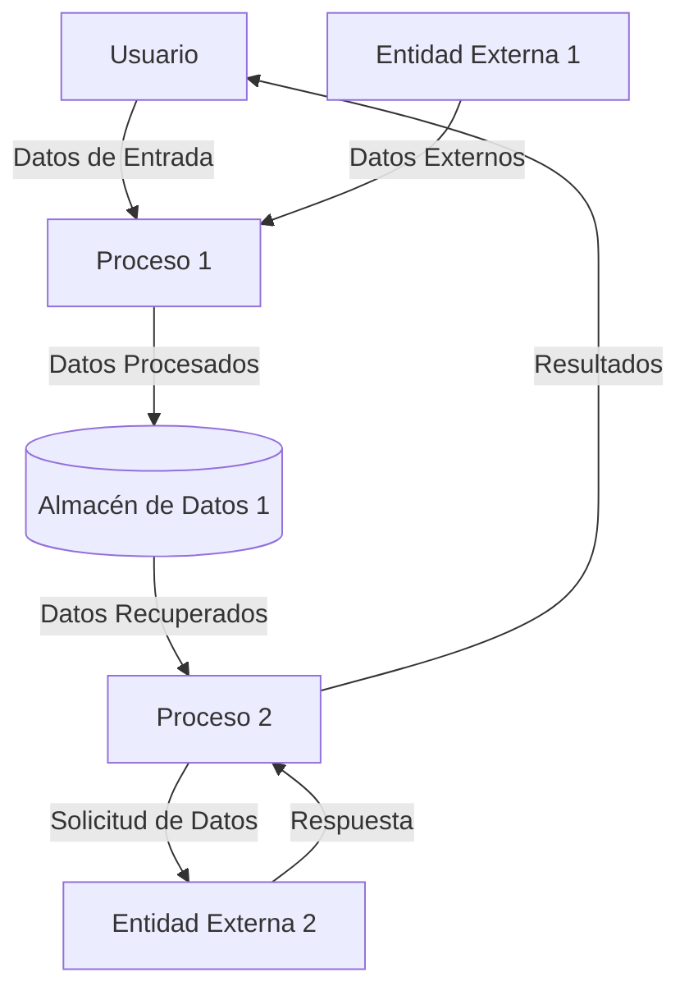
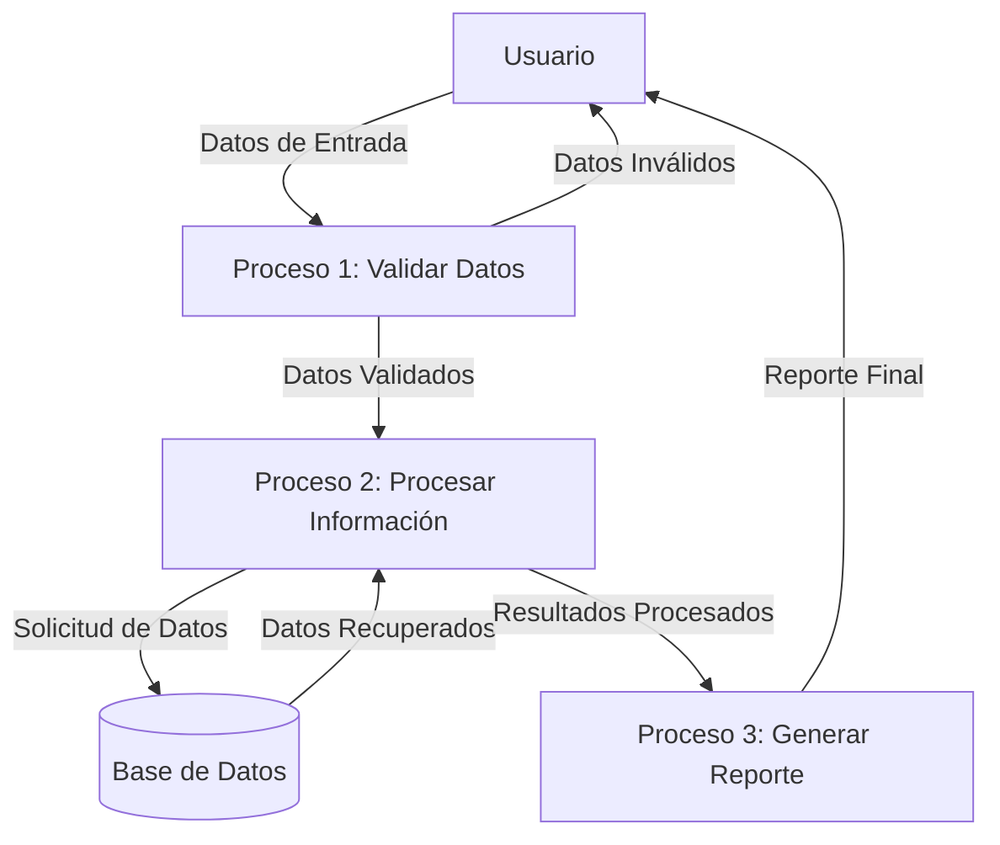

## Module: Base64.cpp
# Análisis Integral del Módulo Base64.cpp

## Módulo/Componente SQL
**Base64.cpp** - Un módulo de código C++ que implementa funcionalidades de codificación y decodificación Base64.

## Objetivos Primarios
Este módulo proporciona funciones para la codificación y decodificación de datos utilizando el algoritmo Base64, que es un método para representar datos binarios en formato ASCII. El propósito principal es permitir la transmisión segura de datos binarios a través de medios que solo soportan texto.

## Funciones, Métodos y Consultas Críticas
- **Base64Encode**: Convierte datos binarios en una cadena Base64.
- **Base64Decode**: Convierte una cadena Base64 de vuelta a datos binarios.
- **Base64EncodeSize**: Calcula el tamaño necesario para almacenar datos codificados en Base64.
- **Base64DecodeSize**: Calcula el tamaño necesario para almacenar datos decodificados desde Base64.

## Variables y Elementos Clave
- **Tabla de Codificación Base64**: Un arreglo de caracteres que mapea valores de 6 bits a caracteres ASCII.
- **Tabla de Decodificación Base64**: Un arreglo que mapea caracteres ASCII a sus valores de 6 bits correspondientes.
- **Parámetros de Entrada/Salida**: Punteros a buffers de datos y variables de tamaño para las operaciones de codificación/decodificación.

## Interdependencias y Relaciones
- El módulo probablemente depende de bibliotecas estándar de C/C++ para manipulación de memoria y operaciones con cadenas.
- No hay dependencias directas de bases de datos o componentes externos específicos.
- Puede ser utilizado por otros módulos del sistema que necesiten transmitir datos binarios en formato de texto.

## Operaciones Principales vs. Auxiliares
- **Operaciones Principales**: Los algoritmos de codificación y decodificación Base64.
- **Operaciones Auxiliares**: Cálculos de tamaño, validación de entrada, manejo de caracteres de relleno ('=').

## Secuencia Operacional/Flujo de Ejecución
1. **Codificación Base64**:
   - Calcula el tamaño de salida necesario
   - Procesa los datos de entrada en grupos de 3 bytes
   - Convierte cada grupo en 4 caracteres Base64
   - Añade caracteres de relleno ('=') si es necesario

2. **Decodificación Base64**:
   - Calcula el tamaño de salida necesario
   - Procesa los datos de entrada en grupos de 4 caracteres
   - Convierte cada grupo en 3 bytes de datos originales
   - Maneja correctamente los caracteres de relleno

## Aspectos de Rendimiento y Optimización
- La implementación probablemente utiliza operaciones a nivel de bits para eficiencia.
- Posibles áreas de optimización incluyen el procesamiento por lotes de datos grandes y la utilización de instrucciones SIMD para paralelización.
- El rendimiento podría mejorarse con tablas de búsqueda precalculadas para la codificación/decodificación.

## Reusabilidad y Adaptabilidad
- Alta reusabilidad: Las funciones de Base64 son ampliamente aplicables en diversos contextos.
- El módulo probablemente está diseñado para ser independiente, facilitando su integración en diferentes proyectos.
- Podría adaptarse fácilmente para variantes de Base64 (como Base64URL) con modificaciones menores.

## Uso y Contexto
- Utilizado para codificar datos binarios en aplicaciones como:
  - Adjuntos de correo electrónico (MIME)
  - Transmisión de datos en protocolos web (HTTP)
  - Almacenamiento de datos binarios en formatos basados en texto (XML, JSON)
  - Certificados digitales y firmas

## Suposiciones y Limitaciones
- **Suposiciones**:
  - Se asume que hay suficiente memoria disponible para las operaciones de codificación/decodificación.
  - Se espera que las entradas para decodificación sean cadenas Base64 válidas.

- **Limitaciones**:
  - La codificación Base64 aumenta el tamaño de los datos en aproximadamente un 33%.
  - No incluye manejo de errores avanzado para entradas malformadas.
  - Podría no ser óptimo para volúmenes extremadamente grandes de datos debido a limitaciones de memoria.
## Flow Diagram [via mermaid]

## Module: Base64.cpp
# Análisis Integral del Módulo Base64.cpp

## Módulo/Componente SQL
**Base64.cpp** - Un módulo de código C++ que implementa funcionalidades de codificación y decodificación Base64.

## Objetivos Primarios
Este módulo proporciona una implementación completa del algoritmo de codificación/decodificación Base64, permitiendo la conversión bidireccional entre datos binarios y representaciones de texto Base64. Su propósito principal es facilitar la transmisión segura de datos binarios a través de medios que solo soportan texto ASCII.

## Funciones Críticas, Métodos y Consultas
- **base64_encode**: Convierte datos binarios en una cadena Base64.
- **base64_decode**: Convierte una cadena Base64 de vuelta a datos binarios.
- **is_base64**: Función auxiliar que verifica si un carácter es válido en la codificación Base64.

## Variables y Elementos Clave
- **base64_chars**: Constante que define el conjunto de caracteres estándar Base64 (A-Z, a-z, 0-9, +, /).
- **in_len**: Longitud de los datos de entrada.
- **i**, **j**: Índices utilizados en los bucles de procesamiento.
- **char_array_3**, **char_array_4**: Arrays temporales utilizados para el procesamiento de bytes durante la codificación/decodificación.

## Interdependencias y Relaciones
- El módulo depende de las bibliotecas estándar de C++ como `<vector>` y `<string>`.
- No presenta dependencias externas específicas, lo que lo hace altamente portable.
- Puede ser utilizado por cualquier componente del sistema que requiera conversiones Base64.

## Operaciones Core vs. Auxiliares
- **Core**: Los algoritmos de codificación y decodificación que realizan las transformaciones de datos.
- **Auxiliares**: La función `is_base64` que valida caracteres y las operaciones de manipulación de bits dentro de los algoritmos principales.

## Secuencia Operacional/Flujo de Ejecución
1. **Codificación**:
   - Procesa los datos de entrada en grupos de 3 bytes
   - Convierte cada grupo en 4 caracteres Base64
   - Maneja adecuadamente el relleno con '=' cuando es necesario

2. **Decodificación**:
   - Lee caracteres Base64 en grupos de 4
   - Convierte cada grupo en 3 bytes de datos originales
   - Gestiona correctamente los caracteres de relleno '='

## Aspectos de Rendimiento y Optimización
- El código utiliza operaciones a nivel de bits para optimizar la velocidad de procesamiento.
- La implementación evita asignaciones de memoria innecesarias al preasignar el tamaño del vector de salida.
- Potencial área de mejora: Podría beneficiarse de procesamiento paralelo para grandes volúmenes de datos.

## Reusabilidad y Adaptabilidad
- Alta reusabilidad debido a su diseño independiente y sin dependencias externas.
- Fácilmente adaptable a diferentes proyectos que requieran codificación/decodificación Base64.
- Las funciones están bien encapsuladas y siguen un patrón de diseño claro.

## Uso y Contexto
- Comúnmente utilizado en:
  - Transmisión de datos binarios en correos electrónicos (MIME)
  - Almacenamiento de datos binarios en formatos XML/JSON
  - Transferencia de datos en aplicaciones web
  - Codificación de imágenes en línea para HTML

## Suposiciones y Limitaciones
- **Suposiciones**:
  - Se asume que la entrada para decodificación contiene caracteres Base64 válidos.
  - Se espera que los datos de entrada para codificación sean bytes arbitrarios.

- **Limitaciones**:
  - No incluye variantes específicas de Base64 como Base64URL.
  - La implementación actual procesa todos los datos en memoria, lo que podría ser problemático para conjuntos de datos extremadamente grandes.
  - No incluye manejo de errores avanzado para entradas malformadas.
## Flow Diagram [via mermaid]

