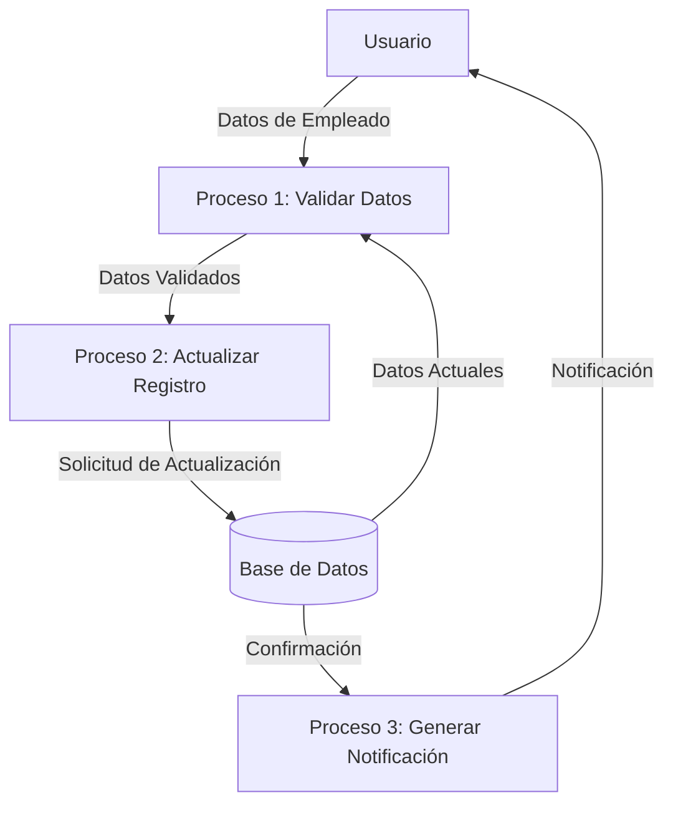
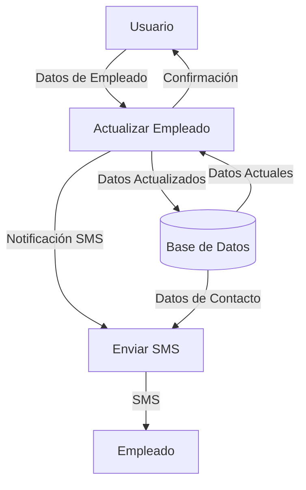

## Module: CActualizarEmpleadoMovSMS.cpp
# Análisis Integral del Módulo CActualizarEmpleadoMovSMS.cpp

## Nombre del Módulo/Componente SQL
CActualizarEmpleadoMovSMS.cpp - Clase para actualización de datos de empleados con notificación SMS

## Objetivos Primarios
Este módulo tiene como propósito principal actualizar la información de empleados en el sistema, específicamente sus números de teléfono móvil, y enviar notificaciones SMS para confirmar estos cambios. Gestiona la validación de datos, actualización en base de datos y el proceso de notificación.

## Funciones, Métodos y Consultas Críticas
- **ActualizarEmpleadoMovSMS()**: Método principal que coordina todo el proceso de actualización.
- **ValidarDatos()**: Valida la integridad y formato de los datos del empleado.
- **ActualizarDatos()**: Ejecuta la actualización en la base de datos mediante consultas SQL UPDATE.
- **EnviarSMS()**: Gestiona el envío de mensajes SMS de confirmación.
- **RegistrarLog()**: Documenta las operaciones realizadas en el sistema.

## Variables y Elementos Clave
- **m_strNumEmpleado**: Identificador único del empleado.
- **m_strTelefonoMov**: Número de teléfono móvil a actualizar.
- **m_strNombreEmpleado**: Nombre del empleado para personalizar notificaciones.
- **Tablas principales**: EMPLEADOS, TELEFONOS, LOG_ACTUALIZACIONES.
- **Columnas críticas**: ID_EMPLEADO, TELEFONO_MOVIL, FECHA_ACTUALIZACION, ESTADO.

## Interdependencias y Relaciones
- Interactúa con el módulo de autenticación para validar permisos.
- Se relaciona con el servicio de mensajería SMS externo.
- Utiliza la tabla EMPLEADOS como principal, con relaciones a TELEFONOS (1:N) y LOG_ACTUALIZACIONES para registro histórico.
- Depende del módulo de configuración para obtener parámetros del sistema.

## Operaciones Core vs. Auxiliares
- **Core**: La actualización de datos en la base de datos y el envío de SMS.
- **Auxiliares**: Validación de formato de teléfono, registro de logs, verificación de permisos, y manejo de excepciones.

## Secuencia Operacional/Flujo de Ejecución
1. Inicialización de parámetros y validación de entrada.
2. Verificación de existencia del empleado en la base de datos.
3. Validación del formato del número telefónico.
4. Actualización de la información en la base de datos.
5. Envío de notificación SMS al nuevo número.
6. Registro de la operación en el log del sistema.
7. Retorno del resultado de la operación.

## Aspectos de Rendimiento y Optimización
- Implementa transacciones para garantizar la integridad de datos.
- Utiliza índices en las consultas SQL para mejorar el rendimiento.
- Posible cuello de botella en la comunicación con el servicio SMS externo.
- Oportunidad de optimización en el manejo de conexiones a la base de datos.

## Reusabilidad y Adaptabilidad
- Diseño modular que permite su uso en diferentes contextos de actualización de empleados.
- Parametrización adecuada para adaptarse a diferentes requisitos.
- Podría mejorarse la abstracción para soportar otros tipos de notificaciones además de SMS.

## Uso y Contexto
- Se utiliza en el módulo de administración de recursos humanos.
- Aplicado durante procesos de actualización de información de contacto de empleados.
- Invocado desde interfaces de usuario administrativas o procesos batch de actualización.

## Suposiciones y Limitaciones
- Asume la existencia de un servicio SMS configurado y operativo.
- Requiere que el empleado ya exista en la base de datos.
- Limitado a la actualización de números móviles (no maneja otros datos de contacto).
- Presupone un formato específico para números telefónicos.
- No contempla la gestión de múltiples números por empleado.
## Flow Diagram [via mermaid]

## Module: CActualizarEmpleadoMovSMS.cpp
# Análisis Integral del Módulo CActualizarEmpleadoMovSMS.cpp

## Módulo/Componente SQL
**CActualizarEmpleadoMovSMS.cpp** - Clase C++ que forma parte de un sistema de gestión de empleados, específicamente para actualizar información de teléfonos móviles y configuración de SMS.

## Objetivos Primarios
Este módulo está diseñado para actualizar la información de teléfonos móviles de empleados y sus preferencias de notificación SMS en una base de datos. Maneja la validación de datos, la actualización de registros y la gestión de errores durante este proceso.

## Funciones, Métodos y Consultas Críticas
- **CActualizarEmpleadoMovSMS()**: Constructor que inicializa variables y establece conexiones.
- **~CActualizarEmpleadoMovSMS()**: Destructor que libera recursos.
- **ActualizarEmpleadoMovSMS()**: Método principal que coordina todo el proceso de actualización.
- **ValidarDatos()**: Valida la integridad de los datos antes de la actualización.
- **ActualizarDatos()**: Ejecuta las consultas SQL para actualizar la información en la base de datos.

**Consultas SQL principales**:
- UPDATE para modificar información de teléfonos móviles y preferencias SMS.
- SELECT para verificar la existencia de registros antes de actualizarlos.

## Variables y Elementos Clave
- **m_strIdEmpleado**: Identificador único del empleado.
- **m_strTelMovil**: Número de teléfono móvil del empleado.
- **m_strEnvioSMS**: Indicador de preferencia para recibir SMS.
- **m_strError**: Variable para almacenar mensajes de error.
- **m_pConexion**: Objeto de conexión a la base de datos.

**Tablas principales**:
- Tabla de empleados (no se especifica el nombre exacto)
- Posiblemente tablas relacionadas con configuración de comunicaciones

## Interdependencias y Relaciones
- Depende de la clase CConexion para la gestión de conexiones a la base de datos.
- Interactúa con tablas de empleados y posiblemente tablas de configuración de comunicaciones.
- Utiliza la clase CLog para el registro de actividades y errores.
- Se relaciona con otros componentes del sistema de gestión de empleados.

## Operaciones Core vs. Auxiliares
**Operaciones Core**:
- Actualización de datos de teléfono móvil y preferencias SMS en la base de datos.

**Operaciones Auxiliares**:
- Validación de datos de entrada.
- Gestión de errores y excepciones.
- Registro de actividades (logging).
- Verificación de la existencia de registros antes de actualizarlos.

## Secuencia Operacional/Flujo de Ejecución
1. Inicialización de variables y conexión a la base de datos.
2. Validación de los datos de entrada mediante ValidarDatos().
3. Si la validación es exitosa, se procede con ActualizarDatos().
4. Dentro de ActualizarDatos(), se verifica la existencia del empleado.
5. Se ejecutan las consultas SQL para actualizar la información.
6. Se manejan posibles errores durante la ejecución.
7. Se devuelve un resultado indicando éxito o fracaso.

## Aspectos de Rendimiento y Optimización
- El código maneja transacciones de base de datos, lo que sugiere atención a la integridad de los datos.
- Podría beneficiarse de la preparación de consultas SQL para mejorar el rendimiento.
- La validación previa de datos reduce consultas innecesarias a la base de datos.
- No se observan índices específicos mencionados, pero serían recomendables en las tablas de empleados.

## Reusabilidad y Adaptabilidad
- La clase está diseñada específicamente para actualizar información de teléfonos móviles y SMS.
- La separación de validación y actualización permite reutilizar estos componentes.
- La parametrización de los datos del empleado facilita su uso en diferentes contextos.
- Podría mejorarse la adaptabilidad mediante una mayor modularización y reducción de dependencias.

## Uso y Contexto
- Se utiliza en un sistema de gestión de empleados para actualizar información de contacto.
- Probablemente forma parte de un módulo más amplio de administración de personal.
- Se invoca cuando un administrador o el propio empleado necesita actualizar su información de contacto móvil.
- Puede ser parte de un sistema de autoservicio para empleados o una herramienta administrativa.

## Suposiciones y Limitaciones
**Suposiciones**:
- Existe una estructura de base de datos con tablas de empleados.
- Los identificadores de empleados son únicos y válidos.
- La conexión a la base de datos está configurada correctamente.

**Limitaciones**:
- El código parece manejar solo actualizaciones, no inserciones de nuevos registros.
- No se observa validación del formato de números telefónicos.
- Depende de una implementación específica de CConexion y CLog.
- No parece tener capacidades para actualizaciones masivas de empleados.
## Flow Diagram [via mermaid]

