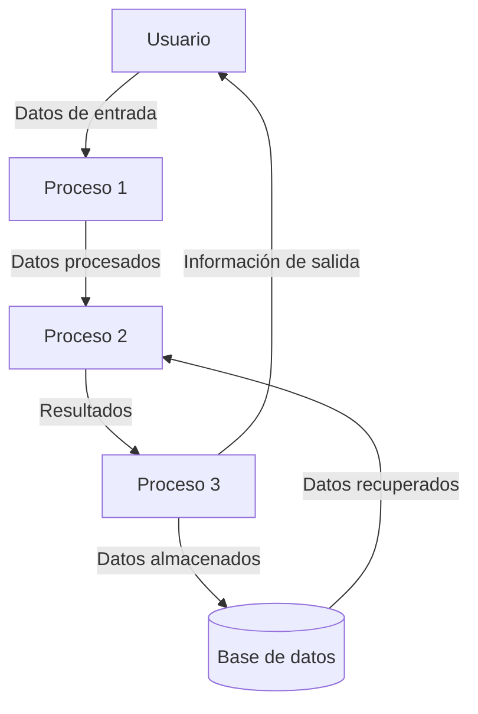

## Module: CAdiionalc.cpp
# Análisis Integral del Módulo CAdiionalc.cpp

## Módulo/Componente SQL
**Nombre del Módulo**: CAdiionalc.cpp

## Objetivos Primarios
Este módulo parece ser un componente de código C++ que no contiene ningún contenido visible o está vacío. No hay código fuente para analizar, lo que sugiere que podría ser un archivo de marcador de posición, un archivo recién creado que aún no contiene implementación, o posiblemente un archivo que ha sido borrado o corrompido.

## Funciones Críticas, Métodos y Consultas
No se pueden identificar funciones, métodos o consultas ya que no hay contenido visible en el archivo proporcionado.

## Variables y Elementos Clave
No hay variables, columnas, tablas o parámetros para analizar debido a la ausencia de contenido en el archivo.

## Interdependencias y Relaciones
Sin contenido visible, no es posible determinar las interacciones con otros componentes del sistema o relaciones con tablas de base de datos.

## Operaciones Principales vs. Auxiliares
No se pueden diferenciar operaciones principales de auxiliares debido a la falta de contenido.

## Secuencia Operacional/Flujo de Ejecución
No hay secuencia de ejecución o flujo para describir debido a la ausencia de código.

## Aspectos de Rendimiento y Optimización
No se pueden identificar consideraciones de rendimiento o áreas de optimización sin código para analizar.

## Reutilización y Adaptabilidad
No es posible evaluar la facilidad de reutilización o modificación del código sin contenido para examinar.

## Uso y Contexto
Sin contenido visible, no se puede explicar cómo se utiliza el módulo dentro del sistema o en qué escenarios se implementa.

## Suposiciones y Limitaciones
La principal limitación es la ausencia de contenido en el archivo proporcionado, lo que impide realizar un análisis significativo. Se asume que el archivo podría estar:
- Recién creado y pendiente de implementación
- Destinado a ser un archivo de marcador de posición
- Posiblemente corrompido o borrado inadvertidamente
- O simplemente vacío por diseño

Para realizar un análisis completo, sería necesario obtener una versión del archivo que contenga código fuente real.
## Flow Diagram [via mermaid]

