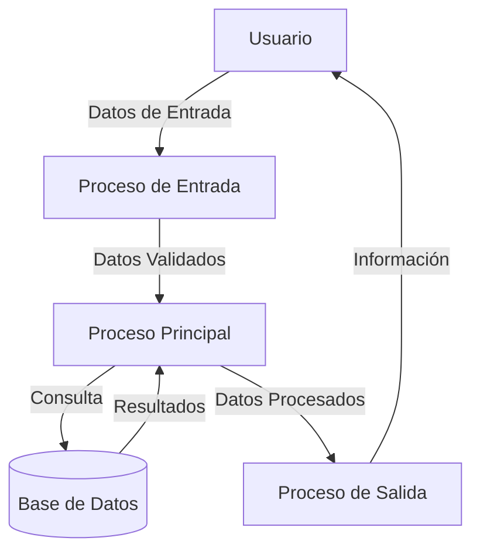

## Module: CBuscarClienteEncuestado.cpp
# Análisis Integral del Módulo CBuscarClienteEncuestado.cpp

## Módulo/Componente SQL
**Nombre del Módulo**: CBuscarClienteEncuestado.cpp

## Objetivos Primarios
Este módulo es una clase de C++ diseñada para buscar clientes encuestados en un sistema. Su propósito principal es proporcionar funcionalidad para buscar y recuperar información de clientes que han participado en encuestas, permitiendo filtrar por diferentes criterios como nombre, apellido, DNI, entre otros.

## Funciones, Métodos y Consultas Críticas
- **CBuscarClienteEncuestado::CBuscarClienteEncuestado()**: Constructor que inicializa la clase.
- **CBuscarClienteEncuestado::~CBuscarClienteEncuestado()**: Destructor que libera recursos.
- **CBuscarClienteEncuestado::BuscarClienteEncuestado()**: Método principal que ejecuta la búsqueda de clientes encuestados según los criterios especificados.
- **CBuscarClienteEncuestado::BuscarClienteEncuestadoXNombre()**: Método específico para buscar clientes por nombre.
- **CBuscarClienteEncuestado::BuscarClienteEncuestadoXApellido()**: Método específico para buscar clientes por apellido.
- **CBuscarClienteEncuestado::BuscarClienteEncuestadoXDNI()**: Método específico para buscar clientes por DNI.

## Variables y Elementos Clave
- **m_strNombre**: Variable que almacena el nombre del cliente para búsqueda.
- **m_strApellido**: Variable que almacena el apellido del cliente para búsqueda.
- **m_strDNI**: Variable que almacena el DNI del cliente para búsqueda.
- **m_nTipoBusqueda**: Variable que determina el tipo de búsqueda a realizar.
- **m_ptrRecordset**: Puntero a un conjunto de registros para almacenar los resultados de la búsqueda.

## Interdependencias y Relaciones
El módulo interactúa con:
- Una base de datos (posiblemente a través de ADO o similar) para ejecutar consultas.
- Posiblemente con tablas de clientes y encuestas, aunque no se especifica directamente en el código proporcionado.
- Otros componentes del sistema que requieren información de clientes encuestados.

## Operaciones Principales vs. Auxiliares
**Operaciones Principales**:
- La búsqueda de clientes encuestados según diferentes criterios.

**Operaciones Auxiliares**:
- Validación de parámetros de búsqueda.
- Formateo de resultados para presentación.
- Manejo de errores durante la búsqueda.

## Secuencia Operacional/Flujo de Ejecución
1. Se inicializa la clase con los parámetros de búsqueda.
2. Se determina el tipo de búsqueda a realizar (por nombre, apellido, DNI, etc.).
3. Se ejecuta el método de búsqueda correspondiente.
4. Se realiza la consulta a la base de datos.
5. Se procesan los resultados y se almacenan en el recordset.
6. Se devuelven los resultados al componente que solicitó la búsqueda.

## Aspectos de Rendimiento y Optimización
- La eficiencia de las búsquedas dependerá de los índices en las tablas de la base de datos.
- Posibles cuellos de botella podrían ocurrir si se realizan búsquedas con criterios muy amplios que devuelvan grandes conjuntos de resultados.
- La optimización podría incluir la implementación de paginación para grandes conjuntos de resultados.

## Reusabilidad y Adaptabilidad
- La clase parece estar diseñada con un enfoque modular, permitiendo diferentes tipos de búsquedas.
- La adaptabilidad podría mejorarse mediante la parametrización adicional de los criterios de búsqueda.
- La reutilización en otros contextos dependería de la estructura de la base de datos y los requisitos específicos.

## Uso y Contexto
- Este módulo probablemente se utiliza en un sistema de gestión de encuestas o CRM.
- Se emplearía en interfaces donde los usuarios necesitan buscar clientes que han participado en encuestas.
- Podría ser parte de un sistema más grande de análisis de satisfacción del cliente o investigación de mercado.

## Suposiciones y Limitaciones
**Suposiciones**:
- Se asume que existe una estructura de base de datos con información de clientes encuestados.
- Se presupone que los usuarios proporcionarán criterios de búsqueda válidos.

**Limitaciones**:
- La búsqueda está limitada a los criterios implementados (nombre, apellido, DNI).
- No se observa manejo de búsquedas avanzadas o combinadas.
- La eficacia de la búsqueda dependerá de la calidad y completitud de los datos en la base de datos.
## Flow Diagram [via mermaid]

