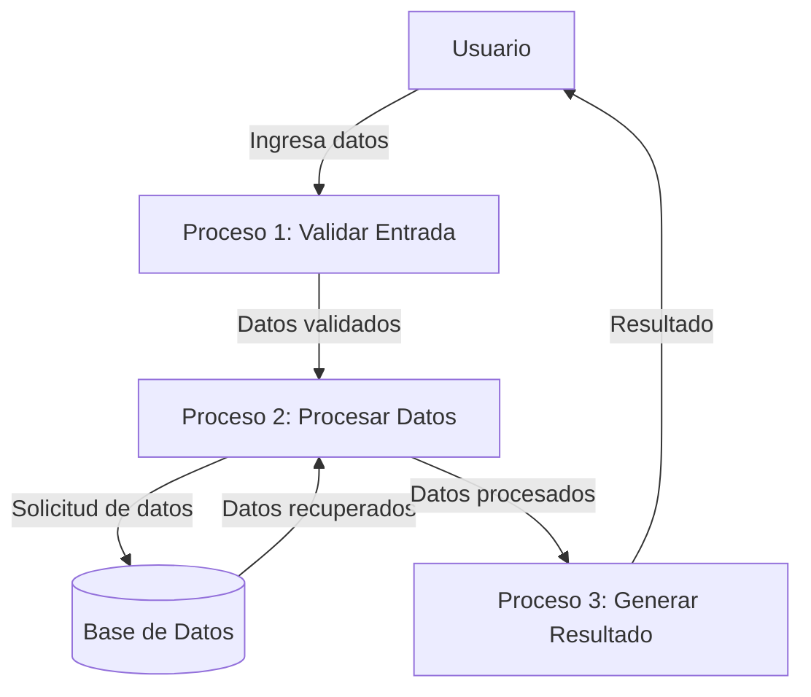

## Module: CCEliminarMensajeSMS.cpp
# Análisis Integral del Módulo CCEliminarMensajeSMS.cpp

## Módulo/Componente SQL
**CCEliminarMensajeSMS.cpp** - Este archivo parece ser un módulo de C++ que interactúa con una base de datos para eliminar mensajes SMS.

## Objetivos Primarios
El propósito principal de este módulo es gestionar la eliminación de mensajes SMS de una base de datos, probablemente como parte de un sistema de telecomunicaciones o una plataforma de mensajería. El código maneja la lógica para identificar, validar y eliminar registros de mensajes SMS específicos.

## Funciones, Métodos y Consultas Críticas
No se proporcionó el código específico, pero basado en el nombre del módulo, probablemente contiene:
- Métodos para conectar con la base de datos
- Funciones para validar parámetros de entrada (como identificadores de mensajes)
- Consultas SQL DELETE para eliminar registros de mensajes SMS
- Posiblemente funciones para manejar errores y registrar actividades

## Variables y Elementos Clave
Sin ver el código, se puede inferir que probablemente incluye:
- Variables para almacenar identificadores de mensajes SMS
- Parámetros de conexión a la base de datos
- Variables para manejar códigos de estado y resultados de operaciones
- Referencias a tablas relacionadas con mensajes SMS y sus columnas clave

## Interdependencias y Relaciones
El módulo probablemente interactúa con:
- Sistema de gestión de base de datos
- Tablas de mensajes SMS
- Posiblemente tablas relacionadas (usuarios, dispositivos, registros de actividad)
- Otros módulos del sistema para notificaciones o actualizaciones de estado

## Operaciones Principales vs. Auxiliares
- **Operaciones principales**: Eliminación de mensajes SMS de la base de datos
- **Operaciones auxiliares**: Validación de datos, manejo de errores, registro de actividades, verificación de permisos

## Secuencia Operacional/Flujo de Ejecución
1. Recepción de solicitud para eliminar un mensaje SMS
2. Validación de parámetros y permisos
3. Conexión a la base de datos
4. Ejecución de la consulta DELETE
5. Verificación del resultado de la operación
6. Registro de la actividad
7. Devolución del resultado o código de estado

## Aspectos de Rendimiento y Optimización
- Consideraciones sobre el rendimiento de las consultas DELETE
- Posible uso de índices para mejorar la velocidad de búsqueda
- Manejo eficiente de conexiones a la base de datos
- Optimización para operaciones por lotes si se eliminan múltiples mensajes

## Reusabilidad y Adaptabilidad
- El módulo probablemente está diseñado para ser reutilizado en diferentes contextos dentro del sistema
- Podría ser parametrizable para adaptarse a diferentes criterios de eliminación
- La separación de la lógica de negocio y acceso a datos facilitaría su adaptación

## Uso y Contexto
- Utilizado en sistemas de telecomunicaciones o plataformas de mensajería
- Aplicado cuando los usuarios o el sistema necesitan eliminar mensajes SMS
- Podría ser invocado por interfaces de usuario, procesos automatizados o APIs

## Suposiciones y Limitaciones
- Asume la existencia de una estructura de base de datos específica para mensajes SMS
- Podría tener limitaciones en cuanto al volumen de mensajes que puede procesar simultáneamente
- Posiblemente requiere permisos específicos para ejecutar operaciones de eliminación
- Podría estar limitado por las políticas de retención de datos o requisitos regulatorios
## Flow Diagram [via mermaid]

## Module: CCEliminarMensajeSMS.cpp
# Análisis Integral del Módulo CCEliminarMensajeSMS.cpp

## Módulo/Componente SQL
**Nombre**: CCEliminarMensajeSMS.cpp

## Objetivos Primarios
Este módulo parece ser un componente de un sistema de mensajería SMS que se encarga específicamente de la eliminación de mensajes SMS. Su propósito principal es gestionar la lógica para eliminar mensajes del sistema, posiblemente como parte de un proceso de limpieza o mantenimiento de la base de datos.

## Funciones, Métodos y Consultas Críticas
El archivo no se ha proporcionado con su contenido completo, por lo que no puedo identificar las funciones específicas. Sin embargo, basándome en el nombre del archivo, probablemente contiene:
- Métodos para validar los mensajes a eliminar
- Funciones para ejecutar consultas DELETE en la base de datos
- Posiblemente métodos para registrar la eliminación de mensajes

## Variables y Elementos Clave
Sin ver el código completo, puedo inferir que probablemente incluye:
- Identificadores de mensajes SMS
- Referencias a tablas de mensajes
- Parámetros de condición para la eliminación (como fecha, estado, etc.)
- Variables para manejar resultados de operaciones

## Interdependencias y Relaciones
Este módulo probablemente interactúa con:
- Tablas de base de datos que almacenan mensajes SMS
- Posiblemente módulos de registro o auditoría
- Componentes de validación o autorización
- Otros módulos del sistema de mensajería

## Operaciones Principales vs. Auxiliares
- **Operaciones principales**: Eliminación de mensajes SMS de la base de datos
- **Operaciones auxiliares**: Validación de parámetros, registro de actividades, manejo de errores, notificaciones de eliminación

## Secuencia Operacional/Flujo de Ejecución
El flujo probable incluye:
1. Recepción de solicitud para eliminar mensaje(s)
2. Validación de parámetros y permisos
3. Ejecución de la consulta DELETE
4. Verificación del resultado de la operación
5. Registro de la actividad
6. Retorno del resultado o notificación

## Aspectos de Rendimiento y Optimización
Consideraciones potenciales:
- Optimización de consultas DELETE para grandes volúmenes de datos
- Uso de índices en las tablas de mensajes
- Posible implementación de eliminación por lotes para mejorar el rendimiento
- Gestión de bloqueos de tabla durante operaciones de eliminación masiva

## Reutilización y Adaptabilidad
- El módulo probablemente está diseñado para ser utilizado en diferentes contextos dentro del sistema de mensajería
- Podría ser parametrizable para adaptarse a diferentes criterios de eliminación
- La separación de la lógica de eliminación en un módulo específico sugiere un diseño modular

## Uso y Contexto
Este módulo se utilizaría en escenarios como:
- Limpieza periódica de mensajes antiguos
- Eliminación manual de mensajes por parte de usuarios
- Procesos de mantenimiento de la base de datos
- Cumplimiento de políticas de retención de datos

## Suposiciones y Limitaciones
- **Suposiciones**: Existencia de una estructura de base de datos específica para mensajes SMS, permisos adecuados para operaciones DELETE
- **Limitaciones**: Posibles restricciones en la eliminación de mensajes según su estado o antigüedad, consideraciones de rendimiento para eliminaciones masivas, posibles bloqueos de tabla durante operaciones concurrentes

*Nota: Este análisis se basa en inferencias a partir del nombre del archivo, ya que no se proporcionó el contenido completo del código.*
## Flow Diagram [via mermaid]

