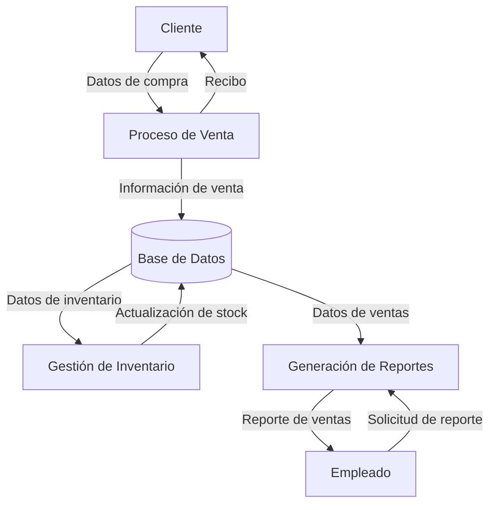

## Module: CChecarCorteCaja.cpp
# Análisis Integral del Módulo CChecarCorteCaja.cpp

## Nombre del Módulo/Componente SQL
**CChecarCorteCaja.cpp** - Módulo de clase C++ para verificación de corte de caja

## Objetivos Primarios
Este módulo implementa la funcionalidad para verificar y gestionar el corte de caja en un sistema de punto de venta o gestión comercial. Su propósito principal es validar los montos de efectivo, comparar los valores esperados con los reales, y gestionar las diferencias en el corte de caja.

## Funciones, Métodos y Consultas Críticas
1. **CChecarCorteCaja::CChecarCorteCaja()** - Constructor que inicializa los atributos de la clase.
2. **CChecarCorteCaja::~CChecarCorteCaja()** - Destructor que libera recursos.
3. **CChecarCorteCaja::DoDataExchange()** - Método para intercambio de datos entre variables y controles de la interfaz.
4. **CChecarCorteCaja::OnInitDialog()** - Inicializa el diálogo y configura los controles.
5. **CChecarCorteCaja::OnOK()** - Maneja la acción de confirmación, validando los montos y procesando el corte.
6. **CChecarCorteCaja::OnCancel()** - Gestiona la cancelación del diálogo.

## Variables y Elementos Clave
1. **m_dEfectivo** - Variable que almacena el monto en efectivo.
2. **m_dEfectivoEsperado** - Monto esperado en efectivo según el sistema.
3. **m_dDiferencia** - Diferencia entre el efectivo real y el esperado.
4. **m_bAceptar** - Bandera booleana para indicar si se acepta el corte.
5. **m_strUsuario** - Cadena que almacena el identificador del usuario.
6. **m_strFecha** - Cadena que almacena la fecha del corte.
7. **m_strHora** - Cadena que almacena la hora del corte.

## Interdependencias y Relaciones
- El módulo interactúa con controles de interfaz de usuario (CEdit, CButton) para mostrar y capturar información.
- Depende de la clase base CDialog para la funcionalidad de diálogo.
- Probablemente se relaciona con otros módulos del sistema para obtener datos de ventas, pagos y transacciones.

## Operaciones Principales vs. Auxiliares
**Operaciones Principales:**
- Validación de montos de efectivo
- Cálculo de diferencias en el corte
- Procesamiento de la aceptación o rechazo del corte

**Operaciones Auxiliares:**
- Inicialización de controles de interfaz
- Formateo de valores monetarios para visualización
- Validaciones de entrada de datos

## Secuencia Operacional/Flujo de Ejecución
1. Inicialización del diálogo con OnInitDialog()
2. Configuración de controles y visualización de valores esperados
3. Captura de datos ingresados por el usuario (monto real)
4. Al confirmar (OnOK):
   - Validación de los datos ingresados
   - Cálculo de diferencias
   - Procesamiento del corte (aceptación o rechazo)
5. Finalización del diálogo y retorno del resultado

## Aspectos de Rendimiento y Optimización
- El código parece enfocarse en operaciones de interfaz de usuario y cálculos simples, por lo que no presenta problemas evidentes de rendimiento.
- Las operaciones matemáticas son básicas y eficientes.
- No se observan bucles complejos o consultas que pudieran generar cuellos de botella.

## Reusabilidad y Adaptabilidad
- La clase está diseñada específicamente para la verificación de corte de caja, lo que limita su reusabilidad directa.
- Podría adaptarse para otros sistemas de verificación de valores monetarios con modificaciones moderadas.
- La separación entre lógica e interfaz podría mejorarse para aumentar la reusabilidad.

## Uso y Contexto
- Este módulo se utiliza en el contexto de cierre de operaciones de caja, probablemente al final de un turno o jornada laboral.
- Es parte de un sistema más amplio de punto de venta o gestión comercial.
- Se invoca cuando un usuario (cajero o supervisor) necesita realizar un corte de caja para verificar que los montos físicos coincidan con los registrados en el sistema.

## Suposiciones y Limitaciones
**Suposiciones:**
- Se asume que existe un sistema que calcula previamente el monto esperado en caja.
- Se presupone que el usuario tiene los permisos necesarios para realizar el corte.
- Se da por hecho que la interfaz de usuario está correctamente configurada para mostrar los controles mencionados.

**Limitaciones:**
- El módulo parece manejar solo efectivo, sin considerar otros medios de pago.
- No se observa manejo de múltiples divisas o tipos de cambio.
- La validación parece básica, sin considerar escenarios complejos de discrepancias.
## Flow Diagram [via mermaid]

