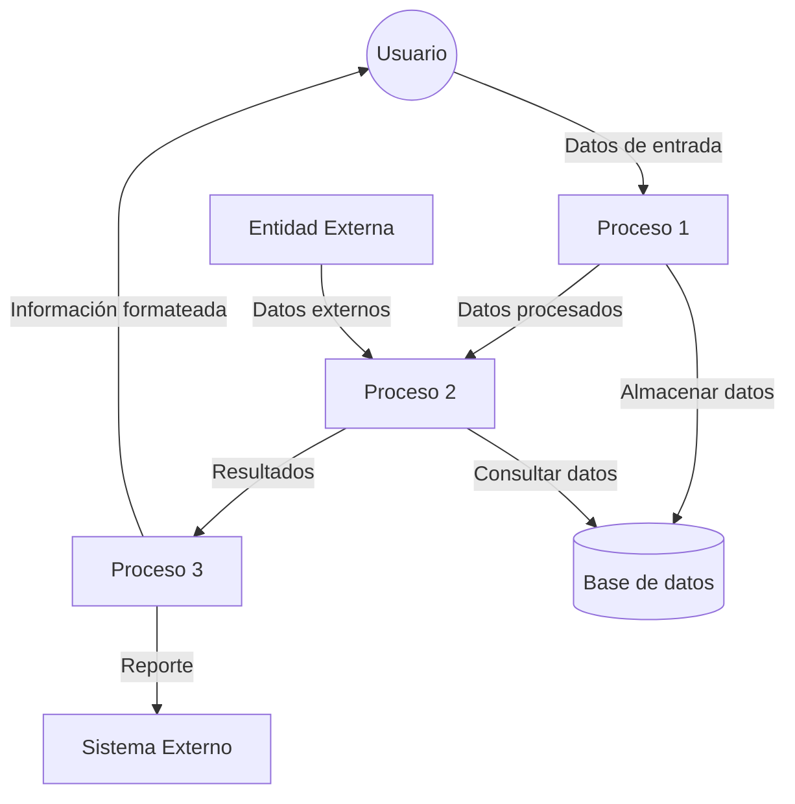
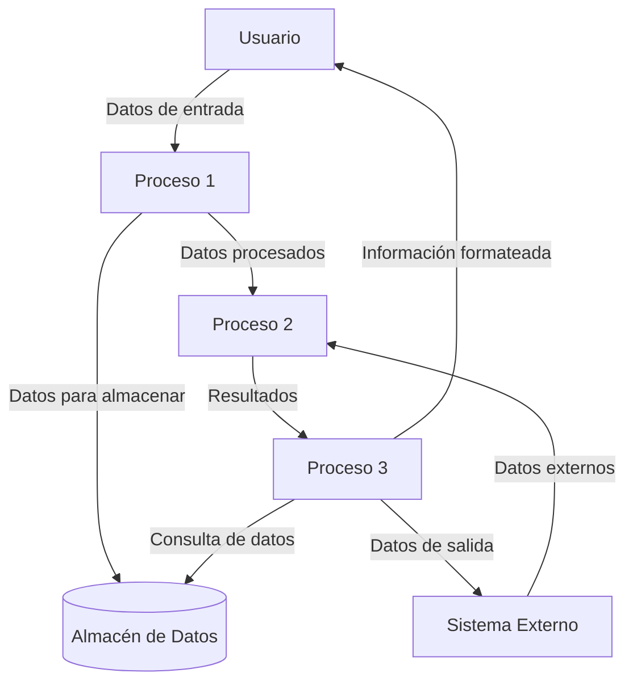

## Module: CChecarEncuesta2.cpp
# Análisis Integral del Módulo CChecarEncuesta2.cpp

## Nombre del Módulo/Componente SQL
CChecarEncuesta2.cpp - Clase para verificación de encuestas

## Objetivos Primarios
Este módulo implementa una clase (`CChecarEncuesta2`) diseñada para verificar y validar encuestas en un sistema de gestión de encuestas. Su propósito principal es analizar la integridad y validez de las respuestas de encuestas, verificando que cumplan con ciertos criterios establecidos.

## Funciones, Métodos y Consultas Críticas
- **Constructor y Destructor**: Inicializa y libera recursos de la clase.
- **ChecarEncuesta()**: Método principal que verifica la validez de una encuesta.
- **ChecarEncuestaCompleta()**: Verifica si una encuesta está completa según criterios específicos.
- **ChecarEncuestaValida()**: Valida si una encuesta cumple con los requisitos de validez.
- **ChecarEncuestaCongruente()**: Comprueba la congruencia interna de las respuestas.

## Variables y Elementos Clave
- **m_pDB**: Puntero a la conexión de base de datos.
- **m_pLog**: Puntero al sistema de registro (logging).
- **m_nIdEncuesta**: Identificador de la encuesta que se está verificando.
- **m_nIdCuestionario**: Identificador del cuestionario asociado.
- **m_nIdEntrevistado**: Identificador del entrevistado.
- **m_nIdEntrevistador**: Identificador del entrevistador.

## Interdependencias y Relaciones
- Interactúa con una base de datos a través del puntero `m_pDB`.
- Utiliza un sistema de registro mediante `m_pLog`.
- Se relaciona con tablas de encuestas, cuestionarios, entrevistados y entrevistadores.
- Depende de la estructura de datos de encuestas y preguntas en la base de datos.

## Operaciones Principales vs. Auxiliares
**Operaciones Principales:**
- Verificación de la integridad de la encuesta.
- Validación de respuestas según reglas de negocio.

**Operaciones Auxiliares:**
- Registro de errores y advertencias.
- Inicialización y limpieza de recursos.
- Verificaciones secundarias de datos.

## Secuencia Operacional/Flujo de Ejecución
1. Inicialización de la clase con parámetros necesarios.
2. Verificación de la completitud de la encuesta.
3. Validación de las respuestas según reglas establecidas.
4. Comprobación de congruencia entre respuestas relacionadas.
5. Registro de resultados y posibles errores.
6. Retorno del estado de validación.

## Aspectos de Rendimiento y Optimización
- Potencial cuello de botella en consultas a la base de datos si las encuestas contienen muchas preguntas.
- Posible optimización en la forma de recorrer y validar las respuestas.
- Consideración de índices en las tablas relacionadas para mejorar el rendimiento de las consultas.

## Reusabilidad y Adaptabilidad
- La clase está diseñada para ser reutilizable con diferentes encuestas.
- La parametrización permite adaptarla a distintos tipos de cuestionarios.
- Podría mejorarse la modularidad separando más claramente las reglas de validación.

## Uso y Contexto
- Se utiliza en el proceso de validación de encuestas antes de su procesamiento o análisis.
- Probablemente forma parte de un sistema más amplio de gestión de encuestas o investigación de mercado.
- Se ejecuta después de la recolección de datos y antes del análisis o reporte.

## Suposiciones y Limitaciones
- Asume una estructura específica de la base de datos para encuestas y cuestionarios.
- Requiere que los identificadores de encuesta, cuestionario, entrevistado y entrevistador sean válidos.
- Las reglas de validación están codificadas en el módulo, lo que podría limitar la flexibilidad si cambian los requisitos.
- No se observa manejo de concurrencia, lo que podría ser una limitación en entornos multiusuario.
## Flow Diagram [via mermaid]

## Module: CChecarEncuesta2.cpp
# Análisis Integral del Módulo CChecarEncuesta2.cpp

## Nombre del Módulo/Componente SQL
**CChecarEncuesta2.cpp** - Módulo de clase C++ para verificación de encuestas.

## Objetivos Primarios
Este módulo implementa la clase `CChecarEncuesta2` que se encarga de verificar y procesar encuestas, específicamente para validar si una encuesta está completa y cumple con ciertos criterios. El código parece ser parte de un sistema más amplio de gestión de encuestas, posiblemente en un entorno de investigación de mercado o recopilación de datos.

## Funciones, Métodos y Consultas Críticas
- **CChecarEncuesta2()**: Constructor de la clase que inicializa variables.
- **~CChecarEncuesta2()**: Destructor que libera recursos.
- **ChecarEncuesta()**: Método principal que verifica si una encuesta está completa según criterios específicos.
- **ChecarEncuestaCompleta()**: Verifica si todos los elementos requeridos de la encuesta están completos.
- **ChecarEncuestaCompletaConCriterios()**: Verifica la encuesta según criterios adicionales.
- **ChecarEncuestaCompletaConCriteriosYCuotas()**: Método más complejo que verifica la encuesta considerando criterios y cuotas.

## Variables y Elementos Clave
- **m_pDB**: Puntero a la base de datos (posiblemente una conexión ADO).
- **m_pRS**: Puntero a un recordset para consultas de base de datos.
- **m_nIdEncuesta**: Identificador numérico de la encuesta.
- **m_nIdEncuestador**: Identificador del encuestador.
- **m_nIdSupervisor**: Identificador del supervisor.
- **m_nIdEstatus**: Estado actual de la encuesta.
- **m_nIdEstatusNuevo**: Nuevo estado a asignar a la encuesta.
- **m_strMensaje**: Mensaje de estado o error.

## Interdependencias y Relaciones
- El módulo interactúa con una base de datos a través de ADO (ActiveX Data Objects).
- Depende de la estructura de tablas relacionadas con encuestas, encuestadores, supervisores y estados.
- Utiliza consultas SQL para verificar y actualizar el estado de las encuestas.
- Se relaciona con otros componentes del sistema como `CEncuesta` y posiblemente con interfaces de usuario.

## Operaciones Principales vs. Auxiliares
**Operaciones Principales:**
- Verificación de la completitud de encuestas según diferentes criterios.
- Actualización del estado de las encuestas en la base de datos.

**Operaciones Auxiliares:**
- Inicialización y liberación de recursos de base de datos.
- Generación de mensajes de estado o error.
- Validaciones intermedias de datos.

## Secuencia Operacional/Flujo de Ejecución
1. Se inicializa la clase con los parámetros necesarios.
2. Se llama a uno de los métodos de verificación según los requisitos.
3. El método verifica la completitud de la encuesta consultando la base de datos.
4. Si la encuesta cumple con los criterios, se actualiza su estado.
5. Se genera un mensaje de resultado.
6. Se devuelve un valor booleano indicando el éxito o fracaso de la operación.

## Aspectos de Rendimiento y Optimización
- Las consultas SQL podrían optimizarse para mejorar el rendimiento, especialmente si manejan grandes volúmenes de datos.
- La gestión de conexiones a la base de datos podría mejorarse para evitar abrir y cerrar conexiones repetidamente.
- El código podría beneficiarse de un mejor manejo de errores y excepciones.

## Reusabilidad y Adaptabilidad
- La clase está diseñada para ser reutilizable con diferentes encuestas y criterios.
- La parametrización permite adaptarla a diferentes escenarios de verificación.
- Sin embargo, la fuerte dependencia de una estructura específica de base de datos podría limitar su adaptabilidad a otros sistemas.

## Uso y Contexto
- Este módulo se utiliza en un sistema de gestión de encuestas para validar si las encuestas están completas antes de procesarlas.
- Probablemente se invoca desde una interfaz de usuario o un proceso automatizado que gestiona encuestas.
- Es crucial para garantizar la calidad de los datos recopilados antes de su análisis.

## Suposiciones y Limitaciones
**Suposiciones:**
- Existe una estructura de base de datos específica con tablas para encuestas, encuestadores y estados.
- Los identificadores de encuesta, encuestador y supervisor son válidos.
- La conexión a la base de datos está disponible y es estable.

**Limitaciones:**
- El código parece estar fuertemente acoplado a una estructura específica de base de datos.
- No hay un manejo robusto de errores para fallos en la conexión a la base de datos.
- La lógica de verificación podría ser difícil de modificar si cambian los criterios de validación.
- El código parece depender de bibliotecas específicas de Windows (ADO), lo que limita su portabilidad.
## Flow Diagram [via mermaid]

