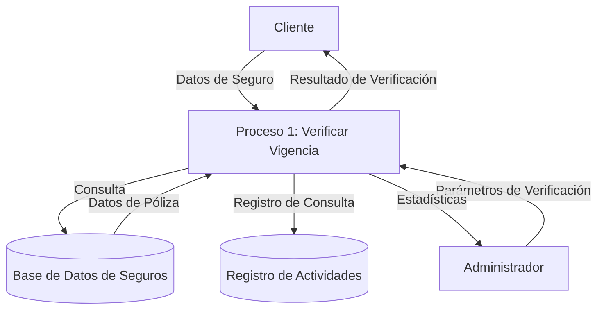

## Module: CChecarVigenciaSeguro.cpp
# Análisis Integral del Módulo CChecarVigenciaSeguro.cpp

## Nombre del Módulo/Componente SQL
CChecarVigenciaSeguro.cpp - Clase para verificar la vigencia de seguros

## Objetivos Primarios
Este módulo tiene como propósito principal verificar la vigencia de pólizas de seguro en un sistema de gestión de seguros. Implementa la lógica para determinar si un seguro está vigente basándose en fechas de inicio y fin, así como en otros parámetros de configuración del sistema.

## Funciones, Métodos y Consultas Críticas
- **CChecarVigenciaSeguro::CChecarVigenciaSeguro()**: Constructor que inicializa la clase.
- **CChecarVigenciaSeguro::~CChecarVigenciaSeguro()**: Destructor de la clase.
- **CChecarVigenciaSeguro::ChecarVigencia()**: Método principal que verifica la vigencia de un seguro basándose en fechas y configuración.
- **CChecarVigenciaSeguro::ChecarVigenciaConDias()**: Método que verifica la vigencia considerando un número específico de días.

## Variables y Elementos Clave
- **m_pConexionBD**: Puntero a la conexión de base de datos.
- **m_pParametrosSistema**: Puntero a los parámetros del sistema.
- **m_pLog**: Puntero al sistema de registro (logging).
- **Fechas**: `dtFechaInicio`, `dtFechaFin`, `dtFechaActual` - Fechas críticas para determinar la vigencia.
- **Parámetros de configuración**: Valores que determinan los días de tolerancia y comportamiento del sistema.

## Interdependencias y Relaciones
- Depende de la clase `CConexionBD` para acceso a la base de datos.
- Utiliza `CParametrosSistema` para obtener configuraciones del sistema.
- Interactúa con `CLog` para el registro de operaciones y errores.
- Posiblemente se relaciona con tablas de pólizas de seguro y configuración del sistema en la base de datos.

## Operaciones Principales vs. Auxiliares
- **Operaciones Principales**:
  - Verificación de vigencia de seguros mediante `ChecarVigencia()` y `ChecarVigenciaConDias()`
- **Operaciones Auxiliares**:
  - Registro de eventos (logging)
  - Manejo de errores
  - Cálculos de fechas y períodos

## Secuencia Operativa/Flujo de Ejecución
1. Inicialización de la clase con conexión a base de datos y parámetros del sistema
2. Recepción de fechas de inicio y fin de la póliza
3. Obtención de la fecha actual del sistema
4. Comparación de fechas para determinar vigencia
5. Aplicación de reglas de tolerancia según configuración
6. Retorno del resultado de vigencia (verdadero/falso)

## Aspectos de Rendimiento y Optimización
- El código parece realizar operaciones simples de comparación de fechas, lo que debería ser eficiente.
- Posibles áreas de optimización:
  - Reducir consultas a la base de datos para obtener parámetros frecuentemente utilizados
  - Implementar caché para parámetros del sistema que no cambian con frecuencia

## Reusabilidad y Adaptabilidad
- La clase está diseñada como un componente reutilizable para verificar vigencia de seguros.
- La parametrización a través de `CParametrosSistema` permite adaptar el comportamiento sin modificar el código.
- Podría mejorarse la adaptabilidad mediante la implementación de interfaces más genéricas para verificación de vigencia.

## Uso y Contexto
- Este módulo probablemente se utiliza en un sistema de gestión de seguros o pólizas.
- Se invocaría cuando se necesita verificar si una póliza está vigente, posiblemente en:
  - Procesos de renovación
  - Validación de cobertura
  - Generación de reportes de pólizas activas/inactivas

## Suposiciones y Limitaciones
- **Suposiciones**:
  - Se asume que las fechas están en un formato consistente y válido.
  - Se espera que los parámetros del sistema estén correctamente configurados.
  - Se presupone la existencia de una conexión a base de datos funcional.
- **Limitaciones**:
  - El código podría no manejar zonas horarias diferentes.
  - No se observa manejo explícito de casos especiales como años bisiestos.
  - Dependencia de la configuración correcta de los parámetros del sistema.
## Flow Diagram [via mermaid]

