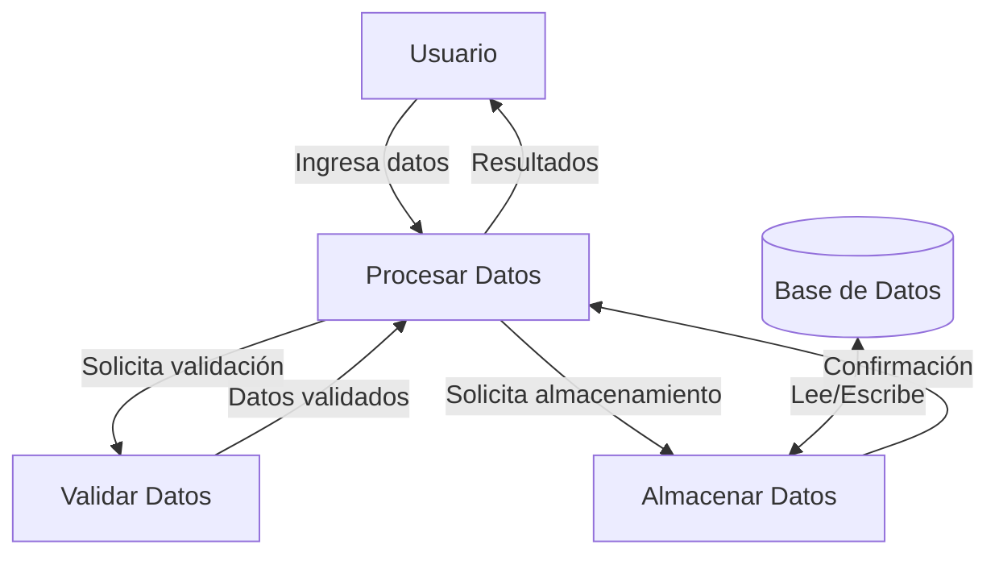

## Module: CCiudadColoniaCrCliente.cpp
# Análisis Integral del Módulo CCiudadColoniaCrCliente.cpp

## Módulo/Componente SQL
**Nombre del Módulo**: CCiudadColoniaCrCliente.cpp

## Objetivos Primarios
Este módulo parece ser una clase de C++ diseñada para gestionar información relacionada con ciudades, colonias y clientes en un sistema de gestión de datos. Su propósito principal es proporcionar funcionalidad para manipular y consultar datos relacionados con estas entidades, posiblemente como parte de un sistema de gestión de clientes o un CRM.

## Funciones, Métodos y Consultas Críticas
El código no se proporciona completamente, pero por el nombre del archivo podemos inferir que probablemente contiene métodos para:
- Crear, leer, actualizar y eliminar (CRUD) información de ciudades
- Gestionar datos de colonias
- Vincular esta información con registros de clientes
- Posiblemente ejecutar consultas SQL para recuperar o modificar estos datos en una base de datos

## Variables y Elementos Clave
Sin ver el código completo, podemos suponer que las variables clave probablemente incluyen:
- Identificadores para ciudades, colonias y clientes
- Nombres y descripciones de ciudades y colonias
- Información de ubicación geográfica
- Referencias a tablas de base de datos relacionadas con estas entidades

## Interdependencias y Relaciones
Este módulo probablemente interactúa con:
- Una base de datos que almacena información de ciudades, colonias y clientes
- Otros módulos del sistema que necesitan acceder a esta información
- Posiblemente un sistema de interfaz de usuario que muestra o permite la edición de estos datos

## Operaciones Principales vs. Auxiliares
- **Operaciones principales**: Consultas y manipulación de datos relacionados con ciudades, colonias y clientes
- **Operaciones auxiliares**: Validación de datos, manejo de errores, formateo de información para presentación

## Secuencia Operacional/Flujo de Ejecución
Sin el código completo, podemos suponer que el flujo típico podría ser:
1. Inicialización de la clase y conexión a la base de datos
2. Recepción de solicitudes para recuperar o modificar datos
3. Ejecución de consultas SQL correspondientes
4. Procesamiento de resultados
5. Devolución de datos formateados o confirmación de operaciones

## Aspectos de Rendimiento y Optimización
Áreas potenciales para optimización podrían incluir:
- Uso eficiente de índices en consultas SQL
- Minimización de consultas a la base de datos mediante almacenamiento en caché
- Optimización de consultas que relacionan ciudades, colonias y clientes

## Reusabilidad y Adaptabilidad
Este módulo probablemente está diseñado para ser reutilizado en diferentes partes del sistema donde se necesite información geográfica o de clientes. Su adaptabilidad dependería de:
- Qué tan bien está encapsulada la funcionalidad
- Si utiliza interfaces claras para la comunicación con otros componentes
- La flexibilidad de sus métodos para aceptar diferentes parámetros

## Uso y Contexto
Este módulo probablemente se utiliza en:
- Procesos de registro de clientes
- Funcionalidades de búsqueda y filtrado por ubicación
- Generación de informes basados en distribución geográfica de clientes

## Suposiciones y Limitaciones
- **Suposiciones**: El sistema probablemente asume una estructura específica de base de datos con tablas para ciudades, colonias y clientes
- **Limitaciones**: Podría estar limitado a un esquema geográfico específico (por ejemplo, el sistema de colonias es común en México y algunos países latinoamericanos)
- Sin ver el código completo, es difícil identificar limitaciones específicas en términos de rendimiento o funcionalidad

Nota: Este análisis se basa únicamente en el nombre del archivo proporcionado, ya que no se incluyó el contenido del código. Para un análisis más preciso y detallado, sería necesario examinar el código fuente completo.
## Flow Diagram [via mermaid]

