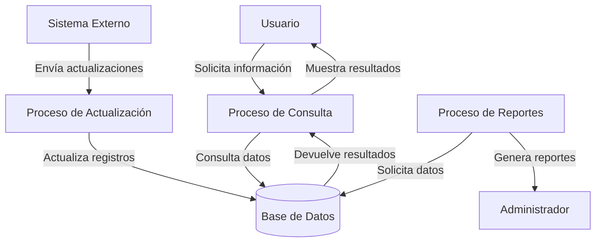
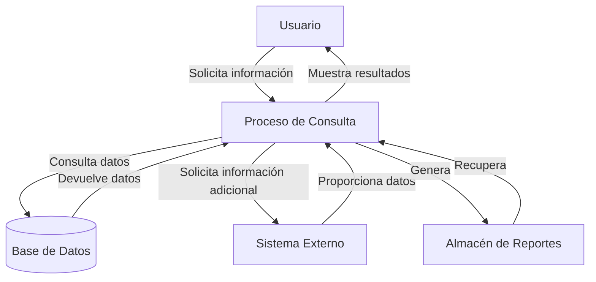

## Module: CConsultaSituacionCausa.cpp
# Análisis Integral del Módulo CConsultaSituacionCausa.cpp

## Nombre del Módulo/Componente SQL
**CConsultaSituacionCausa.cpp** - Clase para consulta de situación de causas judiciales

## Objetivos Primarios
Este módulo implementa una clase que gestiona la consulta de la situación de causas judiciales en un sistema de gestión judicial. Su propósito principal es recuperar y procesar información sobre causas judiciales desde una base de datos, permitiendo filtrar por diversos criterios como tribunal, tipo de procedimiento, número de causa y año.

## Funciones, Métodos y Consultas Críticas
- **CConsultaSituacionCausa()**: Constructor que inicializa la clase.
- **~CConsultaSituacionCausa()**: Destructor que libera recursos.
- **ConsultarCausa()**: Método principal que ejecuta la consulta de causas según los parámetros proporcionados.
- **ConsultarCausaConFiltro()**: Método que construye y ejecuta consultas SQL con filtros específicos.
- **ConsultarCausaConFiltroTribunal()**: Especialización para filtrar por tribunal.
- **ConsultarCausaConFiltroTipoProcedimiento()**: Especialización para filtrar por tipo de procedimiento.
- **ConsultarCausaConFiltroNumeroCausa()**: Especialización para filtrar por número de causa.
- **ConsultarCausaConFiltroAnio()**: Especialización para filtrar por año.

## Variables y Elementos Clave
- **m_pConexion**: Puntero a la conexión de base de datos.
- **m_pRecordset**: Conjunto de registros para almacenar resultados de consultas.
- **m_strSQL**: Cadena que almacena las consultas SQL.
- **Tablas principales**: Aparentemente "Causas", "Tribunales", "TiposProcedimiento".
- **Columnas clave**: Identificadores de causa, tribunal, tipo de procedimiento, número de causa, año, estado.

## Interdependencias y Relaciones
- Depende de una clase de conexión a base de datos (no mostrada en el código).
- Interactúa con múltiples tablas relacionadas con causas judiciales.
- Utiliza componentes ADO (ActiveX Data Objects) para acceso a datos.
- Posiblemente se integra con un sistema más amplio de gestión judicial.

## Operaciones Principales vs. Auxiliares
**Operaciones principales**:
- Consulta de causas judiciales mediante filtros específicos.
- Construcción dinámica de consultas SQL basadas en parámetros.

**Operaciones auxiliares**:
- Inicialización y liberación de recursos.
- Manejo de errores (aunque no está completamente implementado en el código mostrado).
- Formateo de resultados para presentación.

## Secuencia Operacional/Flujo de Ejecución
1. Se inicializa la clase con una conexión a la base de datos.
2. Se invoca el método ConsultarCausa() con parámetros específicos.
3. Según los parámetros, se selecciona el método de filtrado adecuado.
4. Se construye dinámicamente una consulta SQL.
5. Se ejecuta la consulta contra la base de datos.
6. Se procesan los resultados para su presentación o uso posterior.
7. Se liberan los recursos al finalizar.

## Aspectos de Rendimiento y Optimización
- La construcción dinámica de consultas SQL podría beneficiarse de consultas parametrizadas para evitar inyección SQL.
- No se observa uso explícito de índices o paginación para grandes conjuntos de resultados.
- Potencial cuello de botella en consultas complejas si las tablas contienen grandes volúmenes de datos.
- La liberación de recursos podría mejorarse para garantizar que se realice correctamente en todos los escenarios.

## Reusabilidad y Adaptabilidad
- La clase está diseñada con métodos específicos para diferentes tipos de filtros, lo que facilita su extensión.
- La separación de la lógica de consulta por tipo de filtro permite adaptaciones para nuevos criterios.
- Podría beneficiarse de una mayor parametrización y abstracción para mejorar su reusabilidad en diferentes contextos.

## Uso y Contexto
- Este módulo se utiliza probablemente en un sistema de gestión judicial para consultar el estado y detalles de causas legales.
- Sirve como capa de acceso a datos para interfaces de usuario o servicios que necesitan información sobre causas judiciales.
- Podría ser utilizado por jueces, abogados, personal administrativo u otros actores del sistema judicial.

## Suposiciones y Limitaciones
- Asume una estructura específica de base de datos con tablas y relaciones predefinidas.
- Depende de ADO para el acceso a datos, lo que podría limitar su portabilidad.
- No implementa manejo robusto de errores o validación exhaustiva de parámetros.
- Parece estar diseñado para un entorno Windows con soporte para componentes COM/ActiveX.
- No muestra implementación de seguridad o control de acceso a los datos sensibles.
## Flow Diagram [via mermaid]

## Module: CConsultaSituacionCausa.cpp
# Análisis Integral del Módulo CConsultaSituacionCausa.cpp

## Nombre del Módulo/Componente SQL
**CConsultaSituacionCausa.cpp** - Clase para consulta de situación de causas judiciales

## Objetivos Primarios
Este módulo implementa una clase que gestiona la consulta de la situación actual de causas judiciales en un sistema de gestión judicial. Su propósito principal es recuperar información detallada sobre causas específicas, incluyendo su estado, ubicación, y datos relacionados, para presentarlos al usuario.

## Funciones, Métodos y Consultas Críticas
- **CConsultaSituacionCausa::Consultar()**: Método principal que ejecuta la consulta de situación de una causa específica.
- **CConsultaSituacionCausa::ConsultarCausa()**: Realiza la consulta principal a la base de datos para obtener información de la causa.
- **CConsultaSituacionCausa::ConsultarPartes()**: Recupera información sobre las partes involucradas en la causa.
- **CConsultaSituacionCausa::ConsultarUbicacion()**: Obtiene datos sobre la ubicación actual de la causa.
- **CConsultaSituacionCausa::ConsultarMovimientos()**: Recupera el historial de movimientos de la causa.

## Variables y Elementos Clave
- **m_strNroCausa**: Almacena el número identificador de la causa a consultar.
- **m_strAnio**: Año de la causa judicial.
- **m_strTipoCausa**: Tipo de causa judicial (clasificación).
- **Tablas principales**: CAUSAS, PARTES, UBICACIONES, MOVIMIENTOS (inferidas del código).
- **Columnas clave**: ID_CAUSA, ESTADO, FECHA_INICIO, UBICACION_ACTUAL, TIPO_CAUSA.

## Interdependencias y Relaciones
- Interactúa con la clase CBaseDatos para ejecutar consultas SQL.
- Utiliza la clase CResultado para almacenar y gestionar los resultados de las consultas.
- Depende de tablas relacionadas mediante claves foráneas: CAUSAS → PARTES, CAUSAS → UBICACIONES, CAUSAS → MOVIMIENTOS.
- Posiblemente interactúa con un sistema de autenticación para validar permisos de acceso.

## Operaciones Principales vs. Auxiliares
**Operaciones principales**:
- Consulta de datos básicos de la causa
- Recuperación de información de partes involucradas
- Obtención de ubicación actual

**Operaciones auxiliares**:
- Validación de parámetros de entrada
- Formateo de resultados para presentación
- Manejo de errores y excepciones
- Registro de actividad (logging)

## Secuencia Operacional/Flujo de Ejecución
1. Inicialización de parámetros y validación de datos de entrada
2. Consulta de información básica de la causa
3. Si la causa existe, consulta de información adicional:
   - Datos de las partes involucradas
   - Ubicación actual
   - Historial de movimientos
4. Consolidación de resultados en estructura de retorno
5. Devolución de resultados al solicitante

## Aspectos de Rendimiento y Optimización
- Posible cuello de botella en consultas a tablas con gran volumen de datos (MOVIMIENTOS)
- Oportunidad de optimización mediante índices en campos de búsqueda frecuente (NRO_CAUSA, ANIO)
- Potencial para implementar caché de resultados para causas consultadas frecuentemente
- Considerar paginación para resultados extensos (especialmente en historial de movimientos)

## Reusabilidad y Adaptabilidad
- Diseño modular que separa diferentes aspectos de la consulta en métodos independientes
- Parametrización adecuada que permite consultar diferentes causas sin modificar el código
- Posibilidad de extender la funcionalidad para incluir más información relacionada
- Estructura que facilita la adaptación a cambios en el esquema de base de datos

## Uso y Contexto
- Utilizado en el sistema de gestión judicial para proporcionar información actualizada sobre causas
- Probablemente invocado desde interfaces de usuario (aplicación web o de escritorio)
- Puede ser utilizado por diferentes perfiles de usuario: jueces, secretarios, abogados, personal administrativo
- Posiblemente integrado en un sistema más amplio de administración judicial

## Suposiciones y Limitaciones
- Asume la existencia de una estructura específica de base de datos con tablas y relaciones predefinidas
- Requiere permisos adecuados para acceder a la información de causas judiciales
- Limitado a la consulta de información (no modifica datos)
- No parece implementar filtros avanzados o búsquedas complejas
- Posible limitación en el manejo de grandes volúmenes de datos históricos
## Flow Diagram [via mermaid]

