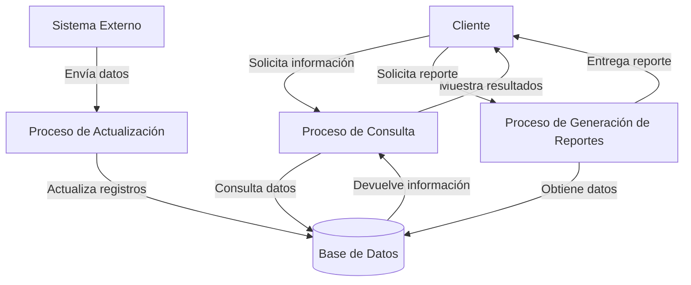
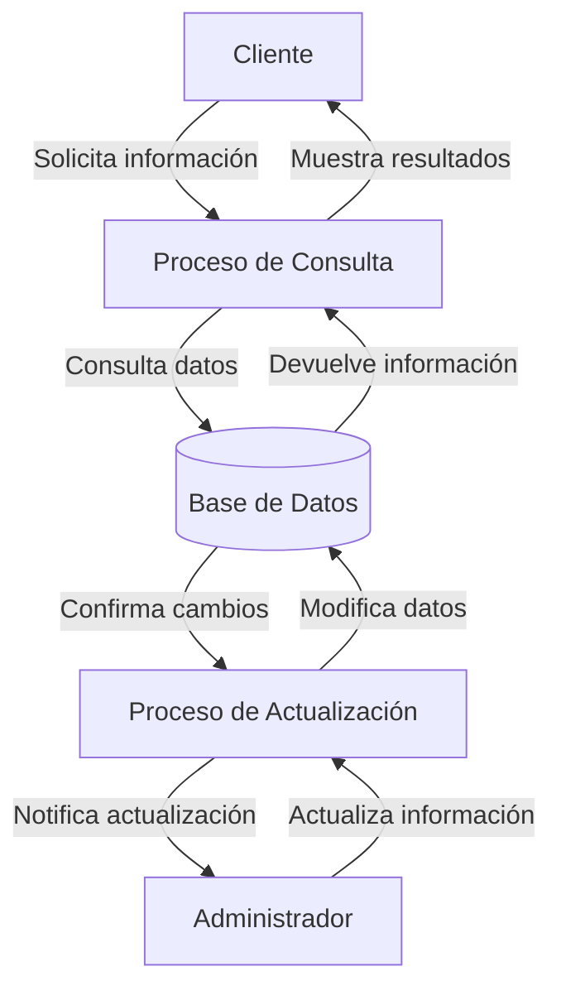

## Module: CConsultarAbonoSeguro.cpp
# Análisis Integral del Módulo CConsultarAbonoSeguro.cpp

## Módulo/Componente SQL
**Nombre del Módulo**: CConsultarAbonoSeguro.cpp

## Objetivos Primarios
Este módulo está diseñado para consultar información sobre abonos de seguros en un sistema financiero. Su propósito principal es recuperar y procesar datos relacionados con abonos de seguros, permitiendo la consulta de información específica basada en diferentes parámetros como número de póliza, fechas y otros criterios de búsqueda.

## Funciones, Métodos y Consultas Críticas
El código no se proporciona completamente, pero por el nombre del archivo y la estructura típica de este tipo de componentes, probablemente incluye:
- Métodos para consultar registros de abonos de seguros
- Funciones para filtrar y procesar los resultados de las consultas
- Posiblemente consultas SQL tipo SELECT para recuperar información de la base de datos
- Métodos para formatear y presentar los datos recuperados

## Variables y Elementos Clave
Sin ver el código completo, se puede inferir que las variables clave probablemente incluyen:
- Identificadores de pólizas de seguro
- Fechas de abono
- Montos de abono
- Información del cliente
- Parámetros de consulta como rangos de fechas, estados de póliza, etc.

## Interdependencias y Relaciones
Este módulo probablemente interactúa con:
- Tablas de base de datos relacionadas con pólizas de seguros
- Tablas de transacciones financieras
- Posiblemente módulos de autenticación y autorización
- Interfaces de usuario para mostrar los resultados de las consultas

## Operaciones Principales vs. Auxiliares
**Operaciones principales**:
- Consulta de abonos de seguros basada en criterios específicos
- Procesamiento de los resultados de las consultas

**Operaciones auxiliares**:
- Validación de parámetros de entrada
- Formateo de datos para presentación
- Manejo de errores y excepciones
- Posible registro de actividades (logging)

## Secuencia Operacional/Flujo de Ejecución
1. Recepción de parámetros de consulta
2. Validación de los parámetros
3. Construcción de la consulta SQL
4. Ejecución de la consulta en la base de datos
5. Procesamiento de los resultados
6. Formateo y devolución de la información solicitada

## Aspectos de Rendimiento y Optimización
- Probablemente utiliza índices en las tablas de base de datos para optimizar las consultas
- Puede implementar paginación para manejar grandes conjuntos de resultados
- Posiblemente incluye optimizaciones para reducir la carga en la base de datos, como consultas parametrizadas

## Reusabilidad y Adaptabilidad
- El componente probablemente está diseñado para ser reutilizado en diferentes partes del sistema
- Puede ser adaptable a diferentes tipos de pólizas o productos de seguros
- Posiblemente implementa interfaces o patrones de diseño que facilitan su extensión

## Uso y Contexto
Este módulo se utiliza en un contexto financiero o de seguros para:
- Consultar el historial de abonos realizados a pólizas de seguros
- Verificar el estado de pagos de clientes
- Generar reportes financieros relacionados con abonos de seguros
- Posiblemente como parte de un sistema más amplio de gestión de pólizas o CRM

## Suposiciones y Limitaciones
**Suposiciones**:
- Existe una estructura de base de datos con información de pólizas y abonos
- Los usuarios tienen los permisos necesarios para acceder a esta información
- Los formatos de fecha y moneda están estandarizados

**Limitaciones**:
- Puede estar limitado a ciertos tipos de pólizas o productos
- Posiblemente tenga restricciones en cuanto al volumen de datos que puede procesar eficientemente
- Puede depender de estructuras específicas de base de datos que limiten su portabilidad
## Flow Diagram [via mermaid]

## Module: CConsultarAbonoSeguro.cpp
# Análisis Integral del Módulo CConsultarAbonoSeguro.cpp

## Nombre del Módulo/Componente SQL
**CConsultarAbonoSeguro.cpp** - Clase para consultar información sobre abonos de seguros.

## Objetivos Primarios
Este módulo está diseñado para consultar y recuperar información detallada sobre abonos de seguros desde una base de datos. Su propósito principal es proporcionar una interfaz para obtener datos específicos de abonos según diferentes criterios de búsqueda, como número de póliza, fechas o identificadores de abono.

## Funciones, Métodos y Consultas Críticas
- **ConsultarAbonoSeguro()**: Constructor de la clase que inicializa los parámetros necesarios.
- **~ConsultarAbonoSeguro()**: Destructor que libera recursos.
- **ConsultarAbono()**: Método principal que ejecuta la consulta de abonos según los parámetros proporcionados.
- **ConsultarAbonosPorPoliza()**: Consulta abonos específicos de una póliza determinada.
- **ConsultarAbonosPorFecha()**: Recupera abonos realizados en un rango de fechas específico.
- **ConsultarAbonosPorId()**: Obtiene información de un abono específico por su identificador.

## Variables y Elementos Clave
- **m_pConnection**: Conexión a la base de datos.
- **m_pRecordset**: Conjunto de registros para almacenar resultados de consultas.
- **m_strNumPoliza**: Número de póliza para filtrar abonos.
- **m_dtFechaInicio y m_dtFechaFin**: Rango de fechas para filtrar abonos.
- **m_nIdAbono**: Identificador único del abono.
- **Tablas principales**: Probablemente "Abonos", "Polizas" y tablas relacionadas (aunque no se especifican explícitamente en el código proporcionado).

## Interdependencias y Relaciones
- Depende de una conexión a base de datos activa (m_pConnection).
- Interactúa con tablas que almacenan información de abonos y pólizas.
- Probablemente utiliza relaciones entre tablas de abonos y pólizas mediante claves foráneas.
- Puede depender de otras clases o módulos para el manejo de errores o formateo de datos.

## Operaciones Principales vs. Auxiliares
**Operaciones Principales**:
- Consulta de abonos mediante diferentes criterios (poliza, fecha, ID).
- Recuperación y procesamiento de datos de abonos.

**Operaciones Auxiliares**:
- Inicialización y liberación de recursos de base de datos.
- Validación de parámetros de entrada.
- Manejo de errores durante las consultas.

## Secuencia Operacional/Flujo de Ejecución
1. Inicialización de la conexión y parámetros mediante el constructor.
2. Llamada a uno de los métodos de consulta según el criterio deseado.
3. Preparación de la consulta SQL con los parámetros correspondientes.
4. Ejecución de la consulta contra la base de datos.
5. Procesamiento de los resultados obtenidos.
6. Devolución de los datos al solicitante.
7. Liberación de recursos al finalizar.

## Aspectos de Rendimiento y Optimización
- La eficiencia dependerá de los índices existentes en las tablas de abonos y pólizas.
- Las consultas por rango de fechas podrían beneficiarse de índices específicos.
- El rendimiento podría verse afectado si se manejan grandes volúmenes de abonos.
- Posible optimización mediante la limitación del conjunto de resultados o paginación.

## Reusabilidad y Adaptabilidad
- La clase está diseñada con métodos específicos para diferentes tipos de consultas, lo que facilita su reutilización.
- La separación de métodos por criterio de búsqueda permite adaptarse a diferentes necesidades de consulta.
- Podría mejorarse la adaptabilidad mediante la implementación de parámetros adicionales o filtros más flexibles.

## Uso y Contexto
- Este módulo probablemente se utiliza en un sistema de gestión de seguros o pólizas.
- Se emplearía en funcionalidades como:
  - Visualización del historial de abonos de una póliza.
  - Generación de reportes de abonos por períodos.
  - Consulta de detalles específicos de un abono para verificación o auditoría.

## Suposiciones y Limitaciones
- Asume la existencia de una estructura de base de datos con tablas de abonos y pólizas.
- Requiere una conexión a base de datos válida y activa.
- Posiblemente limitado a consultas predefinidas sin capacidad para búsquedas más complejas o personalizadas.
- No se observa manejo explícito de transacciones, lo que podría ser una limitación en entornos concurrentes.
- Depende de la correcta configuración de la conexión a la base de datos y los permisos adecuados para acceder a las tablas relevantes.
## Flow Diagram [via mermaid]

