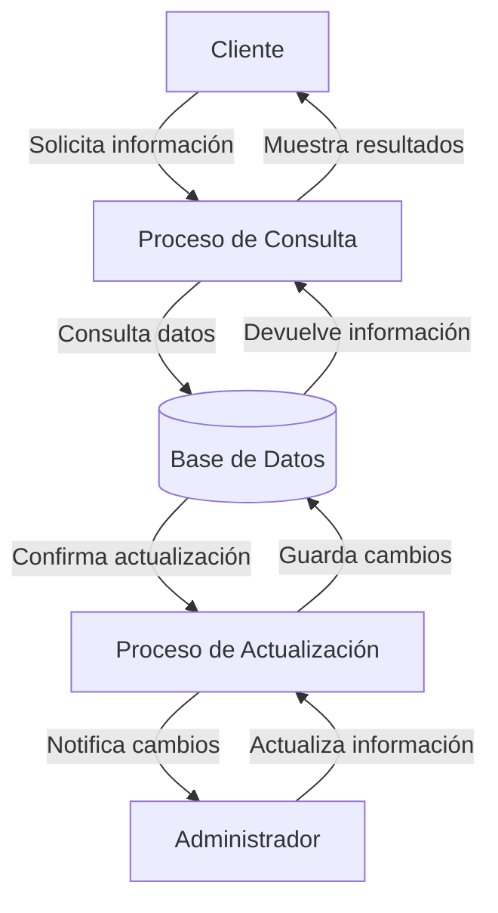

## Module: CConsultarAbonoSeguro2.cpp
# Análisis Integral del Módulo CConsultarAbonoSeguro2.cpp

## Nombre del Módulo/Componente SQL
CConsultarAbonoSeguro2.cpp - Clase para consulta de abonos de seguros

## Objetivos Primarios
Este módulo implementa una clase que gestiona la consulta de información relacionada con abonos de seguros. Su propósito principal es recuperar datos de abonos de seguros desde una base de datos, aplicar filtros específicos y formatear los resultados para su presentación o procesamiento posterior.

## Funciones, Métodos y Consultas Críticas
- **CConsultarAbonoSeguro2()**: Constructor que inicializa la clase.
- **~CConsultarAbonoSeguro2()**: Destructor que libera recursos.
- **ConsultarAbonoSeguro()**: Método principal que ejecuta la consulta de abonos de seguros con parámetros específicos.
- **ConsultarAbonoSeguroDetalle()**: Consulta detalles específicos de un abono de seguro.
- **ConsultarAbonoSeguroDetalleRamo()**: Consulta información detallada por ramo de seguro.
- **ConsultarAbonoSeguroDetalleRamoPoliza()**: Consulta información detallada por ramo y póliza.

## Variables y Elementos Clave
- **m_pDb**: Puntero a la conexión de base de datos.
- **m_pLog**: Puntero al sistema de registro (logging).
- **Parámetros de consulta**: Incluyen identificadores de abonos, fechas, números de póliza, y otros filtros.
- **Tablas principales**: Aunque no se especifican directamente, se infiere el uso de tablas relacionadas con abonos, seguros, pólizas y ramos.

## Interdependencias y Relaciones
- Depende de un sistema de base de datos externo (a través de m_pDb).
- Utiliza un sistema de registro para documentar operaciones y errores (m_pLog).
- Interactúa con múltiples tablas relacionadas con seguros, abonos, pólizas y posiblemente clientes.
- Probablemente forma parte de un sistema más amplio de gestión de seguros.

## Operaciones Principales vs. Auxiliares
- **Operaciones principales**: Las consultas de abonos de seguros y sus detalles.
- **Operaciones auxiliares**: Validación de parámetros, formateo de resultados, manejo de errores y registro de actividades.

## Secuencia Operacional/Flujo de Ejecución
1. Inicialización de la clase con conexión a base de datos y sistema de registro.
2. Recepción de parámetros de consulta.
3. Validación de parámetros (implícita).
4. Construcción y ejecución de consultas SQL.
5. Procesamiento de resultados.
6. Formateo y devolución de datos al solicitante.
7. Registro de la operación y posibles errores.

## Aspectos de Rendimiento y Optimización
- La eficiencia dependerá de la estructura de las consultas SQL subyacentes.
- Potenciales cuellos de botella podrían ocurrir en consultas complejas con múltiples joins.
- La optimización podría enfocarse en el uso adecuado de índices en las tablas consultadas.
- El manejo de grandes conjuntos de resultados podría requerir paginación o limitación de registros.

## Reusabilidad y Adaptabilidad
- La clase parece estar diseñada específicamente para consultas de abonos de seguros.
- La adaptabilidad para otros tipos de consultas requeriría modificaciones significativas.
- La parametrización de las consultas permite cierta flexibilidad en los criterios de búsqueda.

## Uso y Contexto
- Este módulo se utiliza probablemente en un sistema de gestión de seguros para:
  - Visualizar información de abonos realizados.
  - Generar reportes de abonos por diferentes criterios.
  - Verificar el estado de pagos de pólizas.
  - Analizar información financiera relacionada con seguros.

## Suposiciones y Limitaciones
- **Suposiciones**:
  - Existe una estructura de base de datos específica con tablas relacionadas con seguros.
  - Los parámetros de entrada están correctamente formateados.
  - La conexión a la base de datos está disponible y funcional.
  
- **Limitaciones**:
  - La funcionalidad está restringida a consultas (no modifica datos).
  - Depende de la estructura específica de la base de datos.
  - Posiblemente limitado a un tipo específico de seguros o sistema.
  - El rendimiento podría degradarse con grandes volúmenes de datos si las consultas no están optimizadas.
## Flow Diagram [via mermaid]

