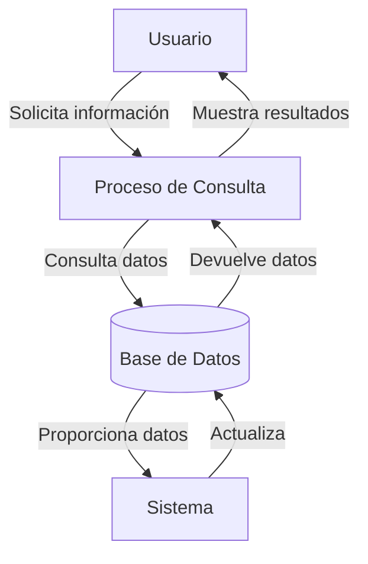

## Module: CConsultarBeneficiario.cpp
# Análisis Integral del Módulo CConsultarBeneficiario.cpp

## Nombre del Módulo/Componente SQL
CConsultarBeneficiario.cpp - Clase para consulta de beneficiarios en un sistema de gestión.

## Objetivos Primarios
Este módulo está diseñado para gestionar la consulta de información de beneficiarios en un sistema, permitiendo la búsqueda y recuperación de datos de beneficiarios según diferentes criterios como número de documento, tipo de documento y otros parámetros. El componente maneja la lógica de negocio para la consulta de beneficiarios y la interacción con la base de datos.

## Funciones, Métodos y Consultas Críticas
- **CConsultarBeneficiario::ConsultarBeneficiario()**: Método principal que ejecuta la consulta de beneficiarios basada en parámetros específicos.
- **CConsultarBeneficiario::ConsultarBeneficiarioXDocumento()**: Método especializado para consultar beneficiarios por número y tipo de documento.
- **CConsultarBeneficiario::ConsultarBeneficiarioXNombre()**: Método para buscar beneficiarios por nombre.
- **CConsultarBeneficiario::ConsultarBeneficiarioXApellido()**: Método para buscar beneficiarios por apellido.
- **CConsultarBeneficiario::ConsultarBeneficiarioXFechaNacimiento()**: Método para buscar beneficiarios por fecha de nacimiento.

## Variables y Elementos Clave
- **m_strNumeroDocumento**: Variable para almacenar el número de documento del beneficiario.
- **m_strTipoDocumento**: Variable para el tipo de documento.
- **m_strNombre**: Variable para el nombre del beneficiario.
- **m_strApellido**: Variable para el apellido del beneficiario.
- **m_strFechaNacimiento**: Variable para la fecha de nacimiento.
- **m_strSql**: Variable que almacena las consultas SQL a ejecutar.
- **m_ptrRecordSet**: Puntero al conjunto de registros resultante de las consultas.

## Interdependencias y Relaciones
- El módulo interactúa con una base de datos a través de consultas SQL.
- Depende de la clase CConexion para establecer y gestionar la conexión a la base de datos.
- Utiliza la clase CRecordSet para manejar los resultados de las consultas.
- Se relaciona con tablas de beneficiarios y posiblemente con tablas relacionadas como tipos de documentos.

## Operaciones Principales vs. Auxiliares
- **Operaciones Principales**: 
  - Consulta de beneficiarios por diferentes criterios
  - Procesamiento de resultados de consultas
- **Operaciones Auxiliares**:
  - Validación de parámetros de entrada
  - Formateo de consultas SQL
  - Manejo de errores y excepciones

## Secuencia Operacional/Flujo de Ejecución
1. Recepción de parámetros de búsqueda (documento, nombre, etc.)
2. Validación de los parámetros recibidos
3. Construcción de la consulta SQL apropiada según los criterios
4. Ejecución de la consulta contra la base de datos
5. Procesamiento de los resultados obtenidos
6. Devolución de los datos del beneficiario o lista de beneficiarios

## Aspectos de Rendimiento y Optimización
- Las consultas SQL podrían optimizarse mediante el uso adecuado de índices en las columnas de búsqueda frecuente (número de documento, nombre, apellido).
- La construcción dinámica de consultas SQL podría mejorarse para evitar problemas de rendimiento con grandes volúmenes de datos.
- Se podría implementar paginación para consultas que devuelvan muchos registros.

## Reusabilidad y Adaptabilidad
- El módulo está diseñado con métodos específicos para diferentes tipos de consultas, lo que facilita su reutilización.
- La separación de la lógica de consulta por criterios específicos permite adaptar fácilmente el código para nuevos requisitos.
- La parametrización de las consultas permite flexibilidad en los criterios de búsqueda.

## Uso y Contexto
- Este módulo se utiliza en un sistema de gestión para consultar información de beneficiarios.
- Es probable que sea parte de un sistema más amplio que incluye registro, actualización y eliminación de beneficiarios.
- Se utiliza en escenarios donde es necesario recuperar información detallada de beneficiarios para su visualización o procesamiento posterior.

## Suposiciones y Limitaciones
- Se asume la existencia de una estructura de base de datos específica con tablas de beneficiarios.
- El módulo parece estar diseñado para un entorno Windows con acceso a bases de datos relacionales.
- Podría tener limitaciones en cuanto a la gestión de grandes volúmenes de datos si no se implementan técnicas de paginación.
- No se observa manejo explícito de concurrencia, lo que podría ser una limitación en entornos multiusuario.
## Flow Diagram [via mermaid]

