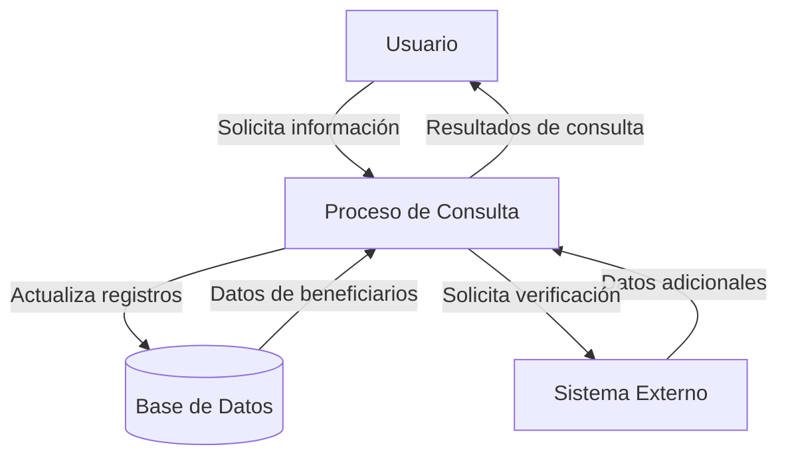

## Module: CConsultarBeneficiariosSeguroTemp.cpp
# Análisis Integral del Módulo CConsultarBeneficiariosSeguroTemp.cpp

## Nombre del Módulo/Componente SQL
CConsultarBeneficiariosSeguroTemp.cpp - Clase para consulta de beneficiarios de seguros temporales

## Objetivos Primarios
Este módulo implementa una clase que gestiona la consulta de beneficiarios asociados a seguros temporales en un sistema de seguros. Su propósito principal es recuperar, procesar y presentar información detallada sobre los beneficiarios de pólizas de seguro temporales, incluyendo sus datos personales y los porcentajes de beneficio asignados.

## Funciones, Métodos y Consultas Críticas
- **CConsultarBeneficiariosSeguroTemp::Execute()**: Método principal que ejecuta la consulta de beneficiarios.
- **CConsultarBeneficiariosSeguroTemp::ConsultarBeneficiarios()**: Realiza la consulta SQL para obtener los beneficiarios.
- **CConsultarBeneficiariosSeguroTemp::ConsultarBeneficiariosSeguroTemp()**: Constructor de la clase.
- **CConsultarBeneficiariosSeguroTemp::~ConsultarBeneficiariosSeguroTemp()**: Destructor de la clase.
- **Consulta SQL principal**: Utiliza SELECT para recuperar información detallada de beneficiarios desde múltiples tablas relacionadas.

## Variables y Elementos Clave
- **Tablas**: 
  - BENEFICIARIOS_SEGURO_TEMP
  - PERSONAS
  - TIPOS_IDENTIFICACION
  - PARENTESCOS
- **Columnas críticas**: 
  - ID_BENEFICIARIO
  - ID_PERSONA
  - PORCENTAJE_BENEFICIO
  - NOMBRE, APELLIDO1, APELLIDO2
  - IDENTIFICACION
  - DESCRIPCION (de tipos de identificación y parentescos)
- **Parámetros**: 
  - m_nIdSeguroTemp: Identificador del seguro temporal
  - m_nIdPersona: Identificador de la persona asegurada

## Interdependencias y Relaciones
- Relación entre BENEFICIARIOS_SEGURO_TEMP y PERSONAS para obtener datos personales de los beneficiarios.
- Relación con TIPOS_IDENTIFICACION para obtener descripciones de los tipos de identificación.
- Relación con PARENTESCOS para obtener descripciones de los tipos de parentesco.
- Dependencia de la clase base CDBBaseObject para funcionalidades de acceso a base de datos.

## Operaciones Principales vs. Auxiliares
- **Operaciones principales**:
  - Consulta SQL para recuperar beneficiarios
  - Procesamiento de resultados de la consulta
- **Operaciones auxiliares**:
  - Inicialización de variables
  - Manejo de errores
  - Liberación de recursos

## Secuencia Operacional/Flujo de Ejecución
1. Inicialización de la consulta y variables
2. Construcción de la consulta SQL con los parámetros recibidos
3. Ejecución de la consulta a la base de datos
4. Procesamiento de los resultados obtenidos
5. Almacenamiento de los datos en estructuras para su uso posterior
6. Liberación de recursos y finalización

## Aspectos de Rendimiento y Optimización
- La consulta utiliza múltiples JOIN que podrían afectar el rendimiento si las tablas contienen grandes volúmenes de datos.
- Se recomienda verificar la existencia de índices adecuados en las columnas ID_PERSONA, ID_BENEFICIARIO y otras columnas utilizadas en las condiciones JOIN.
- La consulta filtra por ID_SEGURO_TEMP, lo que debería estar optimizado con un índice apropiado.

## Reusabilidad y Adaptabilidad
- La clase está diseñada específicamente para consultar beneficiarios de seguros temporales, lo que limita su reusabilidad directa.
- Sin embargo, el patrón de diseño utilizado podría adaptarse para consultas similares en otros contextos.
- La parametrización mediante m_nIdSeguroTemp y m_nIdPersona permite cierta flexibilidad en su uso.

## Uso y Contexto
- Este módulo se utiliza en el contexto de un sistema de gestión de seguros para mostrar información de beneficiarios asociados a pólizas temporales.
- Probablemente se invoca desde interfaces de usuario o reportes que necesitan presentar información detallada sobre beneficiarios.
- Forma parte de un sistema más amplio de gestión de seguros y personas.

## Suposiciones y Limitaciones
- Asume la existencia y estructura específica de las tablas mencionadas en la base de datos.
- Presupone que los identificadores de seguro temporal y persona son válidos al momento de la consulta.
- No parece incluir validaciones exhaustivas de los datos recuperados.
- Está limitado a consultar beneficiarios de seguros temporales y no maneja otros tipos de seguros o beneficiarios.
## Flow Diagram [via mermaid]

