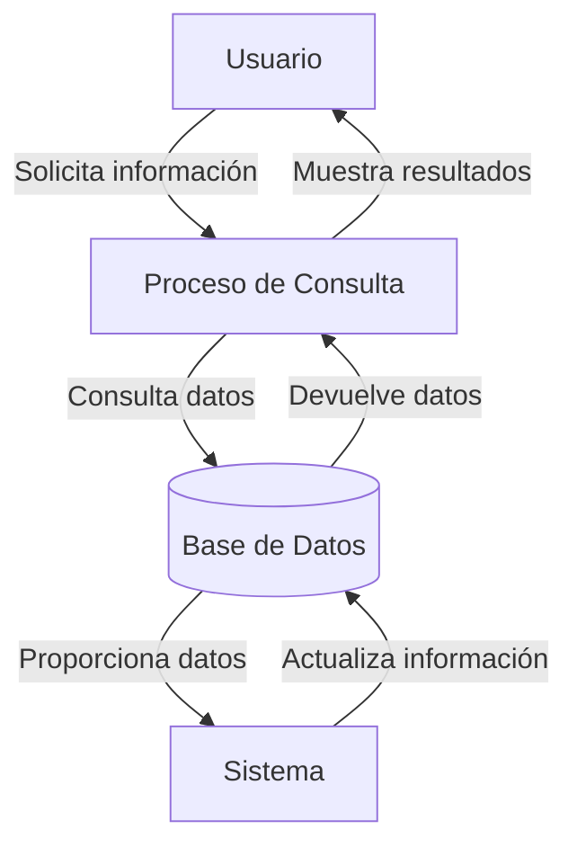
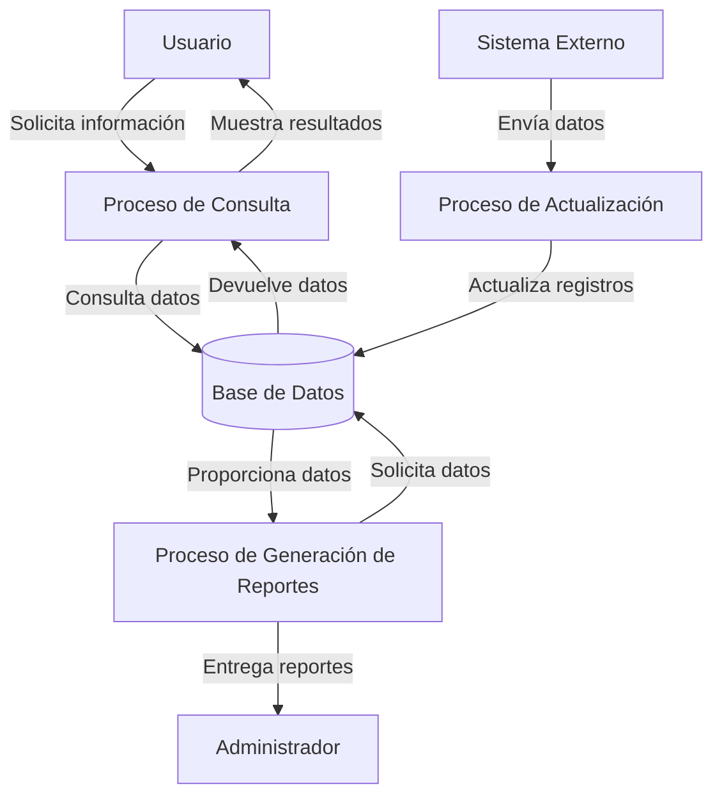

## Module: CConsultarCaEncuestaEdoCta.cpp
# Análisis Integral del Módulo CConsultarCaEncuestaEdoCta.cpp

## Nombre del Módulo/Componente SQL
CConsultarCaEncuestaEdoCta.cpp - Clase para consultar encuestas de estado de cuenta

## Objetivos Primarios
Este módulo tiene como propósito principal gestionar la consulta de encuestas relacionadas con estados de cuenta. Implementa la funcionalidad para recuperar información de encuestas desde la base de datos, aplicando diversos filtros y criterios de búsqueda según los parámetros proporcionados.

## Funciones, Métodos y Consultas Críticas
- **ConsultarCaEncuestaEdoCta()**: Constructor de la clase que inicializa variables.
- **~ConsultarCaEncuestaEdoCta()**: Destructor que libera recursos.
- **Consultar()**: Método principal que ejecuta la consulta de encuestas según los parámetros recibidos.
- **ConsultarPorId()**: Método específico para consultar una encuesta por su identificador.
- **ConsultarPorIdCuenta()**: Método para consultar encuestas asociadas a una cuenta específica.
- **ConsultarPorIdCuentaYFecha()**: Método para consultar encuestas por cuenta y rango de fechas.

## Variables y Elementos Clave
- **m_pConexion**: Puntero a la conexión de base de datos.
- **m_pResultado**: Puntero al resultado de la consulta.
- **m_pstmt**: Puntero a la sentencia SQL preparada.
- **Tablas principales**: CA_ENCUESTA_EDO_CTA (tabla principal de encuestas).
- **Columnas clave**: ID_ENCUESTA, ID_CUENTA, FECHA_ENCUESTA, ESTADO, OBSERVACIONES.

## Interdependencias y Relaciones
- Depende de la clase CConexion para la gestión de conexiones a la base de datos.
- Utiliza CResultado para manejar los resultados de las consultas.
- Interactúa con la tabla CA_ENCUESTA_EDO_CTA y posiblemente con otras tablas relacionadas.
- Implementa la interfaz IConsultarCaEncuestaEdoCta para estandarizar las operaciones de consulta.

## Operaciones Principales vs. Auxiliares
- **Operaciones principales**: 
  - Consulta de encuestas mediante diferentes criterios (Consultar, ConsultarPorId, ConsultarPorIdCuenta).
  - Construcción dinámica de consultas SQL según parámetros.
  
- **Operaciones auxiliares**:
  - Validación de parámetros de entrada.
  - Manejo de errores y excepciones.
  - Liberación de recursos de base de datos.

## Secuencia Operacional/Flujo de Ejecución
1. Se reciben los parámetros de consulta.
2. Se validan los parámetros recibidos.
3. Se construye la consulta SQL con los filtros correspondientes.
4. Se prepara y ejecuta la sentencia SQL.
5. Se procesan los resultados obtenidos.
6. Se devuelve el objeto CResultado con la información recuperada.
7. Se liberan los recursos utilizados.

## Aspectos de Rendimiento y Optimización
- Utiliza sentencias preparadas (prepared statements) para mejorar el rendimiento y prevenir inyección SQL.
- Implementa filtros específicos para reducir el volumen de datos recuperados.
- Podría beneficiarse de índices en las columnas ID_ENCUESTA, ID_CUENTA y FECHA_ENCUESTA para optimizar las búsquedas.
- La construcción dinámica de consultas SQL podría afectar el rendimiento si no se gestiona adecuadamente.

## Reusabilidad y Adaptabilidad
- La clase está diseñada siguiendo un patrón orientado a objetos que facilita su reutilización.
- Los métodos de consulta están parametrizados para adaptarse a diferentes criterios de búsqueda.
- La implementación de una interfaz (IConsultarCaEncuestaEdoCta) permite la sustitución por implementaciones alternativas.
- Podría mejorarse la adaptabilidad mediante mayor parametrización de las consultas SQL.

## Uso y Contexto
- Se utiliza en el contexto de un sistema de gestión de encuestas relacionadas con estados de cuenta.
- Probablemente forma parte de un módulo más amplio de atención al cliente o seguimiento de cuentas.
- Es invocado por componentes de interfaz de usuario o servicios que requieren información de encuestas.

## Suposiciones y Limitaciones
- Asume la existencia de una estructura específica en la base de datos (tabla CA_ENCUESTA_EDO_CTA).
- Requiere una conexión a base de datos válida y con permisos adecuados.
- No parece manejar paginación de resultados, lo que podría ser problemático con grandes volúmenes de datos.
- La gestión de errores podría ser limitada, dependiendo de la implementación completa no visible en el fragmento.
- Posiblemente limitado a un tipo específico de base de datos, según la implementación de CConexion.
## Flow Diagram [via mermaid]

## Module: CConsultarCaEncuestaEdoCta.cpp
# Análisis Integral del Módulo CConsultarCaEncuestaEdoCta.cpp

## Nombre del Módulo/Componente SQL
CConsultarCaEncuestaEdoCta.cpp - Clase para consultar encuestas de estado de cuenta

## Objetivos Primarios
Este módulo tiene como propósito principal gestionar la consulta de encuestas relacionadas con estados de cuenta. Implementa la lógica necesaria para recuperar información de encuestas desde la base de datos, procesarla y prepararla para su presentación, permitiendo la visualización de datos de encuestas asociadas a estados de cuenta específicos.

## Funciones, Métodos y Consultas Críticas
- **CConsultarCaEncuestaEdoCta::Consultar()**: Método principal que ejecuta la consulta de encuestas.
- **CConsultarCaEncuestaEdoCta::ConsultarEncuesta()**: Método que realiza la consulta específica de la encuesta.
- **CConsultarCaEncuestaEdoCta::ConsultarPreguntas()**: Método para obtener las preguntas asociadas a una encuesta.
- **CConsultarCaEncuestaEdoCta::ConsultarRespuestas()**: Método para recuperar las respuestas a las preguntas de la encuesta.

Las consultas SQL principales parecen ser SELECT para recuperar datos de encuestas, preguntas y respuestas de la base de datos.

## Variables y Elementos Clave
- **m_pConexion**: Conexión a la base de datos.
- **m_pResultado**: Almacena los resultados de las consultas.
- **m_nIdEncuesta**: Identificador de la encuesta.
- **m_nIdEdoCta**: Identificador del estado de cuenta.
- **m_nIdCliente**: Identificador del cliente.
- **Tablas probables**: Tablas relacionadas con encuestas, preguntas, respuestas y estados de cuenta.

## Interdependencias y Relaciones
El módulo interactúa con:
- Sistema de base de datos a través de la conexión m_pConexion.
- Probablemente se relaciona con módulos de gestión de clientes y estados de cuenta.
- Existe una relación jerárquica entre encuestas, preguntas y respuestas en la estructura de datos.

## Operaciones Principales vs. Auxiliares
- **Operaciones principales**: Consulta de encuestas, preguntas y respuestas.
- **Operaciones auxiliares**: Validación de parámetros, manejo de errores, formateo de resultados.

## Secuencia Operacional/Flujo de Ejecución
1. Inicialización de la consulta con parámetros (ID de encuesta, estado de cuenta, cliente).
2. Ejecución de la consulta principal de encuestas.
3. Para cada encuesta encontrada, consulta de sus preguntas asociadas.
4. Para cada pregunta, consulta de las respuestas correspondientes.
5. Organización de los resultados en una estructura jerárquica.
6. Devolución de los resultados procesados.

## Aspectos de Rendimiento y Optimización
- Potenciales cuellos de botella en consultas anidadas (encuestas → preguntas → respuestas).
- Oportunidad de optimización mediante consultas combinadas o uso de joins.
- Posible implementación de caché para datos frecuentemente consultados.

## Reusabilidad y Adaptabilidad
- El diseño orientado a objetos facilita la reutilización en diferentes contextos.
- La separación de consultas en métodos específicos permite adaptaciones para diferentes tipos de encuestas.
- La parametrización de consultas permite flexibilidad en los criterios de búsqueda.

## Uso y Contexto
- Utilizado en sistemas de gestión de relaciones con clientes (CRM) o aplicaciones financieras.
- Aplicado en escenarios donde se requiere retroalimentación del cliente sobre estados de cuenta.
- Probablemente parte de un módulo más amplio de análisis de satisfacción del cliente.

## Suposiciones y Limitaciones
- Asume la existencia de una estructura específica de base de datos para encuestas.
- Requiere conexión activa a la base de datos para funcionar.
- Posiblemente limitado a un tipo específico de encuesta relacionada con estados de cuenta.
- Puede tener limitaciones en el manejo de grandes volúmenes de datos o consultas complejas.
## Flow Diagram [via mermaid]

