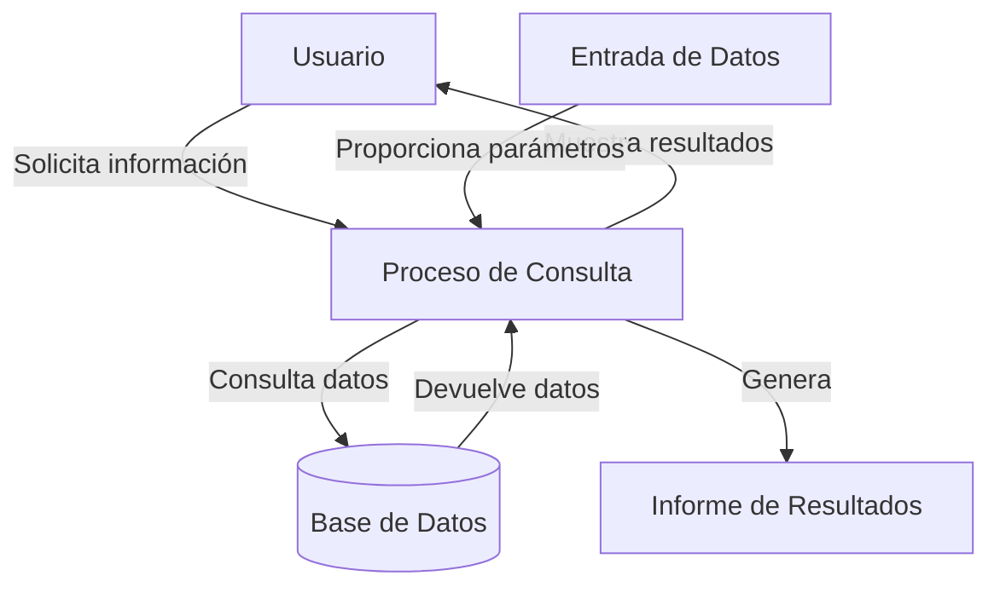

## Module: CConsultarCaTotalEncuesta.cpp
# Análisis Integral del Módulo CConsultarCaTotalEncuesta.cpp

## Nombre del Módulo/Componente SQL
CConsultarCaTotalEncuesta.cpp - Clase para consultar totales de encuestas en un sistema de gestión de calidad.

## Objetivos Primarios
Este módulo está diseñado para realizar consultas específicas sobre los totales de encuestas de calidad en un sistema de gestión. Su propósito principal es recuperar y procesar datos estadísticos relacionados con encuestas, permitiendo filtrar por diferentes criterios como fechas, tipos de encuesta y otros parámetros configurables.

## Funciones, Métodos y Consultas Críticas
- **CConsultarCaTotalEncuesta::Consultar()**: Método principal que ejecuta la consulta SQL para obtener los totales de encuestas según los filtros aplicados.
- **CConsultarCaTotalEncuesta::ConsultarDetalle()**: Método para obtener detalles específicos de las encuestas.
- **CConsultarCaTotalEncuesta::ConsultarDetalleEncuesta()**: Método especializado para consultar información detallada de una encuesta específica.
- **Consultas SQL principales**: Utiliza principalmente consultas SELECT complejas con múltiples JOIN para recuperar datos agregados de encuestas.

## Variables y Elementos Clave
- **Tablas principales**: CA_ENCUESTA, CA_ENCUESTA_DETALLE, CA_TIPO_ENCUESTA
- **Columnas críticas**: id_encuesta, id_tipo_encuesta, fecha_encuesta, valor, estado
- **Parámetros importantes**: m_strFechaInicio, m_strFechaFin, m_nIdTipoEncuesta, m_nIdEncuesta
- **Variables de control**: m_bSoloActivos, m_bMostrarTotales

## Interdependencias y Relaciones
- Relación con tablas de configuración del sistema de calidad
- Dependencia de la estructura de datos de encuestas y sus detalles
- Interacción con el sistema de tipos de encuesta para filtrado
- Posible integración con módulos de reportes o dashboard para visualización de resultados

## Operaciones Core vs. Auxiliares
- **Core**: La construcción y ejecución de consultas SQL para obtener totales y detalles de encuestas
- **Auxiliares**: 
  - Validación de parámetros de entrada
  - Formateo de fechas para consultas
  - Manejo de excepciones y errores
  - Configuración de filtros adicionales según parámetros

## Secuencia Operacional/Flujo de Ejecución
1. Inicialización de parámetros y validación de entradas
2. Construcción dinámica de la consulta SQL según los filtros aplicados
3. Ejecución de la consulta contra la base de datos
4. Procesamiento de resultados y posible agregación de totales
5. Devolución de los datos estructurados al componente solicitante

## Aspectos de Rendimiento y Optimización
- Potenciales cuellos de botella en consultas con múltiples JOIN si las tablas son grandes
- Oportunidad de optimización mediante índices en las columnas de filtrado frecuente
- Posible mejora en la construcción dinámica de consultas para evitar planes de ejecución ineficientes
- Consideración de paginación para conjuntos de resultados grandes

## Reusabilidad y Adaptabilidad
- Diseño modular que permite su uso en diferentes contextos del sistema
- Parametrización flexible que facilita su adaptación a diversos escenarios de consulta
- Posibilidad de extender la funcionalidad para incluir nuevos tipos de filtros o agregaciones

## Uso y Contexto
- Utilizado principalmente en módulos de reportería y análisis de calidad
- Aplicado en dashboards para visualización de KPIs relacionados con encuestas
- Componente clave para la toma de decisiones basada en retroalimentación de encuestas
- Posiblemente integrado en procesos de mejora continua y evaluación de calidad

## Suposiciones y Limitaciones
- Asume una estructura específica de las tablas de encuestas y sus relaciones
- Limitado a los tipos de encuestas definidos en el sistema
- Posibles restricciones de rendimiento con volúmenes muy grandes de datos
- Dependencia de la correcta configuración de los parámetros de filtrado para obtener resultados precisos
- No parece manejar encuestas en múltiples idiomas o con estructuras dinámicas
## Flow Diagram [via mermaid]

