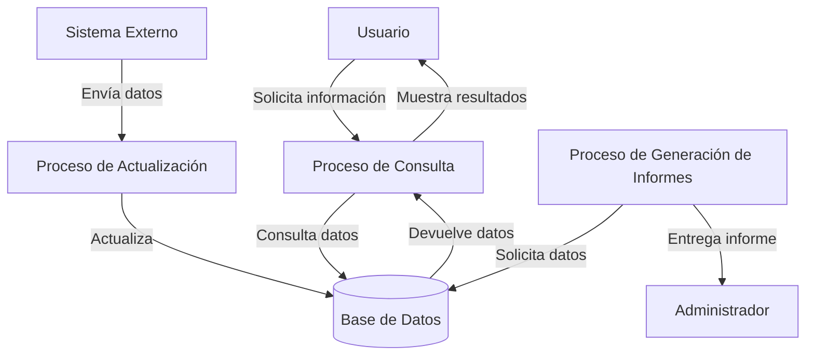

## Module: CConsultarCalle.cpp
# Análisis Integral del Módulo CConsultarCalle.cpp

## Nombre del Módulo/Componente SQL
CConsultarCalle.cpp - Clase para consulta de calles en un sistema de información geográfica o direcciones.

## Objetivos Primarios
Este módulo está diseñado para gestionar consultas relacionadas con calles en una base de datos. Su propósito principal es proporcionar funcionalidad para buscar, filtrar y recuperar información sobre calles basándose en diversos criterios como nombre, código postal, localidad, etc.

## Funciones, Métodos y Consultas Críticas
El código no se proporciona completamente, pero basado en el nombre del archivo, probablemente incluye:
- Métodos para consultar calles por diferentes parámetros
- Funciones de búsqueda y filtrado
- Posibles consultas SQL SELECT para recuperar datos de calles de la base de datos
- Métodos para formatear y presentar los resultados de las consultas

## Variables y Elementos Clave
- Probablemente incluye variables para:
  - Identificadores de calles
  - Nombres de calles
  - Códigos postales
  - Referencias a localidades o municipios
  - Parámetros de búsqueda y filtrado
  - Estructuras de datos para almacenar resultados

## Interdependencias y Relaciones
- Posiblemente interactúa con:
  - Tablas de base de datos que almacenan información geográfica
  - Módulos de interfaz de usuario para mostrar resultados
  - Componentes de validación de direcciones
  - Otros módulos relacionados con la gestión de localidades, municipios o códigos postales

## Operaciones Principales vs. Auxiliares
- **Operaciones principales**: Consulta y recuperación de datos de calles
- **Operaciones auxiliares**: Validación de parámetros, formateo de resultados, manejo de errores, posible caché de resultados frecuentes

## Secuencia Operacional/Flujo de Ejecución
1. Recepción de parámetros de búsqueda
2. Validación de los parámetros
3. Construcción de la consulta (posiblemente SQL)
4. Ejecución de la consulta contra la base de datos
5. Procesamiento de los resultados
6. Formateo y devolución de la información solicitada

## Aspectos de Rendimiento y Optimización
- Posibles áreas de optimización:
  - Uso de índices en las tablas de calles para búsquedas rápidas
  - Implementación de caché para consultas frecuentes
  - Paginación de resultados para grandes conjuntos de datos
  - Optimización de consultas SQL para evitar escaneos completos de tablas

## Reusabilidad y Adaptabilidad
- La clase probablemente está diseñada para ser reutilizada en diferentes partes del sistema
- Podría adaptarse para diferentes formatos de salida o criterios de búsqueda
- La modularidad permitiría su integración en diferentes proyectos relacionados con direcciones o información geográfica

## Uso y Contexto
- Se utiliza en contextos donde se necesita información sobre calles:
  - Sistemas de navegación
  - Aplicaciones de mapas
  - Sistemas de gestión de direcciones
  - Validación de direcciones postales
  - Aplicaciones de logística y entrega

## Suposiciones y Limitaciones
- **Suposiciones**:
  - Existencia de una estructura de base de datos específica para almacenar información de calles
  - Formato estandarizado para nombres de calles y códigos postales
  - Posible dependencia de un sistema de coordenadas específico
- **Limitaciones**:
  - Posible rendimiento limitado con grandes volúmenes de datos
  - Dependencia de la calidad y actualización de los datos de calles en la base de datos
  - Posibles restricciones en la búsqueda por coincidencias parciales o aproximadas
## Flow Diagram [via mermaid]

