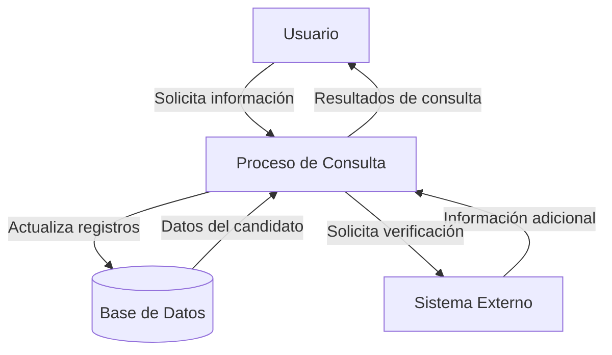

## Module: CConsultarCandidatoPrestamoCN.cpp
# Análisis Integral del Módulo CConsultarCandidatoPrestamoCN.cpp

## Módulo/Componente SQL
**CConsultarCandidatoPrestamoCN.cpp** - Este es un módulo de clase en C++ que forma parte de una capa de negocio (CN) para consultar candidatos a préstamos.

## Objetivos Primarios
El módulo está diseñado para gestionar la consulta de información de candidatos a préstamos en un sistema financiero. Su propósito principal es recuperar, validar y procesar datos de candidatos desde una base de datos, aplicando lógica de negocio específica para determinar su elegibilidad o características como prestatarios.

## Funciones, Métodos y Consultas Críticas
- **ConsultarCandidatoPrestamoXCodigo()**: Método principal que consulta información de un candidato a préstamo por su código.
- **ConsultarCandidatoPrestamoXNombre()**: Método para buscar candidatos por nombre.
- **ConsultarCandidatoPrestamoXDocumento()**: Método para buscar candidatos por número de documento.
- **ConsultarCandidatoPrestamoXCriterio()**: Método genérico para consultar candidatos según diversos criterios.

Estos métodos probablemente ejecutan consultas SQL SELECT para recuperar datos de candidatos desde tablas de la base de datos.

## Variables y Elementos Clave
- **m_pConexion**: Variable que mantiene la conexión a la base de datos.
- **m_pError**: Variable para gestión de errores.
- **Parámetros de búsqueda**: Códigos, nombres, números de documento y otros criterios utilizados para filtrar candidatos.
- **Tablas probables**: Tablas relacionadas con candidatos, préstamos, información personal y financiera.

## Interdependencias y Relaciones
- El módulo interactúa con una capa de acceso a datos para ejecutar consultas SQL.
- Depende de una conexión a base de datos establecida.
- Probablemente se relaciona con otros módulos de gestión de préstamos y clientes.
- Las tablas consultadas probablemente tienen relaciones con tablas de clientes, productos financieros y evaluaciones crediticias.

## Operaciones Core vs. Auxiliares
- **Core**: La consulta y recuperación de datos de candidatos a préstamos.
- **Auxiliares**: Validación de parámetros de entrada, manejo de errores, formateo de resultados y posiblemente logging de operaciones.

## Secuencia Operacional/Flujo de Ejecución
1. Recepción de parámetros de búsqueda (código, nombre, documento, etc.)
2. Validación de parámetros
3. Construcción de consultas SQL basadas en los criterios
4. Ejecución de consultas a la base de datos
5. Procesamiento de resultados
6. Aplicación de lógica de negocio específica
7. Retorno de resultados formateados o estructurados

## Aspectos de Rendimiento y Optimización
- La eficiencia de las consultas SQL es crítica, especialmente si se manejan grandes volúmenes de datos.
- El uso adecuado de índices en las tablas consultadas mejoraría el rendimiento.
- La gestión de memoria para los resultados de consultas extensas podría ser un punto de optimización.
- El manejo de conexiones a la base de datos debe ser eficiente para evitar sobrecarga.

## Reusabilidad y Adaptabilidad
- Los métodos parecen estar diseñados para ser reutilizables con diferentes parámetros de búsqueda.
- La separación de consultas por tipo de criterio (código, nombre, documento) permite adaptabilidad a diferentes escenarios de búsqueda.
- La implementación probablemente sigue patrones de diseño que facilitan su mantenimiento y extensión.

## Uso y Contexto
- Este módulo se utiliza en el contexto de evaluación de préstamos o servicios financieros.
- Probablemente es invocado desde interfaces de usuario o servicios que necesitan información de candidatos a préstamos.
- Podría ser parte de un flujo de trabajo más amplio para la aprobación o gestión de préstamos.

## Suposiciones y Limitaciones
- Asume la existencia de una estructura de base de datos específica con tablas de candidatos y préstamos.
- Requiere una conexión a base de datos establecida y funcional.
- Podría tener limitaciones en cuanto a la complejidad de los criterios de búsqueda soportados.
- La eficiencia puede verse afectada por el volumen de datos y la estructura de la base de datos.
- Probablemente está diseñado para un entorno específico y podría requerir adaptaciones para otros contextos.
## Flow Diagram [via mermaid]

