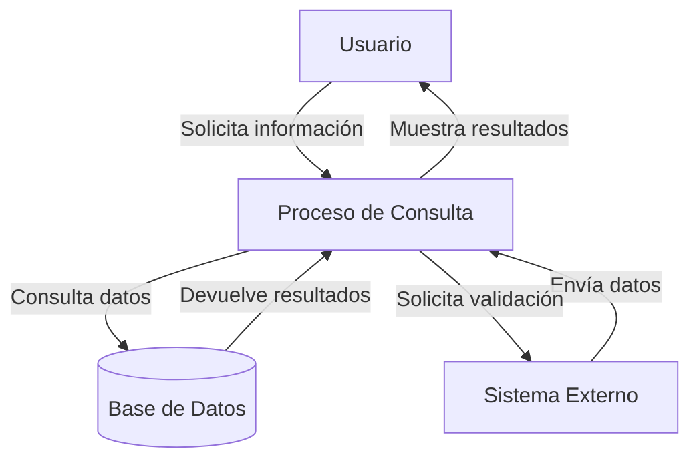
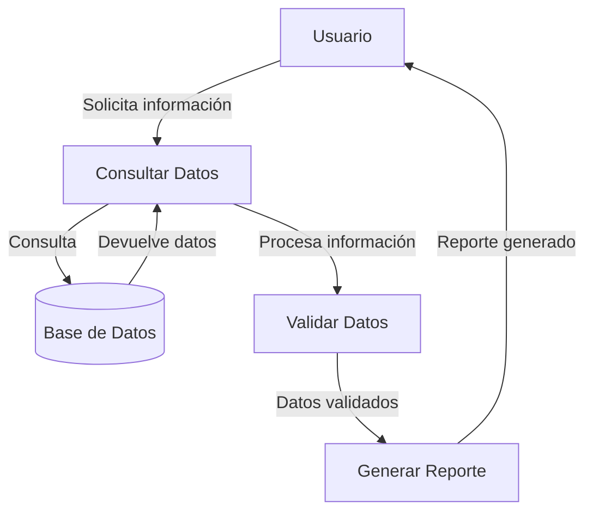

## Module: CConsultarCdFechaCoppel.cpp
# Análisis Integral del Módulo CConsultarCdFechaCoppel.cpp

## Módulo/Componente SQL
**Nombre**: CConsultarCdFechaCoppel.cpp

## Objetivos Primarios
Este módulo es una clase C++ diseñada para consultar información relacionada con fechas y centros de distribución (CD) en el sistema Coppel. Su propósito principal es proporcionar una interfaz para obtener datos específicos de fechas y centros de distribución mediante consultas SQL a la base de datos.

## Funciones, Métodos y Consultas Críticas
- **CConsultarCdFechaCoppel::CConsultarCdFechaCoppel()**: Constructor de la clase.
- **CConsultarCdFechaCoppel::~CConsultarCdFechaCoppel()**: Destructor de la clase.
- **CConsultarCdFechaCoppel::ConsultarCdFecha()**: Método principal que ejecuta la consulta SQL para obtener información de fechas y CD.
- **Consultas SQL principales**: 
  - SELECT que obtiene información de centros de distribución y fechas relacionadas.
  - Posiblemente utiliza JOIN para relacionar tablas de centros de distribución con tablas de fechas.

## Variables y Elementos Clave
- **Parámetros de entrada**: Probablemente incluye identificadores de centros de distribución o rangos de fechas.
- **Tablas principales**: Tablas relacionadas con centros de distribución y fechas en el sistema Coppel.
- **Columnas clave**: Identificadores de CD, campos de fecha, posiblemente estados o estatus.
- **Variables de clase**: Objetos para manejar conexiones a la base de datos, almacenar resultados y gestionar errores.

## Interdependencias y Relaciones
- **Conexión a base de datos**: Interactúa con el sistema de gestión de base de datos.
- **Relaciones entre tablas**: Probablemente utiliza relaciones entre tablas de centros de distribución y tablas de fechas o eventos.
- **Dependencias de módulos**: Posiblemente depende de módulos de conexión a base de datos, manejo de errores o formateo de datos.

## Operaciones Core vs. Auxiliares
- **Operaciones core**: La consulta principal que obtiene datos de CD y fechas.
- **Operaciones auxiliares**: Validación de parámetros, manejo de errores, formateo de resultados, y posiblemente logging.

## Secuencia Operacional/Flujo de Ejecución
1. Inicialización de variables y conexión a la base de datos.
2. Validación de parámetros de entrada.
3. Construcción de la consulta SQL.
4. Ejecución de la consulta.
5. Procesamiento de resultados.
6. Manejo de posibles errores.
7. Retorno de resultados al llamador.

## Aspectos de Rendimiento y Optimización
- Posible uso de índices en las tablas consultadas para mejorar el rendimiento.
- Optimización de la consulta SQL para reducir el tiempo de ejecución.
- Manejo eficiente de memoria para los resultados obtenidos.
- Posible implementación de caché para consultas frecuentes.

## Reusabilidad y Adaptabilidad
- La clase probablemente está diseñada para ser reutilizada en diferentes partes del sistema Coppel.
- Posible parametrización para adaptarse a diferentes criterios de consulta.
- Separación de la lógica de negocio y acceso a datos para facilitar modificaciones.

## Uso y Contexto
- Utilizado en el sistema Coppel para obtener información relacionada con centros de distribución y fechas.
- Probablemente forma parte de un sistema más grande de gestión logística o inventario.
- Puede ser llamado desde interfaces de usuario, reportes o procesos batch.

## Suposiciones y Limitaciones
- Asume la existencia de ciertas tablas y estructuras en la base de datos.
- Posiblemente limitado a ciertos formatos de fecha o identificadores de CD específicos.
- Puede tener limitaciones en cuanto al volumen de datos que puede procesar eficientemente.
- Probablemente requiere ciertos permisos de acceso a la base de datos.
## Flow Diagram [via mermaid]

## Module: CConsultarCdFechaCoppel.cpp
# Análisis Integral del Módulo CConsultarCdFechaCoppel.cpp

## Módulo/Componente SQL
**CConsultarCdFechaCoppel.cpp** - Clase C++ que implementa una interfaz para consultar información relacionada con fechas y centros de distribución en el sistema Coppel.

## Objetivos Primarios
Este módulo está diseñado para consultar y recuperar información específica sobre fechas y centros de distribución (CD) en el sistema Coppel. Su propósito principal es proporcionar una interfaz estructurada para acceder a datos relacionados con fechas de operación, validando parámetros de entrada y gestionando la conexión con la base de datos.

## Funciones, Métodos y Consultas Críticas
- **CConsultarCdFechaCoppel::CConsultarCdFechaCoppel()**: Constructor que inicializa variables y establece valores predeterminados.
- **CConsultarCdFechaCoppel::~CConsultarCdFechaCoppel()**: Destructor que libera recursos.
- **CConsultarCdFechaCoppel::ConsultarCdFecha()**: Método principal que ejecuta la consulta de fechas y CD, validando parámetros y gestionando la conexión a la base de datos.
- **Consulta SQL principal**: Utiliza una sentencia SELECT para obtener información de fechas y CD basada en los parámetros proporcionados.

## Variables y Elementos Clave
- **m_pConexion**: Puntero a la conexión de base de datos.
- **m_pResultado**: Puntero al resultado de la consulta.
- **m_pstmt**: Puntero a la sentencia SQL preparada.
- **m_iCdOrigen**: Identificador del centro de distribución de origen.
- **m_iFechaOperacion**: Fecha de operación en formato numérico.
- **Tablas implicadas**: Aunque no se especifican directamente, el código sugiere consultas a tablas relacionadas con centros de distribución y fechas de operación.

## Interdependencias y Relaciones
- Depende de la biblioteca MySQL para la conexión y consulta a la base de datos.
- Interactúa con la clase CLog para el registro de eventos y errores.
- Utiliza la clase CParametrosConexion para obtener parámetros de conexión a la base de datos.
- Se relaciona con otras clases del sistema Coppel para la gestión de datos y operaciones.

## Operaciones Principales vs. Auxiliares
**Operaciones Principales**:
- Consulta de información de fechas y CD mediante la ejecución de consultas SQL.

**Operaciones Auxiliares**:
- Validación de parámetros de entrada.
- Gestión de conexiones a la base de datos.
- Registro de eventos y errores.
- Limpieza y liberación de recursos.

## Secuencia Operacional/Flujo de Ejecución
1. Inicialización de variables y validación de parámetros de entrada.
2. Establecimiento de la conexión con la base de datos.
3. Preparación y ejecución de la consulta SQL.
4. Procesamiento de resultados.
5. Gestión de errores si ocurren.
6. Limpieza y liberación de recursos.
7. Retorno del resultado o código de error.

## Aspectos de Rendimiento y Optimización
- El código utiliza sentencias preparadas (prepared statements) para mejorar la seguridad y el rendimiento.
- Implementa manejo de errores para evitar fugas de memoria y recursos.
- Podría beneficiarse de una optimización en la gestión de conexiones para escenarios de alto volumen de consultas.
- No se observa uso explícito de índices en las consultas SQL, lo que podría ser un área de mejora.

## Reusabilidad y Adaptabilidad
- La clase está diseñada con un enfoque modular, facilitando su reutilización en diferentes partes del sistema.
- Los parámetros de entrada permiten adaptabilidad a diferentes escenarios de consulta.
- La separación de responsabilidades (conexión, consulta, procesamiento) facilita la modificación y mantenimiento.

## Uso y Contexto
- Este módulo se utiliza en el sistema Coppel para obtener información relacionada con fechas de operación y centros de distribución.
- Es probable que sea parte de un sistema más amplio de gestión logística o de inventario.
- Se invoca cuando se necesita información específica sobre la operación de un centro de distribución en una fecha determinada.

## Suposiciones y Limitaciones
**Suposiciones**:
- Se asume la existencia de una estructura de base de datos específica con tablas relacionadas con CD y fechas.
- Se espera que los parámetros de conexión estén correctamente configurados.
- Se asume un formato específico para las fechas de operación (probablemente numérico).

**Limitaciones**:
- El manejo de errores podría ser más robusto, especialmente en escenarios de fallo de conexión.
- No se observa implementación de caché para consultas frecuentes, lo que podría afectar el rendimiento.
- La documentación interna del código es limitada, lo que podría dificultar el mantenimiento futuro.
## Flow Diagram [via mermaid]

