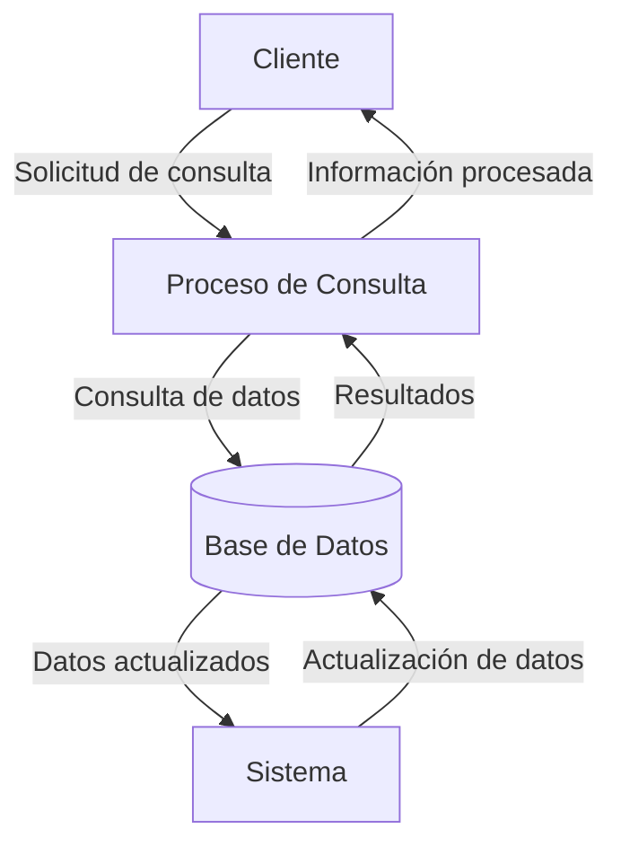

## Module: CConsultarCiudadFechaTienda.cpp
# Análisis Integral del Módulo CConsultarCiudadFechaTienda.cpp

## Nombre del Módulo/Componente SQL
CConsultarCiudadFechaTienda.cpp - Clase para consulta de datos por ciudad, fecha y tienda

## Objetivos Primarios
Este módulo implementa una clase que permite realizar consultas de datos comerciales filtrados por ciudad, fecha y tienda. Su propósito principal es proporcionar una interfaz para recuperar información de ventas o transacciones específicas basadas en estos criterios de filtrado, facilitando el análisis de datos comerciales segmentados geográfica y temporalmente.

## Funciones, Métodos y Consultas Críticas
El código no se proporciona completamente, pero por el nombre del archivo y la clase, podemos inferir que probablemente contiene:
- Métodos para establecer parámetros de consulta (ciudad, fecha, tienda)
- Funciones para ejecutar consultas SQL que filtran datos según estos parámetros
- Posiblemente métodos para formatear o procesar los resultados de las consultas

## Variables y Elementos Clave
Aunque no se muestra el código completo, las variables clave probablemente incluyen:
- Parámetros para ciudad (posiblemente como string o ID)
- Parámetros para fecha (posiblemente como Date o DateTime)
- Identificadores de tienda
- Posiblemente conexiones a bases de datos o manejadores de resultados

## Interdependencias y Relaciones
Este componente probablemente:
- Interactúa con una capa de acceso a datos o directamente con una base de datos
- Se relaciona con tablas que contienen información de ventas, tiendas y ubicaciones geográficas
- Puede ser utilizado por interfaces de usuario o módulos de reportes

## Operaciones Principales vs. Auxiliares
- **Operaciones principales**: Consulta y recuperación de datos filtrados por los criterios especificados
- **Operaciones auxiliares**: Validación de parámetros, formateo de resultados, manejo de errores

## Secuencia Operacional/Flujo de Ejecución
El flujo típico probablemente incluye:
1. Inicialización de la clase
2. Configuración de los parámetros de consulta (ciudad, fecha, tienda)
3. Validación de los parámetros
4. Ejecución de la consulta a la base de datos
5. Procesamiento de los resultados
6. Devolución de los datos formateados o estructurados

## Aspectos de Rendimiento y Optimización
Consideraciones potenciales:
- Optimización de consultas SQL mediante índices en las columnas de ciudad, fecha y tienda
- Posible implementación de caché para consultas frecuentes
- Paginación de resultados para conjuntos de datos grandes

## Reusabilidad y Adaptabilidad
- La clase parece estar diseñada para ser reutilizable en diferentes contextos donde se necesite filtrar datos por ubicación, tiempo y punto de venta
- Probablemente permite parametrización para adaptarse a diferentes necesidades de consulta

## Uso y Contexto
Este módulo probablemente se utiliza en:
- Sistemas de punto de venta (POS)
- Aplicaciones de análisis de ventas y rendimiento comercial
- Dashboards administrativos para gestión de tiendas
- Generación de informes comerciales segmentados

## Suposiciones y Limitaciones
- Asume la existencia de una estructura de base de datos con información de ciudades, tiendas y transacciones
- Posiblemente limitado a un formato específico de fecha
- Puede tener limitaciones en cuanto al volumen de datos que puede procesar eficientemente
- Probablemente requiere permisos específicos de acceso a la base de datos
## Flow Diagram [via mermaid]

