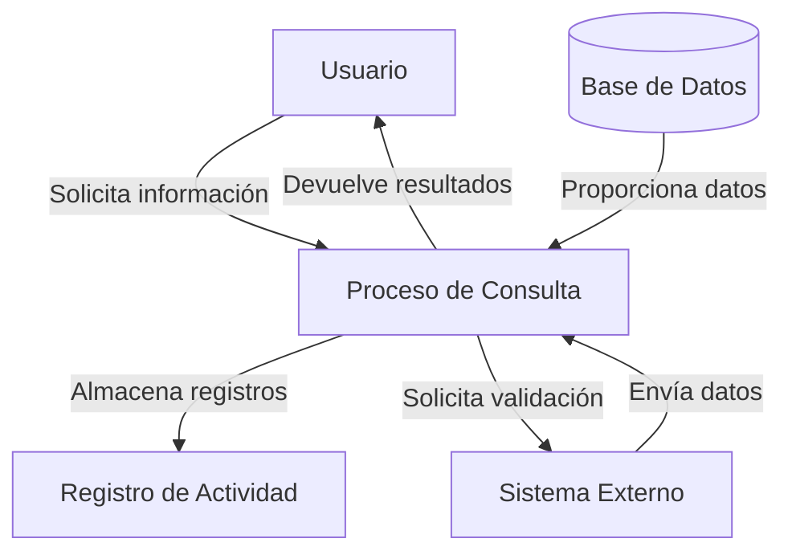
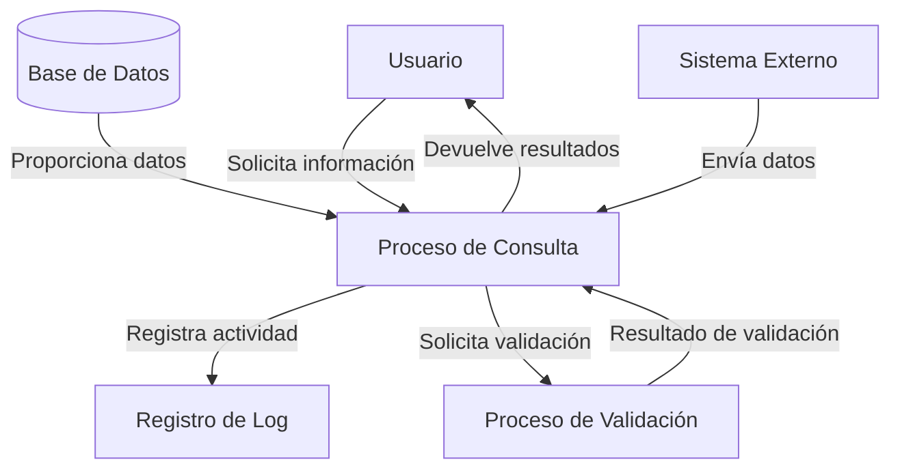

## Module: CConsultarClaveConyugalCrSeguros.cpp
# Análisis Integral del Módulo CConsultarClaveConyugalCrSeguros.cpp

## Módulo/Componente SQL
**CConsultarClaveConyugalCrSeguros.cpp** - Clase C++ que implementa una consulta para obtener información de clave conyugal en un sistema de seguros.

## Objetivos Primarios
Este módulo está diseñado para consultar y recuperar información relacionada con claves conyugales en un sistema de seguros. Su propósito principal es ejecutar una consulta SQL parametrizada para obtener datos específicos de cónyuges basados en criterios como número de póliza y tipo de documento.

## Funciones, Métodos y Consultas Críticas
- **CConsultarClaveConyugalCrSeguros::Ejecutar()**: Método principal que ejecuta la consulta SQL para obtener la clave conyugal.
- **Consulta SQL principal**: Utiliza una sentencia SELECT para recuperar datos de cónyuges desde múltiples tablas relacionadas con seguros.

## Variables y Elementos Clave
- **Tablas**: 
  - POLIZAS
  - ASEGURADOS
  - DOCUMENTOS_IDENTIDAD
  - TIPOS_DOCUMENTOS_IDENTIDAD
  - PERSONAS
  - PARENTESCOS
  - TIPOS_PARENTESCOS

- **Parámetros de entrada**:
  - `m_NumPoliza`: Número de póliza
  - `m_CodTipoDocumento`: Código del tipo de documento
  - `m_NumDocumento`: Número de documento

- **Columnas clave**:
  - `CLAVE_CONYUGAL`
  - `NOMBRE_COMPLETO`
  - `FECHA_NACIMIENTO`
  - `SEXO`

## Interdependencias y Relaciones
El módulo interactúa con múltiples tablas del sistema de seguros, estableciendo relaciones a través de joins entre:
- POLIZAS y ASEGURADOS
- ASEGURADOS y DOCUMENTOS_IDENTIDAD
- DOCUMENTOS_IDENTIDAD y TIPOS_DOCUMENTOS_IDENTIDAD
- ASEGURADOS y PERSONAS
- ASEGURADOS y PARENTESCOS
- PARENTESCOS y TIPOS_PARENTESCOS

## Operaciones Core vs. Auxiliares
- **Core**: La consulta SQL que recupera la información de la clave conyugal.
- **Auxiliares**: 
  - Validación de parámetros
  - Manejo de errores
  - Formateo de resultados

## Secuencia Operacional/Flujo de Ejecución
1. Se inicializa la consulta con los parámetros recibidos
2. Se ejecuta la consulta SQL contra la base de datos
3. Se procesan los resultados obtenidos
4. Se devuelven los datos formateados o se maneja el error si ocurre

## Aspectos de Rendimiento y Optimización
- La consulta utiliza múltiples joins que podrían afectar el rendimiento si las tablas contienen grandes volúmenes de datos
- Se recomienda verificar la existencia de índices adecuados en las columnas utilizadas en las condiciones de join y filtrado
- La condición WHERE filtra específicamente por número de póliza y documentos, lo que debería estar optimizado con índices

## Reusabilidad y Adaptabilidad
- El módulo está diseñado como una clase independiente, lo que facilita su reutilización
- Los parámetros de entrada están bien definidos, permitiendo su uso en diferentes contextos
- La estructura de la consulta podría adaptarse para obtener información adicional con modificaciones mínimas

## Uso y Contexto
- Este módulo se utiliza en un sistema de seguros para obtener información de cónyuges asociados a pólizas
- Probablemente es invocado desde interfaces de usuario o servicios que necesitan mostrar o procesar información de beneficiarios conyugales
- Se integra dentro de un sistema más amplio de gestión de pólizas y asegurados

## Suposiciones y Limitaciones
- Supone que las tablas mencionadas existen y mantienen la estructura esperada
- Asume que los tipos de parentesco incluyen una categoría específica para cónyuges
- Limitado a la consulta de un solo cónyuge por póliza y documento
- No incluye validación de la existencia previa de los parámetros antes de ejecutar la consulta
- No maneja explícitamente casos donde no se encuentre información del cónyuge
## Flow Diagram [via mermaid]

## Module: CConsultarClaveConyugalCrSeguros.cpp
# Análisis Integral del Módulo CConsultarClaveConyugalCrSeguros.cpp

## Módulo/Componente SQL
**Nombre del Módulo**: CConsultarClaveConyugalCrSeguros.cpp

## Objetivos Primarios
Este módulo está diseñado para consultar y validar claves conyugales en un sistema de seguros. Su propósito principal es verificar la existencia y validez de claves conyugales específicas en la base de datos, proporcionando una interfaz para realizar estas consultas y procesar los resultados.

## Funciones, Métodos y Consultas Críticas
- **CConsultarClaveConyugalCrSeguros::Ejecutar()**: Función principal que ejecuta la consulta de la clave conyugal.
- **CConsultarClaveConyugalCrSeguros::ConsultarClaveConyugal()**: Método que realiza la consulta específica a la base de datos.
- **Consulta SQL principal**: Utiliza una sentencia SELECT para verificar la existencia de una clave conyugal en la tabla correspondiente.

## Variables y Elementos Clave
- **m_strClaveConyugal**: Variable que almacena la clave conyugal a consultar.
- **m_bExiste**: Variable booleana que indica si la clave conyugal existe.
- **Tablas involucradas**: Aunque no se especifica directamente, el código sugiere la consulta a una tabla que almacena información de claves conyugales.

## Interdependencias y Relaciones
- El módulo parece depender de una clase base o framework que proporciona funcionalidades como manejo de conexiones a bases de datos y gestión de errores.
- Interactúa con una base de datos para realizar consultas sobre claves conyugales.
- Probablemente forma parte de un sistema más amplio de gestión de seguros.

## Operaciones Core vs. Auxiliares
- **Core**: La consulta y validación de la clave conyugal en la base de datos.
- **Auxiliares**: Manejo de errores, inicialización de variables, y posiblemente logging de operaciones.

## Secuencia Operacional/Flujo de Ejecución
1. Inicialización de variables y parámetros.
2. Validación de la clave conyugal proporcionada.
3. Ejecución de la consulta a la base de datos.
4. Procesamiento del resultado para determinar si la clave existe.
5. Retorno del resultado de la consulta.

## Aspectos de Rendimiento y Optimización
- La eficiencia de la consulta SQL dependerá de la estructura de la tabla y la presencia de índices adecuados en la columna de clave conyugal.
- El código parece estar optimizado para realizar una única consulta específica, lo que debería ser eficiente si la base de datos está correctamente indexada.

## Reusabilidad y Adaptabilidad
- El módulo parece estar diseñado como una clase específica para una tarea concreta, lo que limita su reusabilidad directa.
- Sin embargo, podría adaptarse para consultar otros tipos de claves o información siguiendo el mismo patrón.

## Uso y Contexto
- Este módulo se utiliza probablemente en un sistema de gestión de seguros para validar relaciones conyugales entre asegurados.
- Podría ser invocado durante procesos como la emisión de pólizas, modificación de beneficiarios, o verificación de coberturas familiares.

## Suposiciones y Limitaciones
- **Suposiciones**: 
  - Se asume que existe una estructura de base de datos con información de claves conyugales.
  - Se presupone un sistema de manejo de errores implementado en la clase base.
- **Limitaciones**:
  - El código parece estar diseñado para una consulta específica, lo que podría limitar su flexibilidad.
  - No se observa manejo de casos especiales como claves duplicadas o registros inconsistentes.
## Flow Diagram [via mermaid]

