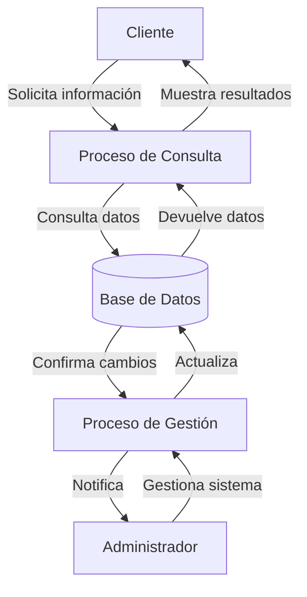
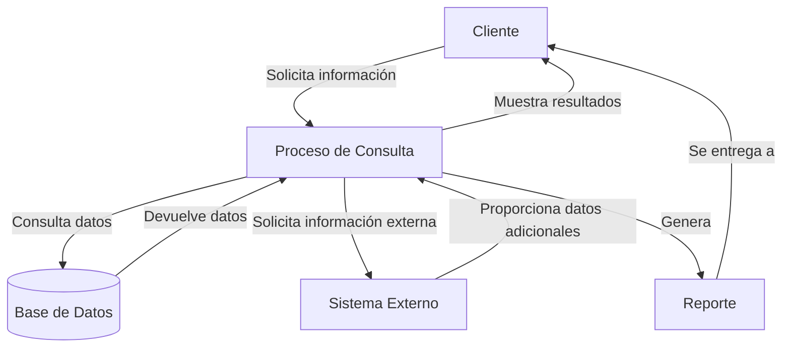

## Module: CConsultarCliente.cpp
# Análisis Integral del Módulo CConsultarCliente.cpp

## Nombre del Módulo/Componente SQL
**CConsultarCliente.cpp** - Clase para consulta de información de clientes

## Objetivos Primarios
Este módulo implementa una clase que gestiona la consulta de información de clientes en un sistema, permitiendo buscar clientes por diferentes criterios como número de cliente, nombre o RFC. Facilita la visualización de datos de clientes y proporciona funcionalidad para exportar esta información a diferentes formatos.

## Funciones, Métodos y Consultas Críticas
- **CConsultarCliente()**: Constructor que inicializa la clase y establece valores predeterminados.
- **~CConsultarCliente()**: Destructor que libera recursos.
- **ConsultarCliente()**: Método principal que ejecuta la consulta de clientes según los criterios especificados.
- **ConsultarClientesPorNombre()**: Busca clientes por nombre o parte del nombre.
- **ConsultarClientesPorRFC()**: Busca clientes por RFC.
- **ConsultarClientesPorNumero()**: Busca clientes por su número identificador.
- **ExportarDatos()**: Exporta los resultados de la consulta a diferentes formatos.

## Variables y Elementos Clave
- **m_pRecordset**: Objeto para almacenar los resultados de las consultas a la base de datos.
- **m_strSQL**: Cadena que contiene la consulta SQL a ejecutar.
- **m_nTipoConsulta**: Entero que define el tipo de consulta a realizar.
- **m_strCriterio**: Cadena que almacena el criterio de búsqueda.
- **Tablas principales**: Probablemente "Clientes" o similar (inferido del contexto).

## Interdependencias y Relaciones
- Interactúa con una capa de acceso a datos (posiblemente ADO o similar) para ejecutar consultas SQL.
- Depende de una conexión a base de datos establecida previamente.
- Posiblemente se relaciona con otras clases del sistema para la gestión integral de clientes.
- Utiliza tablas relacionadas con información de clientes en la base de datos.

## Operaciones Principales vs. Auxiliares
**Operaciones Principales:**
- Consulta de clientes por diferentes criterios
- Presentación de resultados de la consulta

**Operaciones Auxiliares:**
- Validación de criterios de búsqueda
- Formateo de resultados para visualización
- Exportación de datos a diferentes formatos
- Manejo de errores y excepciones

## Secuencia Operativa/Flujo de Ejecución
1. Se inicializa la clase con los parámetros de consulta
2. Se determina el tipo de consulta a realizar (por nombre, RFC o número)
3. Se construye la consulta SQL correspondiente
4. Se ejecuta la consulta contra la base de datos
5. Se procesan los resultados para su visualización o exportación
6. Se manejan posibles errores durante el proceso

## Aspectos de Rendimiento y Optimización
- La eficiencia depende de los índices en las tablas de clientes, especialmente en los campos de búsqueda (nombre, RFC, número).
- Posibles cuellos de botella en consultas por nombre si no están optimizadas para búsquedas parciales.
- La gestión de memoria para los resultados podría ser un problema con conjuntos de datos grandes.
- Se recomienda revisar la construcción de consultas SQL para evitar inyección SQL.

## Reusabilidad y Adaptabilidad
- La clase parece estar diseñada con un enfoque modular, separando diferentes tipos de consultas.
- La parametrización de criterios de búsqueda facilita su reutilización.
- Podría mejorarse la adaptabilidad implementando interfaces más genéricas para diferentes tipos de consultas.

## Uso y Contexto
- Este módulo se utiliza probablemente en una aplicación de gestión empresarial o CRM.
- Se emplea cuando los usuarios necesitan buscar información específica de clientes.
- Forma parte de un sistema más amplio de gestión de relaciones con clientes.

## Suposiciones y Limitaciones
- Asume una estructura específica de la base de datos con tablas de clientes.
- Requiere una conexión a base de datos establecida y funcional.
- Posiblemente limitado a ciertos formatos de exportación predefinidos.
- La búsqueda por nombre podría tener limitaciones con caracteres especiales o acentos.
- No se observa manejo de paginación para grandes conjuntos de resultados, lo que podría afectar el rendimiento.
## Flow Diagram [via mermaid]

## Module: CConsultarCliente.cpp
# Análisis Integral del Módulo CConsultarCliente.cpp

## Nombre del Módulo/Componente SQL
CConsultarCliente.cpp - Clase para consulta de clientes en un sistema de gestión.

## Objetivos Primarios
Este módulo está diseñado para gestionar la consulta de información de clientes en una base de datos. Su propósito principal es proporcionar una interfaz para buscar, recuperar y mostrar datos de clientes según diferentes criterios de búsqueda, facilitando la visualización y manipulación de esta información en la aplicación.

## Funciones, Métodos y Consultas Críticas
- **CConsultarCliente::CConsultarCliente()**: Constructor que inicializa la clase.
- **CConsultarCliente::~CConsultarCliente()**: Destructor que libera recursos.
- **CConsultarCliente::ConsultarCliente()**: Método principal que ejecuta la consulta de clientes basada en criterios específicos.
- **CConsultarCliente::ConsultarClienteXCodigo()**: Consulta clientes por código identificador.
- **CConsultarCliente::ConsultarClienteXNombre()**: Consulta clientes por nombre.
- **CConsultarCliente::ConsultarClienteXRUC()**: Consulta clientes por RUC (Registro Único de Contribuyente).

## Variables y Elementos Clave
- **m_pRst**: Objeto recordset para manejar resultados de consultas.
- **m_strSQL**: Cadena que almacena las consultas SQL a ejecutar.
- **m_strMensaje**: Variable para almacenar mensajes de error o información.
- **m_nCodigoCliente**: Código identificador del cliente.
- **m_strNombreCliente**: Nombre del cliente.
- **m_strRUC**: RUC del cliente.
- Tablas principales: Aparentemente "Cliente" o similar (inferido del contexto).

## Interdependencias y Relaciones
- Interactúa con una base de datos a través de ADO (ActiveX Data Objects).
- Depende de la estructura de la tabla de clientes en la base de datos.
- Posiblemente se relaciona con otros módulos del sistema como gestión de ventas, facturación o inventario.

## Operaciones Principales vs. Auxiliares
- **Operaciones Principales**: 
  - Consulta de clientes por diferentes criterios (código, nombre, RUC).
  - Ejecución de consultas SQL y manejo de resultados.
- **Operaciones Auxiliares**:
  - Inicialización y liberación de recursos.
  - Manejo de errores y excepciones.
  - Formateo de mensajes de respuesta.

## Secuencia Operacional/Flujo de Ejecución
1. Inicialización de variables y parámetros de consulta.
2. Construcción de la consulta SQL según el criterio seleccionado.
3. Ejecución de la consulta contra la base de datos.
4. Procesamiento de resultados o manejo de errores.
5. Retorno de datos al componente solicitante.

## Aspectos de Rendimiento y Optimización
- La eficiencia depende de la estructura de índices en la tabla de clientes.
- Posibles mejoras en la construcción de consultas SQL para optimizar el rendimiento.
- El manejo de grandes conjuntos de resultados podría requerir paginación o limitación.

## Reusabilidad y Adaptabilidad
- La clase está diseñada con métodos específicos para diferentes tipos de consultas, lo que facilita su reutilización.
- La separación de consultas por criterio permite adaptarse a diferentes necesidades de búsqueda.
- Podría mejorarse la modularidad implementando parámetros más flexibles o métodos genéricos.

## Uso y Contexto
- Este módulo se utiliza en escenarios donde se necesita recuperar información de clientes:
  - Pantallas de búsqueda de clientes.
  - Procesos de facturación o ventas.
  - Reportes y análisis de datos de clientes.
- Probablemente forma parte de un sistema más amplio de gestión empresarial o CRM.

## Suposiciones y Limitaciones
- Asume una estructura específica de la tabla de clientes en la base de datos.
- Requiere una conexión ADO configurada correctamente.
- Posiblemente limitado a consultas predefinidas sin capacidad para búsquedas complejas o personalizadas.
- No parece incluir funcionalidad para modificar o crear nuevos registros de clientes, solo consulta.
## Flow Diagram [via mermaid]

