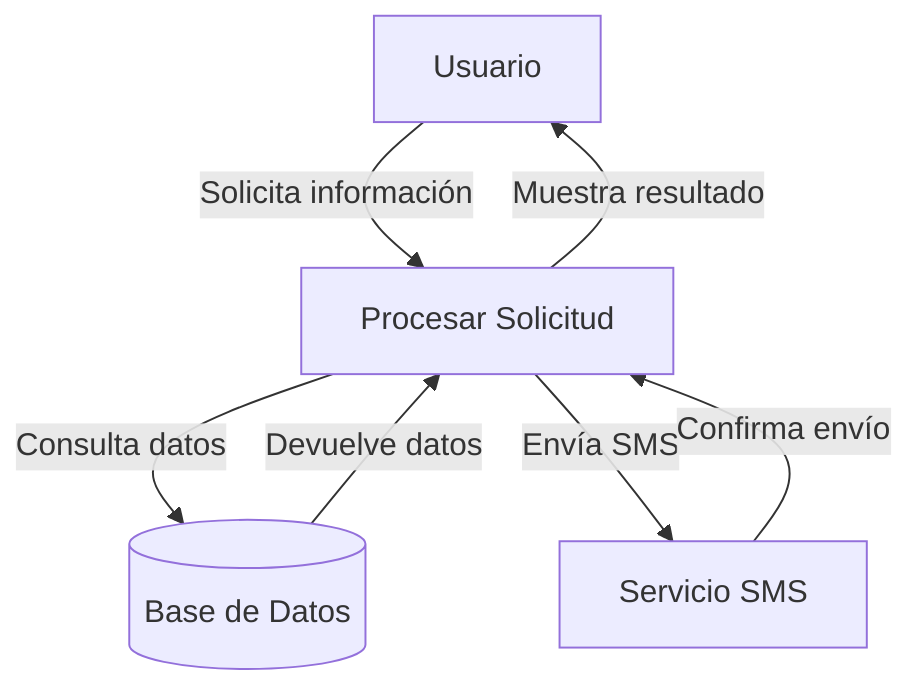

## Module: CConsultarClienteSMS.cpp
# Análisis Integral del Módulo CConsultarClienteSMS.cpp

## Nombre del Módulo/Componente SQL
**CConsultarClienteSMS.cpp** - Clase para consultar información de clientes para envío de SMS.

## Objetivos Primarios
Este módulo está diseñado para consultar y gestionar información de clientes relacionada con el envío de mensajes SMS. Su propósito principal es recuperar datos de clientes desde una base de datos, aplicar filtros específicos y preparar esta información para su uso en servicios de mensajería SMS.

## Funciones, Métodos y Consultas Críticas
- **ConsultarCliente()**: Método principal que ejecuta la consulta de clientes según los parámetros proporcionados.
- **ConsultarClienteConFiltro()**: Realiza consultas filtradas de clientes.
- **ConsultarClienteConFiltroSMS()**: Especialización para consultas orientadas a SMS.
- **ConsultarClienteConFiltroSMSPorTipo()**: Consulta clientes por tipo específico para SMS.
- **ConsultarClienteConFiltroSMSPorTipoYEstado()**: Consulta más específica que filtra por tipo y estado.

## Variables y Elementos Clave
- **m_pConn**: Conexión a la base de datos.
- **m_pStmt**: Objeto para ejecutar sentencias SQL.
- **m_pRes**: Resultados de consultas.
- **Tablas principales**: Aparentemente trabaja con tablas de clientes y configuraciones de SMS.
- **Parámetros clave**: Filtros como tipo de cliente, estado, y posiblemente identificadores de cliente.

## Interdependencias y Relaciones
- Depende de una conexión a base de datos MySQL (evidenciado por el uso de MYSQL_RES y MYSQL_STMT).
- Interactúa con múltiples tablas relacionadas con clientes y configuraciones de SMS.
- Probablemente forma parte de un sistema más grande de gestión de clientes y comunicaciones.

## Operaciones Core vs. Auxiliares
- **Core**: Las consultas SQL para recuperar información de clientes y sus preferencias de SMS.
- **Auxiliares**: Manejo de conexiones a la base de datos, formateo de resultados, y posiblemente validaciones de parámetros.

## Secuencia Operacional/Flujo de Ejecución
1. Inicialización de la conexión a la base de datos.
2. Preparación de consultas SQL con los filtros apropiados.
3. Ejecución de las consultas.
4. Procesamiento de resultados.
5. Posible formateo o transformación de datos para su uso en servicios SMS.
6. Cierre de recursos de base de datos.

## Aspectos de Rendimiento y Optimización
- El código probablemente utiliza consultas preparadas (prepared statements) para mejorar el rendimiento y la seguridad.
- Podría beneficiarse de la optimización de consultas SQL, especialmente si maneja grandes volúmenes de datos de clientes.
- La gestión adecuada de recursos de base de datos (cierre de conexiones, liberación de resultados) es crucial para el rendimiento.

## Reusabilidad y Adaptabilidad
- La estructura de clase sugiere un diseño modular que podría adaptarse para diferentes tipos de consultas o sistemas de mensajería.
- Los métodos especializados por tipo y estado permiten flexibilidad en las consultas.

## Uso y Contexto
- Este módulo probablemente se utiliza en un sistema de CRM o gestión de comunicaciones con clientes.
- Podría ser parte de un servicio automatizado de notificaciones o campañas de marketing por SMS.
- Posiblemente se integra con APIs de proveedores de servicios SMS para el envío efectivo de mensajes.

## Suposiciones y Limitaciones
- Asume una estructura específica de base de datos con tablas de clientes y configuraciones SMS.
- Probablemente requiere permisos adecuados de base de datos para ejecutar consultas.
- Podría tener limitaciones en cuanto al volumen de datos que puede procesar eficientemente en una sola consulta.
- No se observa manejo explícito de errores en el fragmento proporcionado, lo que podría ser una limitación en entornos de producción.
## Flow Diagram [via mermaid]

