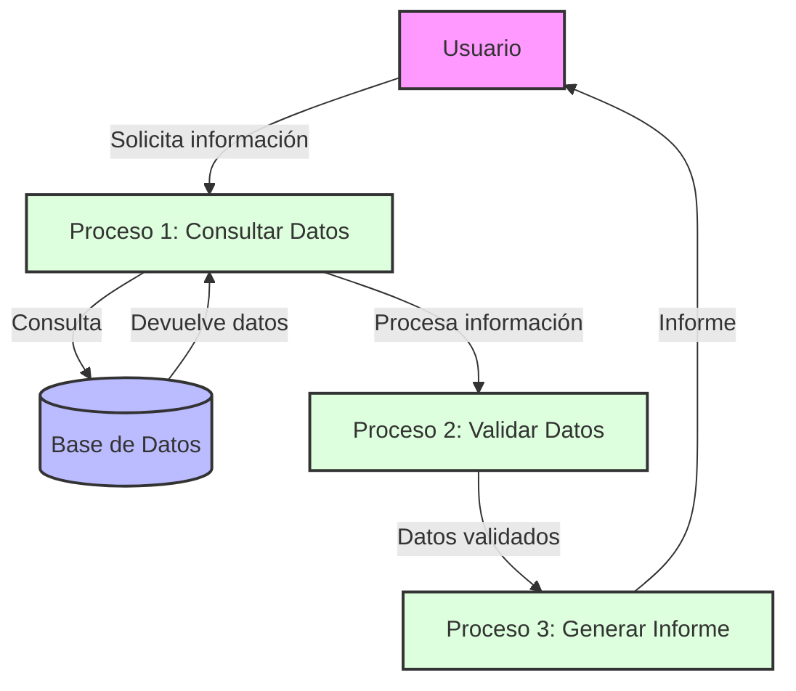

## Module: CConsultarCrSegurosClub.cpp
# Análisis Integral del Módulo CConsultarCrSegurosClub.cpp

## Módulo/Componente SQL
**CConsultarCrSegurosClub.cpp** - Este es un módulo de clase C++ que parece formar parte de un sistema de gestión de seguros o servicios financieros.

## Objetivos Primarios
El módulo está diseñado para consultar información relacionada con seguros de un club o programa de membresía. Su propósito principal es recuperar y procesar datos de seguros asociados a clientes específicos, posiblemente para mostrarlos en una interfaz de usuario o para procesamiento adicional.

## Funciones, Métodos y Consultas Críticas
- **CConsultarCrSegurosClub::CConsultarCrSegurosClub()** - Constructor de la clase que inicializa variables.
- **CConsultarCrSegurosClub::~CConsultarCrSegurosClub()** - Destructor que libera recursos.
- **CConsultarCrSegurosClub::ConsultarCrSegurosClub()** - Método principal que ejecuta la consulta de seguros del club.
- **CConsultarCrSegurosClub::ConsultarCrSegurosClubPorTarjeta()** - Método específico para consultar seguros por número de tarjeta.

## Variables y Elementos Clave
- **m_strNumTarjeta** - Almacena el número de tarjeta del cliente.
- **m_strCodCliente** - Código identificador del cliente.
- **m_strCodSeguro** - Código del seguro consultado.
- **m_strDescSeguro** - Descripción del seguro.
- **m_strFechaAlta** - Fecha de alta del seguro.
- **m_strFechaBaja** - Fecha de baja del seguro.
- **m_strEstado** - Estado actual del seguro.

## Interdependencias y Relaciones
- El módulo parece interactuar con una base de datos a través de consultas SQL no visibles en el fragmento proporcionado.
- Probablemente depende de otras clases o módulos para la conexión a la base de datos y el manejo de errores.
- Interactúa con tablas que contienen información de seguros, clientes y posiblemente tarjetas.

## Operaciones Principales vs. Auxiliares
- **Operaciones principales**: Consulta de seguros por cliente o tarjeta.
- **Operaciones auxiliares**: Inicialización de variables, manejo de errores, formateo de datos para presentación.

## Secuencia Operacional/Flujo de Ejecución
1. Inicialización de variables y parámetros.
2. Validación de datos de entrada.
3. Ejecución de consultas a la base de datos.
4. Procesamiento de resultados.
5. Almacenamiento de datos en variables de clase.
6. Retorno de resultados o códigos de estado.

## Aspectos de Rendimiento y Optimización
- La eficiencia dependerá de la optimización de las consultas SQL subyacentes.
- El manejo de memoria parece ser directo, sin aparentes problemas de rendimiento en el código mostrado.
- Podría beneficiarse de la implementación de caché para consultas frecuentes.

## Reusabilidad y Adaptabilidad
- La clase parece estar diseñada para un propósito específico dentro del sistema.
- La modularidad permite su uso en diferentes partes del sistema que requieran información de seguros.
- La adaptabilidad podría mejorarse con una mayor parametrización de las consultas.

## Uso y Contexto
- Este módulo probablemente se utiliza en un sistema de gestión de clientes o seguros.
- Podría ser parte de una aplicación bancaria, aseguradora o de servicios financieros.
- Se utilizaría en contextos donde se necesite mostrar o procesar información de seguros asociados a clientes o tarjetas.

## Suposiciones y Limitaciones
- Asume la existencia de una estructura de base de datos específica con tablas de clientes, seguros y posiblemente tarjetas.
- Requiere que los identificadores de cliente y tarjeta sean válidos y existan en el sistema.
- Podría tener limitaciones en cuanto al manejo de grandes volúmenes de datos o consultas concurrentes, dependiendo de la implementación de la base de datos subyacente.
- No se observa manejo explícito de transacciones, lo que podría ser una limitación en entornos de alta concurrencia.
## Flow Diagram [via mermaid]

