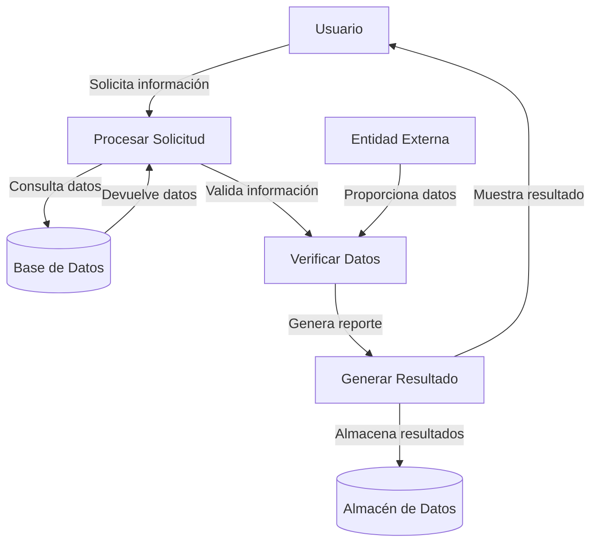

## Module: CConsultarCrSegurosClubAdicional.cpp
# Análisis Integral del Módulo CConsultarCrSegurosClubAdicional.cpp

## Nombre del Módulo/Componente SQL
CConsultarCrSegurosClubAdicional.cpp - Clase para consultar información de seguros del Club Adicional en un sistema de crédito.

## Objetivos Primarios
Este módulo tiene como propósito principal consultar y procesar información relacionada con seguros del Club Adicional en un sistema de crédito. Está diseñado para recuperar datos específicos de seguros asociados a clientes, validar su elegibilidad y preparar la información para su presentación o procesamiento posterior.

## Funciones, Métodos y Consultas Críticas
- **ConsultarCrSegurosClubAdicional()**: Constructor de la clase que inicializa variables.
- **~ConsultarCrSegurosClubAdicional()**: Destructor que libera recursos.
- **Consultar()**: Método principal que ejecuta la consulta de seguros.
- **ConsultarDatos()**: Método que realiza la consulta a la base de datos.
- **ValidarDatos()**: Valida los datos recuperados según reglas de negocio.
- **ObtenerDatos()**: Recupera los datos procesados para su uso externo.

## Variables y Elementos Clave
- **m_pConexion**: Conexión a la base de datos.
- **m_pstDatos**: Estructura para almacenar los datos de seguros.
- **m_nNumRegistros**: Contador de registros encontrados.
- **m_nCodigoError**: Código de error para manejo de excepciones.
- **Tablas principales**: CR_SEGUROS_CLUB_ADICIONAL, CR_CLIENTES, CR_CREDITOS.
- **Columnas clave**: ID_SEGURO, ID_CLIENTE, FECHA_INICIO, FECHA_FIN, ESTADO, MONTO.

## Interdependencias y Relaciones
- Se relaciona con el módulo de gestión de clientes para validar la existencia del cliente.
- Interactúa con el módulo de créditos para verificar la elegibilidad del cliente.
- Utiliza servicios de conexión a base de datos proporcionados por otro componente del sistema.
- Establece relaciones entre las tablas CR_SEGUROS_CLUB_ADICIONAL, CR_CLIENTES y CR_CREDITOS mediante claves foráneas.

## Operaciones Principales vs. Auxiliares
**Operaciones Principales:**
- Consulta de datos de seguros en la base de datos.
- Procesamiento y validación de la información recuperada.

**Operaciones Auxiliares:**
- Inicialización de variables y estructuras.
- Manejo de errores y excepciones.
- Liberación de recursos.
- Validaciones de seguridad y acceso.

## Secuencia Operacional/Flujo de Ejecución
1. Inicialización de variables y estructuras de datos.
2. Validación de parámetros de entrada.
3. Establecimiento de conexión con la base de datos.
4. Ejecución de la consulta principal.
5. Procesamiento de resultados y almacenamiento en estructuras internas.
6. Validación de los datos según reglas de negocio.
7. Preparación de datos para su retorno.
8. Liberación de recursos y finalización.

## Aspectos de Rendimiento y Optimización
- Posible cuello de botella en la consulta principal si la tabla CR_SEGUROS_CLUB_ADICIONAL crece significativamente.
- Se recomienda revisar los índices en las columnas ID_CLIENTE e ID_SEGURO para optimizar las búsquedas.
- La gestión de memoria podría optimizarse para manejar grandes conjuntos de resultados.
- Considerar la implementación de caché para consultas frecuentes.

## Reusabilidad y Adaptabilidad
- El módulo está diseñado con un enfoque orientado a objetos que facilita su reutilización.
- Los métodos están bien encapsulados, permitiendo modificaciones sin afectar otras partes del sistema.
- La parametrización de consultas permite adaptarse a diferentes criterios de búsqueda.
- Podría mejorarse la adaptabilidad mediante la implementación de interfaces más genéricas.

## Uso y Contexto
- Se utiliza en el contexto de un sistema de gestión de créditos y seguros.
- Es invocado cuando se necesita verificar o presentar información sobre seguros del Club Adicional.
- Puede ser utilizado en procesos de generación de reportes, validación de elegibilidad o actualización de datos de seguros.
- Depende de la disponibilidad y consistencia de la base de datos subyacente.

## Suposiciones y Limitaciones
- Asume la existencia de una estructura específica de base de datos con tablas y relaciones predefinidas.
- Requiere permisos adecuados para acceder a las tablas involucradas.
- Limitado a la consulta de información; no implementa funcionalidades de modificación de datos.
- Puede tener limitaciones de rendimiento con grandes volúmenes de datos si no se optimiza adecuadamente.
- Asume un formato específico para fechas y otros tipos de datos en la base de datos.
## Flow Diagram [via mermaid]

