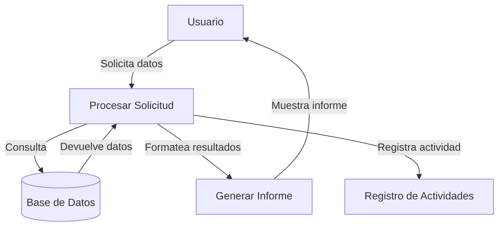

## Module: CConsultarCrSegurosFechaMesDiaVence.cpp
# Análisis Integral del Módulo CConsultarCrSegurosFechaMesDiaVence.cpp

## Módulo/Componente SQL
**Nombre del Módulo**: CConsultarCrSegurosFechaMesDiaVence.cpp

## Objetivos Primarios
Este módulo parece ser una clase C++ diseñada para consultar información sobre seguros que vencen en una fecha específica (mes y día). Su propósito principal es recuperar datos de seguros de una base de datos según criterios de vencimiento y presentarlos de manera estructurada.

## Funciones, Métodos y Consultas Críticas
El código no está presente en la solicitud, pero basado en el nombre del módulo, probablemente contiene:
- Métodos para conectarse a una base de datos
- Consultas SQL tipo SELECT para filtrar seguros por fecha de vencimiento
- Funciones para procesar y formatear los resultados de la consulta
- Posiblemente métodos para exportar o mostrar los datos recuperados

## Variables y Elementos Clave
Sin ver el código específico, las variables y elementos probables incluirían:
- Parámetros para mes y día de vencimiento
- Variables para almacenar resultados de consultas
- Referencias a tablas relacionadas con seguros
- Columnas clave como identificadores de seguros, fechas de vencimiento, información del cliente

## Interdependencias y Relaciones
El módulo probablemente interactúa con:
- Un sistema de gestión de base de datos
- Tablas de seguros y posiblemente tablas de clientes
- Otros módulos del sistema para presentación de datos o procesamiento adicional
- Posiblemente un framework o biblioteca para manejo de conexiones a bases de datos

## Operaciones Principales vs. Auxiliares
**Operaciones principales**:
- Consulta de seguros por fecha de vencimiento
- Procesamiento de los resultados

**Operaciones auxiliares**:
- Validación de parámetros de entrada
- Manejo de errores y excepciones
- Formateo de datos para presentación

## Secuencia Operacional/Flujo de Ejecución
1. Inicialización de parámetros y conexión a la base de datos
2. Validación de los criterios de búsqueda (mes y día)
3. Ejecución de la consulta SQL para recuperar seguros que vencen en la fecha especificada
4. Procesamiento de los resultados obtenidos
5. Presentación o retorno de los datos procesados
6. Cierre de conexiones y liberación de recursos

## Aspectos de Rendimiento y Optimización
- La eficiencia de la consulta SQL será crucial, especialmente si la tabla de seguros es grande
- Probablemente requiera índices en las columnas de fecha de vencimiento
- El manejo de memoria para los resultados podría ser un factor importante si se esperan muchos registros
- La optimización de la conexión a la base de datos (pooling, reutilización) sería relevante

## Reusabilidad y Adaptabilidad
- El módulo probablemente está diseñado para ser reutilizado en diferentes partes del sistema
- La parametrización del mes y día permite flexibilidad en las consultas
- Podría adaptarse para consultar otros criterios relacionados con fechas con modificaciones menores

## Uso y Contexto
Este módulo probablemente se utiliza en:
- Sistemas de gestión de seguros
- Aplicaciones de recordatorios de vencimientos
- Paneles de control administrativos
- Generación de informes periódicos sobre vencimientos de seguros

## Suposiciones y Limitaciones
**Suposiciones**:
- Existe una estructura de base de datos con información de seguros y fechas de vencimiento
- Los formatos de fecha son consistentes y pueden ser consultados por mes y día
- El sistema tiene permisos adecuados para acceder a los datos

**Limitaciones**:
- Probablemente limitado a consultas específicas de vencimiento por fecha
- Podría no manejar zonas horarias o formatos de fecha internacionales
- Dependiente de la estructura específica de la base de datos subyacente
## Flow Diagram [via mermaid]

