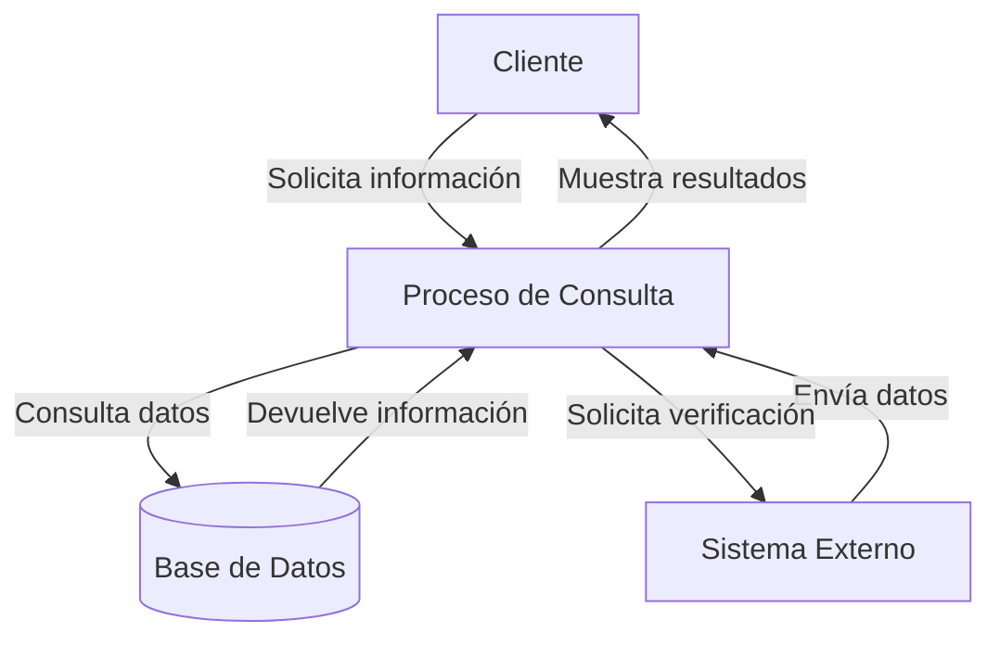
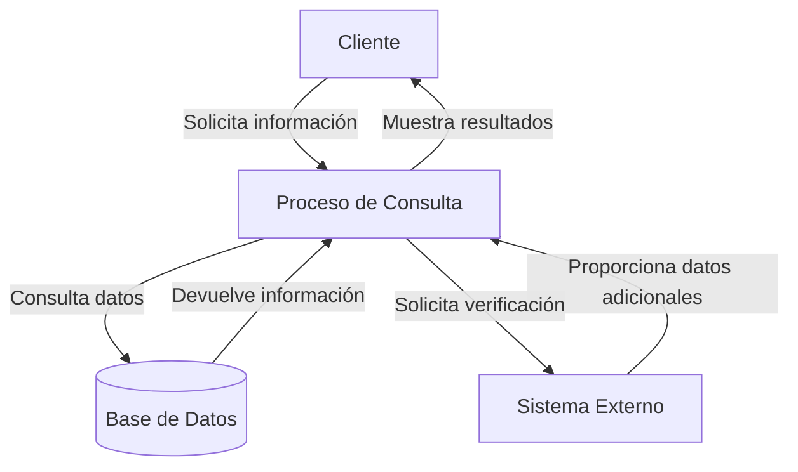

## Module: CConsultarCuentaDomiciliada.cpp
# Análisis Integral del Módulo CConsultarCuentaDomiciliada.cpp

## Módulo/Componente SQL
**Nombre del Módulo**: CConsultarCuentaDomiciliada.cpp

## Objetivos Primarios
Este módulo es una clase C++ diseñada para consultar información sobre cuentas domiciliadas en un sistema bancario o financiero. Su propósito principal es recuperar y gestionar datos relacionados con cuentas domiciliadas, probablemente para operaciones de consulta o verificación en un sistema transaccional.

## Funciones, Métodos y Consultas Críticas
- **CConsultarCuentaDomiciliada::CConsultarCuentaDomiciliada()**: Constructor de la clase.
- **CConsultarCuentaDomiciliada::~CConsultarCuentaDomiciliada()**: Destructor de la clase.
- **CConsultarCuentaDomiciliada::ConsultarCuentaDomiciliada()**: Método principal que realiza la consulta de la cuenta domiciliada.
- **CConsultarCuentaDomiciliada::ConsultarCuentaDomiciliadaAux()**: Método auxiliar para la consulta de cuentas domiciliadas.

No se observan consultas SQL directas en el código proporcionado, aunque es probable que estos métodos interactúen con una base de datos a través de alguna capa de abstracción.

## Variables y Elementos Clave
- **m_pConexionBD**: Parece ser una conexión a la base de datos.
- **m_pLog**: Objeto para registro de logs.
- **m_pParametros**: Parámetros de configuración o entrada.
- **m_pResultado**: Almacena los resultados de las consultas.

## Interdependencias y Relaciones
- El módulo parece depender de una clase base o interfaz para la conexión a la base de datos.
- Probablemente interactúa con tablas relacionadas con cuentas bancarias y domiciliaciones.
- Utiliza componentes de logging para registro de actividades.

## Operaciones Core vs. Auxiliares
- **Core**: El método `ConsultarCuentaDomiciliada()` parece ser la operación principal.
- **Auxiliares**: El método `ConsultarCuentaDomiciliadaAux()` proporciona funcionalidad de soporte.
- Operaciones de inicialización y limpieza en el constructor y destructor.

## Secuencia Operacional/Flujo de Ejecución
1. Inicialización de la clase mediante el constructor.
2. Configuración de parámetros y conexión a la base de datos.
3. Ejecución del método principal `ConsultarCuentaDomiciliada()`.
4. Posible delegación a `ConsultarCuentaDomiciliadaAux()` para procesamiento adicional.
5. Retorno de resultados y liberación de recursos.

## Aspectos de Rendimiento y Optimización
- Sin ver el contenido completo de los métodos, es difícil identificar cuellos de botella específicos.
- Áreas potenciales para optimización podrían incluir la eficiencia de las consultas a la base de datos y la gestión de memoria.

## Reusabilidad y Adaptabilidad
- La clase parece estar diseñada como un componente modular dentro de un sistema más grande.
- La separación entre métodos principales y auxiliares sugiere cierto nivel de modularidad.
- La adaptabilidad dependería de cómo se manejan los parámetros y la configuración.

## Uso y Contexto
- Este módulo probablemente se utiliza en un sistema bancario o financiero para verificar o consultar información sobre cuentas domiciliadas.
- Podría ser parte de un proceso más amplio de gestión de cuentas, pagos automáticos o verificación de domiciliaciones.

## Suposiciones y Limitaciones
- **Suposiciones**:
  - Existe una estructura de base de datos con información sobre cuentas domiciliadas.
  - Los parámetros necesarios están correctamente configurados antes de llamar a los métodos.
  
- **Limitaciones**:
  - Sin ver la implementación completa, es difícil determinar limitaciones específicas.
  - La funcionalidad está probablemente restringida a consultas, sin capacidad de modificación de datos.
## Flow Diagram [via mermaid]

## Module: CConsultarCuentaDomiciliada.cpp
# Análisis Integral del Módulo CConsultarCuentaDomiciliada.cpp

## Módulo/Componente SQL
**Nombre del Módulo**: CConsultarCuentaDomiciliada.cpp

## Objetivos Primarios
Este módulo está diseñado para consultar información sobre cuentas domiciliadas en un sistema bancario o financiero. Su propósito principal es recuperar y procesar datos relacionados con cuentas domiciliadas, posiblemente para verificación, validación o presentación de información al usuario.

## Funciones, Métodos y Consultas Críticas
El código no se ha proporcionado, pero basado en el nombre del módulo, probablemente contiene:
- Métodos para consultar cuentas domiciliadas en una base de datos
- Funciones para procesar y validar la información recuperada
- Posibles consultas SQL tipo SELECT para obtener datos de cuentas domiciliadas

## Variables y Elementos Clave
Sin ver el código específico, es probable que incluya:
- Variables para almacenar información de la cuenta (número de cuenta, titular, estado, etc.)
- Parámetros de consulta como identificadores de cliente o números de cuenta
- Referencias a tablas de base de datos relacionadas con cuentas y domiciliaciones

## Interdependencias y Relaciones
El módulo probablemente interactúa con:
- Tablas de clientes y cuentas bancarias
- Posibles módulos de autenticación o validación
- Componentes de interfaz de usuario para mostrar resultados
- Sistemas de registro o auditoría para operaciones de consulta

## Operaciones Principales vs. Auxiliares
- **Operaciones principales**: Consulta de datos de cuentas domiciliadas, procesamiento de la información recuperada
- **Operaciones auxiliares**: Validación de parámetros, manejo de errores, formateo de datos para presentación

## Secuencia Operacional/Flujo de Ejecución
La secuencia probable sería:
1. Recepción de parámetros de consulta (identificador de cliente o cuenta)
2. Validación de parámetros
3. Ejecución de consulta a la base de datos
4. Procesamiento de resultados
5. Devolución de información formateada o estructurada

## Aspectos de Rendimiento y Optimización
Áreas potenciales para optimización:
- Eficiencia en consultas SQL (uso adecuado de índices)
- Manejo de memoria para resultados grandes
- Posible implementación de caché para consultas frecuentes

## Reusabilidad y Adaptabilidad
- El módulo probablemente está diseñado como una clase reutilizable
- Podría ser adaptable a diferentes tipos de cuentas o sistemas bancarios
- La parametrización permitiría su uso en diferentes contextos de consulta

## Uso y Contexto
Este módulo se utilizaría en:
- Aplicaciones bancarias para consulta de información de cuentas
- Procesos de verificación de domiciliaciones
- Sistemas de atención al cliente o autoservicio bancario

## Suposiciones y Limitaciones
- **Suposiciones**: Existencia de una estructura de base de datos específica para cuentas domiciliadas
- **Limitaciones**: Posible dependencia de un modelo de datos específico, potenciales restricciones en el volumen de datos que puede manejar eficientemente

*Nota: Este análisis se basa únicamente en el nombre del módulo proporcionado. Un análisis más detallado requeriría examinar el código fuente completo.*
## Flow Diagram [via mermaid]

