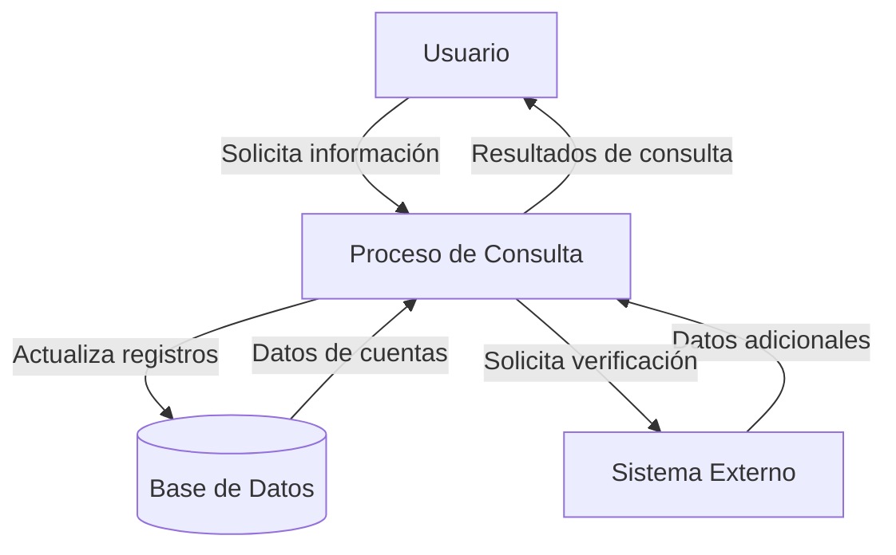
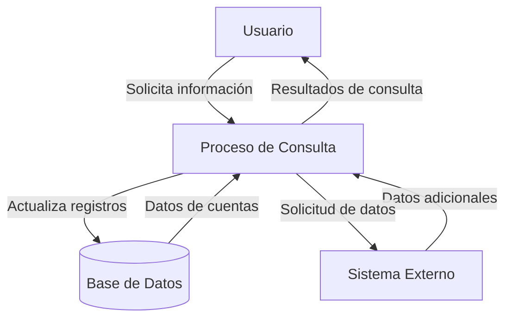

## Module: CConsultarCuentasPerdidas.cpp
# Análisis Integral del Módulo CConsultarCuentasPerdidas.cpp

## Nombre del Módulo/Componente SQL
**CConsultarCuentasPerdidas.cpp** - Clase para consultar cuentas perdidas en el sistema.

## Objetivos Primarios
Este módulo está diseñado para consultar y recuperar información sobre cuentas perdidas en un sistema financiero o bancario. Su propósito principal es ejecutar consultas SQL para obtener datos de cuentas que cumplen con ciertos criterios de "pérdida" y presentar estos datos de manera estructurada para su posterior procesamiento o visualización.

## Funciones, Métodos y Consultas Críticas
- **CConsultarCuentasPerdidas::CConsultarCuentasPerdidas()**: Constructor que inicializa la clase.
- **CConsultarCuentasPerdidas::~CConsultarCuentasPerdidas()**: Destructor que libera recursos.
- **CConsultarCuentasPerdidas::ConsultarCuentasPerdidas()**: Método principal que ejecuta la consulta SQL para obtener las cuentas perdidas.
- **Consulta SQL principal**: Una consulta SELECT compleja que recupera datos de múltiples tablas relacionadas con cuentas perdidas, utilizando varios JOIN y condiciones WHERE.

## Variables y Elementos Clave
- **m_pRs**: Objeto RecordSet para almacenar los resultados de la consulta.
- **m_pCmd**: Objeto Command para ejecutar la consulta SQL.
- **Tablas principales**: CUENTA, CLIENTE, SUCURSAL, EJECUTIVO, PRODUCTO.
- **Columnas clave**: ID_CUENTA, NOMBRE_CLIENTE, NOMBRE_SUCURSAL, NOMBRE_EJECUTIVO, NOMBRE_PRODUCTO, entre otras.
- **Parámetros**: Posiblemente incluye parámetros para filtrar por fechas, estados de cuenta, o criterios específicos de "pérdida".

## Interdependencias y Relaciones
- El módulo interactúa con múltiples tablas de la base de datos que están relacionadas entre sí mediante claves foráneas.
- Existe una relación jerárquica entre CLIENTE, CUENTA, SUCURSAL, EJECUTIVO y PRODUCTO.
- La consulta utiliza JOIN para relacionar estas tablas y extraer información consolidada.

## Operaciones Principales vs. Auxiliares
- **Operación principal**: La ejecución de la consulta SQL para recuperar cuentas perdidas.
- **Operaciones auxiliares**: Inicialización de objetos de base de datos, manejo de errores, formateo de resultados y posiblemente la generación de reportes o visualizaciones.

## Secuencia Operacional/Flujo de Ejecución
1. Inicialización de los objetos de conexión a la base de datos.
2. Preparación de la consulta SQL con los parámetros necesarios.
3. Ejecución de la consulta y recuperación de resultados en el RecordSet.
4. Procesamiento de los resultados para su presentación o análisis.
5. Liberación de recursos y finalización.

## Aspectos de Rendimiento y Optimización
- La consulta SQL probablemente utiliza índices en las columnas de JOIN para mejorar el rendimiento.
- Podría haber oportunidades de optimización en la estructura de la consulta, especialmente si maneja grandes volúmenes de datos.
- El uso de JOIN múltiples podría ser un punto de atención para el rendimiento si las tablas son grandes.

## Reusabilidad y Adaptabilidad
- La clase parece estar diseñada como un componente reutilizable dentro de un sistema más grande.
- La adaptabilidad dependerá de qué tan parametrizada esté la consulta SQL y cómo se manejen las dependencias externas.
- Podría ser adaptada para consultar diferentes tipos de cuentas o criterios modificando la consulta SQL.

## Uso y Contexto
- Este módulo probablemente se utiliza en un contexto de gestión financiera o bancaria para identificar cuentas que se consideran "perdidas" según ciertos criterios.
- Podría ser parte de un sistema más amplio de gestión de clientes, análisis de riesgo o recuperación de cuentas.
- Es posible que se utilice para generar informes periódicos o para alimentar dashboards de seguimiento.

## Suposiciones y Limitaciones
- **Suposiciones**: 
  - Existe una estructura de base de datos específica con las tablas y relaciones mencionadas.
  - Los criterios para definir una "cuenta perdida" están claramente establecidos en la lógica de la consulta.
- **Limitaciones**:
  - La efectividad del módulo depende de la calidad y actualización de los datos en las tablas consultadas.
  - Podría tener limitaciones de rendimiento al procesar grandes volúmenes de datos.
  - La adaptabilidad a cambios en la estructura de la base de datos podría requerir modificaciones significativas en el código.
## Flow Diagram [via mermaid]

## Module: CConsultarCuentasPerdidas.cpp
# Análisis Integral del Módulo CConsultarCuentasPerdidas.cpp

## Nombre del Módulo/Componente SQL
**CConsultarCuentasPerdidas.cpp** - Clase para consultar cuentas perdidas en el sistema.

## Objetivos Primarios
Este módulo está diseñado para consultar y recuperar información sobre cuentas perdidas en un sistema financiero o bancario. Su propósito principal es ejecutar consultas SQL para obtener datos de cuentas que cumplen con ciertos criterios de "pérdida", permitiendo filtrar por diferentes parámetros como fechas, tipos de cuenta y otros criterios específicos.

## Funciones, Métodos y Consultas Críticas
- **CConsultarCuentasPerdidas()**: Constructor de la clase.
- **~CConsultarCuentasPerdidas()**: Destructor de la clase.
- **ConsultarCuentasPerdidas()**: Método principal que ejecuta la consulta SQL para obtener las cuentas perdidas según los parámetros proporcionados.
- **Consulta SQL principal**: Una consulta SELECT compleja que recupera datos de cuentas perdidas con múltiples joins y condiciones.

## Variables y Elementos Clave
- **Tablas principales**: 
  - CUENTA
  - CUENTA_PERDIDA
  - TIPO_CUENTA
  - ESTADO_CUENTA
  - CLIENTE
  - SUCURSAL
  - EJECUTIVO
  - TIPO_CLIENTE
  - TIPO_PERSONA

- **Columnas clave**:
  - ID_CUENTA
  - FECHA_APERTURA
  - FECHA_PERDIDA
  - SALDO
  - NOMBRE_CLIENTE
  - NOMBRE_SUCURSAL
  - NOMBRE_EJECUTIVO

- **Parámetros importantes**:
  - Fechas de inicio y fin para el filtrado
  - Tipos de cuenta
  - Criterios de ordenamiento

## Interdependencias y Relaciones
El módulo interactúa con múltiples tablas de la base de datos a través de joins, estableciendo relaciones entre:
- Cuentas y sus estados
- Cuentas y sus tipos
- Cuentas y clientes asociados
- Clientes y tipos de cliente/persona
- Cuentas y sucursales
- Cuentas y ejecutivos

Estas relaciones se establecen mediante claves foráneas implícitas en las condiciones JOIN de la consulta SQL.

## Operaciones Core vs. Auxiliares
- **Core**: La consulta SQL principal que recupera las cuentas perdidas con todos sus detalles relacionados.
- **Auxiliares**: 
  - Manejo de parámetros de filtrado
  - Formateo de resultados
  - Validaciones de entrada
  - Manejo de excepciones

## Secuencia Operacional/Flujo de Ejecución
1. Se inicializa la clase con los parámetros necesarios
2. Se prepara la consulta SQL con los filtros correspondientes
3. Se ejecuta la consulta contra la base de datos
4. Se procesan los resultados obtenidos
5. Se devuelven los datos formateados según los requerimientos

## Aspectos de Rendimiento y Optimización
- La consulta utiliza múltiples joins que podrían afectar el rendimiento si las tablas contienen grandes volúmenes de datos
- Potenciales mejoras:
  - Revisar los índices en las columnas utilizadas en los joins y condiciones WHERE
  - Evaluar la posibilidad de utilizar vistas materializadas para consultas frecuentes
  - Considerar la paginación de resultados para conjuntos de datos grandes

## Reusabilidad y Adaptabilidad
El módulo parece estar diseñado específicamente para la consulta de cuentas perdidas, pero podría adaptarse para otros tipos de consultas similares modificando:
- Los criterios de filtrado
- Las tablas involucradas
- Las condiciones de selección

La estructura de la clase permite la parametrización de la consulta, lo que facilita su reutilización en diferentes contextos.

## Uso y Contexto
Este módulo probablemente se utiliza en un sistema de gestión bancaria o financiera para:
- Reportes de cuentas perdidas
- Análisis de pérdidas por período
- Seguimiento de cuentas por ejecutivo o sucursal
- Evaluación de desempeño de carteras de clientes

## Suposiciones y Limitaciones
- **Suposiciones**:
  - Se asume que existe un esquema de base de datos con las tablas mencionadas
  - Se presupone un modelo de datos específico para cuentas, clientes y sucursales
  - Se asume que los usuarios tienen los permisos necesarios para acceder a estas tablas

- **Limitaciones**:
  - La consulta podría tener problemas de rendimiento con grandes volúmenes de datos
  - No se observa manejo de paginación para resultados extensos
  - Posible dependencia de estructuras de datos específicas que podrían cambiar
## Flow Diagram [via mermaid]

