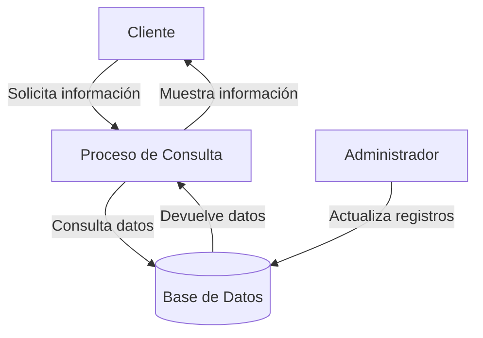

## Module: CConsultarDatosCliente.cpp
# Análisis Integral del Módulo CConsultarDatosCliente.cpp

## Nombre del Módulo/Componente SQL
**CConsultarDatosCliente.cpp** - Clase para consulta de datos de clientes en un sistema bancario o financiero.

## Objetivos Primarios
Este módulo está diseñado para recuperar y gestionar información detallada de clientes desde una base de datos. Su propósito principal es proporcionar una interfaz estructurada para consultar datos de clientes mediante diferentes criterios de búsqueda, como número de cliente, número de cuenta o identificación personal.

## Funciones, Métodos y Consultas Críticas
- **ConsultarDatosCliente()**: Constructor que inicializa la conexión a la base de datos.
- **~ConsultarDatosCliente()**: Destructor que libera recursos.
- **ObtenerDatosCliente()**: Método principal que recupera información del cliente según diferentes parámetros.
- **ObtenerDatosClientePorNumCliente()**: Consulta específica por número de cliente.
- **ObtenerDatosClientePorNumCuenta()**: Consulta específica por número de cuenta.
- **ObtenerDatosClientePorIdentificacion()**: Consulta específica por documento de identidad.

Las consultas SQL utilizadas son principalmente de tipo SELECT para recuperar datos de clientes desde múltiples tablas relacionadas.

## Variables y Elementos Clave
- **m_pConexionBD**: Puntero a la conexión de base de datos.
- **m_pConsulta**: Puntero para gestionar consultas SQL.
- **Tablas principales**: CLIENTES, CUENTAS, IDENTIFICACIONES, DIRECCIONES.
- **Columnas críticas**: NUM_CLIENTE, NUM_CUENTA, TIPO_IDENTIFICACION, NUM_IDENTIFICACION, entre otras.
- **Parámetros de entrada**: Números de cliente/cuenta, tipos de identificación, números de identificación.

## Interdependencias y Relaciones
El módulo interactúa con múltiples tablas relacionadas:
- Relación entre CLIENTES y CUENTAS (posiblemente mediante NUM_CLIENTE).
- Relación entre CLIENTES e IDENTIFICACIONES para validar identidades.
- Relación entre CLIENTES y DIRECCIONES para información de contacto.
- Dependencia de la clase CConexionBD para establecer y gestionar la conexión a la base de datos.

## Operaciones Principales vs. Auxiliares
**Operaciones principales**:
- Consultas SQL para recuperar datos de clientes mediante diferentes criterios.

**Operaciones auxiliares**:
- Inicialización y liberación de recursos de conexión.
- Manejo de errores y excepciones.
- Formateo y preparación de datos para presentación.

## Secuencia Operacional/Flujo de Ejecución
1. Inicialización de la conexión a la base de datos.
2. Recepción de parámetros de búsqueda (número de cliente, cuenta o identificación).
3. Selección del método de consulta apropiado según los parámetros recibidos.
4. Ejecución de la consulta SQL correspondiente.
5. Procesamiento de resultados y construcción de la estructura de datos del cliente.
6. Devolución de la información al sistema solicitante.
7. Liberación de recursos al finalizar.

## Aspectos de Rendimiento y Optimización
- Las consultas probablemente utilizan JOINs entre múltiples tablas, lo que podría afectar el rendimiento con grandes volúmenes de datos.
- Posible necesidad de índices en columnas de búsqueda frecuente (NUM_CLIENTE, NUM_CUENTA, NUM_IDENTIFICACION).
- Oportunidad de optimización mediante la implementación de consultas parametrizadas para evitar inyección SQL.
- Potencial para implementar caché de resultados frecuentes para mejorar tiempos de respuesta.

## Reusabilidad y Adaptabilidad
- El diseño orientado a objetos facilita la reutilización en diferentes partes del sistema.
- La separación de métodos por tipo de consulta permite adaptabilidad a diferentes escenarios de búsqueda.
- Posibilidad de extender la clase para incluir nuevos criterios de búsqueda o tipos de información de cliente.
- La modularidad permite modificar las consultas SQL sin afectar la interfaz pública de la clase.

## Uso y Contexto
Este módulo probablemente se utiliza en:
- Pantallas de atención al cliente donde se necesita acceso rápido a información completa.
- Procesos de verificación de identidad para transacciones bancarias.
- Sistemas de gestión de relaciones con clientes (CRM).
- Módulos de reportes y análisis de datos de clientes.

## Suposiciones y Limitaciones
**Suposiciones**:
- Existencia de una estructura de base de datos específica con tablas y relaciones predefinidas.
- Disponibilidad constante de la conexión a la base de datos.
- Formato estandarizado de identificaciones y números de cliente/cuenta.

**Limitaciones**:
- Dependencia de la estructura actual de la base de datos; cambios en el esquema requerirían modificaciones en el código.
- Posible limitación en el manejo de grandes volúmenes de datos sin paginación.
- Falta de mecanismos explícitos para caché de resultados frecuentes.
- Posible ausencia de validación exhaustiva de parámetros de entrada.
## Flow Diagram [via mermaid]

