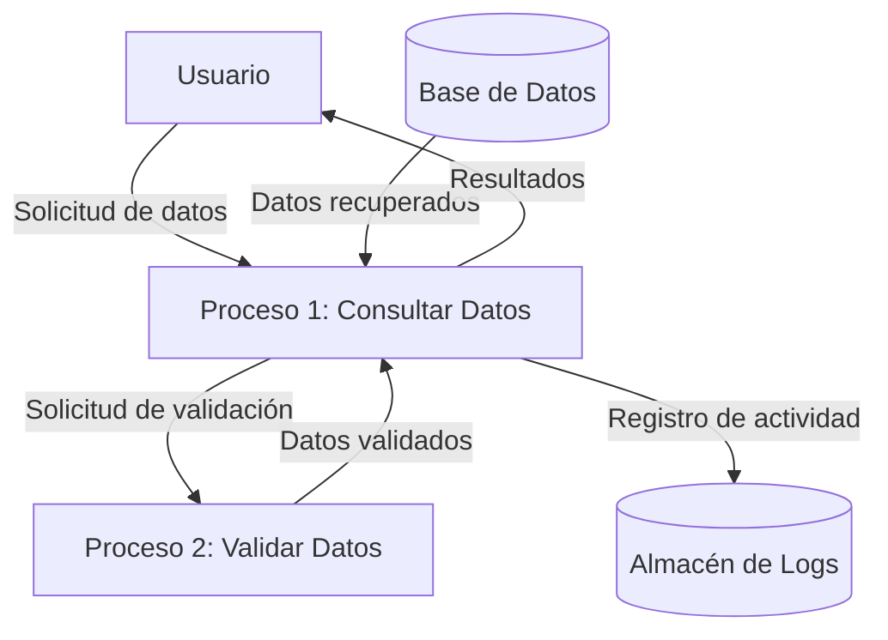

## Module: CConsultarDatosGnDominio3.cpp
# Análisis Integral del Módulo CConsultarDatosGnDominio3.cpp

## Nombre del Módulo/Componente SQL
CConsultarDatosGnDominio3.cpp - Clase para consulta de datos de dominio en un sistema de gestión.

## Objetivos Primarios
Este módulo implementa una clase que se encarga de consultar datos de dominios específicos en una base de datos. Su propósito principal es recuperar información de dominios y sus valores asociados, permitiendo filtrar por diferentes criterios como el código de dominio, descripción, o estado.

## Funciones, Métodos y Consultas Críticas
- **CConsultarDatosGnDominio3()**: Constructor de la clase.
- **~CConsultarDatosGnDominio3()**: Destructor de la clase.
- **ConsultarDominio()**: Método principal que ejecuta la consulta de dominios según los parámetros proporcionados.
- **ConsultarValoresDominio()**: Método para consultar los valores específicos asociados a un dominio.
- **ConsultarValoresDominioXCodigo()**: Método especializado para consultar valores de dominio filtrados por código.

Las consultas SQL principales son SELECT que recuperan datos de las tablas GN_DOMINIO y GN_VALORES_DOMINIO con diversos criterios de filtrado.

## Variables y Elementos Clave
- **Tablas**: 
  - GN_DOMINIO: Almacena información general de dominios
  - GN_VALORES_DOMINIO: Contiene los valores específicos de cada dominio

- **Parámetros importantes**:
  - `psCodDominio`: Código del dominio a consultar
  - `psDescripcion`: Descripción para filtrar dominios
  - `psEstado`: Estado del dominio (A=Activo, I=Inactivo)
  - `pnIdDominio`: Identificador numérico del dominio
  - `pnIdValorDominio`: Identificador del valor específico del dominio

- **Columnas clave**:
  - ID_DOMINIO, COD_DOMINIO, DESCRIPCION, ESTADO en GN_DOMINIO
  - ID_VALOR_DOMINIO, ID_DOMINIO, CODIGO, DESCRIPCION, ESTADO en GN_VALORES_DOMINIO

## Interdependencias y Relaciones
- Existe una relación clave entre las tablas GN_DOMINIO y GN_VALORES_DOMINIO, donde ID_DOMINIO actúa como clave foránea.
- El módulo depende de la clase CConexion para establecer la conexión con la base de datos.
- Utiliza la clase CParametros para gestionar los parámetros de las consultas SQL.
- Interactúa con CResultado para manejar los resultados de las consultas.

## Operaciones Core vs. Auxiliares
- **Operaciones Core**:
  - Consulta de dominios con filtros específicos
  - Recuperación de valores asociados a dominios
  
- **Operaciones Auxiliares**:
  - Manejo de conexiones a la base de datos
  - Construcción dinámica de consultas SQL según parámetros
  - Validación de parámetros de entrada
  - Gestión de errores y excepciones

## Secuencia Operacional/Flujo de Ejecución
1. Se inicializa la conexión a la base de datos
2. Se preparan los parámetros de consulta según los filtros proporcionados
3. Se construye la consulta SQL con las condiciones apropiadas
4. Se ejecuta la consulta contra la base de datos
5. Se procesan los resultados obtenidos
6. Se devuelven los datos en el formato requerido
7. Se liberan los recursos utilizados

## Aspectos de Rendimiento y Optimización
- Las consultas utilizan filtros específicos para reducir el conjunto de resultados.
- Potencial área de mejora: Implementación de paginación para grandes conjuntos de datos.
- No se observa uso explícito de índices en las consultas, lo que podría optimizarse.
- Las consultas dinámicas podrían beneficiarse de preparación previa para mejorar el rendimiento.

## Reusabilidad y Adaptabilidad
- La clase está diseñada con métodos específicos que pueden ser reutilizados en diferentes contextos.
- Los parámetros de consulta permiten flexibilidad en los criterios de búsqueda.
- La separación de consultas para dominios y valores de dominio facilita su uso en diferentes escenarios.
- El código podría beneficiarse de mayor modularidad para facilitar extensiones futuras.

## Uso y Contexto
- Este módulo se utiliza en un sistema de gestión para recuperar información de catálogos o listas de valores predefinidos (dominios).
- Probablemente forma parte de un sistema más amplio que requiere acceso a datos de referencia o parámetros configurables.
- Es utilizado cuando se necesita mostrar opciones en interfaces de usuario o validar valores contra listas predefinidas.

## Suposiciones y Limitaciones
- **Suposiciones**:
  - Se asume que las tablas GN_DOMINIO y GN_VALORES_DOMINIO existen y tienen la estructura esperada.
  - Se espera que los estados de los dominios sean 'A' (activo) o 'I' (inactivo).
  - Se asume que la conexión a la base de datos está correctamente configurada.

- **Limitaciones**:
  - No se observa manejo de transacciones, lo que podría ser problemático en operaciones complejas.
  - La gestión de errores parece básica y podría mejorarse para proporcionar información más detallada.
  - No hay evidencia de mecanismos de caché para consultas frecuentes, lo que podría afectar el rendimiento.
## Flow Diagram [via mermaid]

