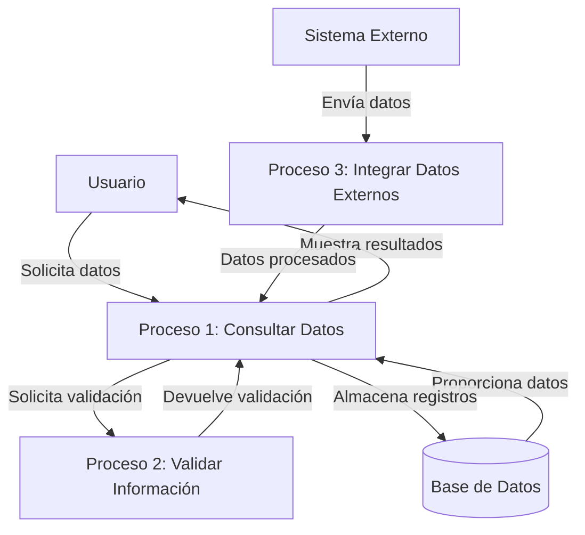
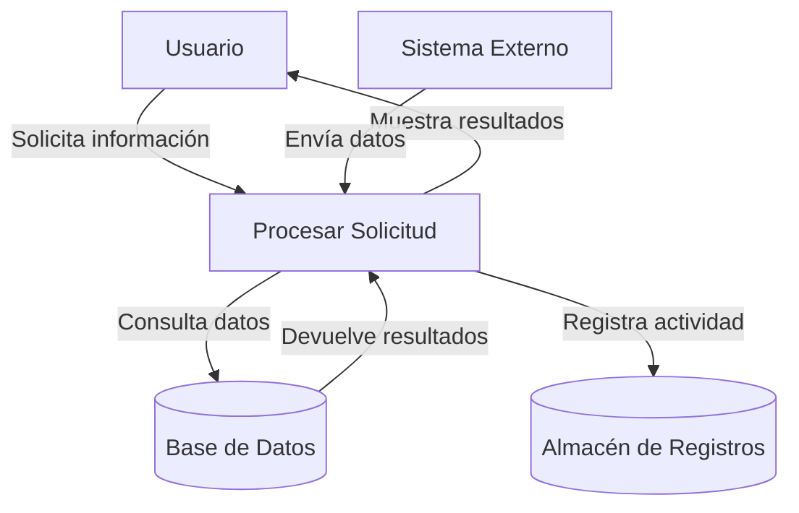

## Module: CConsultarDatosGnDominio4.cpp
# Análisis Integral del Módulo CConsultarDatosGnDominio4.cpp

## Nombre del Módulo/Componente SQL
CConsultarDatosGnDominio4.cpp - Clase para consulta de datos de dominio en un sistema de gestión.

## Objetivos Primarios
Este módulo implementa una clase que se encarga de consultar datos de dominios específicos en una base de datos. Su propósito principal es recuperar información de dominios y sus valores asociados, permitiendo filtrar por diferentes criterios como el código de dominio, descripción, o estado.

## Funciones, Métodos y Consultas Críticas
- **Constructor y Destructor**: Inicializa y libera recursos de la clase.
- **ConsultarDominio()**: Método principal que ejecuta la consulta de dominios según los parámetros proporcionados.
- **ConsultarValoresDominio()**: Consulta los valores asociados a un dominio específico.
- **Consulta SQL principal**: Utiliza SELECT para recuperar datos de dominios con múltiples condiciones de filtrado.

## Variables y Elementos Clave
- **Tablas**: 
  - GN_DOMINIOS: Almacena información de dominios
  - GN_VALORES_DOMINIO: Contiene los valores asociados a cada dominio
- **Columnas clave**: 
  - CODIGO_DOMINIO
  - DESCRIPCION_DOMINIO
  - ESTADO
  - CODIGO_VALOR
  - DESCRIPCION_VALOR
- **Variables importantes**:
  - m_strCodigoDominio: Código del dominio a consultar
  - m_strDescripcionDominio: Descripción para filtrar dominios
  - m_strEstado: Estado del dominio (activo/inactivo)

## Interdependencias y Relaciones
- Depende de la clase CConsultarDatos para la funcionalidad base de consulta.
- Relación entre tablas GN_DOMINIOS y GN_VALORES_DOMINIO mediante el campo CODIGO_DOMINIO.
- Interactúa con el sistema de gestión de errores para manejar excepciones.
- Utiliza componentes de conexión a base de datos para ejecutar consultas.

## Operaciones Core vs. Auxiliares
- **Core**: 
  - Consulta de dominios y sus valores mediante SQL
  - Construcción dinámica de consultas según parámetros
- **Auxiliares**:
  - Validación de parámetros
  - Manejo de errores y excepciones
  - Formateo de resultados para presentación

## Secuencia Operacional/Flujo de Ejecución
1. Inicialización de la clase con parámetros de consulta
2. Validación de parámetros de entrada
3. Construcción de la consulta SQL con condiciones dinámicas
4. Ejecución de la consulta a la base de datos
5. Procesamiento de resultados
6. Para consultas de valores de dominio, se ejecuta una consulta adicional filtrada por el código de dominio
7. Retorno de resultados al llamador

## Aspectos de Rendimiento y Optimización
- La construcción dinámica de consultas SQL permite optimizar las condiciones según los parámetros proporcionados.
- Posible área de mejora: Implementación de caché para dominios frecuentemente consultados.
- La consulta podría beneficiarse de índices en las columnas CODIGO_DOMINIO, ESTADO y campos de búsqueda textual.
- El rendimiento podría degradarse con grandes volúmenes de valores de dominio.

## Reusabilidad y Adaptabilidad
- Alta reusabilidad gracias a la parametrización de las consultas.
- Adaptable a diferentes esquemas de base de datos mediante modificación de nombres de tablas y columnas.
- La separación entre consulta de dominios y valores permite su uso independiente según necesidades.
- Podría mejorarse la modularidad extrayendo la construcción de consultas a métodos separados.

## Uso y Contexto
- Utilizado en sistemas de gestión que requieren consulta de catálogos o listas de valores predefinidos.
- Aplicable en interfaces de usuario para poblar listas desplegables, combos o grids.
- Sirve como componente de backend para servicios de consulta de datos maestros.
- Probablemente parte de un sistema más amplio de gestión empresarial o administrativa.

## Suposiciones y Limitaciones
- Asume la existencia de las tablas GN_DOMINIOS y GN_VALORES_DOMINIO con la estructura esperada.
- Limitado a la consulta de datos, no implementa funcionalidad de modificación.
- No contempla paginación para grandes conjuntos de resultados.
- Asume que los dominios tienen una estructura jerárquica simple (dominio-valores) sin niveles adicionales.
- Posible limitación en el manejo de caracteres especiales en los criterios de búsqueda textual.
## Flow Diagram [via mermaid]

## Module: CConsultarDatosGnDominio4.cpp
# Análisis Integral del Módulo CConsultarDatosGnDominio4.cpp

## Nombre del Módulo/Componente SQL
CConsultarDatosGnDominio4.cpp - Clase para consulta de datos de dominio en un sistema de gestión.

## Objetivos Primarios
Este módulo tiene como propósito principal consultar y recuperar datos de dominios específicos desde una base de datos. Está diseñado para manejar la lógica de negocio relacionada con la obtención de información de dominios, proporcionando una interfaz estructurada para acceder a estos datos mediante consultas SQL parametrizadas.

## Funciones, Métodos y Consultas Críticas
- **CConsultarDatosGnDominio4()**: Constructor de la clase que inicializa variables.
- **~CConsultarDatosGnDominio4()**: Destructor que libera recursos.
- **ConsultarDominio()**: Método principal que ejecuta la consulta SQL para obtener datos de dominio según parámetros específicos.
- **Consulta SQL principal**: SELECT que recupera información de dominios desde la tabla GN_DOMINIOS, filtrando por ID_DOMINIO y otros criterios.

## Variables y Elementos Clave
- **Tablas**: GN_DOMINIOS (tabla principal de dominios)
- **Columnas críticas**: 
  - ID_DOMINIO: Identificador del dominio
  - CODIGO: Código del dominio
  - DESCRIPCION: Descripción textual del dominio
  - ESTADO: Estado del registro (activo/inactivo)
- **Parámetros importantes**:
  - m_strIdDominio: Identificador del dominio a consultar
  - m_strCodigo: Código específico a filtrar
  - m_nEstado: Estado de los registros a recuperar

## Interdependencias y Relaciones
- El módulo depende de la biblioteca de acceso a datos (CAccesoDatos) para ejecutar consultas SQL.
- Interactúa con la tabla GN_DOMINIOS para recuperar información.
- Utiliza la clase CRecordSet para manejar los resultados de las consultas.
- Se integra con un sistema de gestión de errores para el manejo de excepciones.

## Operaciones Core vs. Auxiliares
- **Operaciones Core**:
  - La consulta SQL principal que recupera datos de dominios
  - El procesamiento de los resultados de la consulta
- **Operaciones Auxiliares**:
  - Validación de parámetros
  - Manejo de excepciones
  - Formateo de la consulta SQL según los parámetros proporcionados

## Secuencia Operacional/Flujo de Ejecución
1. Inicialización de variables y parámetros
2. Construcción de la consulta SQL con los filtros apropiados
3. Ejecución de la consulta a través del objeto de acceso a datos
4. Procesamiento de los resultados obtenidos
5. Manejo de posibles errores durante la ejecución
6. Retorno de los datos consultados al llamador

## Aspectos de Rendimiento y Optimización
- La consulta utiliza filtros específicos (ID_DOMINIO, CODIGO, ESTADO) que podrían beneficiarse de índices en estas columnas.
- El código maneja la construcción dinámica de la consulta SQL, lo que podría afectar el rendimiento si no se gestiona adecuadamente el plan de ejecución.
- No se observa paginación de resultados, lo que podría ser problemático si el conjunto de datos es muy grande.

## Reusabilidad y Adaptabilidad
- La clase está diseñada para ser reutilizable, permitiendo diferentes consultas de dominio mediante la parametrización.
- El diseño modular facilita su integración en diferentes partes del sistema.
- La separación entre la lógica de acceso a datos y la lógica de negocio mejora la adaptabilidad.

## Uso y Contexto
- Este módulo se utiliza en un sistema de gestión para recuperar información de catálogos o dominios.
- Probablemente forma parte de un componente más grande que maneja la configuración o parametrización del sistema.
- Se invoca cuando se necesita obtener información de dominios específicos para presentarla al usuario o utilizarla en procesos de negocio.

## Suposiciones y Limitaciones
- Asume la existencia de una tabla GN_DOMINIOS con la estructura esperada.
- Requiere una conexión a base de datos funcional a través del componente CAccesoDatos.
- No maneja paginación, lo que podría ser una limitación para conjuntos de datos grandes.
- La gestión de errores depende de un sistema externo de manejo de excepciones.
- No se observa manejo de concurrencia o bloqueos, lo que podría ser relevante en entornos multiusuario.
## Flow Diagram [via mermaid]

