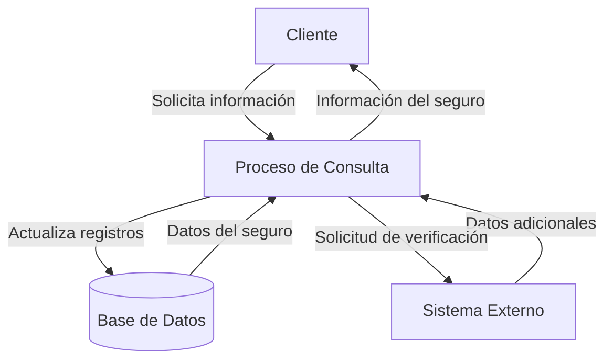

## Module: CConsultarDatosSeguroAdicional.cpp
# Análisis Integral del Módulo CConsultarDatosSeguroAdicional.cpp

## Nombre del Módulo/Componente SQL
CConsultarDatosSeguroAdicional.cpp - Clase para consulta de datos de seguros adicionales

## Objetivos Primarios
Este módulo tiene como propósito principal consultar y recuperar información detallada sobre seguros adicionales desde una base de datos. Está diseñado para manejar la lógica de negocio relacionada con la consulta de datos de seguros adicionales, incluyendo la validación de parámetros y la construcción de consultas SQL dinámicas.

## Funciones, Métodos y Consultas Críticas
- **CConsultarDatosSeguroAdicional::ConsultarDatosSeguroAdicional()**: Método principal que ejecuta la consulta de datos del seguro adicional.
- **CConsultarDatosSeguroAdicional::ValidarParametros()**: Valida los parámetros de entrada antes de realizar la consulta.
- **Consulta SQL principal**: Utiliza SELECT para recuperar datos de seguros adicionales con múltiples JOIN entre tablas relacionadas.

## Variables y Elementos Clave
- **Tablas**: SEGUROS_ADICIONALES, SEGUROS_ADICIONALES_DETALLE, SEGUROS_ADICIONALES_DETALLE_BENEFICIARIOS
- **Parámetros de entrada**: 
  - `m_nIdSeguroAdicional`: Identificador del seguro adicional
  - `m_nIdDetalleSeguroAdicional`: Identificador del detalle del seguro
  - `m_nIdBeneficiario`: Identificador del beneficiario
- **Variables importantes**: 
  - `m_strSQL`: Almacena la consulta SQL dinámica
  - `m_pRecordset`: Objeto para manejar el conjunto de resultados

## Interdependencias y Relaciones
- Interactúa con múltiples tablas relacionadas con seguros adicionales mediante JOIN.
- Depende de la clase base CConsultaBase para funcionalidad heredada.
- Utiliza componentes ADO para la conexión y manipulación de datos.
- Relaciones entre tablas: SEGUROS_ADICIONALES → SEGUROS_ADICIONALES_DETALLE → SEGUROS_ADICIONALES_DETALLE_BENEFICIARIOS

## Operaciones Core vs. Auxiliares
- **Core**: 
  - Construcción y ejecución de la consulta SQL para recuperar datos de seguros
  - Procesamiento del conjunto de resultados
- **Auxiliares**: 
  - Validación de parámetros
  - Manejo de errores
  - Formateo de datos para presentación

## Secuencia Operacional/Flujo de Ejecución
1. Inicialización de variables y parámetros
2. Validación de parámetros de entrada mediante ValidarParametros()
3. Construcción dinámica de la consulta SQL basada en los parámetros proporcionados
4. Ejecución de la consulta contra la base de datos
5. Procesamiento del conjunto de resultados
6. Retorno de los datos o códigos de error según corresponda

## Aspectos de Rendimiento y Optimización
- La construcción dinámica de consultas SQL podría beneficiarse de consultas parametrizadas para mejorar la seguridad y rendimiento.
- Potencial cuello de botella en consultas complejas con múltiples JOIN si las tablas contienen grandes volúmenes de datos.
- No se observa uso explícito de índices en las consultas, lo que podría afectar el rendimiento.

## Reusabilidad y Adaptabilidad
- El módulo está diseñado como una clase específica para consulta de seguros adicionales, lo que limita su reusabilidad directa.
- La estructura heredada de CConsultaBase sugiere un patrón de diseño que facilita la creación de clases similares para otras entidades.
- La parametrización de las consultas permite cierta flexibilidad en los criterios de búsqueda.

## Uso y Contexto
- Este módulo se utiliza en un sistema de gestión de seguros para consultar información detallada sobre seguros adicionales.
- Probablemente forma parte de un sistema más amplio de administración de pólizas o productos de seguros.
- Se invoca cuando los usuarios necesitan visualizar o procesar información de seguros adicionales y sus beneficiarios.

## Suposiciones y Limitaciones
- Asume la existencia y estructura específica de las tablas relacionadas con seguros adicionales.
- Requiere una conexión a base de datos válida y configurada correctamente.
- No maneja explícitamente transacciones, lo que podría ser una limitación en operaciones que requieren consistencia transaccional.
- La validación de parámetros parece básica y podría no cubrir todos los casos de borde o valores inválidos.
## Flow Diagram [via mermaid]

