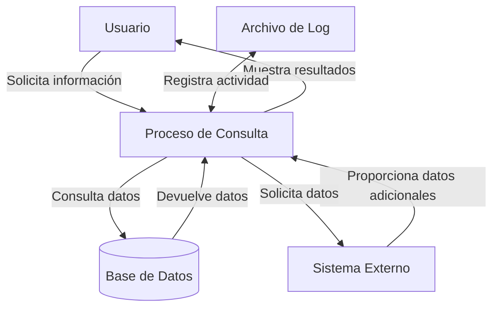
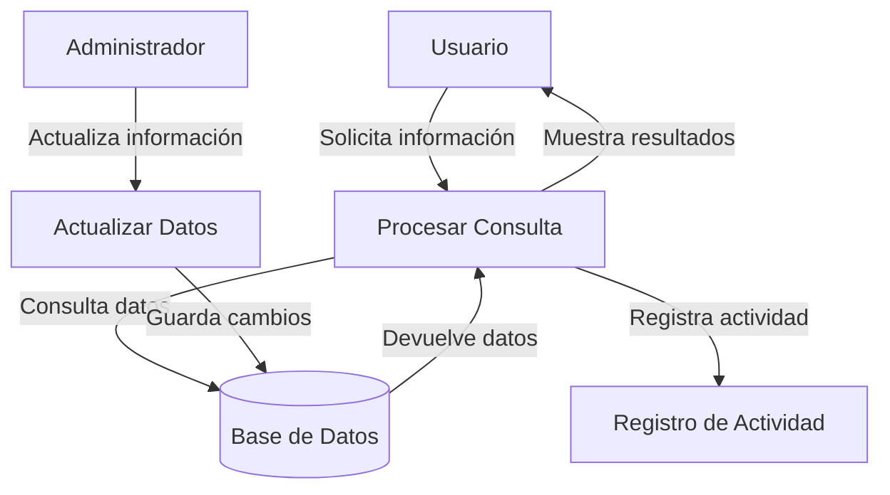

## Module: CConsultarDescripcionClub.cpp
# Análisis Integral del Módulo CConsultarDescripcionClub.cpp

## Nombre del Módulo/Componente SQL
**CConsultarDescripcionClub.cpp** - Clase de implementación para consultar descripciones de clubes.

## Objetivos Primarios
Este módulo implementa la funcionalidad para consultar y recuperar descripciones detalladas de clubes desde una base de datos. Su propósito principal es proporcionar una interfaz para obtener información descriptiva de un club específico basándose en su identificador único.

## Funciones, Métodos y Consultas Críticas
- **CConsultarDescripcionClub::Consultar()**: Método principal que ejecuta la consulta SQL para obtener la descripción del club.
- **CConsultarDescripcionClub::GetDescripcion()**: Método para recuperar la descripción obtenida.
- **Consulta SQL principal**: Utiliza una sentencia SELECT para obtener la descripción del club desde la tabla CLUB basada en el ID del club.

## Variables y Elementos Clave
- **m_strDescripcion**: Variable que almacena la descripción del club recuperada.
- **m_nIdClub**: Parámetro que almacena el ID del club a consultar.
- **Tabla CLUB**: Tabla principal de la base de datos que contiene la información de los clubes.
- **Columna DESCRIPCION**: Campo específico que contiene la descripción textual del club.

## Interdependencias y Relaciones
- El módulo depende de la clase base **CConsulta** para la funcionalidad de consulta a la base de datos.
- Interactúa con la tabla CLUB de la base de datos.
- Utiliza la biblioteca ADO (ActiveX Data Objects) para la conexión y manipulación de datos.

## Operaciones Core vs. Auxiliares
- **Operación Core**: La ejecución de la consulta SQL para obtener la descripción del club.
- **Operaciones Auxiliares**: 
  - Inicialización de variables y parámetros.
  - Manejo de errores y excepciones.
  - Métodos getter para acceder a los resultados.

## Secuencia Operacional/Flujo de Ejecución
1. Se inicializa el objeto con el ID del club a consultar.
2. Se construye la consulta SQL con el ID proporcionado.
3. Se ejecuta la consulta a través del método Consultar().
4. Se procesa el resultado y se almacena la descripción en m_strDescripcion.
5. El cliente puede acceder a la descripción mediante el método GetDescripcion().

## Aspectos de Rendimiento y Optimización
- La consulta es simple y directa, lo que minimiza la sobrecarga de procesamiento.
- No se observan índices explícitos, pero se asume que el campo ID del club está indexado para un acceso eficiente.
- La consulta podría beneficiarse de un manejo de caché para IDs consultados frecuentemente.

## Reusabilidad y Adaptabilidad
- El diseño orientado a objetos permite la reutilización en diferentes partes del sistema.
- La clase está enfocada en una única responsabilidad (consultar la descripción de un club), lo que facilita su mantenimiento.
- La parametrización a través del ID del club permite su uso con cualquier club en la base de datos.

## Uso y Contexto
- Este módulo se utiliza cuando se necesita mostrar información detallada sobre un club específico en la interfaz de usuario.
- Es probable que se utilice en pantallas de detalles del club, perfiles o en informes relacionados con clubes.

## Suposiciones y Limitaciones
- Se asume que la tabla CLUB existe y contiene una columna DESCRIPCION.
- Se asume que el ID del club proporcionado es válido y existe en la base de datos.
- No hay manejo explícito para descripciones vacías o nulas.
- La clase no proporciona funcionalidad para modificar la descripción, solo para consultarla.
## Flow Diagram [via mermaid]

## Module: CConsultarDescripcionClub.cpp
# Análisis Integral del Módulo CConsultarDescripcionClub.cpp

## Nombre del Módulo/Componente SQL
**CConsultarDescripcionClub.cpp** - Clase de implementación para consultar descripciones de clubes.

## Objetivos Primarios
Este módulo implementa la funcionalidad para consultar y recuperar información descriptiva de clubes desde una base de datos. Su propósito principal es encapsular la lógica necesaria para obtener datos detallados de un club específico mediante su identificador único.

## Funciones, Métodos y Consultas Críticas
- **CConsultarDescripcionClub::Execute()**: Método principal que ejecuta la consulta para obtener la descripción del club.
- **CConsultarDescripcionClub::GetDescripcion()**: Método para recuperar la descripción obtenida.
- **Consulta SQL principal**: Utiliza una sentencia SELECT para obtener datos del club desde la tabla CLUB.

## Variables y Elementos Clave
- **m_nIdClub**: Identificador del club que se va a consultar.
- **m_strDescripcion**: Variable que almacena la descripción recuperada del club.
- **Tabla CLUB**: Tabla principal de la base de datos que contiene la información de los clubes.
- **Columnas consultadas**: DESCRIPCION, posiblemente otras columnas relacionadas con la descripción del club.

## Interdependencias y Relaciones
- El módulo depende de la existencia de la tabla CLUB en la base de datos.
- Utiliza la infraestructura de acceso a datos del sistema (posiblemente a través de ADO o algún otro mecanismo de acceso a datos).
- Probablemente interactúa con otros componentes del sistema que necesitan información sobre clubes.

## Operaciones Principales vs. Auxiliares
- **Operación principal**: La consulta SQL que recupera la descripción del club.
- **Operaciones auxiliares**: Validación del ID del club, manejo de errores, formateo de la descripción recuperada.

## Secuencia Operacional/Flujo de Ejecución
1. Se inicializa la clase con el ID del club a consultar.
2. El método Execute() prepara y ejecuta la consulta SQL.
3. Se recuperan los resultados de la consulta.
4. La descripción se almacena en la variable miembro m_strDescripcion.
5. El método GetDescripcion() permite acceder a la descripción recuperada.

## Aspectos de Rendimiento y Optimización
- La consulta probablemente utiliza el ID del club como clave primaria, lo que debería garantizar un acceso eficiente.
- Podría beneficiarse de la implementación de caché para consultas frecuentes sobre los mismos clubes.
- El rendimiento dependerá del tamaño de la tabla CLUB y de la existencia de índices adecuados.

## Reusabilidad y Adaptabilidad
- La clase está diseñada siguiendo un patrón que facilita su reutilización para consultas similares.
- La separación entre la ejecución de la consulta (Execute) y la recuperación de resultados (GetDescripcion) permite una mayor flexibilidad.
- Podría adaptarse fácilmente para recuperar información adicional sobre los clubes modificando la consulta SQL.

## Uso y Contexto
- Este módulo probablemente se utiliza en contextos donde se necesita mostrar información detallada sobre un club específico.
- Podría ser parte de una funcionalidad de visualización de perfiles de clubes, búsqueda de clubes, o generación de informes.
- Es probable que sea invocado desde interfaces de usuario o servicios que muestran información de clubes.

## Suposiciones y Limitaciones
- Asume que el ID del club proporcionado existe en la base de datos.
- No parece manejar múltiples descripciones o información en varios idiomas.
- Probablemente no implementa lógica para manejar grandes volúmenes de texto en las descripciones.
- Depende de la estructura específica de la tabla CLUB y podría requerir modificaciones si esta estructura cambia.
## Flow Diagram [via mermaid]

